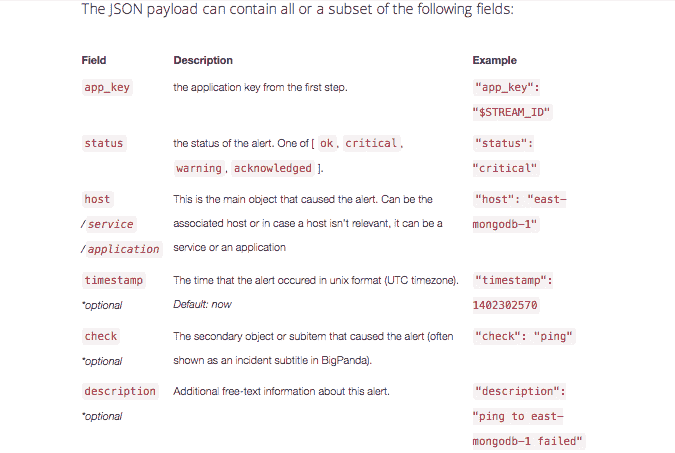

# BigPanda 和应用程序事件问题只会变得更加复杂

> 原文：<https://thenewstack.io/bigpanda-and-the-app-incident-problem-one-person-can-never-solve/>

我们知道，一个人无法以任何手动方式管理新的堆栈。我们还知道，通过数据和自动化数据中心，用几个人的团队管理扩展到数百万人的应用程序是完全可能的。

现在，运营团队面临着一系列新的问题，这些问题来自新一代专业服务产生的所有数据，这些服务旨在帮助管理运行在分布式基础设施上的应用程序的复杂性。

BigPanda 提供了一种服务，通过使用数据科学来管理跨数千台服务器运行的应用程序的事件，从而解决这一问题。今天，该公司获得了对其方法的认可，新闻报道称，该公司从梅菲尔德基金和红杉资本获得了 700 万美元的首轮融资。

事故反应有一些老学校的根源。惠普和其他公司开创了这一领域，允许小型和大型团队管理当时被视为相当复杂的系统。

如今，公司必须管理数千台服务器。为了监控这些应用程序，公司转向了诸如 [New Relic](http://newrelic.com) 、 [App Dynamics](http://appdynamics.com) 、 [Splunk](http://splunk.com) 和 [Nagios](http://www.nagios.org/) 等服务。

但通常情况下，数据是在不同的孤岛中管理的，这本身就造成了复杂性。所有这些数据都需要管理，但是聚合起来比在多个查询中更需要管理。

BigPanda 通过收集数据并将其定义为一个数据模型来规范化数据。它有一个 It 分类法，根据数据的来源来定义数据。它可以处理来自云服务的 Webhooks 数据，或者使用自然语言处理来分析来自 Splunk 生成的电子邮件的数据。

有许多事件管理公司可以解决新堆栈带来的问题。总部位于博尔德的 VictorOps 使用从不同事件和不同团队成员的互动中收集的数据。和 BigPanda 一样，VictorOps 汇总了来自 [New Relic、](http://newrelic.com)[【log Gly】](http://loggly.com)、亚马逊 Cloudwatch、 [Pingdom、](http://pingdom.com) Crittercism 和 [UserVoice](http://uservoice.com) 等不同监测服务和云管理技术的数据。它还监控团队成员之间的数据。

[page duty](https://pagerduty.com)也是在过去几年中广受欢迎的新运营管理工具之一。它通过电子邮件、电话和短信提醒运营团队。它聚合警报并根据优先级路由它们。

数百家公司正在填补这个曾经由传统提供商主导的领域。BigPanda 和其他类似的动物反映了一个更大的运动，这个运动在 DevOps 文化中表现出来，并象征着它的转变。

同样明显的是，手动劳动在数据中心越来越无关紧要。相反，操作人员每天都要管理数以千计的警报，这与过去大不相同。

Big Panda 的方法使用推理算法来帮助它快速跟踪问题。尽管如此，正如可以预期的那样，客户仍然必须对 BigPanda 服务进行微调，以充分利用它。如果没有，客户可能会得到错误的自动结论。随着越来越多的服务出现来管理新的堆栈环境，这种情况只会越来越多。

通过 Flickr 的特征图像。

<svg xmlns:xlink="http://www.w3.org/1999/xlink" viewBox="0 0 68 31" version="1.1"><title>Group</title> <desc>Created with Sketch.</desc></svg>