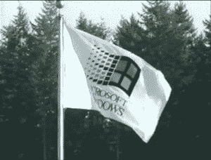
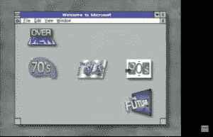
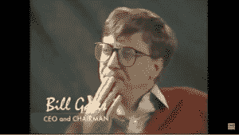
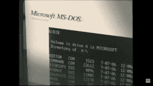
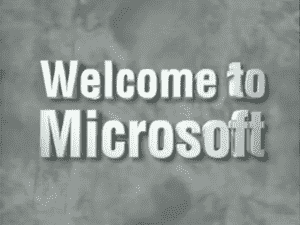

# 比尔·盖茨在重新发现的 1994 年微软视频中预测了未来

> 原文：<https://thenewstack.io/bill-gates-predicts-the-future-in-a-rediscovered-microsoft-video-from-1994/>

感恩节是与熟悉的面孔欢聚一堂的时刻，也许是回顾过去，花些时间思考过去的日子。因此，这个月计算机历史档案项目分享一个非常特别的发现也许是合适的:一段微软在 1994 年制作的视频。

这段视频褪色的颜色表明它会随着时间的推移而褪色，甚至在 90 年代合成器音乐和电子鼓响起之前。一名甜美的播音员低声说道，“微软——一个世界闻名的名字和声誉，”视频显示了一面旗帜在该公司的雷蒙德总部外飘扬，上面有微软 Windows 的标志。

然后，它吹捧该公司在 1994 年仍然奇怪的愿景“每张桌子上，每个家庭都有一台电脑……”，然后添加了这句话经常被遗忘的结尾:“……运行微软软件。”)

这是对很久以前的世界的遗忘的一瞥，也是一个回顾个人计算机早期的机会。但也许它也提供了一个机会，让我们对我们自己的现代计算世界有一个新的视角——至少记住一些它是如何开始的

[https://www.youtube.com/embed/LmW4JjR2-_8?start=196&feature=oembed](https://www.youtube.com/embed/LmW4JjR2-_8?start=196&feature=oembed)

视频

## 等待窗口

该视频吹嘘一家年轻的公司在全球雇佣了“数千”人。(根据市场数据网站 Statista 的数据，今天微软大约有 181，000 名员工。)

很快，这就是你一直在等待的时刻——大约 1994 年的 Windows。

这是第三版。

一个 Windows 用户会意地笑了笑，然后点击桌面上标有“70 年代”的图标，出现了 1975 年 2 月 19 岁的比尔·盖茨和 22 岁的保罗·艾伦的照片。这是在他们为 Altair 8800 创造了基本编程语言(和 Monte Davidoff 一起)之后不久，播音员吹捧这是为个人电脑创造的第一种编程语言。有一台 70 年代的 Altair 8800 电脑的照片，甚至还有它的文档(带有全大写的块状封面)。

“比尔和保罗知道他们在做一件重要的事情:一台个人电脑，”广播员说。

然后突然，有了比尔·盖茨本人的镜头。现在是 1994 年——比尔 39 岁——他对 20 世纪 70 年代的记忆清晰无比。“即使在那个时候，我们也认为‘哇，这个微处理器将会做一些不可思议的事情，’”盖茨回忆道。“早在 1971 年，保罗和我就谈论过微处理器，这确实是他的见解，因为半导体的进步，事情会变得越来越好。

“所以我对他说，‘哇，指数现象非常罕见和引人注目。“你是认真的吗，”"

“他们是认真的，”广播员插话道，“并且很快意识到，如果没有强大而有用的程序，这些奇怪的小盒子就什么也不是！”然后，更简洁地说，他用三个词总结了即将到来的海啸。“硬件需要软件。”

其他里程碑一闪而过——成立了微软远东公司来处理国际销售，创建了微软自己的 Fortran 和 Cobol 编程语言的实现。“一年之内，微软 BASIC 编译器几乎在每台计算机上运行，”播音员漫不经心地补充道。

在最后一个里程碑——在华盛顿贝尔维尤开设新办公室——微笑的 Windows 用户点击到一个名为“80 年代”的文件夹

## 16 位计算机和 MS-DOS

播音员接着将目光回溯到 13 年前的某个时刻，这个时刻现在看来就像是古老的历史。“1981 年，是时候迈出新的一步了。微软重组为一家私人控股公司，比尔·盖茨任总裁，保罗·艾伦任副总裁。

“我们知道 16 位计算正在路上，”盖茨说，“我们看到它可能是一个很好的商业机器，我们决定将大量早期工作集中在英特尔芯片上。”

该视频称 1981 年 8 月 2 日为另一个里程碑——这一天 IBM 发布了运行微软“16 位操作系统 MS-DOS 1.0 版”的个人电脑(还包括基本编程语言。)其他里程碑事件包括在法国、德国和英国成立子公司，以及成立图书出版部门微软出版社。

当我们回忆过去的日子时，视频切换到鼠标的最初创造者道格拉斯·恩格尔巴特的一个简短但发人深省的档案声音剪辑，恩格尔巴特在剪辑中承认“我不知道为什么我们叫它鼠标。

“有时候我会道歉。事情就是这样开始的，我们从未改变它。”

“我们继续改进设计，”比尔·盖茨说，“越来越光滑的外观设计，”视频贯穿了微软鼠标的几个早期版本。(没有一个是无线的……)

当播音员记起 1983 年微软 Word for MS-DOS 的“创新营销策略”时，人们对被遗忘的技术有了更多的了解:“一期《个人电脑世界》杂志中包括了一张演示光盘。”软盘后来让位于 CD-r om，最终只是在线软件即服务。但是，这个视频的播音员把我们带回到过去，回到微软视窗在 1983 年 Comdex 贸易展上发布的世界。但这将是漫长的两年后才会发布。”

苹果电脑之间的无情竞争似乎被掩盖了，盖茨漫不经心地甚至钦佩地说，苹果在图形界面上“赌上了他们的公司”，几乎是在事后补充说，“这就是为什么我们早期如此参与为麦金塔电脑构建应用程序——我们认为他们是对的。我们真的把我们的成功也押在了这上面。”

历史上的其他时刻也像从积满灰尘的书架上取下的剪贴簿一样轻轻掠过。1982 年首次推出的微软飞行模拟器成为世界上最畅销的个人电脑游戏。有微软在 1986 年的首次公开募股(当“美国商业的一股新力量被启动。”30 岁的比尔·盖茨登上了《财富》杂志的封面。甚至有延时摄影，实际上显示了 1985 年他们在雷德蒙德的新公司总部的建设。

很快视频的 Windows 用户就点击了 90 年代文件夹。“1990 年 4 月，俄语版的 MS-DOS 发布了，总共有 14 种语言版本，”广播员告诉我们。

在显示 Windows 版本 3 发布的录像中，盖茨称之为“个人电脑工业历史上的一个重要里程碑！”时任微软法律和公司事务副总裁的比尔·诺伊康(Bill Neukom)出现了，并指出这是整整八年 Windows 开发的高潮。1990 年秋天，盖茨向 Comdex 做了一次“富有远见的演讲”。是什么让它变得有远见？“比尔·盖茨提出了信息高速公路的想法，”播音员解释道。

## 前方的路

1994 年的视频认为，盖茨走在了潮流的前面，他在那年的 Comdex 上专注地告诉观众，“我们需要大量的信息供用户使用”，并敦促硬件和软件制造商——以及分销渠道——一起实现“信息触手可及的愿景”

欢快的音乐还在继续，播音员告诉我们，Windows 3.0 成为了“计算机界面的全球标准”——尽管它只有 12 种语言，在 24 个国家可用。

可以预见，下一个里程碑是 1992 年 5 月 Windows 3.1 的发布。发布六周后，微软已经卖出了…300 万份。(播音员提醒我们这是“业内前所未有的数字。”)现在我们来到了 1993 年，这一年“家庭计算机迅速发展，拥有个人电脑的家庭中有一半有学龄儿童。”但是我们已经到了用一句话概括未来的时刻。

随着这些孩子的成长，新一代计算机用户将对新工具和新产品产生新的需求

这是 4000 万台个人电脑运行微软 Windows 的一年。播音员告诉我们，这是“全世界个人电脑用户的选择标准。”微软的程序现在用多达 28 种语言发布。最后，1994 年视频中的 Windows 用户点击了一个名为“未来”的文件夹它调出了现在已经被遗忘的微软太空模拟器*的预发布版本。“展望未来，微软将继续站在软件开发的前沿，”播音员说。随着背景音乐的播放，音乐变成了听起来更具未来感的合成器，因为播音员承诺将“重点转向”家庭服务(同时继续服务于企业市场)。*

 *但是视频仍然显示了带有软盘驱动器的笨重的台式电脑。

## 未来

奇怪的是，盖茨错过了未来的一部分，他想象着一个蓬勃发展的软件出版市场，但没有预见到在线应用程序的最终崛起——以及最终的数据存储和大规模数据分析。“正是‘每张桌子上都有电脑’让他们错过了智能手机，”YouTube 的一位评论者[讽刺道。](https://www.youtube.com/watch?v=LmW4JjR2-_8&lc=UgwPKgv2ZL4cYn0c-aV4AaABAg)

盖茨似乎在想象一个我们聚集在舒适的小窝里，享受太空模拟器和家庭财务电子表格的世界。他在那里，穿着一件大地色的毛衣，分享着一个健康的愿景，那就是制造令人愉快和有用的产品，“吸引整个家庭，这样家里的这些设备就真的非常非常值得。”

这一刻有一种令人欣慰的乐观情绪，因为播音员在结束这一段关于未来的节目时高兴地说，“微软的愿景，即在这个国家和全世界，每张桌子和每个家庭都有一台电脑，正在成为现实。”当然，视频没有提到的是第二年 Windows 95 的发布，事实上这让微软非常接近这个目标，这个目标在当时看起来很激进，现在看起来很古雅。

带着轻松的企业热情，播音员毫无顾虑地预测，一个“每个人都可以获得浩瀚的信息宇宙”的世界。

“我认为这绝对是一个不可思议的机会，”盖茨说。“我认为这将是非常令人兴奋的。”

<svg xmlns:xlink="http://www.w3.org/1999/xlink" viewBox="0 0 68 31" version="1.1"><title>Group</title> <desc>Created with Sketch.</desc></svg>*