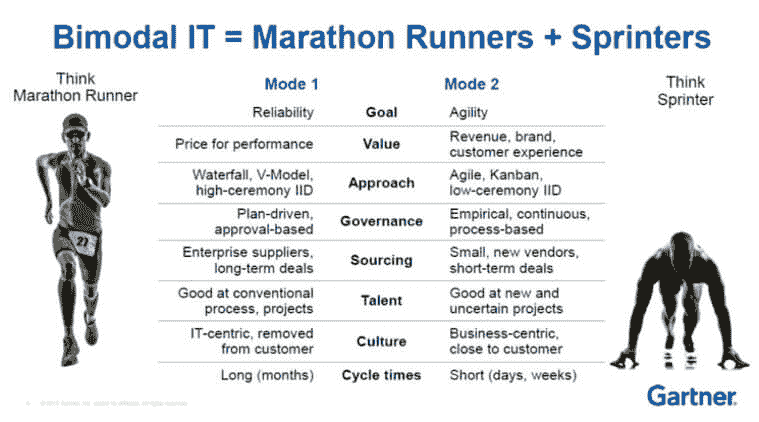
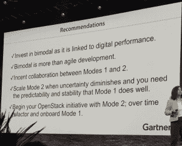
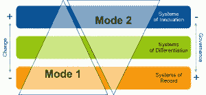

# 双峰 IT:有什么不喜欢的？

> 原文：<https://thenewstack.io/bimodal-it-whats-not-to-like/>

在本周早些时候的 Dockercon 2016 主题演讲中， [Docker](https://www.mirantis.com/software/docker/kubernetes/) 的首席执行官 [Ben Golub](https://twitter.com/golubbe) 迂回地剖析了[双模 IT](http://www.gartner.com/it-glossary/bimodal) 的概念，这是 Gartner Research 分析师 [Mary Mesaglio](http://www.gartner.com/analyst/12240/Mary-Mesaglio) 和 [Simon Mingay](http://www.gartner.com/analyst/9907/Simon-Mingay) 在 2014 年 7 月向世界介绍的概念[。](http://www.cmswire.com/information-management/rethinking-bimodal-it/)

“这是一个很大的谬误，”他说，他指的是双模概念如何将企业 IT 运营分成两个不同的阵营——一个是支持传统 It 应用程序的阵营，这种应用程序的变化很慢，而且受到公司政策的阻碍；另一个是构建新的基于云的应用程序的阵营，这种应用程序的变化由业务发展以更快的速度驱动。

“如果您有 10，000 名开发人员分布在 60 个数据中心，您不会在第一天就关闭这些数据中心。你也不会关闭应用程序，”他说。“你需要一种模式，让你能够运行传统应用，并将它们迁移到下一代私有云，但(也让你)能够在传统基础设施上提供超酷的微服务。”

最近有很多关于双峰 IT 的讨论。不是所有的都好。

James O'Brien 在他的 Point B and Beyond 博客上称其有争议，Forrester 发布了一份名为[“双峰 it 的虚假承诺”](https://www.forrester.com/report/The+False+Promise+Of+Bimodal+IT/-/E-RES131967)和 Jez Humble，在他们连续发表的博客上写了“[双峰 IT 的核心缺陷](https://continuousdelivery.com/2016/04/the-flaw-at-the-heart-of-bimodal-it/)**”**等等。对于一个只有 2 年历史的概念来说，这是一个很大的反对意见。

双模概念非常简单，它解决了企业运营如何从客户端-服务器架构转移到新的基于云/容器的技术，同时保持当前的运营。

双峰 IT 跑步者

Gartner 副总裁兼杰出分析师 [Donna Scott](http://www.gartner.com/analyst/7159/Donna-Scott) 在最近的 OpenStack 大会上发言时，将马拉松运动员比喻为传统 IT，维护标准化的 IT 元素以保持业务照常运行，而短跑运动员则在创建新的协作解决方案的同时部署并行功能。

根据调查数据，Gartner 强烈建议快速采用双模 IT。

Gartner 的高级副总裁兼全球研究主管[Peter Sondergaard](http://www.computerworld.com/article/2982874/it-management/bimodal-it-a-two-pronged-approach-to-delivering-innovation-and-maintenance.html)预测，到 2017 年，75%的 IT 组织将以某种方式实现双峰。斯科特告诉 OpenStackers，接受调查的高管预计，到 2020 年，41%的收入将来自数字业务。

Donna Scott，开放堆栈主题演讲推荐

Sondergaard 说:“首席信息官们无法将他们的旧 it 组织转变为一家数字化创业公司，但他们可以将其转变为一家双模 IT 组织。

然而，在最近的 RSA 会议上的一次演讲中，主题会议，然后提到双模 IT [引起了观众的呻吟和几声猫叫](https://thenewstack.io/chef-offers-habitat-application-automation-alternative-bimodal/)。

不喜欢什么？

Forrester 报告摘要解释说，双峰 IT 创建了两个独立的小组，在隔离的系统上工作，“增加了更多前端和后端的复杂性”，使其“根本无法满足客户和企业对敏捷性的需求。”

Humble 在 4 月份指出，大多数高绩效的组织不需要用安全性来换取敏捷性，他写道:“虽然双模模型为开始敏捷之旅的企业提供了有价值的指导，但我认为它具有误导性，并且我认为，当将其本身视为目的地时，它是危险的。”

> “我认为双峰 IT 分类很好地抓住了传统应用程序的提升和转变，这些应用程序没有针对云进行现代化，可能永远也不会，以及云原生应用程序适合微服务和容器，”— Mark Russinovich，微软。

例如，今年早些时候，LinkedIn [推出了他们的移动应用](https://thenewstack.io/need-speed-linkedins-rapid-release-pipeline-mobile-app-development/)的重建版本。他们的新管道是完全自动化的，新代码每天上线三次，从代码提交到代码可供成员使用之间的时间不超过三个小时。

有了这样的技术，哪里还需要双峰 IT？首先，并不是所有的公司都有 270 名左右的工程师来创造这种自动化，就像 LinkedIn 用来启动和运行这种自动化一样。另一方面，LinkedIn 的基础设施是在 2002 年推出的，因此没有其他传统公司走得那么远。

## 分配未来

根据 Gartner 的说法，双模 IT 适用于采用老式(即客户端/服务器)架构的企业，以及需要转向响应速度更快的架构的企业。

微软 Azure 首席技术官 Mark Russinovich 在 Dockercon 的一次采访中表示:“我认为，双峰 IT 分类很好地抓住了传统应用程序的提升和转变，这些应用程序没有针对云进行现代化，可能永远也不会，云原生应用程序正适合微服务和容器。”。“我认为每个企业都必须双管齐下。如果你想上云，你不能让每个应用程序都现代化。从资源的角度来看，这是不实际的。你应该把注意力集中在最有价值的东西，也就是你的基本应用程序的现代化上。”

微软 Azure 首席技术官马克·鲁西诺维奇

许多人对双峰不屑一顾，因为它是如此的前沿，以至于世界上的其他人都跟不上他们。他们生活在未来，创造未来，真的。但是公司高层管理人员还记得从大型机环境迁移到客户机/服务器体系结构的噩梦。大型甚至中型公司在做出改变时都很缓慢，即使新的守卫认为他们昨天就需要这种功能。

参加尖端技术会议的人可能认为这是显而易见的，但大公司的高层管理人员认为这是一个财务漏洞，这是有历史原因的。或者，中型公司可能没有足够的人力来用新软件彻底重组他们的 IT 部门。

包括政府机构和银行在内的许多公司仍然在大型机上使用 COBOL，因为它有效。在许多情况下，它工作得很好，直到 20 世纪 90 年代带来了新的软件(*cough* Peoplesoft *cough*)，使他们离开了大型机。根据经验，我们知道有些经理仍然对此不满。

在科技领域，记忆是短暂的，过去的就过去了，需要的是更快、更好、更多地前进。更多的服务器，更多的容器，更多的内存，更多的软件，更多的应用，更多的人。总是更多，不同，更快。

但金融有长久的记忆，过去才是重要的，因为过去是决策的基础。花了多少钱？预期的投资回报率真的实现了吗？为什么不呢？增加了多少开销？硬件/软件成本中有多少可以摊销？你还要吗？为什么您不能使用我们已经为您购买的服务器/内存？如果是在“云”上，我为什么要付钱呢？

因此，最终发生的情况是，新培训的工程师希望在旧系统中使用新技术，并悄悄地在所谓的“[影子 IT](http://www.cmswire.com/information-management/rethinking-bimodal-it/) 中创建变通办法

Gartner 的双峰结构

“模式 2 倾向于这些传统上被称为‘影子 IT’的东西，最终由最终用户自己来应对这一挑战。他们说，‘公司给我的工作并不完全符合我的需求。所以我需要做些别的事情来填补空白，”托管通信提供商 [West IP Communications](http://westipc.com/) 的产品管理高级总监 Marcus Schmidt 说。

双峰 IT 是关于整合和标准化这种影子 IT，并允许创新者创新，但在公司结构内。并不是每个公司都建议这样做，尤其是那些已经在做敏捷的公司。没有任何地方暗示它是一个目的地，而是一种达到目的的手段。

此外，大公司适应变化的速度很慢。例如， [PayPal 正在进行一项巨大的计划](https://www.infoq.com/news/2015/10/innersource-at-paypal)，使用 Innersource 来管理内部软件项目。该公司正在彻底重组其工作方式。Paypal 在两年前启动了这项计划，大约与 Gartner 提出双模 IT 概念的时间相同。

双峰模式所要做的就是在向未来发展的同时保持当前的功能。对一些人来说，未来来得太快了。

TNS 执行主编 Joab Jackson 对本文有贡献。

Docker 是新堆栈的赞助商。

专题图片:Docker 首席执行官 Ben Golub 在 Dockercon 2016 上。所罗门·海克斯拍摄的照片。

<svg xmlns:xlink="http://www.w3.org/1999/xlink" viewBox="0 0 68 31" version="1.1"><title>Group</title> <desc>Created with Sketch.</desc></svg>