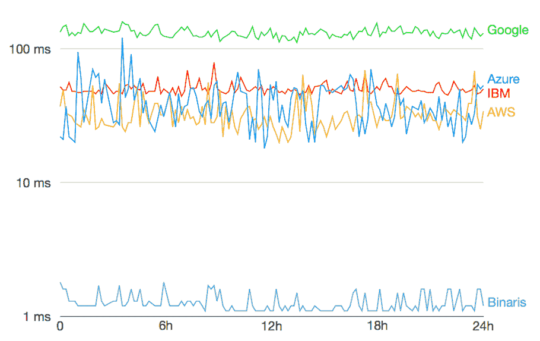

# Binaris 希望减少无服务器产品的延迟

> 原文：<https://thenewstack.io/binaris-wants-reduce-latency-serverless-productions/>

如果新玩家 Binaris 能够基于其仍然处于 alpha 阶段的平台建立一些市场份额，那么最适合无服务器的用例列表(cron 作业、数据和媒体处理以及 ETL)可能会发生重大变化。

Binaris 是一个独立的功能即服务平台，专注于提供一个可预测的、低延迟的无服务器选项。

首席执行官兼联合创始人 [Avner Braverman](https://twitter.com/avnerbraverman) 认为，目前，当前的无服务器选项无法预测延迟时间。他说，延迟是在第 99 个百分位数上测量的——在这个百分位数上，调用响应保证在特定的时间范围内返回，比如 3 毫秒，99/100。平均意义不大，因为对于复杂的系统，很大一部分响应将需要更长的时间，这意味着无服务器的实时用例是不可能的。

布雷弗曼说:“如果你想制作一款游戏，无服务器是一个很好的选择，如果它可以实时响应的话，”因为游戏所需的大量数据和计算只有在用户活跃时才存在。其他领域，如广告招标，以及增强现实等新兴领域，也非常适合无服务器用例，如果(布雷弗曼强调这是一个很大的如果)，无服务器在响应方面更可靠。

Braverman 表示，工业物联网是另一个关键的用例领域，他指出了自动驾驶汽车环境中的需求，除了单独的汽车管理，还有本地城市规模，其中管理交通拥堵或危险警报等功能需要在单独的汽车内或设备上运行的逻辑中做出决策，在一些邻近的边缘结构中，以及在云数据环境中运行的一些逻辑。如果解决了延迟问题，所有这些都可以通过无服务器功能来管理。并且这种模式可以在铁路基础设施和无人机舰队等其他物联网领域重复。

“我们想保证速度。我们第一个 99%的保证是负载下大约 3 毫秒的延迟。今天，其他无服务器平台不提供延迟保证，但测量单个函数调用大约 50 毫秒，在负载下几秒钟，这将使我们快 100 倍以上。这就是我们第一代产品的目标，”布雷弗曼说。

布雷弗曼说，如果你看看目前四个主要的无服务器平台上的响应性能，它是广泛可变的。

为了演示，Binaris 构建了开源 Faasmark 项目作为基准工具。它旨在测量不同 FaaS/无服务器平台上的函数调用延迟，测试基于调用方法、编程语言、内存大小和负载条件。

使用 Faasmark，Braverman 展示了无服务器平台上的对数结果图，热启动空闲(即一次一个调用)在 24 小时的时间间隔内测量到 99%的延迟。

布雷弗曼说:“我们的分析显示，不同时间段的变化很大，总体而言，平台不像你希望的那样可预测。”"链式调用越深，响应时间的不可预测性就越大."

布雷弗曼，他的联合创始人和团队来自以色列国防项目的工作背景，他们需要利用高性能计算技术来管理主要的工程项目。他说，这些技能在构建二进制程序时至关重要。

“这是一项巨大的工程努力。降低这些延迟需要做很多繁重的工作。布雷弗曼说:“我们正在研究深层技术，以实现这一目标。Binaris 最近在纽约使用了 Serverlesssconf 来摆脱隐形模式，并引起了那些可能认为他们不能在用例中使用 serverless 的人的注意。“我们参加了每一次无服务器会议，我们发现对话正朝着将冷延迟和热延迟视为关键问题的方向发展。现在，每个人都在说，是的，我们知道延迟是一个问题。对话肯定是朝着那个方向发展的，所以我们偷偷伸出头来推动对话，让人们知道我们在做什么。”

专题图片:照片由[索尼娅·兰福德](https://unsplash.com/photos/eIkbSc3SDtI?utm_source=unsplash&utm_medium=referral&utm_content=creditCopyText)在 [Unsplash 上拍摄。](https://unsplash.com/?utm_source=unsplash&utm_medium=referral&utm_content=creditCopyText)

<svg xmlns:xlink="http://www.w3.org/1999/xlink" viewBox="0 0 68 31" version="1.1"><title>Group</title> <desc>Created with Sketch.</desc></svg>