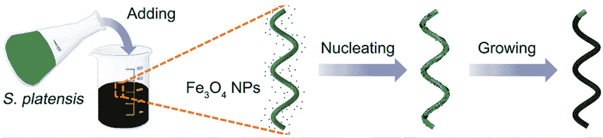
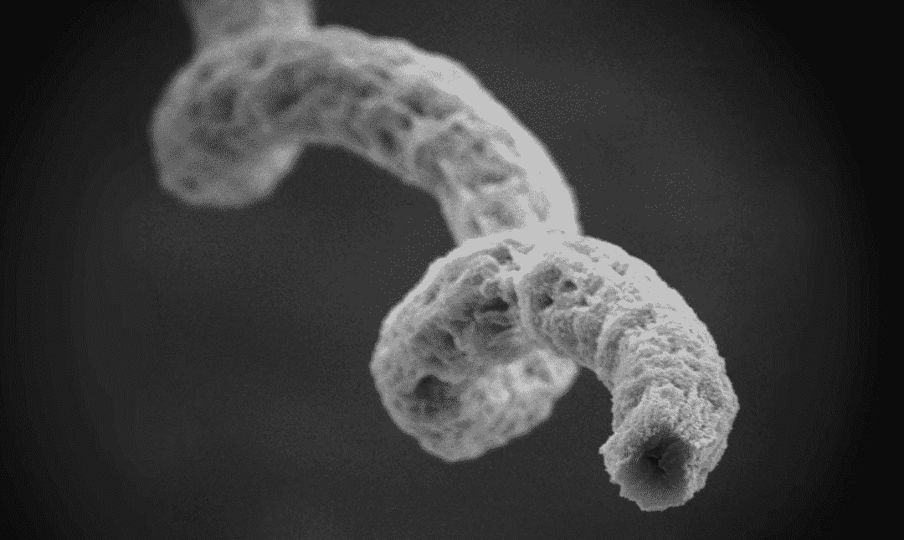
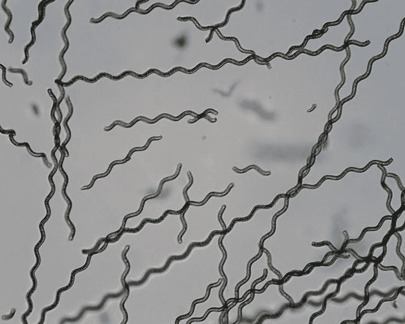

# 由藻类制成的可生物降解的微型机器人有助于对抗癌症

> 原文：<https://thenewstack.io/biodegradable-micro-robots-made-algae-help-fight-cancer/>

如果你热衷于超级食物对健康的明显益处，那么你可能听说过螺旋藻。这些蓝绿藻富含蛋白质，是抗氧化剂和 B 族维生素的重要来源。

但是来自中文大学、曼彻斯特大学和爱丁堡大学的一个国际研究小组正在研究螺旋藻，不是为了它对健康的益处，而是为了用它来制造非侵入性微型机器人的可能性，这种机器人可以检测疾病、输送药物，甚至杀死体内的癌细胞。最重要的是，这些微小的藻类机器人还可以生物降解，而不会产生有害影响。

这项工作发表在最近一期的 [*科学机器人*](http://robotics.sciencemag.org/content/2/12/eaaq1155) 上，意义重大，因为它不同于目前可用的微型机器人，后者通常由不容易分解的人造材料制成，这意味着它们必须通过手术移除或作为废物排出体外。

首席研究员、机械与自动化工程副教授张丽告诉《南华早报》说:“开发可生物降解的微型机器人是一项开创性的工作，因为这在过去很少见。”。

[https://www.youtube.com/embed/Q8hqdzm3Yqc?feature=oembed](https://www.youtube.com/embed/Q8hqdzm3Yqc?feature=oembed)

视频

除了提供通常的营养外，微小的螺旋藻藻本身在体内不会起太大作用。然而，研究小组设计了一种别出心裁的方法，通过将螺旋藻浸入由磁铁矿(Fe [3] O [4] )制成的生物相容性磁性纳米粒子溶液中，创造出一种机器人生物杂交体。这些被磁化的成分可以通过外部磁场被导向体内的特定区域。

## 发光的抗癌机器人

科学家们还利用了螺旋藻固有的发光倾向，使用荧光显微镜来跟踪这些微型机器人在体内的进展。此外，螺旋藻的荧光特性可以用来检测其内部的化学变化。

“荧光的亮度水平与周围环境的 pH 值有关，”张解释说。"微型机器人可以检测 pH 值是否正常."

例如，人们可以看到螺旋藻微型机器人在身体的特定区域是否发光不那么强烈，这表明环境更酸性，这反过来可能暗示癌细胞的存在。

这些最新的发现建立在以前的实验基础上，在以前的实验中，张和他的团队最初试图建造螺旋形状的螺旋微型机器人，因为螺旋形状可以很容易地推进和控制。因此，这一次，该团队专注于利用微藻本身来制造这些微小、微创但高效的“微游动”

该小组的方法允许根据情况对重新适应的螺旋藻进行不同程度的修饰。例如，藻类可以在磁性纳米粒子中浸泡更短的时间，这意味着它们的荧光更容易被追踪。另一方面，如果它们被涂覆的时间更长，因此磁化更强，它们变得更容易控制。对于身体更深的区域，如器官内部，这些微扫描仍然可以使用核磁共振[(NMR)进行跟踪。](https://www.acs.org/content/acs/en/education/whatischemistry/landmarks/mri.html)

但最值得注意的可能是该团队的发现，当这些微小的机器人在培养皿中暴露于螺旋藻至少 48 小时后，它们在生物降解时，似乎会释放出某种化合物，杀死 90%的癌细胞。进一步的测试揭示了从子宫颈、肝脏和皮肤中去除癌细胞的相同结果。这是一个意想不到的副作用，有一天可能会转化为一种更简单的癌症治疗方法。研究人员还认为，这些混合微型机器人还可以简化复杂、难以到达的区域的治疗，如眼睛或循环系统的较小血管。

目前，该团队正在研究这些微型机器人如何运送货物，如救命药物。但是，在这些微型机器人能够用于人类临床试验之前，还有一些路要走。然而，研究小组设想，这些生物混合机器人的进一步发展可能会导致一个强大的微机器人和纳米机器人设备系统，能够执行各种功能，并有可能在这个过程中摧毁癌症。

图片:香港中文大学、曼彻斯特大学和爱丁堡大学。

<svg xmlns:xlink="http://www.w3.org/1999/xlink" viewBox="0 0 68 31" version="1.1"><title>Group</title> <desc>Created with Sketch.</desc></svg>