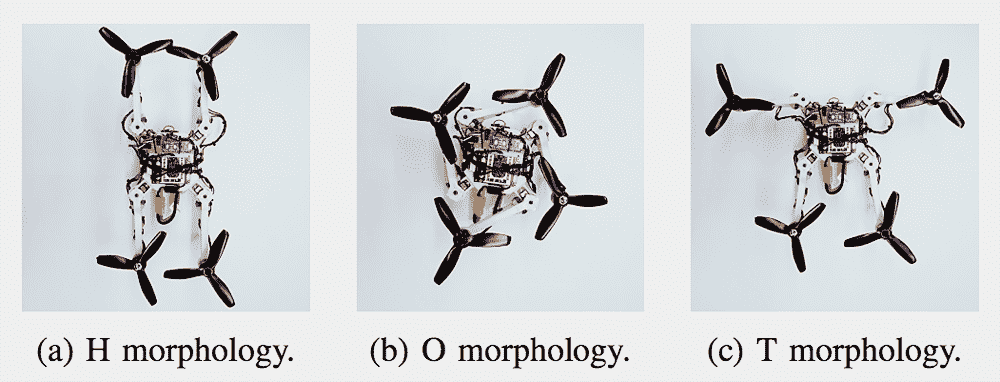
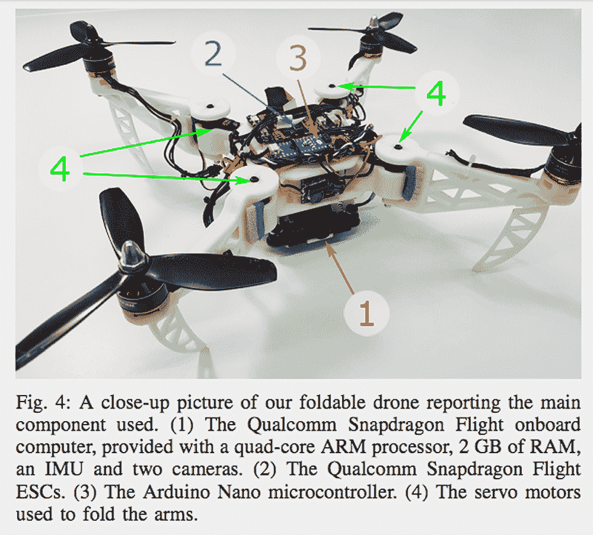
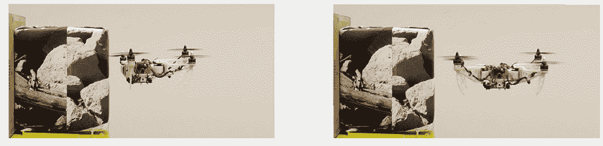

# 像鸟一样的可折叠无人机可以变形以挤进狭小的空间

> 原文：<https://thenewstack.io/bird-like-foldable-drone-shapeshifts-to-squeeze-into-tight-gaps/>

当谈到创建高效的设计和系统时，越来越多的设计师和工程师从大自然中寻找灵感，模仿大自然在数百万年的进化中提出的一些解决方案，以解决复杂的问题。这种从自然中学习的仿生方法是我们拥有飞机、Velcro 和一大堆其他非常有用的产品和 T2 系统的原因。

因此，为了创造一种变形无人机，苏黎士[大学](https://www.uzh.ch/en.html)和[洛桑联邦理工学院](https://www.epfl.ch/index.en.html) (EPFL)的研究人员研究了鸟类如何折叠翅膀通过狭窄的通道，这是完全合理的。这个想法是创造一种自主飞行设备，它可以在地震等灾难发生后转变成不规则形状的角落和受损建筑的裂缝，或者在搜救任务中寻找幸存者，或者在人类无法安全冒险的地方进行其他类型的检查。

[https://www.youtube.com/embed/jmKXCdEbF_E?feature=oembed](https://www.youtube.com/embed/jmKXCdEbF_E?feature=oembed)

视频

## 不对称无人机

虽然[自变形无人机不是新的](https://thenewstack.io/dragon-is-a-modular-drone-that-can-shapeshift-in-mid-air/)，但这款原型机的不同之处在于，它可以在不依赖对称形式或损失有效载荷能力的情况下稳定飞行。它也相对容易控制，并且不依赖于外部运动跟踪系统和计算机。正如苏黎世大学的研究人员和第一篇论文的作者 Davide Falanga 解释说:“从机械的角度来看，我们的解决方案非常简单，但它非常通用，非常自主，带有机载感知和控制系统。”

> 虽然自我改造无人机并不新鲜，但这个原型的不同之处在于，它可以稳定飞行，而不依赖于对称的形式或损失有效载荷能力。

根据他们团队的[论文](http://rpg.ifi.uzh.ch/docs/RAL18_Falanga.pdf)，他们的可折叠无人机具有 3D 打印的可折叠臂，允许它在飞行中以至少三种不同的方式改变形状:做出看起来像“H”、“O”或“T”的形状。每种状态都有不同的用途，从放入孔中，甚至是抓住物体，正如在上面的视频中看到的，当在空中时，它可以在这些形式状态之间互换。这些形式中的每一种都是通过观察不同鸟类的形态而改编的；例如，无人机的“H”形配置源自鸽子和雨燕如何调整它们的翼面，以在很大的巡航速度范围内优化它们的滑翔效率，或者将它们自己“挤压”成较小的形状，以在狭窄的空间中滑翔。可折叠无人机做同样的事情，但不会损失太多时间，也不会损失运载能力。

在展开的形状中，无人机看起来像任何其他标准的四轴飞行器:有一个中央刚体，其中装有电池，传感器和控制系统。然而，该团队对手臂及其螺旋桨采用了灵活的“平面折叠”策略。每个手臂都配备了一个伺服电机，这使得它们可以针对不同的任务独立地改变它们的角度配置。例如，通过将自身折叠成更窄的“H”形，它可以穿过紧密狭窄的间隙——尽管与标准的“X”形相比，这降低了沿滚动轴的机动性。“O”形配置允许无人机缩小自己，甚至更多，以通过小的水平开口飞行，尽管再次有所取舍，特别是在机动性和效率方面。“T”形非常适合暴露其中央机身的传感器，以检查垂直表面，因为它使无人机的前面没有任何螺旋桨。

此外，该团队采用了一种自适应控制器，通过随着重心的变化调整螺旋桨的推力，能够在整个变形过程中保持无人机的稳定:“每当采用新的形态时，我们的自适应控制策略都会实时更新，以考虑机器人的新几何形状[..].此外，形态学相关的控制分配方案用于计算所需的螺旋桨速度。”

该团队现在正致力于在他们的原型中实现自动形态选择，以及找到一种允许高效、高速飞行的形式，并使这些手臂也能垂直移动，这意味着更多的飞行配置可能会出现。在一个野火、地震甚至恐怖袭击等自然灾害似乎呈上升趋势的时代，这种多功能、可变形的无人机可能会拯救很多生命。

图片:苏黎士大学和 EPFL 大学

<svg xmlns:xlink="http://www.w3.org/1999/xlink" viewBox="0 0 68 31" version="1.1"><title>Group</title> <desc>Created with Sketch.</desc></svg>