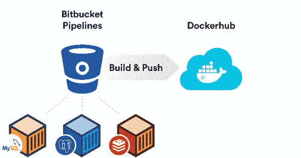

# Bitbucket 管道现在连接到 Docker 容器

> 原文：<https://thenewstack.io/bitbucket-pipelines-now-connects-docker-containers/>

Linux 用户知道[管道](http://ryanstutorials.net/linuxtutorial/piping.php)(|’ing)允许将通用工具链接在一起，比如装配线。[去年秋天推出的 Bitbucket Pipelines](https://bitbucket.org/product/features/pipelines) ，在持续集成环境中执行类似的任务。周二， [Atlassian](https://www.atlassian.com) [发布了](https://blog.bitbucket.org/)Bitbucket Pipelines 的更新，将 [Docker](https://www.docker.com/) 容器带入组合，准备部署到 [Kubernetes](/category/kubernetes/) 容器编排系统。

这些容器不仅仅局限于用户构建的容器。可以说，Bitbucket 管道现在还包括了在代码装配线中使用服务容器的能力。在 Dockercon 2017 上宣布的这一更新中，用户将能够在其 Bitbucket Pipeline 测试环境中托管多达三个服务，允许构建任务链快速启动依赖服务，如 [MySQL](https://www.mysql.com/) 、 [Redis](https://redis.io/) 或任何其他在 [Docker Hub](https://hub.docker.com/) 中作为容器呈现的服务。

Atlassian 公司 [Bitbucket Cloud](https://confluence.atlassian.com/get-started-with-bitbucket/get-started-with-bitbucket-cloud-856845168.html) 的首席产品经理 Rahul Chhabria 表示，这次管道更新是受到开发世界所面临的困难的刺激。“我们认为云开发是一个不断增长的空间。我们看到越来越多的企业提供云解决方案，我们也看到了一些棘手的问题。越来越多的公司将他们的应用程序作为 Docker 容器来交付。

众所周知，构建时间是成功开发团队的关键。脸书和谷歌都花了大量的钱来优化他们的构建过程，确保开发者不必坐以待毙，等待他们的软件在每次构建后通过一系列的测试。

事实上， [CircleCI](https://circleci.com/) 和 [ElectricCloud](http://electric-cloud.com/) 都围绕加快生产速度建立了完整的业务。对于 Atlassian 的 Bitbucket 平台来说，这似乎是一个很好的目标，该平台一直在 GitHub 的 mindshare 主导的市场中寻找立足点。

“这节省了管理构建服务器操作的无数时间，”Chhabria 说。“人们将能够使用 Docker 容器构建应用程序，他们将不再需要安装 [Jenkins](https://jenkins.io/) 来管理服务器，也不再需要跨不同的服务为多个用户提供服务。”

詹金斯是查布里亚的一个大目标，这也是有道理的。自从甲骨文获得命名权后，Jenkins 项目从最初的 Hudson 项目中分离出来，多年来，它已经成为大多数开发人员在持续集成和持续部署环境中构建和测试软件的事实上的标准。

尽管詹金斯很受欢迎，但 Chhabria 将其归类为遗产。“理想情况下，我们希望让人们不再使用像 Jenkins 这样的传统系统。我们是专业团队的 git 解决方案。

为了达到这一点，Chhabria 说管道团队非常关注性能优化。“我们的核心关注点是性能，”Chhabria 说。“通过管理自己的服务器，您可以获得一些好处，但这需要为两组用户提供极高的成本，并且限制了开发人员和工程师之间的反馈循环。我们的计划是实现自动化，让事情变得更快。”

<svg xmlns:xlink="http://www.w3.org/1999/xlink" viewBox="0 0 68 31" version="1.1"><title>Group</title> <desc>Created with Sketch.</desc></svg>