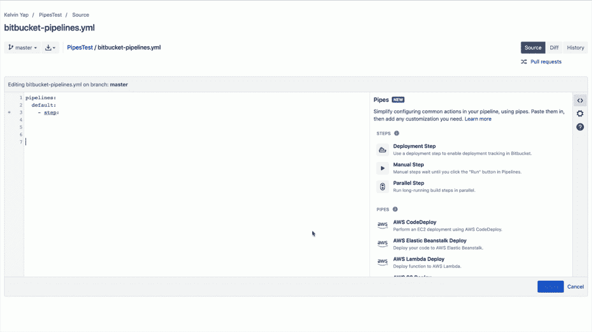

# Bitbucket 简化了使用管道构建 CI/CD 管道

> 原文：<https://thenewstack.io/bitbucket-simplifies-building-ci-cd-pipelines-with-pipes/>

持续集成和持续交付(CI/CD)背后的核心概念是，您的代码总是处于可交付状态，但是经常会有一个障碍——将代码从您的 repo 带到您的生产服务器的行为。

根据 Atlassian 最近的一项调查[，一般团队使用 4.3 个工具将代码从开发转移到面向客户的生产，这意味着团队必须有几个移动的部分一起工作。为了应对团队在完成 CI/CD 生命周期中面临的困难，Atlassian](https://www.atlassian.com/software-development/practices) [在近三年前发布了 Bitbucket Pipelines](https://www.atlassian.com/blog/bitbucket/introducing-bitbucket-pipelines-beta-continuous-delivery-built-within-bitbucket) 。正如该公司当时指出的，“实现连续交付并不容易。”

尽管建立了 Bitbucket 管道，该公司发现 DevOps 团队在集成各种工具和将代码投入生产时仍然遇到困难。据 [Bitbucket Cloud](https://bitbucket.org/) 的产品负责人 [Harpreet Singh](https://www.linkedin.com/in/singhharpreet/) 称，该公司最近的调查发现，超过 90%的受访者在让工具协同工作时遇到了困难。因此，该公司正在发布比特斗管道，辛格说这大大简化了流程。

“新的管道功能是管道的一个组件，它通过即插即用的集成用户界面，大大简化了设置和自动化测试和发布管道的过程，”Singh 说。开发人员无需编写脚本来设置管道，而是可以从受支持的集成(也称为管道)列表中进行选择，以自动创建这些管道，并使用流行的第三方工具进一步扩充现有管道

虽然 Bitbucket Pipelines 最初是为了解决这个问题而发布的，但不同组件之间的相互作用仍然带来了复杂性，Singh 将这种新产品比作家庭中的各个管道。

辛格说:“在你的房子里安装管道时，你必须连接各个管道，以便将水输送到需要的地方。”管道与管道的关系类似，您需要将管道编译在一起，以便在 Bitbucket 管道中创建完全自动化的 CI/CD 管道

点击观看。

目前，Bitbucket Pipes 推出了近 36 个由微软、AWS、Slack、谷歌云等公司预先配置的管道，但 Singh 表示，每天都在开发新的管道。使用管道，团队可以通过复制和粘贴每个管道的 YAML，然后填写必要的字段，轻松地将不同的工具链接在一起。从那里，管道的更新和管理由作者处理，而不是使用它的团队。

Singh 在发布 Pipes 的博客文章[中写道:“无论您是为 AWS 等托管服务创建简单的部署管道，利用多云部署策略，还是自动化涉及安全扫描、监控和工件管理的复杂管道，Bitbucket Pipes 都可以轻松构建和自动化满足您确切需求的 CI/CD 管道。“受支持的管道不仅使跨管道和存储库设置外部服务变得简单，而且它们还由作者更新和维护，这意味着您永远不必担心自己更新或重新配置它们。最终结果是，无论 CI/CD 管道有多复杂，都可以轻松地构建、更新、修改和维护它们。”](https://bitbucket.org/blog/meet-bitbucket-pipes-30-ways-to-automate-your-ci-cd-pipeline)

所有启用了[位桶管道](https://confluence.atlassian.com/bitbucket/get-started-with-bitbucket-pipelines-792298921.html?utm_source=blog&utm_medium=social&utm_campaign=bitbucket_bitbucket-pipes&_ga=2.219446682.265138277.1551381466-761337044.1551381466)的位桶用户都可以立即使用位桶管道。

通过 Pixabay 的特征图像。

<svg xmlns:xlink="http://www.w3.org/1999/xlink" viewBox="0 0 68 31" version="1.1"><title>Group</title> <desc>Created with Sketch.</desc></svg>