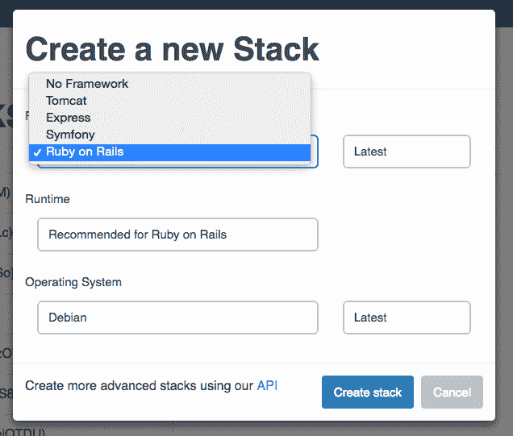
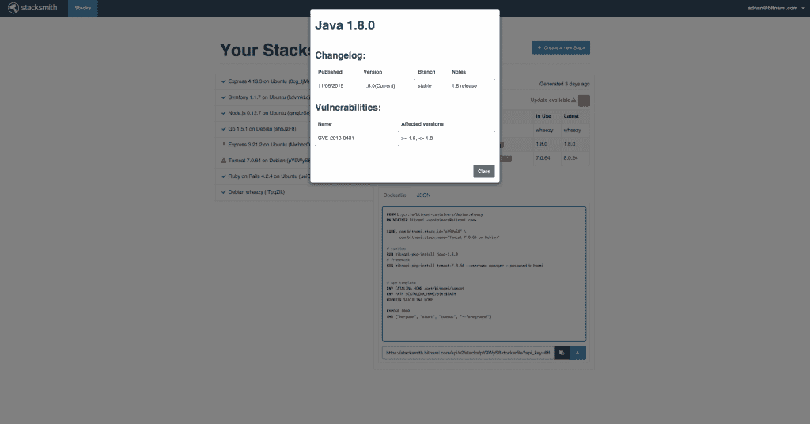
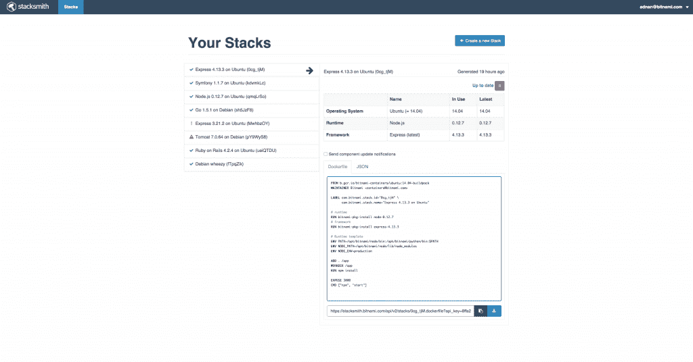

# Bitnami 的新 Stacksmith 交付预装码头集装箱

> 原文：<https://thenewstack.io/bitnami-announces-stacksmith/>

当致力于基于容器的基础设施时，首先出现的问题之一是用必要的后台应用程序和库创建和装备容器所花费的时间。对于需要大量容器的基于微服务的架构来说尤其如此。

此外，跨技术堆栈维护映像可能会很麻烦，因为依赖关系会过时或受到影响。Bitnami 已经解决了这些问题，并通过一项名为 Stacksmith 的新服务解决了这些问题，该服务目前处于测试阶段，将允许开发人员专注于创建新的应用程序，而不是担心操作系统要求或复杂的环境设置。

Bitnami 产品副总裁西蒙·贝内特(Simon Bennett)在一份声明中说:“这个测试版的目标是，我们希望社区能够建立尽可能多的不同类型的图像，并以我们从未预料到的方式使用 Stacksmith。”

Bitnami 的核心业务是提供一个非常大的在线可下载应用程序目录，包括开源软件和商业软件。该公司在后端运行一个大型构建系统，以确保这些包保持最新的安全补丁。这个 Stacksmith 新服务将这些应用程序加载到 Docker 容器中。

Bitnami Stacksmith 是一个为定制应用程序生成 Docker 文件的服务，提供了从头构建 Docker 化容器的替代方法。开发人员可以创建预装了他们喜欢的语言和库的容器，包括 Python、Java、PHP、Ruby 和 Node.js。当他们使用的组件更新时，该服务还会主动通知开发人员，使他们能够及时了解安全修复和功能更新。

在 Stacksmith 交付 Docker 文件后，开发人员可以将他们的自定义应用程序代码添加到 Docker 文件中。Stacksmith 还为开发团队提供了各种通知，让[知道作为其堆栈一部分的容器中的软件何时被更新](https://www.youtube.com/watch?v=4A24pD-P_N4&feature=youtu.be)，允许他们在 Stacksmith UI 中管理它。

图为:Bitnami Stacksmith，创建新的堆栈

## 引擎盖下

Bitnami Stacksmith 自动化了构建 Docker 文件的过程，从开放源代码和商业应用程序和库的 Bitnami 库中提取。在 Bitnami 运行时之上构建允许团队让他们的应用程序快速运行，而不是组装他们的技术堆栈的各个部分。Bitnami 允许开发人员将其应用程序的依赖项、数据库和库捆绑在一起，以确保最终用户将体验到开箱即用的产品，这意味着这种方法可以在更短的时间内交付更多的应用程序。

目前，一次只能触发一个构建，新构建请求之间的时间限制为五分钟。

图为:Bitnami Stacksmith 漏洞通知

Stacksmith 是 API 驱动的，允许开发人员通过单击 Stacksmith 链接中的导航栏来浏览他们的 API 文档。根据应用程序的需要，用户还可以使用声明性 API 或 ui。Stacksmith 还允许团队使用定制的 URL 共享他们的 Docker 文件，因此团队成员可以随时了解项目或测试应用程序的最新进展，因为在整个 QA 测试过程中会解决 bug。

图为:Bitnami Stacksmith 打开页面

随着容器继续扩展到简单的隔离测试环境之外，高效处理更多任务的需求变得非常重要。消除大规模应用程序开发和部署的障碍始于允许团队轻松地创建和管理他们基于容器的环境。Bitnami Stacksmith 提供了一项服务，帮助那些使用 Docker images 的人更好地管理、共享和更新他们的应用程序，使他们能够在一天中处理更多的任务，而不是花时间更新他们技术堆栈中的各个依赖项。

*Docker 是新栈的赞助商。*

专题图片:[备份栈](https://www.flickr.com/photos/jaymis/3190462946)，由 [Jaymis Loveday](https://www.flickr.com/photos/jaymis/) 授权于 [CC by 2.0](https://creativecommons.org/licenses/by/2.0/) 。

<svg xmlns:xlink="http://www.w3.org/1999/xlink" viewBox="0 0 68 31" version="1.1"><title>Group</title> <desc>Created with Sketch.</desc></svg>