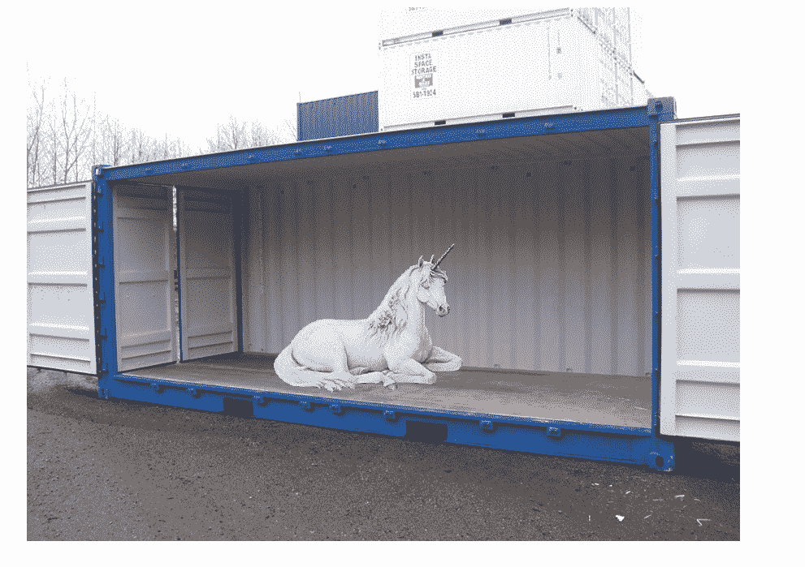

# Bitnami 帮助谷歌更接近 AWS 应用商店模式

> 原文：<https://thenewstack.io/bitnami-helps-google-get-closer-to-the-aws-app-store-model/>

自 2012 年以来，亚马逊网络服务拥有了自己的应用商店。如今，它销售开发人员工具、NoSQL 数据库、监控和问题跟踪软件、操作系统以及开发人员构建和管理应用堆栈通常需要的所有基本组件。

这项服务依赖于 Bitnami，Bitnami 的业务是将堆栈组件打包成非常紧密的包。上周，Bitnami 还加入了与谷歌计算引擎的合作伙伴关系。要理解这一举动的意义，需要回顾一下历史。

## 野生堆栈的自然栖息地

在古代，当巨大的蛇在广阔的、未开垦的大陆上漫游时，在云中部署 SaaS 应用程序的最简单方法是启动一个已经安装了该应用程序的通用形式的虚拟机实例。就开源软件而言，许多云服务鼓励他们自己的客户创建通用实例，然后与客户共享。例如，在 Azure 上，VHD 文件上有[库存虚拟机实例](http://azure.microsoft.com/en-us/documentation/articles/fundamentals-introduction-to-azure/)，这与你看到的与 Oracle 的 VirtualBox 一起打包使用的东西没什么不同。

这是非常方便的。在现代世界，进化的智人更喜欢在“云中”运行应用程序，而不是“在云中运行的虚拟机上”如果你想一想，每次你想实例化一个应用程序的时候，制造另一台假电脑的真正目的是什么？

这一物种中最聪明的已经开始订阅提供你可能已经读到过的叫做“堆栈”的服务。

自 2008 年以来，[一家名为 Bitnami](https://bitnami.com/learn_more) (最初有一个大大的“N”)的堆栈提供商一直致力于简化企业应用程序的部署，特别是内容管理系统，通过[将所有此类服务所需的一切压缩到一个堆栈](http://www.cmswire.com/cms/web-cms/bitnami-launches-modules-install-multiple-apps-on-a-single-software-stack-002886.php)。

正如[这个 2013 年的教程视频显示的](https://www.youtube.com/watch?v=bQ74IWTyAAI) (YouTube)，Bitnami 的标准化堆栈非常完整，你可以在物理 PC 上部署它，从而为几乎任何应用程序创建一个安全的沙盒开发环境。Bitnami 堆栈基于“三巨头”——Apache、MySQL 和 PHP——以及 Linux、Mac OS 和 Windows 版本。因此:灯，MAMP 和 WAMP。

## 进化迫使适应

然而，随着地球岩浆的冷却，Bitnami 演变成了一个即时应用程序启动器:一种选择你需要运行的应用程序并说“运行它”的方式。

Bitnami 首席运营官 Erica Brescia 在接受 CMSWire 采访时解释说:“Bitnami 云托管主要面向商业和非技术用户，他们的原生云控制台(谷歌、亚马逊、Azure)自由度太大，因此很难使用。”“因此，它有助于将更多这样的用户带到云上，否则他们可能会更习惯使用传统平台。”

出于基于云的启动器的目的，Bitnami 包确实是紧密捆绑的、基于 Linux 的虚拟机——不像 Docker 容器那样紧密，但仍然是最小的。由于 Bitnami 的脚本安装程序的设计方式，你可以部署多个应用程序，并确保它们之间没有干扰或依赖问题。

“预配置 Linux 虚拟机极其复杂，因为它需要了解完整的软件堆栈及其依赖关系，”Brescia 说。“保持堆栈的持续头痛是 Bitnami 消除的额外负担。用户可以简单地旋转他们想要的图像的最新版本。鉴于 Linux 操作系统上较低级别组件最近出现的安全问题，这一点变得尤为重要。”

你可能已经注意到了，Bitnami 正在通过 AWS 转售自有品牌的自助供应应用程序主机。而它的母公司 BitRock，Inc .也知道不少关于安装人员的事情。如果你没有听说过 BitRock，你可能听说过它的另一个主要产品: [InstallBuilder](http://installbuilder.bitrock.com/) 。

## 它开始变得越来越像比特纳米

上周，为了帮助扳平与亚马逊的比分，谷歌发布了自有品牌的[云发射器](https://cloud.google.com/launcher/#/explore)。

[![[SCM]actwin,0,0,1,1;Desktop 3/30/2015 , 5:27:20 PM](img/fd9ec0cdb8ece4f8219fe0e622640e7f.png)](https://thenewstack.io/wp-content/uploads/2015/03/150330-Google-Cloud-Launcher.jpg)

它本质上是一个 SaaS 应用商店，拥有 126 个著名的开源包(其中一些是为不同堆栈配置的相同应用)，只需点击几下其自我供应系统，即可部署在谷歌计算引擎上。您可能会注意到(没有隐藏)，这些包中有很多确实是 Bitnami 包。

正如其他地方报道的那样，它不是谷歌的第一个“点击部署”系统；自 2014 年初以来，谷歌实际上已经在计算引擎上提供了自己的点击部署服务。它也不是“只是一次点击”，但它肯定不是很多次点击，无论如何，免费信用报告服务的老手不会轻易上当。

但 Cloud Launcher 确实让谷歌——一家其客户端应用商店比亚马逊更知名、使用量更大的公司——更接近与亚马逊的 AWS Marketplace 平起平坐，后者[代表 BitRock 转售预先配置的 Bitnami 包](https://aws.amazon.com/marketplace/seller-profile/ref=srh_res_product_vendor?ie=UTF8&id=dbe6480c-fd0d-4625-9bd0-44606ed33fa6)。

布雷西亚告诉我们，今年春天晚些时候，Bitnami 将推出所谓的“it-just-works”监控支持，以谷歌云监控的形式支持在谷歌云中推出的包。这样，客户可以获得实时性能指标。

我们问布雷西亚，一个 Bitnami 或 Google Cloud Launcher 的客户可以用一个打包的虚拟机做什么，除了同样的客户可以用，比如说，[一个运行在 Google 容器引擎](https://cloud.google.com/container-engine/)上的 Docker 容器做什么？

“我们不认为集装箱与虚拟机竞争，”首席运营官回答说。“容器具有许多对开发人员及其工作流有价值的属性。但是，这两种形式的打包和分发都可以从可重复性、强大的版本保证以及应对常见操作挑战(如日志记录和监控)的标准化方法中受益。

“我们是容器的忠实粉丝，并在我们自己的开发中广泛使用它们，”Brescia 补充道，然后抛出了这一令人瞠目结舌的说明:“我们将在不久的将来发布 Bitnami 容器产品。”

**更新** : Bitnami 刚刚推出了 [Dockerizer](http://dockerizer.com/) ，一个分发开发者团队的开放平台。

通过 Flickr Creative Commons[获取专题图片。](https://www.flickr.com/photos/lodigs/137777901/in/photolist-ec6Y-f39q-aaHW7d-525k5C-4BoUFF-db9z4-dnMsEz-nqxTYN-9ny14-pbE7bn-dnMERX-6fDnGk-4xFzQM-eg4pwW-4sYKMe-2BEcno-8tB8ak-a8pgt2-dBXATg-bsGWcZ-6YsGjK-4GCn4J-qAmKN-85ScQ-4Bq4g2-bAUb2W-aFeHkq-8cEYPG-zrxXC-5u8Nod-ccfXP-62Yv2h-9gsHzL-8yHhgG-96mETW-48EZEs-cgPMQ1-aAqt9p-2RxXN8-ri4ud-odDMtd-6guc2R-dvmSJ-6VkYbn-QDmyR-6Vq3Rs-7hdXBs-4Cvny3-9pKgkJ-6V7UHx)

<svg xmlns:xlink="http://www.w3.org/1999/xlink" viewBox="0 0 68 31" version="1.1"><title>Group</title> <desc>Created with Sketch.</desc></svg>