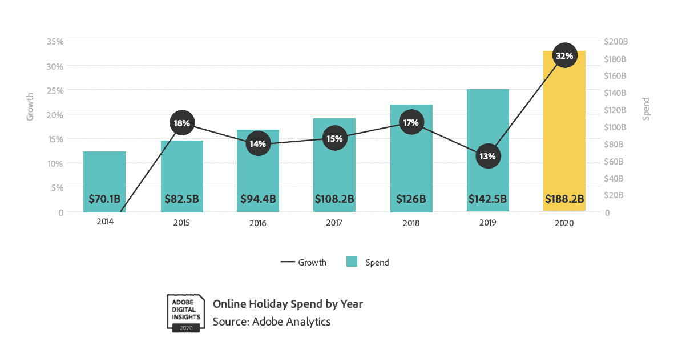
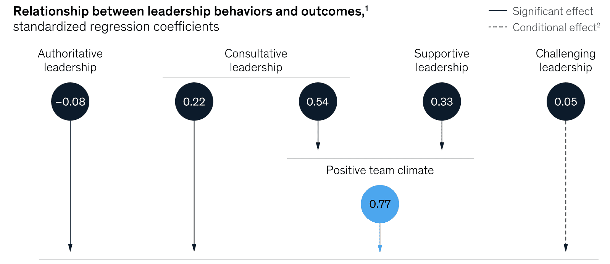

# 黑色星期五停机时间:如何避免对您的业务造成影响

> 原文：<https://thenewstack.io/black-friday-downtime-how-to-avoid-impacts-on-your-business/>

[Hannah Culver](https://www.linkedin.com/in/hannah-culver/)

[Hannah 是 PagerDuty 的一名解决方案营销人员，她对实时紧急工作如何在这个数字时代的所有行业中发挥作用很感兴趣。](https://www.linkedin.com/in/hannah-culver/)

这是十一月一个清爽的星期五早晨。你喝着咖啡，在精神上为决定你财年的那一天做好准备。你将如何度过这个黑色星期五？你的团队准备好了吗？

我们都听说过[可怕的停机数字](https://www.gremlin.com/ecommerce-cost-of-downtime/)，公司每分钟损失数千。那是在平常的一天。在黑色星期五，这些费用可能是天文数字。

在如此关键的一天出现停机或网站性能下降，不仅仅意味着一次性的收入损失；这也意味着更低的客户满意度、更低的品牌忠诚度和潜在的竞争优势。这对团队来说也是非常令人沮丧的。

随着 2020 年成为在线流量最大的一年，零售商面临着更大的压力来提供卓越的数字体验。根据 Adobe 的 2020 年假日购物季报告，“在线假日购物季超过 1880 亿美元，比 2019 年增长了 32%。”

然而，这一趋势并非始于新冠肺炎。全国零售联合会进行的一项调查显示，2019 年，1.24 亿人在商店购物，1.422 亿人在零售商网站购物。这不是一个微不足道的数字。Blackfriday.com 预测，2021 年，黑色星期五和感恩节的在线消费总额将同比增长 20%，达到 170 亿美元。

很明显，在这个关键时期，可靠的数字体验将最终决定零售商的成功。那么，你的团队如何准备呢？现在你可以考虑三件事来帮助你的假期取得成功:

1.  投资于交通高峰期的最佳实践。
2.  创造一个心理安全的环境。
3.  用正确的工具武装你的团队。

有了这三个，你可以为你的团队准备黑色星期五和之后的事情。

## 1.投资于交通高峰期的最佳实践

[超级关怀](https://www.pagerduty.com/blog/hypercare-for-the-holidays/)是一段时间，在这段时间内，可提供更高水平的支持，以确保系统的无缝采用或运行。在交通高峰期，当风险很高，服务需要近乎完美的时候，许多团队会转向这种运营模式。虽然 hypercare 可以采取多种形式，但您的团队可以通过一些常见的方式走在前面:

*   **实施代码冻结**:确保在接近高峰期的当天不会发生任何变化，除非这些变化与解决客户面临的事件有关。
*   **记录并实践重大事故流程**:确保待命团队成员做好待命准备，熟悉事故管理流程并知道如何与其他团队合作。几次演习可以帮助团队成员建立信心。
*   **建立适当的可观察性**:建立实时监控、记录和跟踪，以及综合监控，以保持期望的性能水平。
*   **为可见性设置仪表板**:验证并创建有意义的业务服务，以便利益相关者可以在环境中发生任何问题时得到提醒。
*   **建立利益相关者沟通流程**:确保有一个与利益相关者沟通的明确流程，包括利益相关者可以在哪里找到关于重大事故的更多信息。
*   **负载测试、容量和混乱计划**:利用现有的负载测试和混乱工程工具建立基线。确保有能力处理预期的高峰需求。

请参见我们的 [Hypercare 清单](https://www.pagerduty.com/resources/ebook/hypercare-readiness-checklist/)，了解有关 PagerDuty 如何帮助支持这些计划的更多详细信息。

然而，需要注意的是，这些都是流程解决方案。您还需要确保有人员和技术来支持它。特别是，确保团队成员做好准备是至关重要的。做到这一点的方法之一是促进心理安全。

## 2.创造一个心理安全的环境

工作场所心理安全是由哈佛大学的艾米·埃德蒙森创造的一个概念，并被定义为“团队成员共同持有的信念，即团队对于人际冒险是安全的。”换句话说，这意味着你的团队感到安全，可以提出问题而不用担心惩罚，犯错误而不用担心惩罚，并尝试新的工作方式，因为他们知道自己有安全网和学习空间。

那么，为什么这对你的团队很重要呢？嗯，研究表明心理安全会产生更好的结果。根据盖洛普的数据，“只有十分之三的美国员工强烈认为在工作中，他们的意见似乎很重要。但是，通过将这一比例提高到 60%，组织可以实现人员流动率降低 27%，安全事故减少 40%，生产力提高 12%。”

更快乐、更安全、更高效的团队。这就是心理安全所能提供的。进一步的研究表明，特定的领导类型在这方面更有效。[麦肯锡&公司发现](https://www.mckinsey.com/business-functions/organization/our-insights/psychological-safety-and-the-critical-role-of-leadership-development)既能提供咨询又能提供支持的领导者能够为他们的团队营造一个更安全的环境。

领导风格的改变会对你的团队的日常运作产生重大影响。例如，想象一下，尽管你尽了最大努力，但你在黑色星期五还是停电了。作为一名领导者，你以权威的方式掌控一切。你确切地告诉你的团队要做什么，因为时间是关键，所以没有讨论的余地。然而，这产生了不良的结果，因为解决事件的 SME(主题专家)对情况有更准确的看法。但是，由于缺乏心理安全感，他们不说话。这一事件持续时间过长，对收入和客户体验有直接影响。

让我们重新想象一下这种情况。你知道发生了一起事故。你询问你的团队如何最好地解决这个问题，以及他们是否需要你的帮助。你允许你的中小企业解决问题，并以他们要求的方式提供帮助。如果不是以你想象的方式，这个事件会很快解决。这种积极的结果是心理安全的直接影响。

在这些关键时刻，相信你的团队会做正确的事情很重要。这对事件解决时间和收入很重要，但从长远来看，对您领导的团队也很重要。心理上更安全的团队是会留下来的团队，在像“[大辞职](https://www.npr.org/2021/06/24/1007914455/as-the-pandemic-recedes-millions-of-workers-are-saying-i-quit)”这样的时期，留住人才是最重要的。

失败是肯定的，心理安全的团队能够更好地处理事件，即使是在像黑色星期五这样压力很大的日子。您可以确保您的团队通过放置合适的工具为这些关键时刻做好更充分的准备。

## 3.用正确的工具武装你的团队

工具不能防止像黑色星期五这样重要的一天发生失败，但是它可以帮助团队更快地从失败中恢复过来，并且学习，这样问题明年就不会重复了。以下是您应该在数字运营管理平台中寻找的四个关键功能，它们将有助于让黑色星期五(以及一年中的每一天)变得更加轻松:

*   **消除噪音，知道谁在待命**:随着事故数量的逐年增加(【2019 年至 2020 年 19%)，噪音响应者的水平也需要与之抗衡。找到消除这种噪音的解决方案，这样您的团队就可以专注于真正重要的事情，并知道哪些信号需要他们的关注。此外，您应该能够轻松管理随叫随到，而无需笨重的电子表格或呼叫树。这有助于您更快地找到合适的 SME，从而提高 ack%(确认百分比)并明确多个团队之间的所有权。
*   **启动无缝事件响应**:在事件响应期间，您需要快速工作。一个理想的解决方案应该是允许你在已经使用的工具内工作——比如 Slack、Teams 和 Zoom——并帮助你最大限度地减少工作量。自动化是将您的响应团队从更关键的任务中解放出来的关键。使用自动化来协调响应流程，为响应者分配角色，甚至只需点击一个按钮即可运行诊断脚本或自动补救。
*   **从自己的错误中吸取教训**:当事件结束时，很自然的会想深呼吸，拍拍自己的背。一旦放松的感觉结束，你可能会好奇——是什么导致了这个问题？尤其是在像黑色星期五这样重要的日子里，每个事件都是审查的对象。一个理想的工具将帮助你理解哪里出了问题，如何修复它，以及如何在系统以同样的方式失败两次之前优先考虑你需要做出的改变。
*   关注你的团队健康:黑色星期五仍然是一年中最重要的购物日之一。虽然过去大多数购物都集中在这一天，但现在假期交易早在 9 月就开始了，一直持续到假期开始。记住这一点，保护你的团队免于精疲力竭是很重要的。您需要一个平台来帮助您了解您的系统和人员在假期压力下的状况。

如果这些功能听起来像是你的团队可以从中受益的东西，你仍然有时间采用一种解决方案，这将有助于使你的黑色星期五成为一个真正的大门终结者，无论是在现场还是在线。

*今天就试试 PagerDuty 的 [14 天免费试用](https://www.pagerduty.com/sign-up/)。或者，如果你想了解更多关于零售商如何进入这一快速数字化时期的信息，请查看我们的电子书《[停机时间对零售商的影响](https://www.pagerduty.com/resources/ebook/impact-downtime-retail/)*

<svg xmlns:xlink="http://www.w3.org/1999/xlink" viewBox="0 0 68 31" version="1.1"><title>Group</title> <desc>Created with Sketch.</desc></svg>