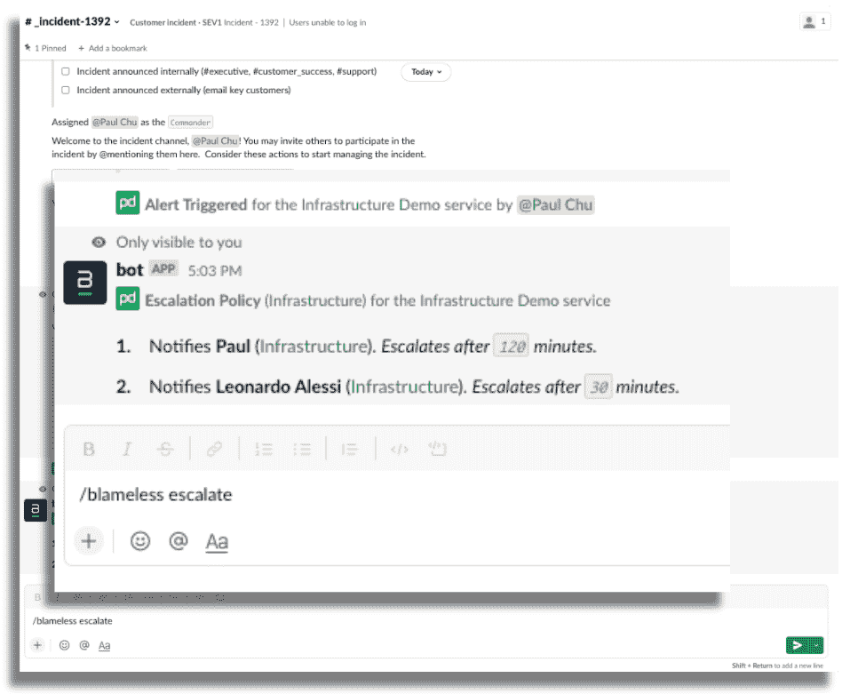

# 无可指责的通信流:当坏事发生时的通信

> 原文：<https://thenewstack.io/blameless-commsflow-comms-for-when-bad-things-happen/>

沟通渠道仍然是 DevOps 的基石。然而，当试图消除不同团队之间的孤岛时，在不同的涉众之间保持适当的沟通仍然是一个挑战。越来越分散的团队以及与跨云原生环境部署和管理基础架构相关联的复杂性，进一步增加了确保将正确的消息分发给需要它们的利益相关方的难度和必要性。

当事故发生时，需要向正确的人传达适当的信息，通信挑战也可能成为更大的问题。所有这些通信应始终正确归档和可访问，以便在事后分析过程中从事件中吸取教训，从而避免将来出现某些错误和故障。

“当需要上报以吸引更多专家时，及时沟通是关键。除了工程，其他业务功能需要知道事件的状态，以了解它是如何进展的，”[迪尔德丽·马霍](https://www.linkedin.com/in/deirdre-mahon-1a67a)，[无可指责](https://www.blameless.com/)的营销副总裁告诉 New Stack。"没人想用大量重复的问题打断随叫随到的工作。"

马霍说，“无可指责”的新通信流旨在自动分发可编辑的通信，以便“在正确的过渡步骤”更新相关团队。“每个人都可以保持冷静，因为他们知道这是由正确的专家处理的。”

## 及时、内容丰富的更新

马霍说，这样的沟通流可以分布到支持、销售、客户成功，当然还有管理。“由于这些团队不会坐在事故松弛通道上观察每一步，他们可能会担心事故的状态。有了 CommsFlow，他们可以继续执行正常的任务，因为他们知道他们会通过自己喜欢的方式(电子邮件、Slack 或 SMS)及时收到内容丰富的更新。”

马霍说，如果没有一个集中的地方来整理所有信息，就很难获得准确的时间表或详细的追溯报告。“团队可能会浪费大量时间从各种地方拼凑故事:Google Docs、Zoom calls、Slack channels、吉拉门票、页面责任升级政策，以及来自监控或可观察性解决方案的所有相关图表。没有详细的回顾，(事后)，就没有办法知道到底发生了什么，以及如何改善前进，”马霍说。“失去了一个重要的学习机会，再次经历同样旅程的可能性很高。这对工程师、客户或整个企业都没有好处。”

马霍说，通过这种方式，CommsFlow 旨在帮助减轻处理事件的团队面临的负担，同时减轻相关的压力或不必要的问题。马霍说:“客户得到了更新，随叫随到的团队不会因为额外的压力和负担而感到精疲力竭。”

## 消除手动操作

在 CommsFlow 发布之前，通信提升需要工程师在处理事件时的个人思考和人工努力。有了预配置的行动手册或商定的流程步骤，这种提升肯定会更轻松，因此有了 CommsFlow，团队可以轻松编辑针对特定事件过渡步骤的预先批准的通信，这些步骤可以根据工作流规则自动分发。“这在与包括客户和合作伙伴在内的外部利益相关者沟通时尤其有用，”马霍说。“这导致了更快的沟通，简化了整个工作流程，包括解决方案和追溯报告。”

CommsFlow 提供的无可指责的通信功能包括:

*   可定制的消息创建、编辑和发送触发器。
*   与流行的消息和电子邮件提供商集成。
*   由预定义的规则和工作流触发的自动化邮件分发。
*   使用多种工具(电子邮件、SMS、Slack 和 MS 团队)同时锁定收件人。
*   集中管理、定制和“调整”所有通信规则。
*   当事件状态、严重性或追溯性发生变化时，自动触发消息。
*   在事件的特定时间段内，以自定义的时间间隔自动发送提醒。
*   集中消息日志，帮助调整您的沟通策略的有效性。
*   确定并整理你最常用的沟通流程。

<svg xmlns:xlink="http://www.w3.org/1999/xlink" viewBox="0 0 68 31" version="1.1"><title>Group</title> <desc>Created with Sketch.</desc></svg>