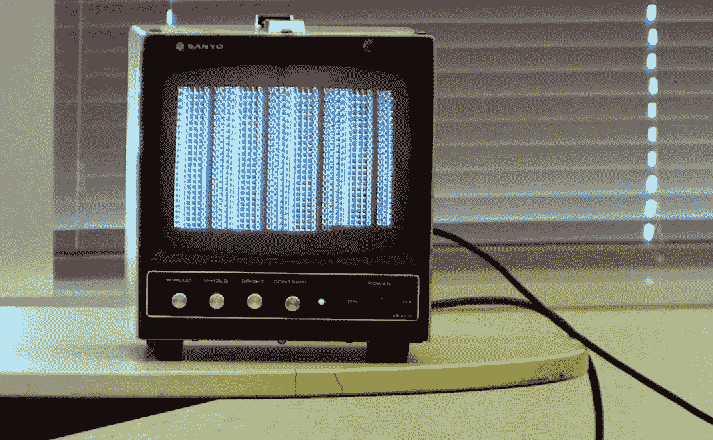
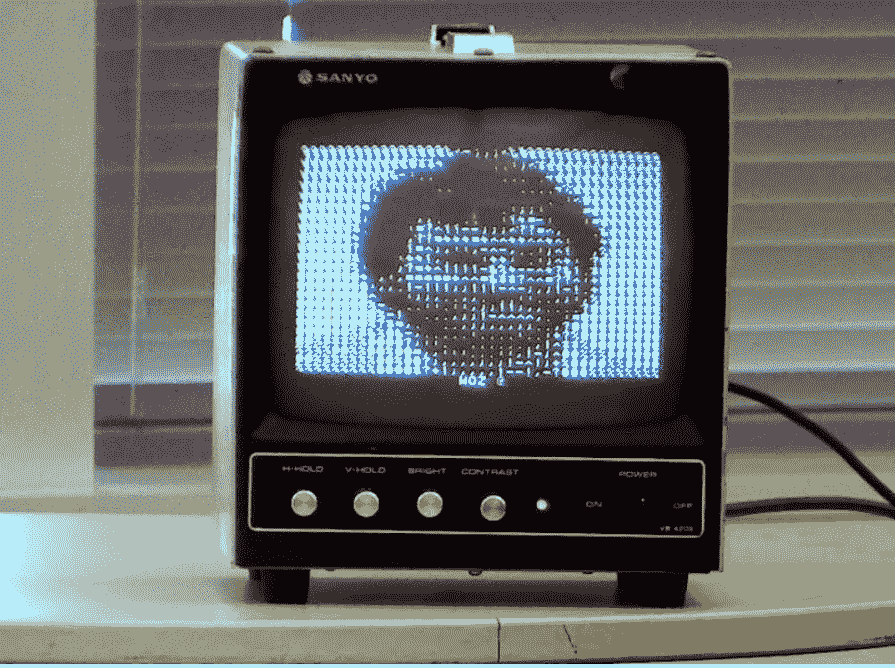
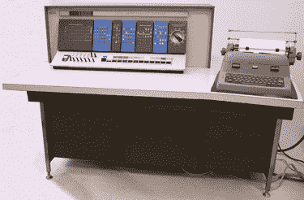

# 飞向过去:在西部复古电脑节上的苹果 1 演示

> 原文：<https://thenewstack.io/blast-off-into-the-past-an-apple-1-demo-at-the-vintage-computer-festival-west/>

上周末，山景城的[计算机历史博物馆](https://www.computerhistory.org/)举办了[西部老式计算机节](http://vcfed.org/wp/festivals/)，通过精心策划的一些非凡的文物展示，让与会者有机会珍惜我们的共同遗产，并与爱好者、教育家和致力于保护这一切的保护主义者交流。

着眼于子孙后代，这个节日对任何 14 岁或 14 岁以下的人免费，并由 Vintage Computer Federation，一个 501(c)3 非营利组织精心维护。

“你会发现 20 世纪 60 年代的小型机、70 年代的自制系统、80 年代的八音盒和一些奇怪的东西，”电影节的网站承诺[。](http://vcfed.org/wp/festivals/vintage-computer-festival-west/)

“最终，保护这项技术并与后代分享它才是真正的意义所在，”[写道，技术网站 Hackaday](https://hackaday.com/2019/07/30/vintage-computer-festival-west-is-almost-here/) 是该活动的赞助商之一，另外还有计算机械协会、IEEE 和计算机历史博物馆。

Hackaday 的视频撰稿人之一 Bil Herd 也是 Commodore 128 的前首席设计师，他发表了一篇关于时间如何影响老式计算机内部组件的演讲。

[https://www.youtube.com/embed/L6ZwjusbEdw?feature=oembed](https://www.youtube.com/embed/L6ZwjusbEdw?feature=oembed)

视频

## **欢迎来到你的过去**

这是继新泽西、华盛顿和意大利之后，该非营利组织今年的第三个节日。但是对这个硅谷版本的期望似乎特别高。从[展会的参展商页面](http://vcfed.org/wp/festivals/vintage-computer-festival-west/vcf-west-exhibits/)来看，有很多热心人和热情，他们提供了 100 多台老式电脑演示。亮点包括:

*   软件开发人员 Chris Davis 展示了他的老式电脑(由 Gabe 和 Eli Davis 协助)，包括基于 Arduino Duo 的 Altair 8800 和 Apple I 的现代复制品。
*   高级技术主管 Simon Wynn 展示了完全修复的 Sun Microsystems IPX，这是一个 20 世纪 90 年代初基于 Sparc 的 UNIX 工作站，最初售价为 11，995 美元。
*   来自圣何塞的迈克尔·弗曼演示了 Radio Shack 的一台 20 世纪 80 年代的 TRS-80 彩色电脑，并被爱好者们吹捧为正在开发的产品。
*   来自加州雷德伍德城的布莱恩·帕克谈到了为建造一台 19 世纪 30 年代著名计算机的半实物复制品所做的努力:巴贝奇的分析引擎。
*   San Leandro Computer Club 带来了其最初的 Atari 400 和 800 计算机(首次发布于 20 世纪 70 年代末)以及所有的外围设备(包括世界上第一个第一人称射击游戏“星际突袭者”，以及所有其他最初的 Atari 游戏)。他们甚至在雅达利在 C.E.S .实际使用过的原始信息亭中演示了他们的机器——包括原始交互演示软件的副本。
*   还展示了 DEC PDP-1(1959 年首次生产)。

甚至有人[发现了一个谜解码器](https://twitter.com/drahardja/status/1158221075739623426)。博物馆本身[提供了一个展品](https://twitter.com/ComputerHistory/status/1156655772492869632)，在*Mac*网站上引起了苹果博主们的注意。

David Pierini [上周在网站上写道:“你必须乘坐时间机器回到 1976 年，在加州洛斯阿尔托斯克里斯特大道的车库里，才能在同一个地方找到 10 台 Apple 1 电脑。”。帖子还指出，Apple 1 注册表报告仅生产了 200 台，并报告至少有五台电脑预计会实际运行。](https://www.cultofmac.com/642424/apple-1-vintage-computer-festival-west/#more-642424)

有两个不同的演示将这一历史事件放在适当的背景下，其中一个甚至包括对第一台 Apple I 的所有者 Liza Loop 的采访，这是 26 岁的史蒂夫·沃兹尼亚克亲自送给她的。

[https://www.youtube.com/embed/YwgAMJ1vBV4?start=265&feature=oembed](https://www.youtube.com/embed/YwgAMJ1vBV4?start=265&feature=oembed)

视频

在同一场演讲中，苹果 1 专家科里·科恩还展示了一台从德国空运过来的真实的苹果 1，并提供了一些历史。(科恩没有从原始时代的卡带播放器上下载 BASIC 语言——那需要 20 分钟——而是换上了一台现代的 iPad。)

房间里真的有些紧张——因为这台苹果 1 已经一年多没有运行了。“好吧，谁有灭火器，”科恩开玩笑说…

科恩曾希望将苹果 1 的视频输出——接近模拟——用于大型演示屏幕。但不幸的是，虽然苹果 1 可以工作，但视频适配器却不行。接下来，他尝试连接一个小型三洋显示器，然后拍摄它的微小显示。未来苹果公司的 12 号员工丹尼尔·科特基和他一起站在台上，输入 0。看它是否会列出内存——它确实列出了。

演示进行到 50 分钟时，科恩终于能够向观众展示 Apple 1 的基本提示——向观众解释他必须非常小心地打字。

然后他运行了一个程序，一遍又一遍地打印出“你好，VCFHELLO，vcf HELLO”——赢得了观众的掌声。

“如果你能做到这一步，信不信由你，那会让苹果 1 的价值增加几十万美元，”他说。

他完成了一个打印出原始双色图像的演示——首先是沃兹，然后是史蒂夫·乔布斯，然后是沃兹和乔布斯在一起，最后是苹果的标志。

科特基后来展示了一个程序，可以让苹果 1 的复制品发送电子邮件。科恩[还主持了一个由 Apple 1 用户组成的小组](https://www.youtube.com/watch?v=yrxinWAtWAo&amp;feature=youtu.be&amp;t=867)——以及一些最早的苹果员工。

## **月球上的电脑**

人类“原始”的早期计算机完成了一些惊人的事情。在一个特别的演示中，计算机修复专家 Mike Stewart 实际上演示了一个官方的 NASA 阿波罗飞船程序模拟程序——基本上是原始软件，尽管它通常只是将输出发送到模拟器。相反，他把它插入了一个调试器中，他们将使用它来恢复一台真正的阿波罗制导计算机，然后用它向 1969 年的原始计算机的“门精确复制品”提供信号。“所以现在我必须为阿波罗 11 号软件中的一个错误做一个变通办法，”他一度说。重启电脑会让软件失去对着陆雷达的追踪。

[https://www.youtube.com/embed/YTk7jyiaE1U?start=628&feature=oembed](https://www.youtube.com/embed/YTk7jyiaE1U?start=628&feature=oembed)

视频

他还告诉观众，即使阅读显示器上的代码也有其自身的挑战:“宇航员必须记住每个显示器上小数点的位置，因为显示器上没有任何点。”当 Delta H 号报告着陆雷达的读数与阿波罗导航计算机的读数冲突时，最激动人心的时刻到来了。“这意味着现在我们比 AGC 认为的要低 4000 英尺。这对于着陆来说是一个问题……计算机将以这种速度将我们直接送入地表。”

解决办法？输入“`Verb 57 Enter,"`，切换到着陆雷达的测量我们将看到 Delta-H 慢慢倒计时，因为自动增益控制器慢慢地将雷达读数整合到它对我们所在位置的想法中。"

半个世纪后，代码[现在可以在 GitHub](https://github.com/virtualAGC/AGC_simulation) 上获得，但很高兴看到观众在它运行时观看它，并在模拟模块降落在月球上时鼓掌，它的引擎准时停止。

“所以现在我们在月球表面，”斯图尔特说。(掌声更多。)“我们就是这样驾驶阿波罗 11 号着陆的。”

但随后他按下“中止状态”按钮，返回轨道。

与此同时，RR Auctions [实际上是*出售*](https://twitter.com/dag_spicer/status/1157800740749893632) 一台苹果 1 和一台阿波罗导航计算机——并在即将到来的拍卖之前将它们带到展会上“预览”。

## **为大型机构建新键盘**

来自博物馆 IBM 1620 Jr .项目的戴夫·巴布科克(Dave Babcock)介绍了他的团队如何利用一台商用 IBM Lexmark Wheelwriter 1000 打字机，然后创建了一个适用于老式计算机的通用终端键盘。例如，从 1959 年开始，它可以兼作大型 IBM 1620 的控制台打字机，或者作为 ASCII 电传打字机。

[https://www.youtube.com/embed/pNj6Ny_v2FU?start=360&feature=oembed](https://www.youtube.com/embed/pNj6Ny_v2FU?start=360&feature=oembed)

视频

他们用聪明和勇气克服了无数的挑战——包括在打字机的逻辑板上“注入”假按键。它在未来也会派上用场，因为博物馆正在重建 IBM 1620 主机，创造出一个坚固的历史精确的再创造，博物馆的参观者可以与之互动。它需要一台控制台打字机来输入机器语言启动指令。

“我们的目标是这是一台通用的电传打字机，”他在最后的问答环节中说。“它可以代替电传打字机或任何其它电传打字机，与任何具有 RS2/ASCII 之类东西的计算机一起工作。”

IBM 1620。

最终，这个节日给了他们一个绝佳的机会，用更多的机器来测试他们的设备。他们已经将它插入到 PC、MAC、Raspberry Pi、PDP-8/i、Altair 8800 的复制品中——每一个新设备都允许他们对过去和现在的混合进行一点点调整和定制。

本着这个节日的真正精神，他们为任何来享受这个老式电脑大聚会的人提供了一个特别的优惠。

“我们在展会上达成了一项协议，任何拥有 RS2 电脑的人都可以拿过来插上电源！”

* * *

# WebReduce

<svg xmlns:xlink="http://www.w3.org/1999/xlink" viewBox="0 0 68 31" version="1.1"><title>Group</title> <desc>Created with Sketch.</desc></svg>