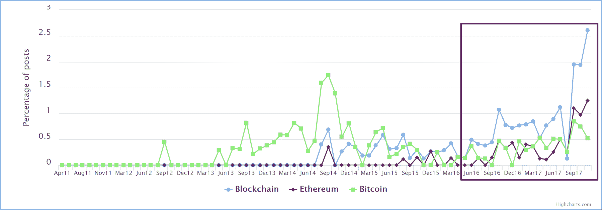
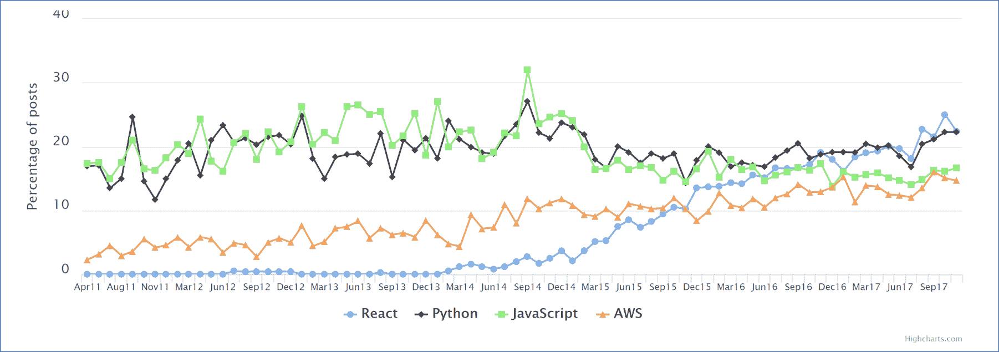

# 本周数字:区块链火热；但是 React.js 在上面

> 原文：<https://thenewstack.io/blockchain-hot-react-js-top/>

在过去的一年里，区块链已经脱离了它最著名的应用——比特币。寻求职业发展的开发人员最好仔细研究一下这项新兴技术。

追踪向[黑客新闻](https://news.ycombinator.com/)提交“可疑”信息的《黑客新闻》雇佣趋势显示，提及[区块链](/tag/blockchain/)的帖子一直在增加。10 月份，这个词在招聘信息中的使用频率从去年的 95 个上升到第 45 个。[以太坊](https://www.ethereum.org/)，另一种加密货币以太背后的分布式账本技术，在乔布斯提到它的次数上也已经超过了比特币。

这并不是因为比特币被超越了。相反，以太坊是许多采用智能合约和 ico(首次发行硬币)的企业正在使用的技术，这些技术正在筹集资金，为未来的令牌项目提供资金。据传闻，经验丰富的区块链开发商现在年薪高达 20 万到 30 万美元。这些数字催生了一波课程，比如来自区块极客的课程，旨在提供雇主和初创企业创始人正在寻找的技能。

你喜欢这种炒作吗？是时候面对现实了。React 编程能力是最热门的术语，占帖子的 22.4%，相比之下，区块链的这一比例为 2.6%。Python、 [JavaScript](/tag/javascript/) 和亚马逊网络服务也在招聘职位中被广泛提及。有趣的是，普通的旧 JavaScript 在 2014 年末开始下降，而 React 的提及率却开始上升。

除了黑客新闻，我们还查看了 StackOverflow、Dice.com 和 LinkedIn 上的招聘信息。总的来说，这些网站有更多寻求 JavaScript 技能的职位，但是大约 1%的职位提到了区块链。

这个故事的寓意是什么？区块链是热门，但它仍然必须取得指数级的收益，直到它与其他技能相匹敌，才能让开发人员找到工作。

通过 Pixabay 的特征图像。

<svg xmlns:xlink="http://www.w3.org/1999/xlink" viewBox="0 0 68 31" version="1.1"><title>Group</title> <desc>Created with Sketch.</desc></svg>