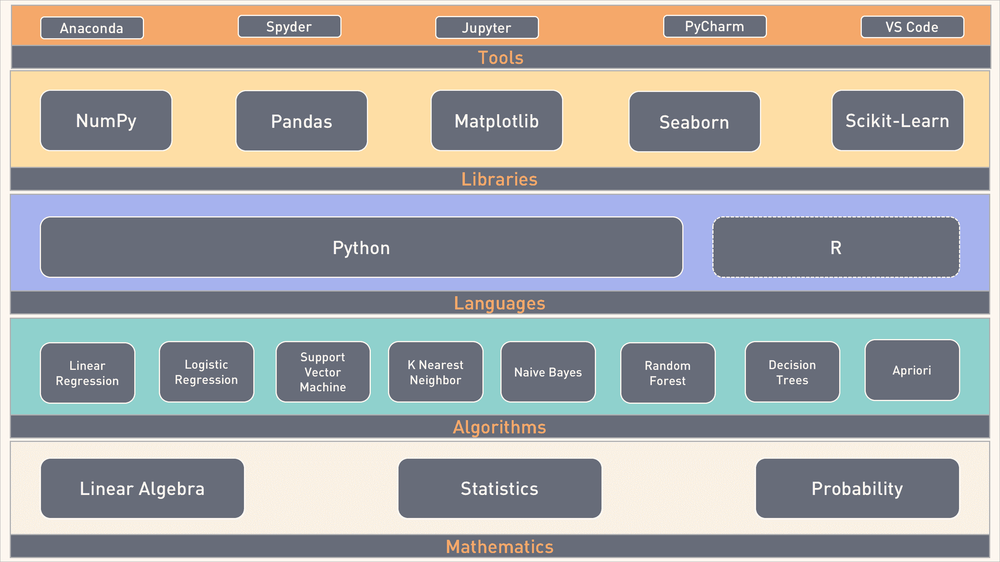

# 开发者开始机器学习的蓝图

> 原文：<https://thenewstack.io/blueprint-developers-get-started-machine-learning/>

许多开发者(包括我自己)已经将学习机器学习纳入了他们 2018 年的新年决心。即使每天在日历上划出一个小时，我也很难取得进展。出现这种情况的主要原因是对从哪里开始和如何开始感到困惑。对于一个一般的开发者来说，入门机器学习是势不可挡的。

有很多教程、MOOCs、免费资源和博客都涉及这个话题。但它们只会让事情看起来更复杂，从而增加混乱。

很多时候，我们希望有一本教科书，涵盖了学科的最重要的部分，给我们正确的信心。幸运的是，C 和 UNIX 发明的时候，我们还没有万维网。用户和开发者依赖于创作者创作的一套有限的手册和教科书。在当前的背景下，学习任何新的东西变得越来越困难。像机器学习和深度学习这样的新兴技术可以获得的大量资源令人生畏。

在花了相当多的时间了解情况后，我为开发人员编写了一份接受机器学习的基本技能和技术清单。这个蓝图局限于监督学习，有意排除深度学习。在转向深度学习和神经网络之前，开发人员理解并欣赏机器学习的魔力是极其重要的。我将在本系列即将发表的一篇文章中分享一个类似的深度学习蓝图。

## 数学

如果你真的想在机器学习领域建立职业生涯，你就不能回避数学。线性代数在 ML 中起着重要的作用。训练、测试和预测中使用的每个数据点首先被转换成一个实数数组。这些数组用于基于矩阵加法、减法和乘法的复杂计算。在进入高级概念之前，先从标量、向量、矩阵和张量的基础开始。

统计学对于机器学习同样重要。监督学习中使用的关键算法源于古老的统计模型和定理。你需要理解统计学的基本原理，从均值、中位数、众数、变异和标准差开始。它还有助于在构建 ML 模型时处理数据的分析和可视化。

概率论为开发和测量机器学习模型的有效性提供了一个框架。首先学习基本的概率计算，然后是贝叶斯法则、条件概率和链式法则。

可汗学院是你学习数学的最佳选择。选择涵盖上述领域的适当模块。

## 算法

算法构成了机器学习的核心。他们甚至在 ML 流行之前就存在了。这些算法中的大多数是由数学家在过去十年中创造的。其中大部分都是基于经过验证的统计模型。

预测和分类是机器学习的两个重要领域。基于历史数据，预测一个实数是一个非常流行的应用。类似地，对图像或数据点进行分类也是一个有用的场景。在预测和分类的实验中使用了著名的波士顿房价和 [MNIST 数据集](http://yann.lecun.com/exdb/mnist/)。

线性和逻辑回归构成了最大似然法的基础。即使在涉及深度学习和神经网络的高级用例中，这两个也变得很重要。投入时间理解方程，y=mx+c，不要忽略与梯度下降、学习率、损失函数、成本函数相关的概念。即使在深度学习中，它们也是高度相关和适用的。

诸如 SVM、KNN、朴素贝叶斯等其他算法用于预测或分类。但是，一旦你理解了线性回归的工作原理，这些算法就很容易理解了。

基于线性回归的预测分析相当于 ML 的“hello world”。确保你在学习这个算法上投入了足够的时间。

在你想打开编辑器开始编码之前，花点时间用 Microsoft Excel 来理解算法。如需灵感，请参考本系列过去的教程机器学习不是魔术。

## 语言

Python 和 R 是开发 ML 模型的两种流行语言。如果你是一个完全的初学者，没有任何背景，你可以选择这两种语言中的任何一种。

Python 是迄今为止最适合 ML 的语言。它的简单性让开发人员专注于问题，而不是迷失在语法、语义和约定中。它受欢迎的另一个原因是处理列表、字典和元组等数据结构的能力。Python 拥有科学计算工具和库的最佳生态系统。学习 Python 3.x 让你面向未来。花时间掌握 Python 中的语法、数据结构和文件 I/O。

如果您来自非编程背景，对 MATLAB 有些熟悉，R 可能是您的最佳选择。幸运的是，Python 中的许多工具都有 R 语言绑定，对于传统的统计学家来说，R 提供了一种熟悉的方法。

我个人推荐的是 Python，基于易学性和工具的可用性。

## 图书馆

本节介绍的库主要是针对 Python 的。尽管 R 有等价的模块，我们将着眼于科学计算和机器学习的 Python 库和模块设计。

NumPy 是一个强大的 Python 计算库。它是为复杂的数据结构设计的，比如向量和张量。涉及多维数组的计算由 NumPy 轻松处理。它为矩阵乘法提供了现成的功能。与用 Python 编写的执行算术运算的自定义代码相比，NumPy 的速度快得惊人。它针对性能进行了高度优化。它是许多其他库和框架的基础。对 NumPy 的透彻了解对于机器学习是必不可少的。

由于结构化数据有 CSV、TSV 和 Microsoft Excel 格式，我们需要一个库来访问和操作这些数据。 [Pandas](https://pandas.pydata.org/) 是最流行的 Python 库，用于从现有资源创建灵活的数据结构。它是清理数据集和为复杂分析准备数据的重要工具。Pandas 与 NumPy 和其他可视化工具集成得很好。

除了 NumPy 和 Pandas，Matplotlib 是最重要的库。它是可视化数据的基本工具。从直方图到盒须图，Matplotlib 使绘制数据变得轻而易举。

和 Matplotlib 一样， [Seaborn](https://seaborn.pydata.org/) 是另一个数据可视化工具，值得在数据科学家工具包中占有一席之地。

Scikit-learn 是 Python 世界中机器学习的主力。它为主流的机器学习算法提供了开发者友好的 API。一旦数据准备好并规范化，只需调用几次 Scikit-learn 来训练和测试模型。它是许多算法的简化抽象。这个模块的助手方法对于数据科学家来说是必不可少的。即使您没有使用 Scikit-learn 进行训练和评估，helper 方法也可以节省大量数据准备阶段的时间。如果你没有掌握 Scikit-learn，你就不能自称是 Python ML 开发人员。

## 工具

工程师的效率取决于他使用的工具包，机器学习也不例外。ML 的工具仍在发展，但是有一些成熟的环境可以加速模型开发。

Anaconda 是安装 Python 以及数据科学所有先决条件的首选工具包。它附带了一个名为 Conda 的定制安装程序，用于添加、删除和升级模块。Anacoda 发行版中包含了标准模块和库，如 NumPy、Pandas、Scikit-learn。它适用于 Linux、MacOS 和 Windows。

Anaconda 中提供的 Spyder 是一个很好的数据科学 IDE。编辑器支持自动完成、语法检查和验证。Spyder 包括一个变量浏览器和 Python shell，用于交互式调试。

Jupyter 主导了 Python 工具生态系统。Jupyter 的前身是 IPython，它通过基于浏览器的交互式体验将 REPL 推向了一个新的高度。与 Markdown、HTML、文本和图形的集成使它成为最好的工具。Jupyter 笔记本很容易被开发者分享。Github 可以原生渲染 Jupyter 笔记本，这使得它成为协作开发的理想选择。

[PyCharm](https://www.jetbrains.com/pycharm/) 是 IntelliJ 的开发者 JetBrains 的 Python IDE。它有一个功能有限的免费社区版，和一个包括像概要分析和高级调试等功能的商业版。

[Visual Studio Code](https://code.visualstudio.com/) 是跨平台开发者工具市场的最新加入者。它已经受到开发人员的欢迎，并且通过与 Python 的紧密集成，VS 代码正在演变成一个数据科学 IDE。随着微软加大对 Azure ML 的推送，VS 代码将成为 Azure ML 开发的首选工具。

如果您想知道 TensorFlow、Caffe、Apache MXNet、Microsoft CNTK 和其他工具包适合哪里，请继续关注下一部分，在那里我将介绍深度学习准备就绪的蓝图。

<svg xmlns:xlink="http://www.w3.org/1999/xlink" viewBox="0 0 68 31" version="1.1"><title>Group</title> <desc>Created with Sketch.</desc></svg>