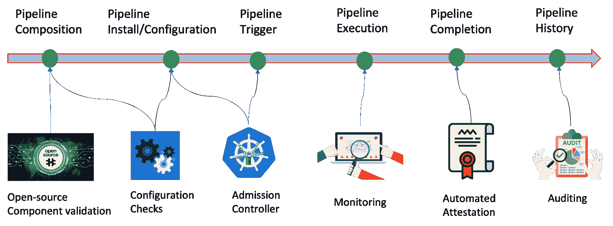

# 保护 CI/CD 管道的蓝图

> 原文：<https://thenewstack.io/blueprint-for-securing-your-ci-cd-pipelines/>

 [施里帕德纳德戈达

施里帕德是 IBM 研究院的高级技术人员。他热衷于推动研究创新，为云计算带来与众不同的功能。他目前的研究领域包括 DevSecOps、开发人员工具以及基本上所有与容器安全相关的东西。](https://www.linkedin.com/in/shripad-nadgowda-8196949/) 

最近，越来越多的网络安全事件影响了不同类型和规模的组织。这些事件引起了人们对加强我们软件 IT 基础设施的整体网络安全态势的迫切和深思熟虑的关注。从最高层的政府机构到主要的云供应商和开源基金会，一个势头强劲的关键领域是我们软件供应链的安全性。

软件供应链的典型范围从开发人员编写代码开始，一直到应用程序在云上部署并被持续监控。在这个范围内，有一个持续集成/持续交付(CI/CD)管道的关键部分，在这里我们实现所有的 DevSecOps 控制，执行构建，发布工件，并最终部署到云上。这些可以说是整个应用程序生命周期中最安全敏感的操作。创新和在 CI/CD 管道中引入独特安全控制的势头非常强劲，包括静态代码扫描、软件物料清单(SBOMs)中的依赖性审计、签名验证等等。

当我们用这些安全控制加强我们的管道时，我想指出我们的 CI/CD 管道本身容易受到安全漏洞的影响。从最近的事件中有证据表明，我们的 CI/CD 管道的配置和操作存在缺陷。因此，我们必须像对待生产工作量一样，同等重视管道的安全。在本文中，我将讨论一个蓝图，通过它我们可以尝试实现这一点。

## CI/CD 管道的生命周期

就像应用程序一样，我们的管道也有自己的生命周期，如下所示。我们将以此为参考，围绕我们的管道在不同阶段所需的安全属性展开讨论。

**管道组成:**这是我们编码和组成管道的阶段。围绕管道有一个不断增长的开源生态系统，其中有许多常见的功能，如`git-clone`、`vulnerability-scan`、`container-build`等。，可从 GitHub Action [Marketplace](https://github.com/marketplace) 或 Tekton [Catalog](https://github.com/tektoncd/catalog) 等目录中获得。因此，在合成过程中，我们在管道中使用这些函数是很自然的。但是，同样，开源并不意味着它是免费的！在使用这些函数之前，我们需要完整性和安全性验证。这可以通过签名验证和标准漏洞扫描来实现。我们已经建立了一个开源工具，叫做“ [tapestry-pipelines](https://github.com/tap8stry/tapestry-pipelines) ”，它允许我们签署和验证管道资源。

**管道配置/安装:**完成后，接下来我们安装和配置管道。这通常包括设置工作集群来运行我们的管道、配置管道参数和设置用户凭证等任务。原则上，就像我们有 Docker 和 Kubernetes 针对容器和 Kubernetes 服务的 CIS 基准来指导我们各自的安全配置一样，我们也需要为 CI/CD 管道设计一个安全配置清单。

**管道触发器:**接下来，管道由一些触发器执行，这些触发器可以是事件触发器，如 *pull_request/push* 上的 GitHub 事件，手动触发器，甚至是定时触发器，如 cron 作业。这是我们需要确保只有被祝福的管道才被允许执行的最后手段。“合格”的标准因用户而异，通常包括检查管道定义是否已签名，以及执行功能所引用的图像是否已扫描。同时，我们需要检查事件触发器是否来自授权的来源。例如，在 GitHub 事件的情况下，我们观察事件负载来验证用户的身份。一旦清除，我们的 CI/CD 管道将开始在集群上执行。

**管道监控:**我认为总体上来说，监控是安全领域中一个不被重视的工具。尽管它可能无助于防止任何与安全相关的问题，但它可能是发现这些问题的最古老、最成熟的技术。它可以有效地用于监视所有管道运行，并识别跨多个管道运行的任何资源瓶颈和异常行为。此外，还有现有的云原生监视器可用；我们只需要在管道中启用正确的仪器来收集这些遥测数据。

**管道证明:**当管道执行完成时，我们需要捕获管道中执行的每个函数的签名证明记录。例如，对于 Tekton CD 管道，我们可以利用 [tektonCD/chains](https://github.com/tektoncd/chains) 来自省单个任务的执行状态并记录其签名证明。它还自动对管道中构建和发布的任何容器映像进行签名。展望未来，有一个意图是自动签署管道中产生的每一个工件。此外，我已经向 Tekton 社区提交了一个扩展提案,它将允许我们记录端到端的起源，从事件源一直到我们的 CI/CD 管道中的签名工件。

**管道审计:**在管道执行完成并被记录在历史中之后，我们需要能够在未来的任何时间点审计管道和由管道产生的任何工件。例如，假设我有一个 CI 管道，它构建并发布一个非常流行的数据库应用程序映像，名为“whySQL”，我经常发布这个映像的新版本。在任何时候，根据供应链安全实践 101，在使用该映像之前，如果您希望根据用于构建该映像的管道的证明记录来确定其出处，并获得管道已签名和验证的确认，则我们需要为用户提供一个自动化审计框架来完成该工作。

总之，我认为这份蓝图是我们开始保护 CI/CD 渠道的良好开端。我们希望在令人惊叹的开源社区的支持下构建这些技术。因此，如果您有任何反馈或愿意提供帮助和贡献，请通过 [GitHub](https://github.com/nadgowdas) 、 [Twitter](https://twitter.com/shri_jay) 或[电子邮件](mailto:shri.nadgowda@gmail.com)联系我。

<svg xmlns:xlink="http://www.w3.org/1999/xlink" viewBox="0 0 68 31" version="1.1"><title>Group</title> <desc>Created with Sketch.</desc></svg>