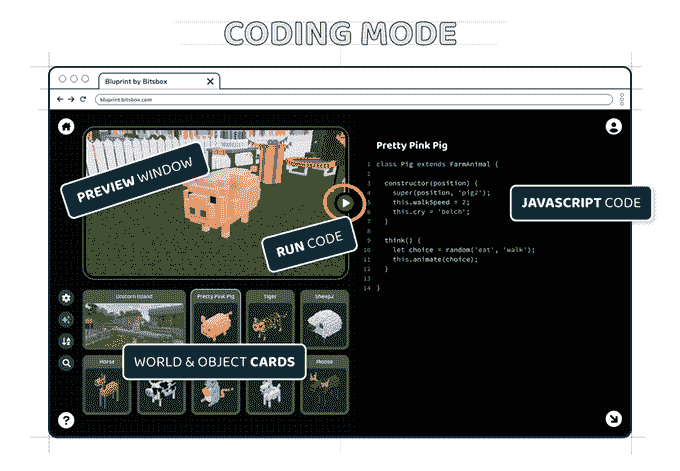

# Bluprint 在元宇宙教孩子们编写 JavaScript 代码

> 原文：<https://thenewstack.io/bluprint-teaches-kids-to-code-javascript-in-the-metaverse/>

Bitsbox 在过去十年的大部分时间里一直致力于教孩子们如何编程，现在该公司正在将其课程和代码教学工具带入下一个层次:元宇宙。目前，[正在开发一款名为 Bluprint](https://www.kickstarter.com/projects/bitsbox/bluprint-by-bitsbox-world-building-and-coding-for-kids#) 的新应用，旨在“偷偷摸摸地尝试向那些已经喜欢构建 3D 世界(《我的世界》)和与朋友一起玩在线游戏(Roblox)的孩子们介绍现实生活中的编码。”

[https://www.youtube.com/embed/CyPUzBLSufQ?feature=oembed](https://www.youtube.com/embed/CyPUzBLSufQ?feature=oembed)

视频

Bitsbox 的联合创始人兼首席创意官 Aidan Chopra 在接受 New Stack 采访时解释说，bits box 试图以与首席执行官/首席技术官 Scott Lininger 在 20 世纪 80 年代早期学习的方式大致相同的方式教孩子们如何编码。

“斯科特是那一代学会用打字编码的人，”乔普拉说。“如果你想运行一个程序，你可以把代码从书里拿出来，然后你就有了一个可以玩的游戏。从他的角度来看，这就是你学习编程的方式:你从某样东西上复制代码，然后这是一种肌肉记忆的东西。这就像学习演奏别人创作的音乐一样，你只是通过临摹就开始理解其中的模式。”

自 2014 年成立以来，Bitsbox 在网站上为孩子们提供了一个虚拟平板电脑，他们可以将每月邮寄给他们的代码复制到其中。根据 [FAQ](https://bitsbox.com/faq.html) 的说法，该代码是由 Bitsbox API 提供的 JavaScript 和 HTML5 的一个版本，它将 JavaScript 简化为“简短而甜蜜的编程命令库，所有这些都经过精心设计，易于键入，易于学习，并且灵活”。

虽然这可能是 20 世纪 80 年代孩子们学习的方式，但 Chopra 说这是今天用户最大的抱怨。

“如果你想做任何复杂的东西，都需要几百行代码，输入这些代码很麻烦，尤其是当你只有六岁的时候，”乔普拉说。“从实际阅读和解释现有代码中可以学到很多东西，尤其是如果它被很好地注释了的话。真的是很有用的东西。所以，我们想，让我们尝试一些不同的东西。”

## 搬到元宇宙

[https://www.youtube.com/embed/oTPkkG7AvA4?feature=oembed](https://www.youtube.com/embed/oTPkkG7AvA4?feature=oembed)

视频

这个“不同的东西”就是 Bitsbox 的下一个版本 [Bluprint](https://www.kickstarter.com/projects/bitsbox/bluprint-by-bitsbox-world-building-and-coding-for-kids) 。Bluprint 不仅将其角色和界面移动到三维环境中，还改变了其教学工具，使其更少依赖于键入，而更多地依赖于阅读和修改现有代码——这与开发人员可以阅读、重用和修改从互联网上获取的代码的方式非常相似。

“学习阅读代码的价值可能和学习编写代码的价值一样大，这很奇怪，因为很多编码教育都是从一张白纸开始的，”Chopra 说。“我们不是这样教孩子阅读人类语言的。你在开始写作之前就开始阅读。每个人都这样。奇怪的是，在某种程度上，我们用一种非常不同的方式教编码。”

Bluprint 元宇宙预先填充了对象和角色，它们具有可以快速查看和更改的代码。它为用户提供了一种不同的与代码交互和学习代码的方式，这种方式可以从一个难度层次到下一个难度层次。

“我们实际上可以通过这样的方式来组织学习:第一步，查看代码并对其稍作修改(一个字符串，一个数字),然后看看这对其行为有什么影响。或者通过添加一些方法来增加一种新的行为，或者只是以某种方式激活它们，看看这是否可行，”乔普拉说。“它是关于改变你看到的东西，它是关于添加一些东西，然后，最终，它是关于从头开始创作东西。”

Bluprint 元宇宙是为其用户(因为他们通常不到 12 岁)的安全和隐私而建造的，他们建造的世界只接受邀请，内置父母控制。在编码安全方面，Bitsbox 和 Bluprint 的联合创始人 [Scott Lininger](https://www.linkedin.com/in/scottlininger) 解释说“孩子们可以写任何他们喜欢的 JavaScript。但是……他们的代码运行在一个安全的沙箱中，不允许他们访问私人信息、修改网页、打开链接之类的事情。”

用户可以使用熟悉的图形编辑器在元宇宙中构建对象，但每个对象的代码只需点击一下，用户不仅可以编辑属性，还可以进入函数和面向对象编程等主题。



## 与《我的世界》和 Roblox 的区别

乔普拉解释说，这个蓝图部分来自于看到孩子们对《我的世界》有多么兴奋，但却无法为《我的世界》编码，因为这样做太难了。使用 Bluprint，创建和修改代码被有意地直接集成到产品中；相比之下，为《我的世界》编码，乔普拉说这是“一点点附加的，有点难”

就像它的前身一样，Bluprint 将教孩子们 JavaScript，尽管这一次用了一个更大、功能更强的 JavaScript API。根据 Bluprint 的 Kickstarter，该公司采用了用于 Bitsbox 的 JavaScript API，并“将其扩展到 3D，添加了几十种新方法，并添加了文件管理系统，使复杂的项目成为可能。”

同时，Bluprint 的 JavaScript API 仍然足够简单，可以教孩子们如何编码。Lininger 对 Roblox 的 Luau 和 Bluprint 的 JavaScrip API 进行了快速比较，Roblox 的 Luau 在 [Lua](https://www.lua.org/) 之上提供了一个 API，并指出“Roblox 的 Lua API 非常棒，但对初学者来说并不太友好。”

林宁格指着[Roblox 文档](https://developer.roblox.com/en-us/api-reference/property/InputObject/KeyCode)中的一个 LUA 脚本，当你在键盘或游戏手柄上这么做时，它需要 20 多行代码来显示“你按了 X”。

```
local UserInputService  =  game:GetService("UserInputService")
local ContextActionService  =  game:GetService(“ContextActionService”)

local function actionHandler(actionName,  inputState,  inputObj)
  if inputState  ==  Enum.UserInputState.Begin then 
  print("You pressed X")
  end

  --  Since this function does not return anything,  this handler will
  --  "sink"  the input and no other action handlers will be called after
  --  this one.
end

local navGamepads  =  UserInputService:GetNavigationGamepads()
for  _,  gamepad in pairs(navGamepads)  do
    local supportedKeyCodes  =  UserInputService:GetSupportedGamepadKeyCodes()

    for  _,  keycode in pairs(supportedKeyCodes)  do
        if  (keycode  ==  Enum.KeyCode.ButtonX)  then
            ContextActionService:BindAction(“SampleAction”,  actionHandler,  false,  Enum.KeyCode.ButtonX)
        end
        if  (keycode  ==  Enum.KeyCode.X)  then
            ContextActionService:BindAction(“SampleAction”,  actionHandler,  false,  Enum.KeyCode.X)
        end
    end
end

```

即使对于一个业余程序员来说，所提供的代码也很难快速理解。相比之下，使用 Bluprint 的 JavaScript API 的这五行代码可以达到同样的效果。

```
function press(button)  {
  if  (button  ==  'x')  {
    ui.log('You pressed X')
  }
}

```

“我们从许多家长那里听说，他们的孩子在学习 Roblox 编码方面没有取得成功，因为它‘太复杂了’，”Lininger 说。“我们希望制作一些不吓人、从成功开始、真正有趣的东西。”

## 元宇宙创作工具？

Bluprint 目前正在开发中，但 Chopra 表示，该团队希望在未来几个月内推出 Bluprint 的早期版本。虽然 Bluprint 最初是为了教孩子们编码而创建的，但他说它可能会有更多的用途。

“这不像我们刚刚在网上用一个真正可访问的 API 创建了这个《我的世界》式的东西，所以孩子们可以用它学习编码。我们实际上所做的可能是创造了世界上最容易使用的元宇宙创作工具，”乔普拉说。“如果你真的做了一个工具，让以前从未真正编程或制作过 3D 东西的人也能参与到这个元宇宙项目中来，会怎么样？那会是一种好的力量吗？我认为我们有点相信这是可能的，所以同时这是 Bitsbox 和我们教孩子编码的业务的第二条产品线，我们也为初学者开发了这套创作工具，以便他们能够建立自己的元宇宙小角落。”

<svg xmlns:xlink="http://www.w3.org/1999/xlink" viewBox="0 0 68 31" version="1.1"><title>Group</title> <desc>Created with Sketch.</desc></svg>