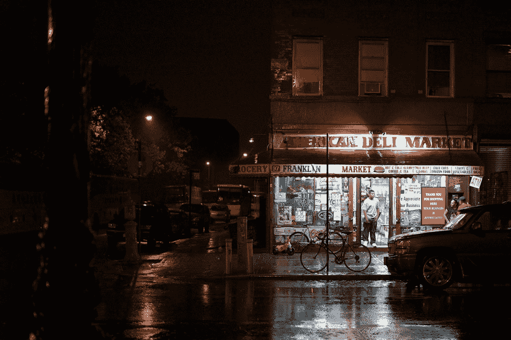
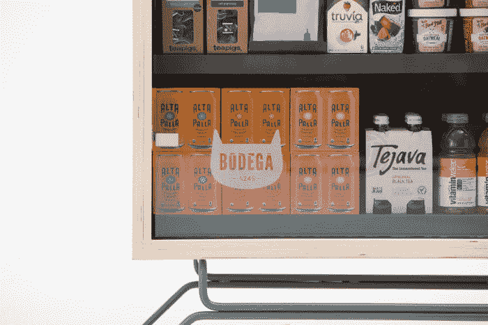

# Bodega 将自动售货机美化为“街角商店”的想法是一个警示故事

> 原文：<https://thenewstack.io/bodegas-glorified-vending-machine-corner-store-idea-cautionary-tale/>

不起眼的街角商店是任何大都市的支柱之一。在洛杉矶或纽约等大城市，这些街角商店通常以夫妻店的形式经营，这些家族企业往往是购买夜宵、饮料、香烟、应急卫生纸或彩票的最佳(也是唯一)场所。

无论它们是被称为杂货店、熟食店、打包店、牛奶酒吧、熟食店还是杂货铺，它们通常都可以作为非正式的邻里聚会场所，一个向路过的邻居问好或与店员闲聊的地方。在一些低收入的城市社区，很难找到超市(T3)，当地的街角商店可能也是新鲜农产品的唯一来源。所以这些商店不仅仅是方便，它们还有一些不太明显的用途——一种社区地标，如果你愿意的话。

因此，最近推出的 [Bodega](https://bodega.ai/) 激怒了不少人，这或许是有道理的，这是一家总部位于旧金山的初创公司，旨在通过在公寓楼、健身房、办公室、大学校园和宿舍等不同地点推出自动化“食品柜”来“扰乱”便利店行业。这些五英尺宽的陈列柜里放着不易腐烂的食物和其他你通常可以在当地街角商店找到的产品。这个概念显然已经从脸书、推特、Dropbox 和谷歌等大牌资源那里获得了大量资金。

但是如果你认为这听起来像一个美化的自动售货机，你可能不会太离谱，尽管这些机器也配备了一些机器学习软件，可以帮助每个杂货店“学习”顾客购买最多的商品。该系统还被编程为当商品缺货时提醒人类员工补充。这些盒子在智能手机应用程序的帮助下解锁，还配备了计算机视觉技术，可以帮助注册所购买的东西，然后自动从你的信用卡中扣除费用。

“每个社区往往有相对同质的品味，因为他们生活或工作在同一个地方，”Bodega 联合创始人兼前谷歌员工[保罗·麦克唐纳](https://www.linkedin.com/in/paulmcdonaldgoogle/)在 [*快公司*](https://www.fastcompany.com/40466047/two-ex-googlers-want-to-make-bodegas-and-mom-and-pop-corner-stores-obsolete) 上解释道。“通过研究他们的购买行为，我们希望最终弄清楚一栋公寓楼里的人和另一栋公寓楼里的人的需求有什么不同。我们可以定制一个宿舍和另一个宿舍的物品。”

“这里的愿景比盒子本身要大得多，”麦克唐纳补充道。“最终，集中的购物场所将不再必要，因为将会有 10 万个杂货店分散开来，其中一个总是离你 100 英尺远。”

但问题就在这里:许多城市居民实际上喜欢他们当地的街角商店，其中许多商店可能会提供独特的额外服务，如早上便宜的新鲜咖啡，定制的三明治和你在其他地方找不到的奇怪产品。像许多不希望自己的工作自动化的人一样，许多人不希望看到他们最喜欢的社区商店被机器取代。

因此，难怪该公司发布后，网上有很多人愤怒。尽管该公司声称，其市场研究表明，在拉丁美洲社区，很少有人觉得他们的名字具有冒犯性，但一些人确实强烈批评了该公司明显的文化挪用和注册西班牙语单词“bodega”(翻译:cellar)来描述他们的服务，导致一些人指责该公司“[种族不敏感和经济特权](https://www.citylab.com/equity/2017/09/here-is-everything-thats-wrong-with-bodega-the-startup-that-destroys-bodegas/539739/)”

其他人则谴责该公司在将这些机器与夫妻店直接竞争时的不良定位，夫妻店是代表成千上万勤劳家庭生计的小企业。声称这些机器会让这些家庭破产听起来并不是一个好主意。此外，这些人类经营的商店都有自己鲜明的特点；无论杂货店背后有多少机器学习，这些机器都很可能提供更加统一(和平淡)的体验。

更有趣的是，其他人指出，这些机器最终将成为上述无形资产的可怜替代品:即使它们无处不在，如果你在晚上被一个陌生人跟踪感到毛骨悚然，你也不可能碰到一台，而且它们根本无法提供大多数城市居民在大城市的陌生环境中渴望的那种人际交往的火花。便利固然很好，但代价是什么？

正如该公司艰难地发现的那样，无论你如何努力尝试或合理化，你都不能假装自己不是。尽管酒店试图通过快速(如果有点空洞的话)[道歉](https://blog.bodega.ai/so-about-our-name-aa5bff63a92d)来控制损失，但从头开始还是个好主意。

让我们面对现实吧:虽然新技术会有所帮助，但这并不意味着生活中所有美好的事情*都可以*自动化。在很大程度上，整个惨败对其他创业公司来说是一个警示，他们可能会被他们可能没有考虑到的事情弄得措手不及:提出一个不存在的问题的解决方案。

图片:博德加、[迈克尔·科里](https://www.flickr.com/photos/khouri/ "Go to Michael Cory's photostream") (CC BY 2.0)、[约阿布·杰克逊](https://www.instagram.com/joabjack/)

<svg xmlns:xlink="http://www.w3.org/1999/xlink" viewBox="0 0 68 31" version="1.1"><title>Group</title> <desc>Created with Sketch.</desc></svg>