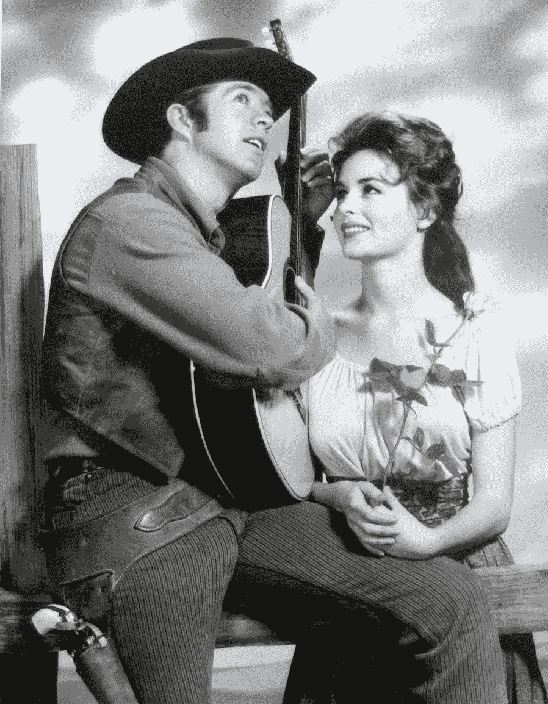
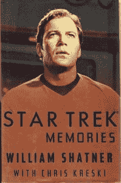
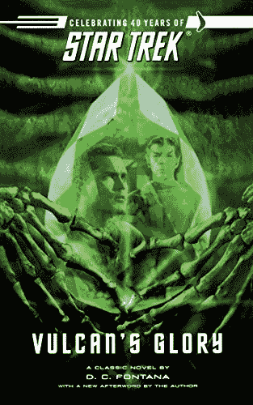

# 《勇敢前行:星际迷航》先驱作家 D.C .丰塔纳的一生

> 原文：<https://thenewstack.io/boldly-going-the-life-of-pioneering-woman-star-trek-writer-d-c-fontana/>

本月早些时候，世界告别了《星际迷航》原著的先锋作家和故事编辑 D.C .丰塔纳该剧对 23 世纪人类技术将带领我们走向何方有着积极的愿景，成为了极客文化的试金石，正是丰塔纳帮助指导了星舰进取号最初的五年任务(在 20 世纪 60 年代末，该剧持续了短短三年)。

但是丰塔纳的生活提供了另一个关于我们自己世界的故事——关于决心、创造力、雄心和服务。网络上充满了[时刻](https://www.youtube.com/watch?v=JJ9SBhrZ840)，在那里[丰塔纳](https://www.youtube.com/watch?v=lWOVBDRX7Zg) [向](https://www.youtube.com/watch?v=7UeebxbhqxQ)提供她自己的[现实生活故事](https://www.youtube.com/watch?v=z42MGaErayY)，包括[与作家协会基金会长达一小时的特别采访](https://www.youtube.com/watch?v=CCSp8TnnbNU)，在那里她回顾了她半个世纪以来在电视和科幻小说领域的工作。

这提醒我们，我们最重要的使命可能是分享我们自己的经历，并为我们的后代留下一些宝贵的东西。

## **寻找新世界**

在漫画作家马文·沃夫曼的采访中，丰塔纳记得她从 11 岁起就想成为一名作家。因此，她在新泽西州费尔利·迪金森大学(Fairleigh Dickinson University)获得了行政秘书专业的副学士学位，开始了她的职业生涯，然后在娱乐业的一系列秘书职位上追求自己的梦想。作为纽约 Screen Gems 总裁拉尔夫·科恩的初级秘书，丰塔纳的工作最终包括阅读一些剧本。

“我犯了大多数作家都会犯的致命错误，”她告诉沃尔夫曼。“我对自己说，‘我能做到。’"

很快，她搬到了加州，在一位西部片的编剧和制片人那里找到了一份秘书的工作，同样，“作为我工作的一部分，我经常阅读剧本，所以我开始注意到它们是如何组合在一起的，它们的节奏和词汇。”根据丰塔纳在 IMDB.com 大学的传记，她成为了一名剧本朗读者/编辑/制片人，到 21 岁时，她已经自己写了几个剧本。在她职业生涯的早期，她为现已被遗忘的 60 年代早期西部片写了几集，如《边境马戏团》(Frontier Circus)、《高个子》(The Tall Man)和《西部之路》(The Road West)。

《高个子》的宣传海报。

因为她在卖动作冒险剧本，她告诉沃尔夫曼，“最终，我开始用‘d . c . Fontana’作为署名，这样我就可以在没有性别偏见的情况下阅读剧本了……”

不久，她就成了一个名叫吉恩·罗登伯里的人的生产秘书。他们是在一起制作他的军事主题节目《上尉》时认识的丰塔纳告诉作家协会基金会，他们是在墓地拍摄一个场景时听到肯尼迪总统遇刺的消息的。

她还经常讲吉恩·罗登伯里让她读他的 10 页原稿的故事，内容是关于他的新节目《星际迷航》的想法在威廉·夏特纳的回忆录《星际迷航的回忆》中，丰塔纳说“我真的很喜欢它，当然那时候电视上没有类似的东西。我认为它有很多可能性，你可以看到这些故事。它们会自动出现在你的脑海里。”

沙特纳的书还包括丰塔纳对她决定全职成为作家的那一天的回忆。“我得出的结论是，我只是不想再当秘书了……吉恩能够理解这种雄心，因为在离开警察队伍的问题上，他一度不得不面临非常相似的决定。”

1996 年，该剧的联合制片人赫伯特·f·索洛(Herbert F. Solow)和负责制作的执行董事罗伯特·h·贾斯特曼(Robert H. Justman)在《星际迷航内幕:真实故事》(Inside Star Trek: The Real Story)一书中高度赞扬了丰塔纳的工作。”1966 年 9 月，当她辞去罗登伯里的秘书一职时，她为接替她的新秘书写了一份 8 页、单行间距的“程序”指令。她用了整整一页的篇幅详细描述了她对吉恩·罗登伯里办公桌的评论:“通常看起来像是龙卷风袭击了它……”

“作为 D.C. Fontana，她成为《星际迷航》中最有价值和最可靠的作家之一。”

她当时 27 岁。

## **在事情发生的房间**

在作家协会的采访中，丰塔纳还记得，在《星际迷航》第一季结束前，两名故事编辑已经离开了该剧。“吉恩·罗登伯里转向我，说‘我要给你一个重写本。如果你能重写这个剧本，让我和 NBC 都满意，你就可以做我的故事编辑。因为一如既往，你从一开始就在那里，你知道这个节目。"

在沙特纳的书中，丰塔纳将那个让她获得故事编辑工作的决定性插曲命名为“天堂的这一边”，并解释了为什么它让她的作品脱颖而出。“在最初的草稿中，爱情故事发生在苏鲁和那个女孩之间，而这些孢子在某个山洞里，所以我们的角色不得不不断误入这个山洞被感染，这一事实拖累了剧本。那个问题的解决办法是‘不要靠近洞穴’……很简单。”

但她也提高了这一集的风险，让通常没有感情的斯波克先生变得浪漫起来。“斯波克终于能够感受到爱并体验它的快乐，打破了他的瓦肯训练的壁垒，这使他无法感受。”在这一集的最后一行，斯波克坚忍地回忆道，“这是我一生中第一次感到快乐。”

Fontana 告诉 Shatner，她的故事新版本“真的很独特……我及时拿到了剧本，反响非常好，所以我得到了这份工作。”

在 2013 年 StarTrek.com 的一次采访中，丰塔纳记得那一集提到了斯波克的父母。她后来写了一集，其中史波克的父母都拜访了企业号——他的瓦肯人父亲和他的人类母亲。当被问及她对该剧的贡献时，她回答说:“主要是斯波克这个角色的发展，以及他所衍生的瓦肯人的历史/背景/文化。”

2006 年，丰塔纳还写了一部《星际迷航》小说，“[火神的荣耀](https://www.amazon.com/gp/product/B000FC0WEM/ref=dbs_a_def_rwt_hsch_vapi_taft_p1_i0)”，根据该书在亚马逊的描述，这本书讲述了“一个从未公开的故事，关于一个非常年轻的斯波克先生，他在美国企业号上的第一次任务。”

但是她的影响并没有就此结束。丰塔纳也是该剧选角决定的一部分，并被包括在制片人的圈子里。她后来会记得她通过实践学到了很多东西。“我学到了很多。这比去电影学院要好。”她补充说，从 1998 年开始，她开始分享她在美国电影学院教书时学到的所有东西——指导和教授那些将要去电影学院的 T2 人。

第二季结束后，丰塔纳告诉罗登贝里，她想继续前进。她回去写西部片——包括顶级电视剧《财运》(Bonanza)、《高查帕拉尔和大峡谷》(The High Chaparral and Big Valley)在接下来的几年里，她为各种各样的电视节目写作。有像《失落之地》、《六百万美元人》、《洛根的奔跑》系列这样的未来科幻剧，也有像《旧金山的街道》和《达拉斯》这样的当代剧。

但正是在 1973 年伟大作家的罢工期间，她找到了一个她仍然可以不越过纠察线写作的节目:“星际迷航:动画系列。”她被任命为副制片人——据《星际迷航》报道，罗登贝里将他作为创作力量的角色委托给了丰塔纳——该剧第二季甚至[获得了艾美奖最佳儿童剧集](https://www.imdb.com/title/tt0069637/awards)。

1987 年，丰塔纳还编写了长达两小时的《星际迷航:下一代》第一集的剧本，该剧获得了久负盛名的雨果奖提名。她是第一季的编剧之一。根据美国电影协会的备忘录，丰塔纳还写了一本《星际迷航》漫画书和几个科幻视频游戏，并对许多其他项目感兴趣。

它指出，丰塔纳最后的写作学分是粉丝创作的科幻网络系列“星际旅行:新航程”的一集，题为“为我所有的日子服务”

## **冲击屏幕外**

《星际迷航:真实故事》还称赞丰塔纳找到了作家大卫·格罗尔德，他创作了《星际迷航》最著名的一集《特里布尔斯的麻烦》。在本书结尾的词汇表中，它还记得丰塔纳和杰罗德“发起并赢得了作家协会对派拉蒙和罗登贝里的仲裁。”这是对她职业生涯中鲜为人知的部分的提醒:她为创作者的权利而斗争。

她在 2014 年的采访中回忆道，20 世纪 70 年代，丰塔纳还加入了作家协会的妇女委员会。“妇女委员会刚刚成立，因为我们开始意识到我们需要一个这样的委员会，我们在行业协会中的代表人数远远不足，现在仍然如此。”当时，该协会大约有 10%是女性，其余是白人男性，而且“我们决定需要让更多的女性参与委员会，参与协会，并让她们的存在为人所知。”因为如果他们只代表公会的 10%，“我们希望有发言权。”

她在该行会的董事会中连续任职了两届。“我在 1988 年罢工后参加竞选，因为我觉得董事会里没有足够多的女性，我想进入董事会。我想加入这场战斗。”

在他的个人博客上，资深漫画家和电视作家马克·伊万尼耶回忆了她对美国编剧工会西区的“服务和奉献”。“组织内部的事情可能会变得混乱，一些委员会可能会感到被那些对自己的职业生涯感到愤怒并将其发泄在行业协会身上的人所控制。每当我和多萝西在公会会议室的时候，她都是一个睿智的存在，散发着理智和无私，温和地提醒所有人关注更大的图景。

“她非常聪明，非常有原则，在我看来，她受到所有人的尊重……”

https://twitter.com/bowiesongs/status/1201976257354883073\

<svg xmlns:xlink="http://www.w3.org/1999/xlink" viewBox="0 0 68 31" version="1.1"><title>Group</title> <desc>Created with Sketch.</desc></svg>