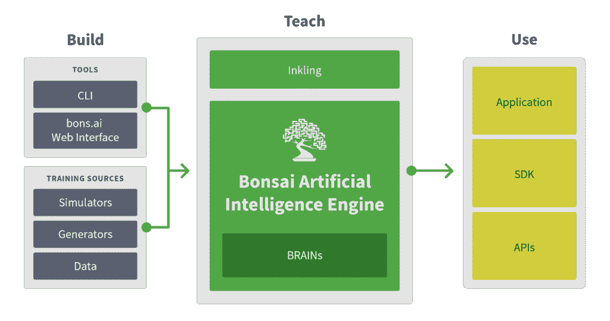

# Bonsai 的目标是为人工智能做数据库为数据做的事情

> 原文：<https://thenewstack.io/bonsai-tries-find-sweet-spot-developers-using-artificial-intelligence/>

人工智能如何帮助食品加工商从[甘草挤压机](https://www.google.com/search?q=licorice-extrusion+machine&tbm=isch&imgil=8ajiw0x0Hh9AAM%3A%3BpfkikfPiGkxvxM%3Bhttp%3A%2F%2Fwww.bchltd.com%2Fproducts%2Fconfectionery%2F&source=iu&pf=m&fir=8ajiw0x0Hh9AAM%3A%2CpfkikfPiGkxvxM%2C_&usg=__lHaL-ojtOK6DOIJpeZUCsGCa-fc%3D&biw=1760&bih=800&ved=0ahUKEwjs8c_TtcnRAhWm14MKHVknAtYQyjcILg&ei=ES5-WKylJKavjwTZzoiwDQ#imgrc=993pQzuceQJdAM%3A)中获得最大产量？人工智能如何帮助出租乐高套装的公司快速确定归还的套装中是否缺少零件？

如果软件真的正在吞噬世界，人工智能已经准备好咬下一大口，随着[高度针对性的系统](https://www.oreilly.com/ideas/7-ai-trends-to-watch-in-2017)正在为金融、医疗保健、安全和零售等行业开发，以及一系列其他仍在开发中的应用。

IBM 总裁兼首席执行官 Ginni Rometty 最近预测，[在五年内，每一个重要的决定](http://www.computerworld.com/article/3135852/artificial-intelligence/ibm-in-5-years-watson-ai-will-be-behind-your-every-decision.html)，无论是商业还是个人生活，都将在其沃森技术的帮助下做出。

然而，在 Forrester 的一项调查中，58%的企业报告说他们正在研究人工智能，但现在只有 12%的企业在使用它，这凸显了其潜力和实际实践之间的差距。

问题是，只有大约 18，000 名数据科学家和其他专业人士拥有利用人工智能技术的技能。总部位于加州伯克利的初创公司 [Bonsai](https://bons.ai/) 旨在让全球 1800 万软件开发人员更容易接触到人工智能技术，特别是那些很少或没有技术背景的人。

Bonsai 首席执行官兼联合创始人马克·哈蒙德(Mark Hammond)表示:“人工智能领域存在一个问题，你必须非常成熟，拥有数据科学和机器学习方面的大量专业知识，才能有效利用它。”。“我们真的在努力让它民主化。

市场情报公司 Tractica 预测，到 2025 年，人工智能应用的全球市场将从 2016 年的 6.437 亿美元增长到 368 亿美元。它表示，低成本、按需和基于云的人工智能框架将是这一增长的关键推动因素。

哈蒙德表示，目前市场上有三种人工智能方法，许多组织仍在试图找出人工智能的用处:

*   工具包如谷歌 [TensorFlow](https://www.tensorflow.org/) 和 [H2O](http://www.h2o.ai/) 。他们基本上采取的策略是“我们会给你所有你可能想使用的算法，并把它们放入一个漂亮的、相互连接的包中。”这是可行的，但是使用起来需要相当多的专业知识。

*   “黑盒”是真正的统计分析包，如 [BigML](https://bigml.com/) 或 [DataRobot](https://www.datarobot.com/) 。他们说，“只要给我们你的数据，告诉我们哪些列是被其他列预测的，我们会帮你想出办法的。”没有比这更容易的了。挑战在于你几乎没有控制力。你做了相反的权衡:它非常容易使用，但是你没有控制权。

*   第三种方法试图走中间路线:使用 API。他们中最著名的是 IBM Watson 和 Clarifai 等人。他们试图完全隐藏所有的人工智能。它们占用了功能的一小部分，并为您提供了一个解决特定问题的接口。他们能够在引擎盖下构建所有的人工智能，所以你不必看到任何东西。只有当您试图解决的问题与 API 所能做的完全一致时，它才会起作用。如果你稍微偏离，它就不起作用。

## 数据库模型

Bonsai 旨在提供第四种选择——为人工智能做数据库为数据做的事情。

“当数据库还是全新的时候，它们也面临着类似的挑战，”Hammond 解释道。“如果你想构建一个以复杂的方式使用数据的应用程序，你必须担心许多底层的东西，这非常类似于使用工具包。

“数据库说，‘让我们提升抽象层次。让我们给你一个引擎，数据库引擎，它将为你管理所有底层的东西。它不可能是魔法，所以它给了你一种特殊的编程语言，SQL 就是常见的一种。使用这种语言，你可以告诉我们关于你的数据的抽象。请告诉我们什么是数据实体，它们之间的关系如何，您希望能够就这些数据提出什么样的业务问题。数据库引擎将使用这些信息来计算如何为您完成所有这些工作。"

类似地，Bonsai 使用一种叫做 Inkling 的人工智能编程语言，旨在根据你想教什么而不是如何学习来表示人工智能。哈蒙德说，关键是把重点放在教上，而不是学上。

您定义要学习的概念、学习的课程、学习是否充分或适当以及如何最好地改进学习。你可以随时回去微调学习。

每个暗示程序都被输入 Bonsai 人工智能引擎，以便生成和训练适当的模型，称为大脑。AI 引擎抽象并自动化了人工智能的底层机制。 [EMA 分析师 Torsten Volk](http://blogs.enterprisemanagement.com/torstenvolk/2017/01/13/machine-learning-artificial-intelligence-masses/) 称之为“AI/ML 的微服务”，开发者将问题解构为组件，然后向 Bonsai 引擎提供文本和视觉数据，供其学习。

哈蒙德说:“这种语言可以让你将思维从所有这些低级的东西转移到你试图解决的商业问题上，因为你可以将你的领域和主题专业知识教给计算机。”

您使用模糊代码来构建智能模型，但是您使用该模型的方式与您使用数据库的方式相同，使用 Java 或 C++或您使用的任何语言连接到它。使用 SDK，您可以连接到 intelligence system 服务器，然后将其视为应用中使用的流数据分析系统。

它可以在您的数据中心、云中运行，也可以作为无人机或其他机器人中的嵌入式进程运行。

## 解决实际问题

Bonsai.ai 于 2014 年由哈蒙德(他的背景是神经网络和计算)和连续企业家 [Keen Browne](https://www.linkedin.com/in/keenbrowne/) 创立，他之前的创业公司包括中国的视频游戏平台 [ECitySky Limited](http://www.bloomberg.com/research/stocks/private/snapshot.asp?privcapid=136737842) 和之前与哈蒙德一起工作的求职网站[employee Insight](http://employinsight.com/)。该公司现在有 25 名员工，已经筹集了 600 万美元。

该公司在去年 3 月的 Strata + Hadoop World 上赢得了初创公司展示，并在 9 月的 T2 奥莱利人工智能大会上推出了私人测试程序。它还与早期设计合作伙伴合作，包括英伟达和西门子技术到商业(TTB)公司，以开发、测试和调整该平台。与西门子一起，它一直致力于工业自动化和机器人技术。

目前，它专注于控制和优化用例，例如甘草机。

“人们试图添加智能的纯粹、大量的问题令人着迷，”哈蒙德在谈到测试程序时说。“它确实强调了 API 对于人们试图做的 100 或 200 多件最常见的事情来说是非常棒的，但当你看到真正的企业试图解决真正的问题时，就会发现这是一条巨大的长尾。他们需要一种通用的方法和平台来解决这些问题。”

特征图片:[甘草 0408 5336](https://www.flickr.com/photos/ross_elliott/4574040779/in/photolist-7Yc9Y4-7wUmgR-eaJpVt-8DcDoi-4Lk4KB-ffdqCR-EaSMM-6MgUPV-91t1QN-4zFi4J-fgxEQc-9AkHqD-ffttEy-5hBtoX-2XjiFJ-686qpK-gKodM-8AxrXo-9UaZh8-a7W4w1-5hFNm9-9tVM4b-9x3e9b-dDf8U1-49uCk3-9VwqUk-9mZNp7-dEQj2U-8cngrj-r6a9ex-ffttRu-adUPqr-9qxg1m-5hBtaR-cqG9ww-dwR9yX-pv5byt-m5a32M-mtEaM-eQ5q5k-6ETSdh-hczaaZ-9iuUVR-9mWJV4-9mZNo5-b9Wshp-xcajFX-fi1x13-8tWLSR-o7vb7K) 由[罗斯·艾略特](https://www.flickr.com/photos/ross_elliott/)授权 **[CC BY-SA 2.0](https://creativecommons.org/licenses/by/2.0/)** 。

<svg xmlns:xlink="http://www.w3.org/1999/xlink" viewBox="0 0 68 31" version="1.1"><title>Group</title> <desc>Created with Sketch.</desc></svg>