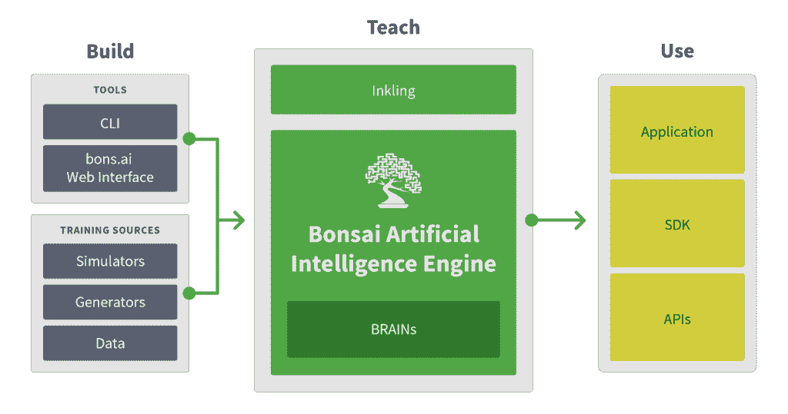

# Bonsai 的马克·哈蒙德谈人工智能:这是关于教学的

> 原文：<https://thenewstack.io/bonsais-mark-hammond-ai-teaching/>

在某种程度上，“机器学习”这个词对程序员来说是一种误导，因为，事实上，成功的人工智能更多的是关于“教”，而不是“学”，因此， [Bonsai](https://bons.ai) 的创始人兼首席执行官[马克·哈蒙德](https://www.linkedin.com/in/markisaachammond/)断言，这是一个人工智能的中间件平台(任务声明:“AI for Everyone。”)

上周在旧金山，我坐下来和哈蒙德聊天，他自称是认知企业家，结合了计算机科学、认知科学和商业智慧。他从一年级开始编程，并在高中时在微软找到了一份工作，这份工作一直持续到他从[加州理工学院](http://www.caltech.edu/)获得神经科学学位。在那里，他将自己对大脑工作方式的理解和技术应用于众多创业公司和学术研究中，于 2010 年共同创立了 JobCompass，然后于 2014 年创立了 Bonsai。他的热情是将他对大脑如何工作的理解转化为有益的应用技术。

我们谈论了人工智能(AI)、机器学习、奇点以及棒球教学。

我看到一条尖刻的推特[断言大多数人们所说的人工智能只是一大堆“如果”语句。我知道那是错误的，但是我发现我不能清楚地说出其中的区别。可以吗？](https://twitter.com/destraynor/status/698953963052277760)

从根本上说，从编程的角度来看，[机器学习](/category/machine-learning/)并不复杂，但这是一种与大多数工程师习惯的思考问题的方式非常不同的方式。所以，这就是我要得到“数学”的地方

如果你是一个程序员，你有一个函数“f ”,它接受一些输入“x ”,然后给你“x 的 f ”,你的整个训练就是，我如何得到一个真正好的“f ”,这就是你被训练要做的。

机器学习颠覆了这一点。看，我不会给你 f，也不会让你做 f，我会给你 x，我会给你 x 的输出 f，我会让你知道 f 是什么。所以它在倒退。不要为我设计 f，给定输入和输出，推导出 f。简而言之，这就是机器学习。

你听到的所有东西——深度学习、[马尔可夫链、](http://setosa.io/ev/markov-chains/)、[概率生成模型](http://homes.cerias.purdue.edu/~crisn/papers/android_ccs_2012.pdf)，我们可以继续下去——它们都是学习什么是“f”的不同技术。

他们每个人试图解决的问题是完全一样的。已知 x 和 x 的 f，你能推导出 f 是什么吗？就是这样。

所以绝对不是一堆“如果”语句。

这是一个技术的集合，你可以使用它，给定一组输入和它们映射到的输出，计算出从这些输入映射到这些输出的函数是什么。

这是一个很高的层次。如果你想让我详细说明我，让我知道。

继续，多谈一点。请吧。我们的读者是那些花费毕生精力编写“f”的人

好的，所以你可以有很多方法来思考如何得到 f

你可以做简单的线性回归。你可以使用[贝叶斯定理](https://betterexplained.com/articles/an-intuitive-and-short-explanation-of-bayes-theorem/)来了解与事物相关的概率；你可以使用遗传算法。有大量的算法路径可供选择。他们都有根本不同的解决问题的方法。

如果你的读者想深入了解细节， [Pedro Dominguez](https://homes.cs.washington.edu/~pedrod/) 有一本非常好的概述书，名为“[主算法](https://www.amazon.com/Master-Algorithm-Ultimate-Learning-Machine/dp/0465065708)”，其中详细介绍了主要的方法类别以及每种方法的思想流派。

如果你想挖得更深一点，那么我们会想到神经网络，因为现在很多时候当人们谈论人工智能和机器学习时，他们会特别想到深度学习或神经网络，因为这很流行。这是一切旧的又是新的复苏。这是和以前一样的神经网络，只是在前面加上了“深度”。它们很有趣，与概率规划模型不同。这些更类似于传统程序员在编程方面习惯思考的东西:“我可以把它分解成我正在学习的这些推理规则，”等等，而神经网络是这种神秘的东西。

与众不同的原因是它根本不是冯·诺依曼架构。人们不习惯考虑非冯·诺依曼架构，因为你在计算机科学学院的第一年就学到了冯·诺依曼架构，然后你再也不会想到它，因为一切都是从它派生出来的。

一个冯诺依曼架构，简洁地说，一个处理单元，存储器，内存，它们一起工作。我过于简单化了。在神经网络中，计算和记忆发生在同一个地方。他们不是分开的。计算是记忆，记忆是计算。它们是一回事。

马克·哈蒙德。照片由 TC 柯里。

所以想到这一切是如何运作的有点奇怪，因为它是外来的。但是在技术层面上，这就是为什么它不是一个“如果”的陈述。这不是一个经验的，逻辑的系统。

没有从内存中读取数据的过程。任何两个计算元素之间的连接是记忆。所以这只是一个大部分人习惯思考的从根本上不同的计算基底。

公平地说，如果你问很多人它是如何工作的，他们将能够告诉你它在算法上是如何工作的，但如果你问它是做什么的？这些神经单元实际上在做什么？不太了解。

我开始为财富 50 强公司做 Peoplesoft 实现，在一次聚会上被指责通过自动化工作使人们失业。事实要复杂得多——部门已经改变，但工作仍需完成。现在我听到了关于人工智能的同样的事情。下周发布的一项研究称，80%的开发者担心人工智能会增加失业率。你会对那些开发者说什么？

首先，不是 AI；是技术。技术普遍做到了这一点。我们有“破坏”这个词，因为人们把木鞋扔进夺走他们工作的机器里。现在公平地说，人工智能似乎比其他类型的技术发展得更快，所以我可以理解这是令人不安的。然而，人们对它能做什么的想象更多地是由炒作而不是现实驱动的。人工智能将更多地增强我们的工作，而不是取代我们的工作。现在，会有人的工作被自动化吗？是的。工作会被取代，但这也带来了新的机会，新的工作。

人们在像我们这样的平台上建立的技术更多的是商业决策支持，而不是自动化分析师:给分析师提供更好的信息，帮助他们做更多的事情，而不是摆脱分析师。这是增强现实，而不是替代现实。

看看航空业。自动驾驶已经存在很久了，但飞行员仍然是必要的。

> “我特别要告诉开发者的是:机器学习系统必须学习。总得有人教他们。你的工作就是教他们。”

自动驾驶汽车很有趣，因为它们得到了太多的炒作。但是看看货运车队和航运。如果你能让卡车把货物从一个海岸运到另一个海岸，并让卡车司机一天多工作几个小时，因为高速公路又长又直又无聊。但与此同时，你可以让系统帮助他们，就像飞机上的自动驾驶仪一样，当情况需要时，让他们参与进来。这不是取代他们，而是使他们能够做更多的事情，为卡车司机、卡车运输公司和整个经济提供大量的价值，对吗？

因此，在彻底取代之前，增强是你会看到更多的东西。这并不是说我们明天醒来时，机器会抢走我们所有的工作。我知道恐惧来自哪里，这并不是毫无根据的，但像所有的技术一样，期望超过现实，并且有领先的指标来预测未来。所以我不太担心。

我特别要告诉开发者的是:机器学习系统必须学习。总得有人教他们。你的工作就是教他们。

盆景台。

**在 TNS 之前的一次[采访中，你说在机器学习；您定义要学习的概念、学习的课程、学习是否充分或适当以及如何最好地改进学习。](https://thenewstack.io/bonsai-tries-find-sweet-spot-developers-using-artificial-intelligence/)** **所以你创建了你的[暗示](https://bons.ai/products)程序来定义学习。**

它定义了教学。当你写代码的时候，在一天结束的时候，你写的是你要教什么和你如何教它。你实际上是在为引擎构建教育学。然后，引擎使用教学法来选择适当的低级机械学习模型。

最好把[Inkling]想象成一个数据库。当您编写 SQL 代码时，您不必担心数据将存储在哪里或者索引的数据结构，这些层都是从您这里抽象出来的。

你真正担心的是你想对你的数据提出什么样的商业问题。我们(盆景)也是这么做的。它只是关于智能而不是持久的数据存储。

这是关于学和教的问题。这有点滑稽。教学完全成了事后的想法。每个人都认为“我会用更多的数据来解决问题。”但是，当你开始从教学的角度考虑这个问题时，对大多数人来说，它变得更加直观，因为我们一直在孩子身边。当你和孩子们在一起时，你不知道他们是如何学习的，你不知道大脑是如何做它正在做的事情的，然而我们仍然能够教他们我们希望他们学习的东西。

我们有一整套关于如何有效教学的科学和艺术。因为我们实际上已经在我们的公司和我们自己身上制度化的专业知识和智慧是我们将要教授的东西。不是“你如何在深度学习神经网络上反向传播。”这就像我问你晶体管逻辑如何在现代中央处理器上工作。你在写程序的时候会担心这个吗？不，编译器会帮你解决这个问题。

> 选择给机器添加意识是一种选择。你不必选择去做。99%的应用程序永远不需要这样做。所以不，我不太担心奇点。

在我看来，人工智能也将如此。我们可以将这作为一个编译步骤，让开发人员专注于教学部分，并获取我们想要教授的主题专业知识和领域知识。

这是很大的工作量。很多很多的工作。我们并不想制造有意识的机器。目标是让工具变得更智能，帮助你做任何你想做的事情。你不希望你的冰箱命令你吃沙拉。这不是目标。我们的目标是让工具变得更智能，帮助你尝试做你想做的事情。

因此，建立一个有意识或有知觉的系统，使它能够自己运行任意的事情——这不是目标。

所以你对奇点没那么着迷？

不。我认为以教学为中心的方法的美妙之处在于，你可以向计算机教授任意复杂的信息量，它可以用来完成你为它设定的任何目标，而且它永远不需要被灌输任何这些东西。我们完全可以避免这个问题。

选择给机器添加意识是一种选择。你不必选择去做。99%的应用程序永远不需要这样做。所以不，我不太担心奇点。

**[Neo Technology](https://neo4j.com/) 创始人 [Emil Eifram](https://www.linkedin.com/in/emileifrem/) 是一个图形爱好者，声称人脑是最复杂的图形。你的神经科学研究是如何影响你在 Bonsai 的工作的？来自人脑的哪些特质是 AI 所必需的，哪些特质不是必需的？**

有意思。有一种观点认为，一切都应该是逻辑上纯粹的，数学上正确的，完美的理性的，但这导致了类似这样的问题，“好吧，你有这种以教学为中心的方法。难道人工智能不应该自己从基本原理中学习它需要知道的一切吗？”

这在数学上是正确的，但是人类从第一原理开始学习微积分，花了很多很多代人，历经数千年，直到牛顿。

你是想务实地解决企业目前面临的实际问题，还是想专注于科学的基础部分？这就是视角的不同。

所以当我坐下来解决如何让人工智能广泛地为程序员所用的问题时，我是从这样一个角度来看待这个问题的，即我们所拥有的智能的一个例子就是大脑。我意识到大脑不是从基本原理开始工作的。机器学习人工智能没有理由与自然智能不同。

当我去教我的儿子，他四岁，棒球；我没有向他投快球。那是直觉上的愚蠢。他才四岁，你为什么要这样对他？我把威福莱球放在 T 上，当他擅长这个的时候，我把威福莱球设置为弹出，当他擅长这个的时候，我在近距离下投。这是模拟的，不是真的。这是有意伪造的，目的是为了有教育意义。

模拟可以做到这一点。模拟可能是你试图轻松教授的边缘案例。你不必开着你的自动驾驶汽车出去行驶数英里来获取这些怪异边缘条件的样本。可以简单模拟一下。模拟将会是这些系统教学的一个重要部分。程序性生成，学徒数据，看着其他人已经知道如何做这件事，这些都不是数据驱动的技术，它们与仅仅在系统中投入大量数据一样重要，如果不是更重要的话。

向我的儿子扔快球来学习如何打棒球，就相当于我给了一台机器一个大数据数据集，然后说:“嘿，你自己想办法。”

我曾经用股票交易做类比——人们学习如何进行技术交易分析。我不是来教你这些的，我不是来把一堆华尔街日报扔到你面前，在图表上圈出点，然后让你神奇地凭直觉知道我们到底在谈论什么。

然而，我们对计算机这样做并不感到不安，我们想知道为什么我们需要 1000 万个样本，它才能算出东西。

当你开始考虑如何教授它时，数据、数据和更多的数据并不是正确的答案。你需要最后的数据，因为那是真实的生活。

<svg xmlns:xlink="http://www.w3.org/1999/xlink" viewBox="0 0 68 31" version="1.1"><title>Group</title> <desc>Created with Sketch.</desc></svg>