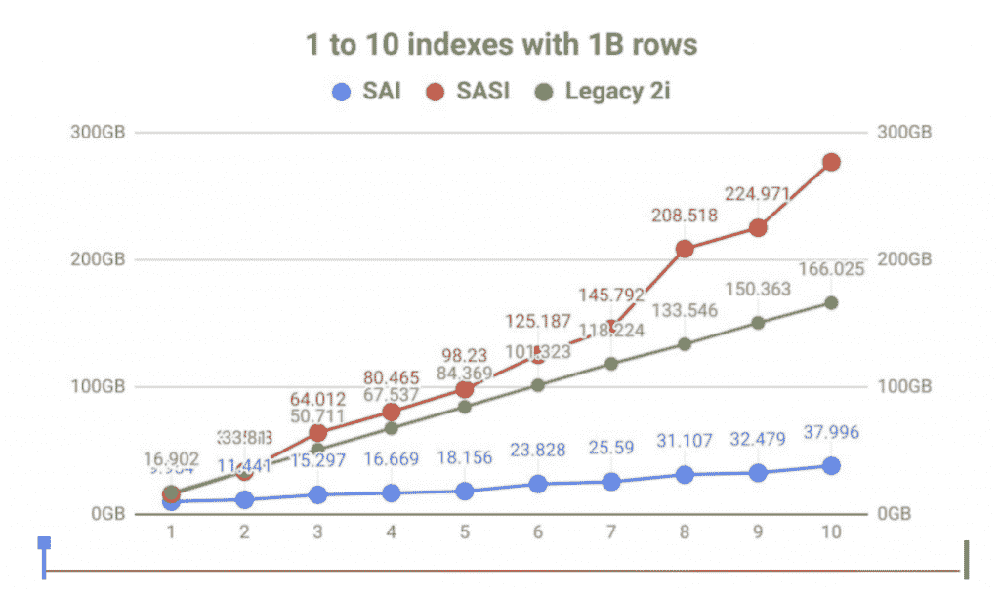
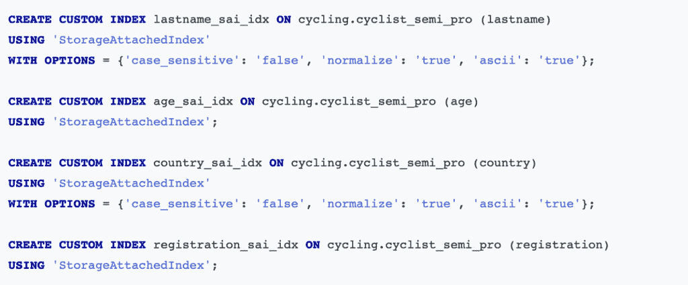

# 通过存储附加索引提升 Cassandra 数据模型

> 原文：<https://thenewstack.io/boost-cassandra-data-models-with-storage-attached-indexing/>

虽然 Apache Cassandra 在获取数据方面很棒，但它有一个严格的查询模式，这限制了习惯于关系数据库的开发人员。这可能会延长开发周期和上市时间。

在这里，我们将介绍存储附加索引，这是一种简化和加速 Cassandra 上数据建模过程的方法。

## **分布式系统中的索引**

 [大卫·琼斯-吉拉蒂

David 是 DataStax 的开发者拥护者，也是分布式数据库的狂热爱好者。他在编程、数据库管理、云、服务器/网络监控和分析方面拥有超过 25 年的相关经验。](https://www.linkedin.com/in/david-gilardi) 

索引是将搜索关键字与相应数据记录的位置相关联的过程。如果您曾经使用过数据库，那么您会使用主索引来为数据表设置主键。索引是用主键自动完成的，数据查找快速高效。

但是当我们从主索引扩展到非主键查询时，情况就开始变化了。关系数据库将进行查找，但是 Cassandra 返回一个错误，因为分布式系统中的数据布局非常不同。不仅如此，Cassandra 还明确禁止大规模的非主键查询。

因为主索引基于主键来组织数据，所以表可以被组织为 B+树。在 B+树中，叶节点存储行，而不是包含行和列的网格。对于关系数据库和 Cassandra 数据库，主键都支持真正高效的查询。

辅助索引有助于查询非主键列，但是辅助索引通常不如主索引有效。同样，这对于关系数据库和 Cassandra 数据库都是正确的。因为开发人员仍然需要运行非主键查询，所以出现了几种二级索引实践。

## **二次标引的局限性**

 [帕特里克·麦克法丁

帕特里克是即将出版的《在 Kubernetes 上管理云原生数据》一书的合著者。他目前在 DataStax 的开发者关系部门工作，并且是 Apache Cassandra 项目的一名贡献者。Patrick 曾是 Apache Cassandra 的首席布道者和 DataStax 的顾问，在那里他度过了构建一些最大的生产部署的美好时光。](https://www.linkedin.com/in/patrick-mcfadin-53a8046) 

为了理解二级索引的局限性，让我们更仔细地看看它们与 Cassandra 表和物化视图相比是如何工作的。

表和物化视图是分布式索引的例子。基于分区键，表或视图数据结构分布在集群中的所有节点上。当使用分区键检索数据时，Cassandra 确切地知道哪些副本节点可能包含结果。例如，在复制因子为 5 的 100 节点集群中，一个查询最多需要 5 个副本节点和 1 个协调器节点。

相反，辅助索引是本地索引的例子。二级索引由许多独立的数据结构表示，索引存储在每个节点上的数据。当只使用索引列检索数据时，Cassandra 无法确定哪些节点可能有必要的数据。因此，它必须查询集群中的所有节点。例如，给定一个具有任意复制因子的 100 节点集群，所有 100 个节点都必须搜索它们的本地索引数据结构。这不能很好地扩展，并且成本很高。

因此，对于实时事务查询，当分区键已知时，应该只使用辅助索引。这使得您的查询可以基于索引列从已知分区中检索行。在这种情况下，Cassandra 同时利用了分布式索引和本地索引。

对于基于低基数列检索表行的大型子集的昂贵的分析查询，辅助索引也有利于在集群中的所有节点上分布处理。这些类型的查询通常通过 Spark Cassandra Connector 运行，在那里使用 Apache Spark 进一步处理检索到的数据。但是，请注意，在这个用例中，基于 Apache Solr 的搜索索引比二级索引的性能好得多。

## **Cassandra 中的二次索引**

[二级索引](https://cassandra.apache.org/doc/latest/cassandra/cql/indexes.html)从 Cassandra 开始就已经存在，用于搜索列数据和运行任意的 WHERE 子句。尽管它有一个非常用户友好的语法，但是每当有对 Cassandra 数据库的写操作时，它都会重新索引所有的列和表。这使得企业很难管理他们的数据库。

过了一段时间，苹果推出了[存储附加二级索引(SASI)](https://dtsx.io/3wNx9WB) ，通过快速范围扫描和内存索引进行标记化文本搜索。但是 SASI 用低效的索引增加了磁盘的使用量，而且一般用户很难掌握它的用法，因为它的语法是针对特定的用例的。

随之而来的是整合了 Solr-Lucene 组合[的](https://solr.apache.org/guide/6_6/merging-indexes.html)[DataStax Enterprise(DSE)Search](https://dtsx.io/3wOJjyK)，这是一个强大的搜索引擎，为关系或分布式数据库建立索引。历史上，Lucene 是索引文本数据的黄金标准。二合一的组合允许 DSE Search 提供全文搜索、高效索引和内存索引。([这里是](https://dtsx.io/3oD51Ri)Cassandra 可用的不同二级索引的完整分类。)

## **解决方案:存储附加索引(SAI)**

DataStax 的[存储附加索引(SAI)](https://dtsx.io/3LrvxGk) 通过为 [Astra DB](https://dtsx.io/3Lr6mnb) 和 Cassandra 提供有效的二级索引，解决了二级索引实践的缺点。SAI 拥有用户友好的语法，用于二级索引和内存索引，就像 SASI 一样。

您可以使用 SAI 为任何列和几乎任何 Cassandra 数据类型(包括文本、数字和集合类型)添加列级索引。此功能使您能够使用 Cassandra 查询语言(CQL)等式、范围(仅数字)和包含语义来过滤查询。与 Cassandra 二级索引相比，SAI 提供了更多的功能，与任何 Cassandra 或 DSE 搜索索引相比，它的写入速度更快，并且使用的磁盘空间明显更少。图 1 显示了 SAI、SASI 和 Legacy 2i 的磁盘上的密度预期。

图一。磁盘上的密度预期。

现在，您可以在 Cassandra 上运行超出主键范围的强大查询，就像在关系数据库上一样。图 2 展示了 Cassandra 上存储附加索引的示例，您稍后将在实践练习中创建这些索引。

图二。Cassandra 上的存储附加索引示例。

## **这如何改变你的数据模型？**

存储附加索引简化并加速了 Cassandra 上的数据建模过程。现在，您可以在对新数据模型进行反规范化之前对列进行索引—只需从单个表开始，并在此基础上构建索引。

当数据模型非规范化时，Cassandra 表现最佳。但是对于我们这些来自关系世界的人来说，我们习惯于在关系数据库上运行灵活的查询。使用存储附加索引，可以为 Cassandra 数据模型增加更多的灵活性，减轻非规范化的精神负担，并减少必须处理的表的数量。

但是，如果您有严格的服务级别协议要求，要求您的响应时间在一位数毫秒以内，那么您仍然需要对数据库进行非规范化。为非规范化而优化就是为性能而优化，就像为保时捷或法拉利而优化一样。我们在这里给出了反规格化和数据建模过程[更全面的分解，或者通读我们在](https://dtsx.io/3so800Q) [SAI 上的](https://dtsx.io/3JiOud2)[文档](https://dtsx.io/339mJEm)和[FAQ](https://dtsx.io/3rDDG38)。

DataStax 也在积极将 SAI 与 Cassandra 合并。请通过 dev@cassandra.apache.org[联系我们，获取关于此次整合的最新消息。](mailto:dev@cassandra.apache.org)

## **动手练习:SAI 入门**

让我们继续设置 Astra DB 来创建一个完全实现的 Cassandra 数据库，并通过 SAI 查询主键之外的内容。按照这个[视频](https://dtsx.io/3JiwOOU)和 [GitHub](https://dtsx.io/3HSrAJ6) 中的逐步说明来创建和配置你的 Astra 数据库。

接下来，模拟一个牙医可能在 Cassandra 上使用的客户端数据模型的用例。以下是这些步骤的细目分类:

1.  [导航至 Astra DB 上的 CQL 控制台，并登录数据库。](https://dtsx.io/3uEY3PI)
2.  描述数据库中的所有键空间。
3.  [创建一个“客户”表并插入一些数据。](https://dtsx.io/3uEY3PI)
4.  [验证数据是否存在。](https://dtsx.io/3uEY3PI)
5.  [在名字、姓氏和生日这三个字段上创建索引。](https://dtsx.io/3uEY3PI)
6.  [使用我们的索引执行查询。](https://dtsx.io/3uEY3PI)

至此，您应该已经使用精确匹配、多个字符串大小写和日期范围对字符串和日期字段的组合进行了查询。通过添加三个字段的索引，我们显著扩展了数据模型的灵活性。展望未来，让我们[添加另一个索引](https://dtsx.io/3uEY3PI)来支持新的数据模型需求，以便根据客户的下一次约会来查找客户。

## **动手练习:物联网传感器数据模型**

之后，您就为实际的物联网用例做好了准备。在本练习中，您将帮助一个组织增强他们的 Cassandra 数据模型，并使其在主键之外的查询变得简单易行。观看此[视频](https://www.youtube.com/watch?v=GLJc1Uz9dqw&t=4684s)获取说明，并访问 [GitHub](https://dtsx.io/3gEr0mx) 获取代码。以下是步骤:

1.  [导航到 Astra DB 上的 Studio 控制台，导入一个预处理过的 Studio 笔记本。](https://dtsx.io/3gEr0mx)
2.  [转到“第 3 节。物联网传感器数据模型用例”继续。](https://dtsx.io/3634t0G)

我们希望您已经更清楚地了解了存储附加索引，以及它如何大大提高 Cassandra 数据模型的效率。

<svg xmlns:xlink="http://www.w3.org/1999/xlink" viewBox="0 0 68 31" version="1.1"><title>Group</title> <desc>Created with Sketch.</desc></svg>