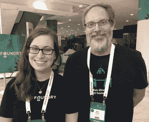
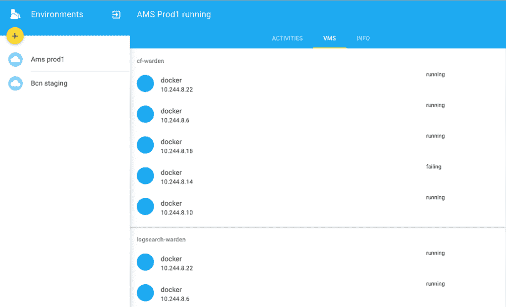
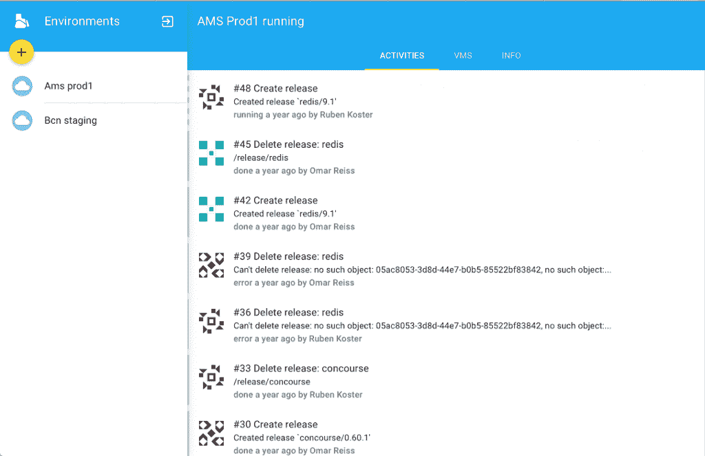

# BOSH 将 Cloud Foundry 与 Google 云平台挂钩，提供大规模虚拟机生命周期管理

> 原文：<https://thenewstack.io/bosh-hooks-cloud-foundry-google-cloud-platform-offers-large-scale-vm-lifecycle-management/>

BOSH ，Cloud Foundry 事实上的部署机制，正被紧密集成到 Google 云平台中。该软件还被扩展到 Cloud Foundry 之外，以管理其他复杂的基于虚拟机的工作负载。

谷歌工程师即将完成 BOSH 云提供商接口(CPI)的第一版，该接口将允许 Cloud Foundry 轻松部署在[谷歌云平台](https://cloud.google.com/)上，并利用许多 GCP 本地服务，如[可抢占虚拟机](https://cloud.google.com/compute/docs/instances/preemptible)和[定制大小的虚拟机](https://thenewstack.io/google-compute-engine-now-offers-custom-virtual-machine-sizing/)。

“我想说我们已经非常接近完成了，”谷歌云平台的技术负责人埃里克·约翰逊说。

BOSH 的能力也不仅限于简化云铸造部署。事实上，该软件可以方便地安装任何复杂的分布式应用程序，甚至平台，如 Hadoop 或 OpenStack。

一家名为 [Dozer.io](https://dozer.io/) 的公司正在寻求将 BOSH 作为一种配置管理和编排工具进行商业扩展，提供商业支持和 BOSH GUI，简化企业内许多 BOSH 实例的管理。

作为 Cloud Foundry 的部署子系统，BOSH 是我们的平台平台。这给了我们多云的能力，所以我们可以支持所有这些不同的云，[云铸造基金会](https://www.cloudfoundry.org/)的首席执行官 [Sam Ramji](https://twitter.com/sramji) 在本周在德国法兰克福举行的[2016 年云铸造欧洲峰会上说道。](https://cfsummiteu2016.sched.org/)

谷歌的科琳·布里安特和埃里克·约翰逊在云铸造峰会上讨论波什。

BOSH 也称为外壳，旨在以可复制的方式管理虚拟机(VM)的整个生命周期，以可复制的方式整合版本控制、打包和部署。

虽然 BOSH 是为 Cloud Foundry 打造的，但它可以承担许多与传统 IT 配置工具相同的职责，如 Puppet 和 Chef，尽管它也支持不可变基础设施的编排，如 Google 的 [Kubernetes](/category/kubernetes/) 。

除了 GCP，BOSH 还支持 VMware vSphere、vCloud Director、Amazon Web Services EC2 和 OpenStack 等基础架构服务。CPI 格式可用于扩展 Bosh 以与其他云服务一起工作，并且正在开发一个可以包含多个云的单一 CPI。

谷歌软件工程师 [Colleen Briant](https://www.linkedin.com/in/colleen-briant-9517701b) 正在为 GCP 工作一个 Cloud Foundry 服务经纪人，它将为 Cloud Foundry 用户提供原生接入谷歌服务，如 [PubSub](https://cloud.google.com/pubsub/docs/publisher) 、 [CloudSQL](https://cloud.google.com/sql/docs/) 、[云存储](https://cloud.google.com/storage/)、[机器学习](https://cloud.google.com/products/machine-learning/)和 [BigQuery](https://cloud.google.com/bigquery/) 。

Briant 说:“配置数据库、设置用户和[管理]身份验证有大量的幕后工作。她说，服务中介将简化很多这方面的工作。

“BOSH 的力量在于它是系统部署的确定性方法，”Dozer 的工程师之一 Omar Reiss 解释道。软件假定清单中描述的配置是软件应该在系统中部署的方式。通过依赖配置，BOSH 可以保持软件处于健康状态，自动纠正任何偏离理想配置的情况。

一个 BOSH 版本，或称“BOSH”，包含一个被管理的软件包，以及任何支持库，以及关于如何解包和部署软件包的说明。该软件包还包括关于如何启动、停止和重启不同进程的具体监控说明。部署清单指定了某个作业应该运行多少个实例，以及它们应该使用什么 IP。

Dozer.io 正在开发的 BOSH 图形用户界面的一个高峰

当虚拟机更新时，BOSH 会自动将其装载到服务中，删除虚拟机的旧版本并更新网络信息。

“这是一个强有力的概念，”赖斯说。每当虚拟机由于某种原因进入错误状态时，BOSH 首先尝试重新启动一个进程，如果它没有恢复，BOSH 将尝试重新创建虚拟机。“它希望你以标准的方式部署你的基础设施，”他说。

Dozer.io 正在考虑向企业提供预配置“BOSHes”的想法，这可以简化复杂分布式软件的部署，如 Cloud Foundry。

Dozer 团队的另一名工程师 [Ruben Koster](https://github.com/rkoster) 解释说，Dozer 已经遇到了许多最初使用 BOSH 部署 Cloud Foundry 的公司，但他们也在为其他工作扩展它，有些公司甚至以前使用传统的配置管理工具，如 Puppet。

BOSH 也有利于在软件投入部署之前对其进行测试，提供了一种快速启动复杂应用程序实例的方法，从而重现可能只发生在特定软件组合中的错误。在测试环境中重新创建精确的设置可能需要一天或更长时间。

“一旦人们开始使用 BOSH，他们就开始在各种环境中使用它，”Koster 说。

[云代工厂](https://www.cloudfoundry.org/)是新堆栈的赞助商

专题图片:推土机的鲁本·科斯特(左)和奥马尔·赖斯。

<svg xmlns:xlink="http://www.w3.org/1999/xlink" viewBox="0 0 68 31" version="1.1"><title>Group</title> <desc>Created with Sketch.</desc></svg>