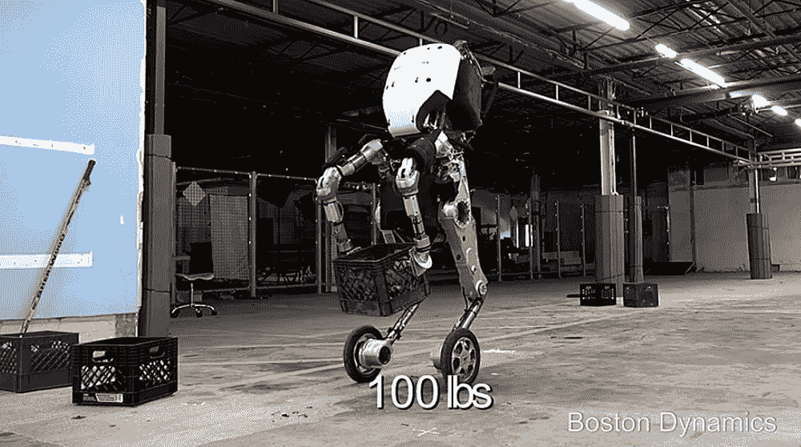
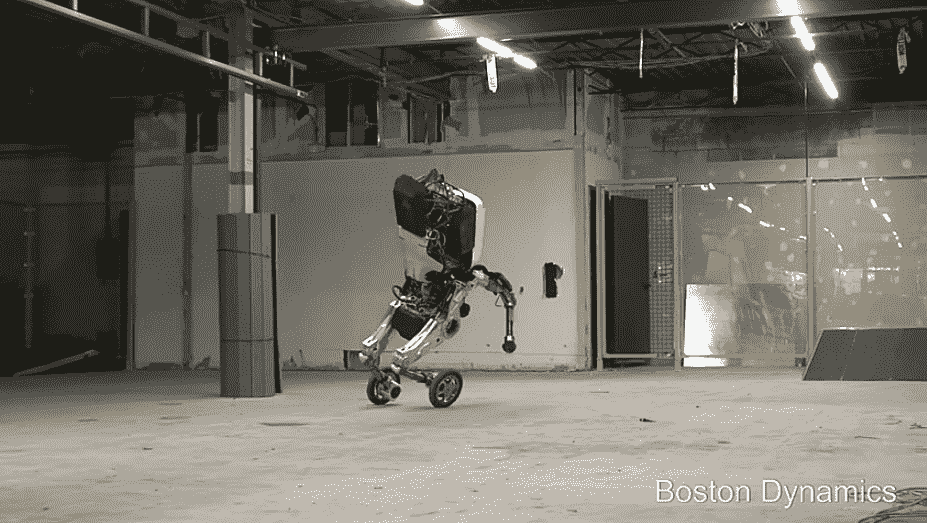
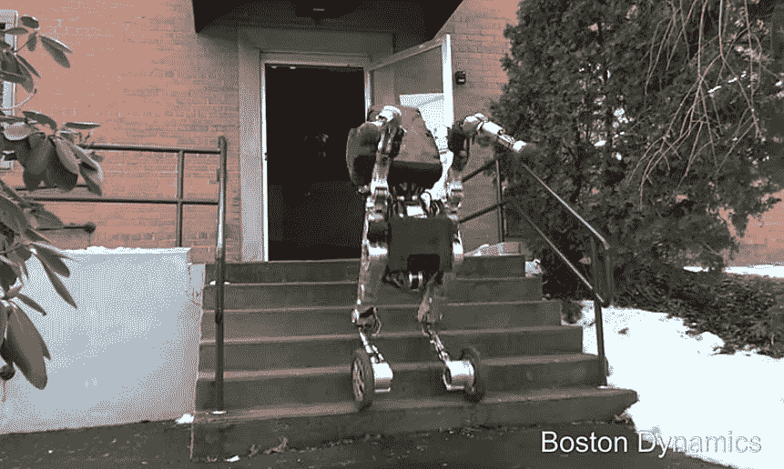

# 波士顿动力公司的敏捷轮腿人形机器人表演令人难以置信的特技

> 原文：<https://thenewstack.io/boston-dynamics-agile-wheel-legged-humanoid-robot-performs-incredible-stunts/>

机器人有各种大小和形状，有些被制成笨重的工业机器人，有些被制成对人类友好的 T2 协作机器人，还有一些是微小的 T4 纳米机器人，有朝一日可能能够在人体内进行手术。现在，谷歌旗下的机器人公司[波士顿动力](http://www.bostondynamics.com/)创造了一个敏捷的人形机器人，腿上有轮子，昵称为 Handle。观看这个机器人奇迹，它可以轻松地四处奔跑、跳上桌子、滑下楼梯:

[https://www.youtube.com/embed/-7xvqQeoA8c?feature=oembed](https://www.youtube.com/embed/-7xvqQeoA8c?feature=oembed)

视频

据该公司称，6.5 英尺高的手柄是一个实验原型，可以举起 100 磅的重量。它的电池允许它以每小时 9 英里的最高速度行驶约 15 英里，然后需要充电——这远远超过其他两条腿机器人可以吹嘘的。

混合轮式腿系统的使用也意味着它的结构比波士顿动力公司以前的两条腿和四条腿的机器人更容易建造。该公司写道:“Handle 使用了许多与我们制造的四足和双足机器人相同的动力学、平衡和移动操纵原理。”“但由于只有大约 10 个驱动关节，它的复杂性大大降低。轮子在平坦的表面上很有效，而腿几乎可以去任何地方。”

该公司告诉 IEEE Spectrum*尽管制造轮式机器人的概念已经流传了一段时间，但该公司的工程师们去年才开始开发。为了加速这一过程，他们使用了与最初为 Atlas 制造的相同的动力、手臂和上身部件，Atlas 是他们以前的设计之一，用于穿越崎岖的户外地形，由电力和液压驱动。*

 *你可以看到相似之处:手柄运动相同的白色上身设计，但略有不同，它使用电动和液压驱动。这使得它能够快速移动和转弯，或者相对快速地跃起四英尺。另一方面，用于控制两个机器人原型的软件具有相似的平衡和动态控制原理。

## 恐怖谷

波士顿动力公司的创始人、前麻省理工学院教授[马克·雷伯特](https://www.linkedin.com/in/marc-raibert-a520b9119/)在上个月的一次会议上介绍 Handle 时开玩笑说，这种异常灵活的机器人可能看起来很神奇，但也“会引发噩梦”。人们可以看到为什么:一支这样的军队将在瞬间超越我们这些没有轮子的人——这是机器人接管 T4 的又一个迹象。还有一种可能性是，人形机器人正在步入所谓的“[恐怖谷](https://en.wikipedia.org/wiki/Uncanny_valley)”的领域——该理论认为，随着机器人越来越像人类，它们对真实的人类来说越来越令人毛骨悚然。

这个名字指的是当人类遇到看起来像人但不像人的东西时引发的不可思议的感觉，导致对物体缺乏同理心的反应，物体可能是机器人，计算机生成的动画，甚至是看起来很逼真的洋娃娃。这种效应促使一些专家警告不要制造人形机器人，因为这可能会导致对这些机器人的“虐待行为”。

在任何情况下，人形机器人的发展似乎都不太可能停止，因为有人在他们身边会感到不舒服。由于它的轮子和令人生畏的灵活性，Handle 看起来不像是直接从赛博朋克小说里出来的东西。所以谁知道下一步会是什么——也许是可以在轮子和腿之间互换的机器人，或者介于两者之间的东西？

图片:波士顿动力。

<svg xmlns:xlink="http://www.w3.org/1999/xlink" viewBox="0 0 68 31" version="1.1"><title>Group</title> <desc>Created with Sketch.</desc></svg>*