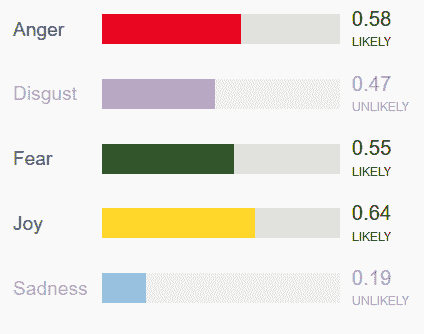
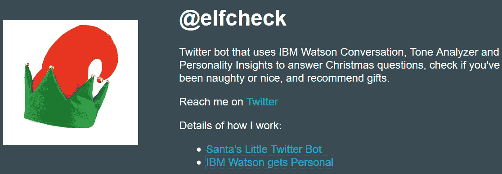

# 机器人应该如何应对挫折？

> 原文：<https://thenewstack.io/bots-humans-respond-frustration/>

我们应该对我们的机器人更好吗？机器人究竟应该如何应对我们的愤怒和沮丧？

CNN Money 最近发表了一篇文章，“ [Alexa，闭嘴:愤怒反对新机器](http://money.cnn.com/2017/08/22/technology/culture/personal-voice-assistants-anger/index.html)”，提出了一些有趣的问题，即对我们的虚拟助手不好是否是坏事——以及他们的开发者应该如何应对这种混乱的人类愤怒。

事实上，当谈到语音助手时，我们不断发展的关系正在社交媒体上得到彻底的记录:

## 处理挫折

根据[自然语言研究高级副总裁 Jay Wilpon](https://www.linkedin.com/in/jay-wilpon-040631/) 在 [Interactions](https://www.interactions.com/) (提供智能虚拟助手)的说法，这个问题可能比听起来更难，正是因为人们*并不*总是与语音助手自然互动。“听听任何人向他们的手机询问州首府或鲑鱼食谱——他们过度发音，夸大辅音，用简短的句子说话。他在一篇题为“[愤怒的客户正在塑造人工智能的未来](https://venturebeat.com/2017/09/03/angry-customers-are-shaping-the-future-of-ai/)”的文章中写道:“这是一种人机“方言”的形式，我们已经开发出来，以确保技术能够理解我们在说什么。”

在那篇文章中，他认为提供企业级客户服务的虚拟代理处于处理愤怒客户的最前沿。“由于客户服务本质上是专注于问题，许多客户在开始互动时已经感到沮丧，”他指出。

> “至少，它创造了一种模式和强化，只要你的措辞恰当，你就能得到你想要的东西，不需要任何细节。”—猎人步道

出于对科学的兴趣，他敦促顾客“自然地和那些客服机器人说话。如果你愿意，就给他们点颜色看看！在一天结束时，你将推进人工智能——一次一个对话。"

但是不同的观点来自 X.ai 的创始人，他提供了一个名为 Amy(或 Andrew) Ingram 的会议安排虚拟助手。X.ai 的丹尼斯·莫滕森告诉 CNN 财经频道，既然它是一台机器，“在那种情况下，人们倾向于舒适地表达他们的沮丧。”

赌注可能比我们想象的要高。

作为麻省理工学院技术与自我项目的主任，雪莉·特克尔专注于人类与技术的互动，她担心这可能会导致“人们对待彼此的方式变得粗俗”她告诉 CNN，“我们对待机器就像对待人一样。”因此，这可能会导致“我们被吸引去像对待机器一样对待人们。”

美国有线电视新闻网注意到缺乏数据表明*人们如何经常*对新机器感到愤怒它指出，亚马逊拒绝置评，苹果也没有回应置评请求，但微软指出，根据他们的文章，Cortana“每天都受到诅咒和攻击性语言的攻击”，该文章报道称，微软已经部署了一个编辑人员，“以做出正确的回应。”

他们采访了该团队的作家之一黛博拉·哈里森，她向 CNN 强调，Cortana“随时准备并渴望进行富有成效的积极对话”，但同时也努力“立即停止攻击性行为”

2016 年 2 月，CNN 还报道说，当谈到 Cortana 时，“很大一部分早期查询[是关于她的性生活](http://money.cnn.com/2016/02/05/technology/virtual-assistants-sexual-harassment/index.html)，引用了微软的黛博拉·哈里森在旧金山[再就业虚拟助理峰会](http://videos.re-work.co/events/16-virtual-assistant-summit-san-francisco-2017)上的一次讲话。如果你对 Cortana 说一些特别不好的话，“她会发疯的。这不是我们想要鼓励的那种互动。”哈里森说，他们通过与真实世界的助手交谈来学习，这些助手已经经历了他们自己的真实世界的骚扰。当要对 Cortana 编程时，“我们希望非常小心，不要让她以任何方式感到屈从……或者我们会建立一种我们不想在社交中延续的动态。”

"我们能够为我们之后的事情打下基础。"

[https://www.youtube.com/embed/-WcC9PNMuL0?feature=oembed](https://www.youtube.com/embed/-WcC9PNMuL0?feature=oembed)

视频

这是一个不会消失的问题，因为“许多用例来自这种动机，”机器人平台提供商[罗宾实验室](http://www.robinlabs.com/)的首席执行官[伊利亚·埃克斯坦](https://www.linkedin.com/in/ilyaeck/)说。去年 10 月[她告诉 Quartz](https://qz.com/818151/virtual-assistant-bots-like-siri-alexa-and-cortana-spend-much-of-their-time-fending-off-sexual-harassment/) ，他们的分析在他们的数据库中识别出至少 5%的互动是明确的性暗示。

## 愤怒:下一代

对机器人的无礼已经困扰了一个重要的人口群体:父母。 [Avi Greengart](http://www.currentanalysis.com/common/analysts/bio_164.html) ，一位 [Current Analysis](http://www.currentanalysis.com) ，[的技术分析师告诉 Quartz](https://qz.com/701521/parents-are-worried-the-amazon-echo-is-conditioning-their-kids-to-be-rude/) ，补充说亚马逊的虚拟助手“从来不说‘那很粗鲁’或者‘我厌倦了你一遍又一遍地问我同样的问题。”"

“父母的责任之一是教会你的孩子社交礼仪，你对着这个盒子说话，就好像它是一个不需要社交礼仪的人。”

六月，风险投资家亨特·沃克写道:“亚马逊回声很神奇。这也让我的孩子变成了一个混蛋。”在[Inc*Inc*](https://www.inc.com/linkedin/hunter-walk/amazon-echo-magical-its-also-turning-my-kid-asshole-hunter-walk.html)转载的一篇短文中，沃克抱怨说“Alexa 容忍不礼貌的行为。”

“从认知上来说，我不确定一个孩子能理解为什么你可以指挥 Alexa，但不能指挥一个人，”他写道。“至少，它创造了一种模式和强化，只要你的措辞恰当，你就能得到你想要的东西，不需要任何细节。”

Walk [在接受 Quartz](https://qz.com/701521/parents-are-worried-the-amazon-echo-is-conditioning-their-kids-to-be-rude/) 采访时详细阐述了他对女儿如何受到亚马逊设备交互影响的担忧。“因为她是一个小女孩，她需要大声说话，她的命令中有一种无意的攻击性语气。”尽管公平地说，沃克的一位朋友——也是一位家长——[将 Alexa 描述为天赐之物](http://mommyproof.com/alexa-the-amazon-echo-is-my-new-best-friend/)。

“需要把你的孩子带到桌子上吗？让 Alexa 把计时器设置为两分钟，”丽贝卡·汉诺威·库兹韦尔写道。“他们*监听*到 Alexa。当她按铃时，他们就来了……”

六月*《今日美国》* [采访了 Jenny Radesky](https://www.usatoday.com/story/tech/nation-now/2017/06/07/alexa-you-turning-my-kid-into-jerk/375949001/) ，她是密歇根大学的儿科医生，研究数字媒体，也是美国儿科学会[媒体使用指南](http://pediatrics.aappublications.org/content/138/5/e20162591)的合著者。她建议父母在与虚拟助手互动时，试着为孩子树立友善的榜样。

也有积极的可能性。麻省理工学院的技术评论[采访了 Cynthia Breazeal](https://www.technologyreview.com/s/608430/growing-up-with-alexa/) ，她在[麻省理工学院媒体实验室](https://www.media.mit.edu/)领导个人机器人小组，报告说她“看到了像 Alexa、Google Home 等虚拟助手的巨大机会，这些虚拟助手被设计成推动我们以我们希望被对待的方式对待他人，”帮助孩子们建立社交技能。

也许这就是为什么[伊丽莎白·里斯](https://www.linkedin.com/in/elizabeth-reese-564204/)，一位微软的写作经理，她的职责包括 Cortana，[写道](https://medium.com/microsoft-design/searching-for-kindness-on-the-interwebs-76f5b247dd9)虚拟助手“她的核心原则之一是她总是很善良。”她认为，科技行业的一些人专注于提供带有内置善意的产品，作为“一个技术提醒，如果机器人和其他人工智能能够礼貌并小心我们的感受，我们不应该忘记这在我们的人际互动中也是可能的。”

## IBM 的解决方案

其他公司正在解决这个问题。 [IBM Watson](https://www.ibm.com/watson/) 的首席技术官罗布·高告诉 CNN Money，其人工智能平台已经在分析语音交互中的语气和情绪，以识别愤怒的客户。首先沃森会“解释并回应他们的意图”，然后道歉并说它不理解。但如果其他方法都失败了，“我们会把它交给一个活的特工。”

在沃森的网站上，该公司指出，它还可以[分析推文和在线评论的语气](https://www.ibm.com/watson/services/tone-analyzer/)，并处理其他用例。该网站声称，它可以“监控客户服务和支持对话，以便您可以适当和大规模地回应您的客户。看看客户是满意还是失望，代理是否礼貌和有同情心……让您的聊天机器人能够检测客户的语气，这样您就可以建立对话策略来相应地调整对话。”

去年假期开始时，IBM 甚至将他们的[沃森对话](https://www.ibm.com/watson/services/conversation-2/)和[沃森声调分析器](https://www.ibm.com/watson/services/tone-analyzer/)从他们的 [Bluemix 平台](https://www.ibm.com/cloud-computing/bluemix/)合并成[圣诞老人的小推特机器人](https://twitter.com/elfcheck)。它分析任何以正确语法使用其名称的 Twitter 时间线的语气，“如果它发现太多愤怒或厌恶[，它会把你放在淘气名单上](https://medium.com/@snrubnomis/santas-little-twitter-bot-1ffe44995d41)”

## 基本本能

但可能有一个更黑暗的事实:人类对他们的虚拟助手大喊大叫是因为他们喜欢这样。去年 10 月,《纽约客》的特约撰稿人莎拉·拉尔森写道,“对 Alexa 大喊大叫可以帮助你找回自我。”。这增加了乐趣。”

所以也许像 Alexa 这样的虚拟助手只是在教我们一些关于自己的不舒服的东西。

> 有没有其他人也对 Alexa 感到无法控制的愤怒？来自[亚马逊](https://www.reddit.com/r/amazonecho/)

一名用户(名为“typicallydownvoted”)记得，Alexa 只有在命令被喊出来，以及一些选择咒骂的时候才会播放新闻。具有讽刺意味的是，Alexa 教的恰恰是错误的一课。

也许这一切都在提醒我们，虽然机器人可能会令人沮丧，但我们人类也有自己的缺点需要改进。一位 Reddit 用户记得[称 Alexa 为贬义词](https://www.reddit.com/r/amazonecho/comments/4ex420/does_anyone_else_get_uncontrollably_angry_at/d24m1t9/)，却得到一个忏悔者的问候，“对不起，我下次会努力做得更好……”

“然后我觉得自己像个混蛋…”

* * *

# WebReduce

通过 Pixabay 的特征图像。

<svg xmlns:xlink="http://www.w3.org/1999/xlink" viewBox="0 0 68 31" version="1.1"><title>Group</title> <desc>Created with Sketch.</desc></svg>