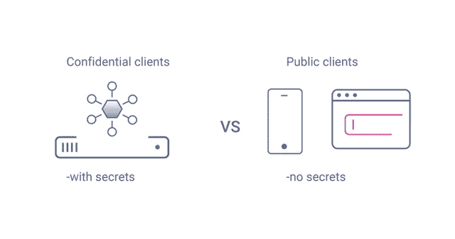
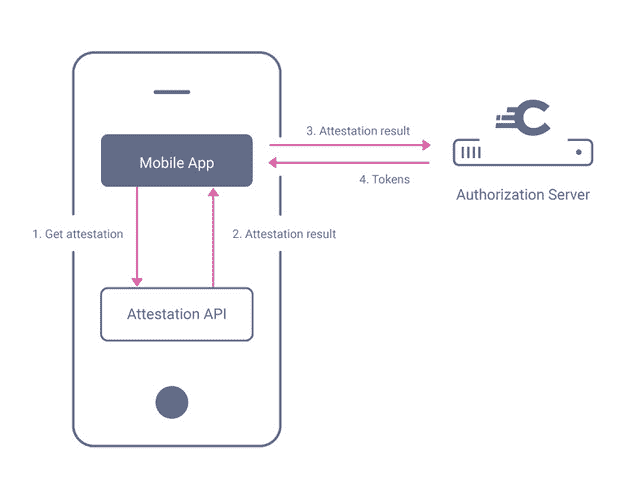

# 勇敢的移动世界:原生应用中的 OAuth

> 原文：<https://thenewstack.io/brave-mobile-world-oauth-in-native-apps/>

如今，移动应用无处不在，不出所料，许多应用需要用户登录。

 [米哈尔·特罗扬诺斯基

Michal 是 Curity 公司的产品营销工程师。他是一名拥有 10 多年 web 技术工作经验的开发人员。从事不同的项目使他能够学习不同的语言，观察不同的设计模式——也涉及到 API。](https://www.linkedin.com/in/micha%C5%82-trojanowski-58664932/) 

也许一个应用程序需要保存用户的偏好，在服务器上访问用户的资源或者远程保存用户的数据。无论是哪种情况，应用程序都需要一种方法来安全地认证用户，以访问或管理他们的资源。

OAuth 和 OpenID Connect (OIDC)这两个成熟的身份验证和授权标准对这项任务非常有帮助。尽管 OAuth 和 OIDC 最初是考虑到浏览器而创建的，但它们在本地应用程序领域和在万维网中一样有用。

然而，在原生应用中实现 OAuth 和 OIDC 会带来新的挑战和风险，开发者和架构师应该意识到这一点。为了保证这些协议的安全，需要考虑一些事情。

## 机密客户与公共客户

使用 OAuth 或 OIDC 的应用程序在 OAuth 术语中称为“客户端”,在 OIDC 术语中称为“依赖方”。这两种类型都分为两类:机密客户和公共客户。

机密客户端是能够保密的应用程序。这些客户端可以使用它们的客户端 ID 和一个秘密向授权服务器进行身份验证，因为它们确信用户和恶意方都无法读取该秘密。在大多数情况下，这些都是运行在后端的应用程序，没有人能够访问应用程序的代码。

另一方面，公共客户端是运行在不安全环境中的应用程序，任何人都可以访问应用程序代码。这些客户端不能保守秘密，并且不应该使用需要在授权服务器上进行身份验证的流。这些应用程序可能作为单时代应用程序完全在浏览器中运行，也可能是移动或桌面应用程序。

## 移动客户端是公共客户端

移动应用程序永远不应该在授权服务器上注册为机密客户端——遵守这一规则至关重要。如果应用程序被发布了一个秘密，那么这个秘密必须被编译成代码分发给终端用户的移动设备。这意味着任何人都可以反编译应用程序来获取秘密，并使用它来模拟合法的应用程序。

模拟应用程序的能力可能会产生各种后果。不太严重的问题，至少从安全和身份的角度来看，可能意味着恶意方使用你的游戏应用程序的凭据将篡改的结果发布到记分牌上。在最好的情况下，这可能会让你的其他玩家感到沮丧。在最坏的情况下，这可能意味着有人会不公正地要求奖励赢得排名。如果恶意应用程序被分发给用户以窃取他们的凭据或访问他们的资源，可能会发生更严重的后果，因为用户会认为他们正在登录合法的应用程序。

代码交换 (PKCE)标准的[验证密钥是为了缓解移动应用成为公共客户端的一些问题而创建的。使用 PKCE 有助于确保用授权码交换令牌的客户端就是最初启动 OAuth 流的客户端。它可以防止恶意应用程序窃取授权代码，从而获得对用户资源的访问权限。](https://curity.io/resources/learn/oauth-pkce/)

根据当前的最佳实践，强烈建议移动应用程序使用 PKCE。尽管如此，PKCE 并不是一种认证应用的方式，也不应该被视为认证的替代。恶意应用程序仍然可以使用合法的客户端 ID 让用户登录。在这种情况下，使用 PKCE 只会验证同一恶意应用程序能够将授权代码交换为令牌。

## 重定向 URI 作为一种证明出处的方式

OAuth 流安全性的一个重要部分是使用用户代理，如浏览器，以及重定向统一资源标识符(URI)。在授权服务器对用户进行身份验证并收集所有必需的同意之后，服务器会将用户重定向回客户端。此时，授权服务器需要验证授权代码(或隐式流中的令牌)是否被发送回正确的客户端，而不是发送给冒名顶替者。这就是浏览器和重定向 URI 有用的地方。通过利用重定向 URI，服务器验证它将数据发送回正确的客户端，浏览器确保该请求被重定向到正确的位置。我们都相信浏览器使用关于域的准确的 DNS 信息并重定向到正确的目标。

同样的机制也用在本地应用中，但是这里用户被重定向回一个应用而不是一个网页。重定向到移动应用程序可以通过两种方式实现，通过应用程序链接或深层链接。

在使用 app 链接的时候，你的应用注册了它的 URL 方案，比如 myapp://，操作系统知道调用 URL 的时候打开哪个 app。然而，这有一些安全问题，因为恶意应用程序可以注册与合法应用程序相同的方案，并拦截针对它的重定向。

另一种方法是深度链接，它使用 https://方案，让用户为应用程序分配给定的域。应用程序的签名和包也会根据域中的文件进行验证，从而提供另一种级别的控制。因为使用了 TLS，所以用户可以确定真正的重定向正在进行，并且他们可以确保将重定向 URI 与合法的应用程序相关联。因此，深度链接是目前移动应用程序中处理重定向 URIs 的推荐方式。

## WebView 与应用内浏览器和外部浏览器

前段时间，Android 和 iOS 为开发者引入了一种在应用中直接打开网页的方式。WebViews 旨在提升用户体验，因为不再需要打开单独的浏览器。然而，这个解决方案有一些安全缺陷。当在移动应用中直接打开页面时，用户无法控制他们是否正在浏览正确的域。因此，用户变得更容易受到网络钓鱼攻击。

此外，主机应用程序可以从打开的页面读取表单输入，并获取用户的凭证。所以[现在推荐](https://datatracker.ietf.org/doc/html/rfc8252#appendix-B)当一个 app 需要打开页面时，只使用应用内或者外部浏览器。通过遵循这一最佳实践，用户可以验证应用程序加载的域。因为页面是在浏览器中打开的(即使是通过应用内浏览器)，所以一定程度的沙盒是有保证的。主机应用程序不能访问用户的输入，也不能读取与授权服务器交换的 cookies。

浏览器、深度链接和 PKCE 结合起来，创建了一个健壮的解决方案，用于在本地移动应用程序中处理 OAuth 流。用户可以验证他们被重定向到的授权服务器的域。恶意应用程序也很难使用合法的客户端 ID 进行登录——由于深度链接，授权代码将被交还给合法应用程序，PKCE 将要求任何应用程序都不能使用最初发给另一个应用程序的代码。

当然，使用额外的浏览器应用程序有时会妨碍可用性。例如，没有用户手势(如点击按钮)，深度链接不会返回到应用程序。此外，偶尔的浏览器变化或错误可能会使本机应用程序的 OIDC 难以维护。

## 动态客户注册

处理移动应用认证的一个推荐方法是实现[动态客户端注册](https://curity.io/resources/learn/openid-connect-understanding-dcr/) (DCR)。使用 DCR 时，移动应用程序的每个实例都在授权服务器上将自己注册为独立的客户端，并获得自己的秘密。然后，应用程序可以安全地存储这个秘密，这样就不可能通过代码反编译来窃取它。即使这个秘密被窃取，它也只代表应用程序的具体实例，因此用处有限。

DCR 为移动客户端认证问题提供了一个不错的解决方案，但是它也有缺点。为了在授权服务器的 DCR 端点注册自己，应用程序可能需要某种授权，这样 DCR 功能就不会被滥用。这又导致了如何授权 DCR 呼叫的问题。通常，这意味着将某种凭证放入应用程序代码中。当使用 DCR 时，这也意味着如果有许多移动应用程序注册实例，注册客户端的数据库可能会增长到巨大的规模。这可能会使管理变得困难，例如，如果您想要向移动应用程序添加新的范围，除非授权服务器提供了处理这种情况的功能。

## 证明作为客户端身份验证方法

更现代的 Android 和 iOS 版本引入了可在 OAuth 流中用于客户端认证的功能:客户端证明。客户端证明 API 使用非对称加密密钥，这些密钥安全地存储在设备的专用硬件模块中。然后，应用程序使用这些密钥对关于设备和应用程序的声明进行签名。

生成的消息证明用户正在运行应用程序商店中发布的合法应用程序。这可以通过断言应用程序的签名摘要和包名来实现。该消息还证明了该设备没有被 root 或越狱。用于证明的密钥本身是用证书签名的，这些证书的信任链高达 Google 和 Apple 发布的根证书。这使得任何一方都能够对签名的消息进行摘要，以验证其可信度。

在 OAuth 流程中，移动证明可用于签署用于[客户端断言认证](https://curity.io/resources/learn/client-assertions-jwks-uri/)的 JSON Web 令牌(jwt)。使用这种方法，授权服务器可以确保它处理的是合法的应用程序，即使没有使用硬编码的密码。

## OAuth 本地应用安全性的未来

用于本地应用的 OAuth RFC 8252 于 2017 年发布，此后世界继续发展。除了浏览器带来的可用性和可靠性问题之外，还需要额外的安全性。这就是证明证明其力量的地方。认证在移动世界中被视为一等公民，以至于出现了新的解决方案，如 Google SafetyNet API，以填补硬件认证不可能实现的设备的空白。

证明允许对移动公共客户端进行身份验证。因此，浏览器不再需要证明客户端的合法性。这允许开发人员创建不依赖外部用户代理的 OAuth 流。在 Curity，这使我们能够开发一个[超媒体认证 API](https://curity.io/resources/learn/what-is-hypermedia-authentication-api/)——一种让客户端在没有浏览器的情况下执行 OAuth 和 OpenID 连接的方法。我们的 HAAPI 实现展示了移动证明如何成为构建新功能的有用且强大的工具。该 API 支持使用任何认证方法，包括 [App2App 移交](https://curity.io/resources/learn/app2app-via-hypermedia/)给专业的第三方认证系统，如 BankID。我们相信，放弃对浏览器的依赖而支持证明的实现是本机应用中 OAuth 安全性的未来。

## 结论

本机应用程序与在 web 服务器上安全运行的后端应用程序有很大不同。这影响了许多架构和安全决策，OAuth 也不例外。在使用 OAuth 流实现安全性时，本机应用程序开发人员应该记住遵循最佳实践。记住，移动应用程序不能被视为机密的 OAuth 客户端，这对于创建安全的解决方案至关重要。这一事实要求使用其他增强安全性的功能，如 PKCE、深度链接或证明。

<svg xmlns:xlink="http://www.w3.org/1999/xlink" viewBox="0 0 68 31" version="1.1"><title>Group</title> <desc>Created with Sketch.</desc></svg>