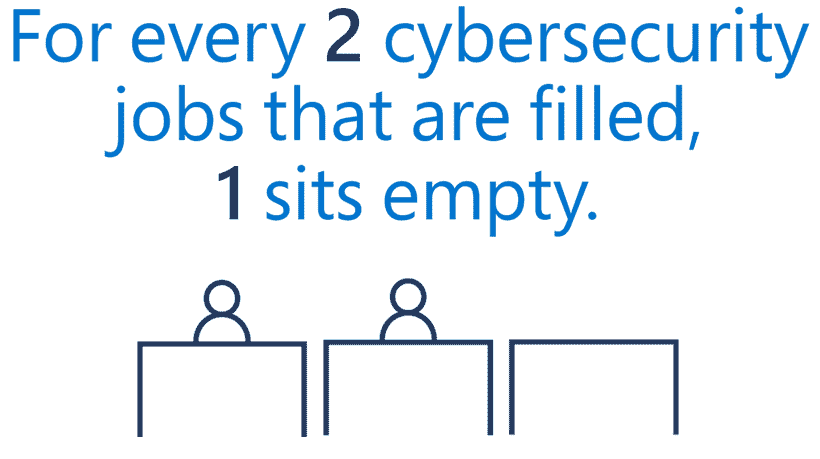

# 漏洞和勒索软件:2021 年回顾

> 原文：<https://thenewstack.io/breaches-and-ransomware-a-look-back-at-2021/>

随着 2021 年接近尾声，又有一个[年度](https://thenewstack.io/hopes-and-fears-a-look-back-at-some-of-the-iconic-tech-stories-of-2019/) [传统](https://thenewstack.io/humans-vs-algorithms-a-look-back-at-2018/) [观察](https://thenewstack.io/big-question-2016-can-trust-technologies/) [在新的堆栈](https://thenewstack.io/big-question-2016-can-trust-technologies/)中:我们对一些特殊或重要时刻的非正式回顾。我习惯性地称之为“过去一年的大规模 MapReduce”，突出了似乎预示着未来的事件，在这一年的最后闭幕式上，我们思考这一切最终意味着什么。

但是，除了庆祝我们的成功，2021 年也是一些真正引人注目的失败的一年。出现了停机、漏洞和许许多多的勒索软件。

如果有一线希望的话，那就是 2021 年使网络安全成为一个大到不容忽视的问题。因此，当我们迈向 2022 年时，我们面临的挑战现在一目了然。

## 停机时间和中断

2021 年告诉我们，云提供商的普通中断可能会引发整个互联网的涟漪。June 发现 cloud CDN 的一个配置问题很快[影响了 PayPal、Reddit 和 GitHub 等顶级网站](https://techcrunch.com/2021/06/08/numerous-popular-websites-are-facing-an-outage/)。12 月 17 日，脸书、Slack、Hulu 和 DoorDash 等顶级网站的 AWS 服务中断。

“类似的中断发生在 12 月 7 日，”NBC 新闻回忆道，“瘫痪的视频流，停止联网的机器人吸尘器，甚至关闭宠物食品分配器，这一系列事件提醒人们有多少生活已经转移到网上，特别是在冠状病毒疫情期间。”

但是我们应该吸取什么教训呢？美国全国广播公司认为，这些事件“有助于打破这样一种幻觉……即日常消费者可以依赖在线服务，不会出错。”耶鲁大学法学院的网络安全讲师肖恩·奥布莱恩(Sean O'Brien)甚至直言不讳地告诉 NBC，“‘云’从来都不是可持续的。”

奥布莱恩也是总部位于区块链的信息服务公司 PanQuake 的首席安全官，他向 NBC 坚持认为，云“只是一个由中央实体控制的集中网络资源的委婉说法”，暗示对等技术和边缘计算等替代技术可能会比他所说的少数几家大型云公司之间的“封建”权力集中系统更受欢迎。

纽黑文大学计算机科学助理教授[瓦伊德·贝扎丹](https://www.linkedin.com/in/vahid-behzadan/)认为，解决方案也可以像*更多*云一样简单，公司会考虑[多云解决方案](https://www.cnbc.com/2021/12/12/aws-outage-and-hashicorp-ipo-point-to-a-multicloud-future.html)的弹性潜力。

Behzadan 告诉 NBC，2021 年的中断可能只会刺激更多的改进，并讽刺说，没有杀死互联网的东西会使它变得更强大。

但即使这是真的，2021 年向我们展示了许多其他需要改进的地方。

## 俄罗斯网络士兵的崛起

今年年初，微软总裁布拉德·史密斯(Brad Smith)随后称之为“世界上有史以来最大、最复杂的攻击”，估计“肯定有超过 1000 名”工程师参与了组装该漏洞。

[在哥伦比亚广播公司的新闻节目“60 分钟](https://www.cbsnews.com/news/solarwinds-hack-russia-cyberattack-60-minutes-2021-02-14/)”上，史密斯说微软指派了 500 名工程师只是为了调查一个广泛使用的网络管理平台的漏洞，该漏洞在 2020 年 12 月中旬首次披露。

攻击者攻击了网络安全管理软件产品猎户座，60 分钟描述它为“你可能从未听说过的最普遍的软件产品之一……由数百万行计算机代码组成。其中 4032 个被秘密重写，并在例行更新中分发给客户，打开了一个秘密的后门……”18，000 家公司下载了路透社后来描述的“被窃听的网络管理软件”，哥伦比亚广播公司指责“俄罗斯网络士兵”参与了私人和公共网络。

哥伦比亚广播公司报道称，“美国司法部承认，俄罗斯人花了几个月的时间进入他们的电脑，访问电子邮件流量——但该部门不会告诉我们到底拿走了什么。”“财政部、商务部、国家卫生研究院和能源部都是如此。甚至是保护和运输我们核武库的机构。”路透社还指出，英特尔、思科和微软在下载了网络安全管理软件产品的软件后也遭到了攻击。在本周末的一封电子邮件中，一名网络安全管理软件产品代表强调，有“少得多的数量”超过 1.8 万人通过他们的安全漏洞受到了主动攻击，尽管路透社(Reuters)在 9 月份还报道称，实际影响“在很大程度上仍不得而知”路透社甚至采访了一名顾问，他与数十家下载了网络安全管理软件产品受损软件的上市公司合作，该顾问承认，“大多数公司都有未报告的违规行为。”

当然，这一年以另一个普遍的安全问题结束——以及一场解决 Log4j 漏洞的争夺战(据估计本周[将影响 35，863 个 Java 包](https://therecord.media/google-more-than-35000-java-packages-impacted-by-log4j-vulnerabilities/))。但在这期间，这一年破坏安全实际上变成了一个非常赚钱的职业，影响了从[奶油奶酪供应商](https://gizmodo.com/ransomware-jerks-helped-cause-the-cream-cheese-shortage-1848195368)到圣诞节前对克罗诺斯工资系统的攻击[的一切。](https://www.cpomagazine.com/cyber-security/widely-used-kronos-payroll-provider-down-for-weeks-due-to-ransomware-attack-was-log4shell-involved/)

## “勒索之年”

事实上，网络安全供应商 SonicWall 甚至决定将 2021 年命名为“[勒索软件之年](https://www.sonicwall.com/news/sonicwall-the-year-of-ransomware-continues-with-unprecedented-late-summer-surge/)”——该公司提供的数字令人震惊。

使用从近 200 个国家的 100 多万个安全传感器收集的数据，SonicWall 计算出截至 9 月底每个客户平均有 1，748 次勒索尝试，物联网恶意软件增加了 33%。截至 9 月底，总计有高达 4.95 亿次勒索尝试。

研究人员最终预测，2021 年最后三个月将有 2.19 亿次勒索尝试，因此到新年前夕，2021 年勒索攻击的总数将达到 7.14 亿次。

一些袭击如此巨大，以至于成为了全国性的头条新闻。今年 5 月，东海岸主要燃料供应商 Colonial Pipeline 遭到勒索软件攻击。(彭博报道称，在几个小时内，该公司不顾一切地向他们的东欧袭击者支付了 440 万美元的赎金——其中 230 万美元[后来被追回](https://abcnews.go.com/Politics/doj-seizes-millions-ransom-paid-colonial-pipeline/story?id=78135821)。)

彭博还引用了[的估计](https://securityandtechnology.org/wp-content/uploads/2021/04/IST-Ransomware-Task-Force-Report.pdf)2020 年组织支付的平均赎金已经达到 312493 美元。今年 6 月，CNET 报道称，在袭击者关闭了他们五家牛肉加工厂后，肉类生产商 JBS 美国公司支付了 1100 万美元赎金。

事实证明，一些勒索软件现在甚至分享特百惠的分销模式:多层次营销。ZDNet 报道了勒索软件即服务行业的增长，恶意软件的创造者将他们的产品出租给感兴趣的网络攻击者，以换取勒索金钱的分成。(有些人甚至以订阅的方式提供他们的软件。)

ZDNet 还从 Zerto(一家为虚拟化基础设施和云环境提供产品包括备份和灾难恢复解决方案的公司)的高级产品营销经理那里获得了一个令人沮丧的 2022 年预测。“我们将看到勒索软件攻击的严重性和数量持续增加，”该消息人士说。

在同一篇文章中，云安全提供商 Thycotic 的首席安全科学家甚至想知道是否会出现另一种订阅模式，即公司直接向勒索软件团伙定期付款，以避免受到攻击。

## 一个新的国际时代

当然，还有其他安全问题。根据 The Verge 的说法，2021 年有超过 4000 万美国人的健康信息暴露在数据泄露事件中，这是“自 2020 年以来的一个重大飞跃，也是越来越多健康数据遭到黑客攻击和泄露的趋势的延续。”

在信用报告服务 Experian 泄露之后，大约 2 . 2 亿巴西人的个人数据在一月[暴露。](https://www.zdnet.com/article/experian-challenged-over-massive-data-leak-in-brazil/)

但是有些盗窃比其他的更有利可图。在年底，NBC 新闻计算出有 20 起不同的超过 1000 万美元的加密货币盗窃案，其中 6 起超过 1 亿美元的盗窃案发生在 T2。

在其他地方，一些旧的威胁以新的形式回归，10 月份，微软警告[网络安全管理软件产品攻击背后的同一个组织](https://www.microsoft.com/security/blog/2021/10/25/nobelium-targeting-delegated-administrative-privileges-to-facilitate-broader-attacks/)有更多的“民族国家活动”，“试图获得多个云服务提供商的下游客户”(以及托管服务提供商和其他 IT 服务组织的客户)。

根据微软的说法，网络攻击者不是利用单个漏洞，而是依赖“一个多样化的动态工具包，包括复杂的恶意软件、密码喷雾、供应链攻击、令牌盗窃、API 滥用和鱼叉式网络钓鱼来危害用户帐户并利用这些帐户的访问权限。”

微软补充说，这次攻击“具有行为者妥协-一对多妥协方法的特征”，并警告说，攻击者“瞄准服务提供商的特权帐户，在云环境中横向移动，利用受信任的关系获得对下游客户的访问权，并进一步攻击或访问目标系统。”

10 月，微软的史密斯做出了乐观的评估，“我们已经进入了一个新的国际时代，这个时代没有战争，但不断有外国网络安全攻击威胁着我们的企业，也威胁着我们的学生、医疗保健和日常生活。”

## 新的希望

在这些坏消息中，有一种对互联网年轻时代的美好回忆，Linux 操作系统只是雄心勃勃的年轻人的一个梦想。随着 Linux 接近 30 周年纪念日，5 月份托沃兹回首往事，回忆起 Linux“[实际上是从我开始偶然发展而来的](https://thenewstack.io/linus-torvalds-on-why-open-source-solves-the-biggest-problems/)，我最初只是试图了解我的新 PC 硬件的细节。”

那是一个更简单的时代，早期 Linux 贡献者 Dirk Hohndel(现在也是首席开源官和 T2 VMware 副总裁)强调了这一点。在 9 月与托瓦尔兹的[对话中，霍恩德尔思考了当今软件的新复杂性，在一个容器、Kubernetes 和各种微服务的世界里。](https://thenewstack.io/linus-torvalds-on-community-rust-and-linuxs-longevity/)

“如果我今天长大，”托沃兹承认，“我不确定我是否会足够接近硬件，在那里我会感到舒服地理解。”

但与此同时，他指出，今天更年轻的开发人员可以尝试各种各样的 Raspberry Pi 单板计算机和可访问的微控制器、在线架构手册等。所以这也是一个拥有更多信息的世界。

也许这就是未来的希望所在。微软的史密斯写道，在评估美国对网络安全管理软件产品的反应时，微软也发现了一个令人清醒的事实:“缺乏训练有素的网络安全人员减缓了我们客户的反应。"

然后，他承诺与美国社区大学一起发起一场全国性运动，在未来四年内将美国网络安全劳动力增加 25 万人。他们的目标是试图帮助填补 464，200 个仍然开放的(高薪)需要网络安全技能的职位，占全国所有职位空缺的 6%。

“虽然其中一些人将在微软工作，”史密斯写道，“但绝大多数人将为全国成千上万的其他雇主工作。”

该活动包括免费课程(包括与微软 Azure 安全技术认证相关的材料)，以及在 150 所社区大学的培训和为 25，000 名学生提供的奖学金和“补充资源”(包括来自微软员工和 GitHub 学生开发包的一些指导)。

“在许多日子里，在许多问题上，分歧可以分裂我们的国家，”史密斯的博客文章总结道。“但我们需要一场网络安全就业运动，保护国家，让我们团结起来。”

埋藏在所有这些新闻故事中的是一线希望:我们不会记住 2021 年科技工作者面临的所有网络安全挑战，也许历史也会将这一年视为我们开始调动资源迎接这些挑战的一年。

但无论接下来发生什么，2021 年提出了 2022 年必须回答的问题。

<svg xmlns:xlink="http://www.w3.org/1999/xlink" viewBox="0 0 68 31" version="1.1"><title>Group</title> <desc>Created with Sketch.</desc></svg>