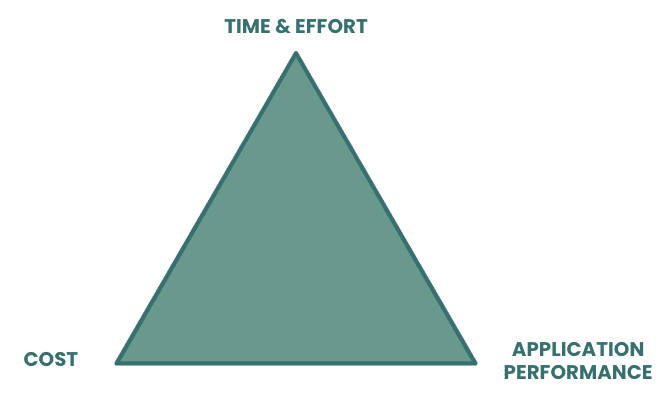
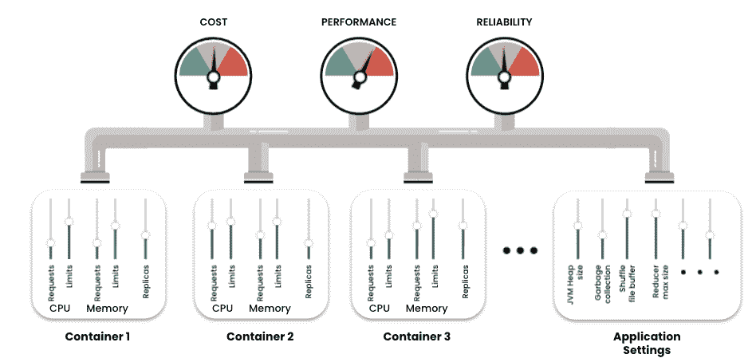
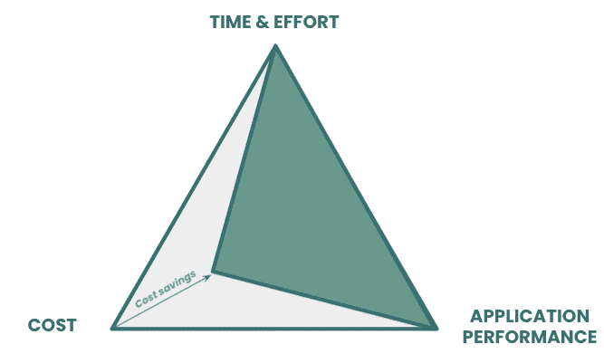
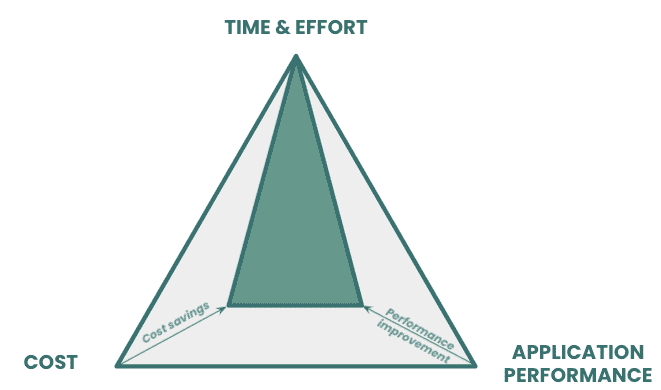
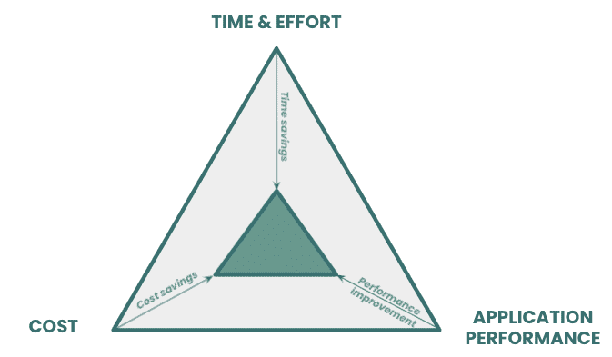
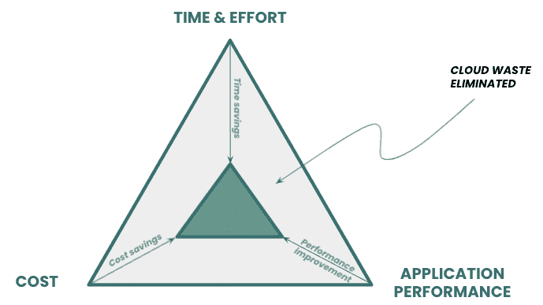

# 通过优化您的应用打破 Kubernetes 铁三角

> 原文：<https://thenewstack.io/break-the-kubernetes-iron-triangle-by-optimizing-your-apps/>

 [里奇·宾利

里奇是 StormForge 公司产品营销高级总监。他在 IT 管理领域营销产品已经超过 20 年，在此之前，他是一名系统工程师和软件开发人员。](https://www.linkedin.com/in/rich-bentley-b88121/) 

在项目管理界，有一个概念被称为“[铁三角。你可能从“好、快、便宜”这句话就知道了。挑两个。”这个想法是每个项目都有权衡。例如，如果你想更快地完成一个项目，要么花费更多，要么你必须牺牲质量。](https://en.wikipedia.org/wiki/Project_management_triangle)

事实证明，同样的概念也适用于在 Kubernetes 上部署应用程序。

类似于项目管理的例子，Kubernetes 铁三角的三个点是:

*   **成本**。为运行应用程序分配了多少资源？您在云成本方面支付了多少？
*   **应用性能**。应用程序的性能如何？有多靠谱？它符合 SLOs 吗？
*   **时间和精力**。为部署配置和准备应用程序需要多少工时，需要多长时间？

库伯内特铁三角

就像项目管理三角一样，你需要考虑权衡。

想要降低运行应用程序所涉及的云成本吗？那么您要么需要牺牲应用程序的性能，要么希望您的团队花费更多的时间对您的应用程序进行试错式调优，以便它能够更高效地运行。

希望提高应用程序性能？无论是云成本还是您团队的时间和精力，都将让您付出更多的成本来寻找合适的应用程序设置，从而在给定的价位上最大限度地提高性能。

您希望您的团队在部署之前花更少的时间测试和配置您的应用吗？那么您可能会为此付出更高的云成本或降低的应用程序性能。

## **天下没有免费的午餐……**

您可以将铁三角内的区域视为运行应用程序的总成本，其中总成本不仅包括硬云支出，还包括您团队的时间以及不合标准的应用程序性能给企业带来的成本。

因为三角形是铁做的，所以面积是固定的。天下没有免费的午餐。你不能鱼与熊掌兼得。该死，现在我饿了——马上回来。

## **…还是有？**

事实证明，有一种方法可以通过利用人工智能(AI)和自动化来打破 Kubernetes 铁三角。

AI 是关键，因为 Kubernetes 的[复杂性。每次部署应用程序时，您都必须做出几个资源决策。这包括容器级别的资源决策:CPU 和内存请求和限制，以及副本。将它乘以组成应用程序的容器数量，然后添加特定于应用程序的配置设置，如 JVM 堆大小、垃圾收集等，您就可以快速做出几十个需要做出的决定。](https://thenewstack.io/the-growing-complexity-of-kubernetes-and-whats-being-done-to-fix-it/)

这些设置都会影响应用在生产中的运行成本，以及应用的性能和稳定性。它们都是相互关联的，这让事情变得更加复杂。作为一个人，你所能做的就是利用你的经验，对最佳设置做出最好的猜测，部署你的应用程序，看看会发生什么。如果您的云成本太高，利用率太低或者性能达不到标准。那你再试一次。

但是有数十亿种可能的配置。要找到一种能以最低的成本实现适当性能水平的方法，就像大海捞针一样困难。但人工智能，或者更具体地说，机器学习，非常适合解决这种类型的优化问题。机器学习可以以比人类更高效和有效的方式进行这种“试错”。

机器学习还允许自动选择最佳配置，因此您的工程师不必花费数小时、数天或数周时间进行调整、调试和故障排除。

## **回到铁三角**

使用机器学习和自动化，您现在可以想象这样一个世界:

*   您可以找到在不影响性能的情况下最大限度降低成本的应用配置。
    
*   您可以找到这样的配置，它将确保应用程序性能达到或超过 SLO，而不会花费过多的成本。
    
*   您可以找到这种最佳配置，而无需您的工程师在 Kubernetes 的杂草中花费数天时间。
    

还记得我们说过三角形内部的面积代表运行应用程序的总成本吗？我们现在所做的是最小化三角形的面积，同时仍然实现我们的业务目标。该区域的减少是我们有效消除的浪费。

## **何去何从**

为了在您自己的环境中应用这些原则，您可以根据 [FinOps 生命周期](https://www.finops.org/framework/phases/)采取以下步骤。

1.  **获得知名度**。解决问题的第一步是认识到你有一个问题。获得可见性意味着了解您的应用程序的运行效率、性能以及在配置中投入的时间和精力。这可以通过您可能已经拥有的工具组合来实现，例如应用性能监控和云成本管理工具，以及像 [StormForge](https://stormforge.io) 这样的优化工具，它们可以帮助您了解和分析权衡。
2.  **优化**。知道了自己所处的位置，您现在可以专注于低挂的果实，并优化那些效率最低的应用程序，或者那些消耗您的工程团队最多周期的应用程序。利用人工智能来自动化这一过程，并帮助您的团队做出明智的资源决策，而无需反复试验。StormForge 等优化工具就是为了推动这一过程而构建的。
3.  **操作**。一旦您围绕可见性和优化建立了工具和实践，您就可以开始将这些过程构建到您的正常工作流中。这是建立成本意识和资源效率文化的关键。通过自动化，您可以将优化构建到 CI/CD 工作流中，以确保任何新版本在进入生产之前都得到优化。

遵循这些步骤，你就可以享用免费午餐了(或者至少是一顿真正便宜的午餐)。在那之后，你可以随意吃些蛋糕。快乐优化！

<svg xmlns:xlink="http://www.w3.org/1999/xlink" viewBox="0 0 68 31" version="1.1"><title>Group</title> <desc>Created with Sketch.</desc></svg>