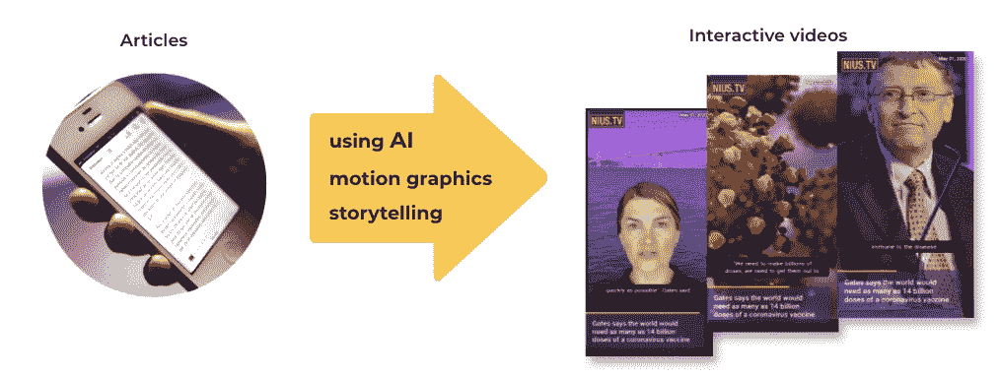
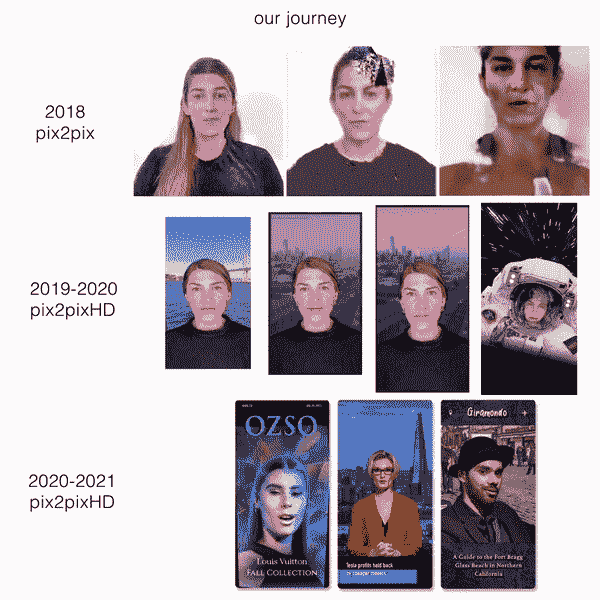
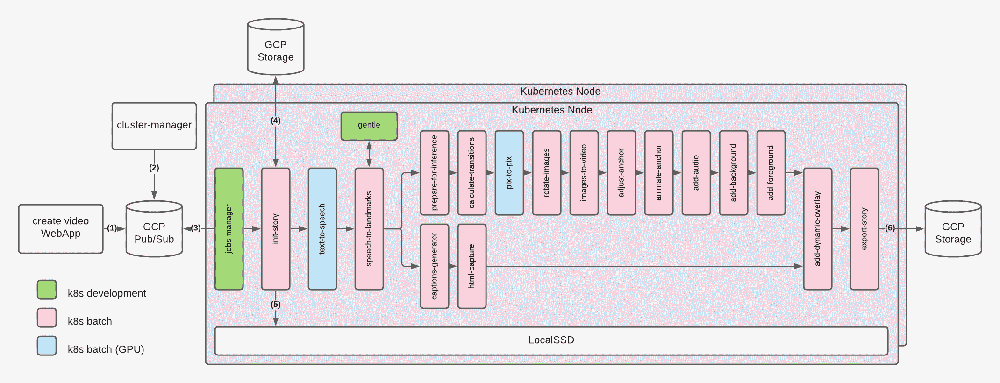
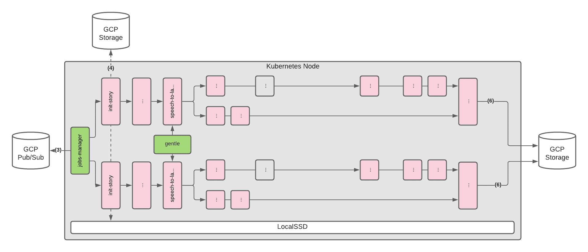

# 分解:Kubernetes 为 NIUS 运行的人工智能视频生成管道。电视

> 原文：<https://thenewstack.io/breakdown-the-kubernetes-run-ai-video-generation-pipeline-for-nius-tv/>

[牛斯。TV](https://nius.tv) 是一个面向移动设备的非线性电视新闻聚合器，它使用人工智能将用户感兴趣的主题转换成短片。这是一个从 2019 年 10 月到 2021 年 4 月的项目，尽管早期实验可以追溯到 2018 年 5 月。在此期间，我们制作了大约 100 个故事，超过 50 万人在社交媒体上观看了我们的视频。

这篇文章是关于后端架构支持视频生成管道的动机和决策。

## 介绍

 [卡洛斯·钦奇利亚·马特奥

Carlos Chinchilla Mateo 拥有 15 年的软件工程师经验。他从 16 岁开始销售软件，在过去的 10 年里，他在位于旧金山、英国和温哥华的公司担任创始工程师，在那里他的职责是将设计、软件、自动化和人工智能结合起来，创造新产品。](https://www.linkedin.com/in/carloschinchilla/) 

深度学习的进步越来越令人印象深刻，并允许我们用一个适度的、动态的 Kubernetes (K8s)设置来创建我们独特的合成故事。

我们没有研究新的新颖架构来解决端到端的文本到视频合成问题(这可能非常昂贵，并且通常需要非常特殊的技能)，而是将视频生成问题分解为我们称为“步骤”的粒度组件

我们利用了健壮的、现成的人工智能系统，这些系统是公开可用的、有文档记录的和经过测试的，并且依靠容器化技术将所有东西缝合在一起。

首先是渲染技术:不久前，第一个版本的 [pix2pix](https://github.com/phillipi/pix2pix) (2016)创建了分辨率为 256×256 的图像。今天，NVIDIA 的 [pix2pixHD](https://github.com/NVIDIA/pix2pixHD) (2018)可以输出高达 2048×1024 的图像，细节水平非常高，只需几个时代的训练。

像 NVIDIA 的 [vid2vid](https://github.com/NVIDIA/vid2vid) (2018)这样的项目采用了图像合成的想法，并通过合成视频将其进一步扩展，这增加了新的困难，如更长的训练时间，更高的内存要求，需要多个 GPU 进行训练( [DGX-1](https://nvlabs.github.io/few-shot-vid2vid/main.pdf) )等等。

以下是我们使用的人工智能系统列表:

## 体系结构

让我们从较高的层面来看一下视频生成流程中的各个步骤:

这就是制作视频的样子:

1.  我们的一名员工使用 webApp 撰写新闻报道，并为其选择合适的图片。一旦一个故事被保存，一个消息被发布到一个 pubsub 队列。
2.  监视 pubsub 队列中的消息的 Cluster-manager 看到了一条新消息，并创建了一个 k8s 集群。一旦 k8s 集群准备就绪，它就会启动 jobs-manager 和 gentle。
3.  作业管理器最终从队列中取出消息，并启动 init-story [k8s 批处理](https://kubernetes.io/docs/concepts/workloads/controllers/job/)作业。
4.  和 5。Init-story 然后从 Google 云存储(GCS)中提取所有的动画资产和新闻图片，并将它们存储到 LocalSSD 中，其余的工作继续进行…

6.最终的视频将存储在 GCS 中。

如果在 Kubernetes 集群运行时创建了新故事，则该特定故事的新流程将从上面列表中的第 3 点开始，并与其他流程并行运行，如下图所示:

### 挑战

正如上面的架构图和 AI 系统表中所提到的，每个 AI 系统都有不同的依赖关系、执行模型，有些需要 GPU。

此外，管道中的步骤需要协调，我们能够根据队列中有多少故事来扩展容量。

让我们详细讨论一下这些挑战。

### 属国

尽管一些人工智能系统共享相同的深度学习(DL)框架和 python 库，但一些系统需要特定的版本和构建指令。这种碎片化使得构建一个单一的容器并同时支持所有的人工智能系统具有挑战性。

我们使用 Docker 容器来独立隔离每个 AI 系统。使用这种方法的一个优点是，我们可以在不破坏其他系统的情况下，将人工智能系统更换为新的系统。

### 资产共享

我们的视频需要看起来清晰。

目前，视频生成管道以 2048×1024 的分辨率、每秒 60 帧的速度输出每帧大约 2mb 的 PNG 文件。由于我们的视频通常长约 35 秒，因此仅通过几个步骤就创建了大约 4.2GBs 的数据。典型视频生成的最终输出约为 16GBs。

为了允许在步骤之间快速共享资产，我们在管道中的所有步骤将 k8s 卷挂载到 pod 时，公开了[local SSD](https://cloud.google.com/kubernetes-engine/docs/how-to/persistent-volumes/local-ssd)。

一个限制是，因为 LocalSSDs 一次只能连接到一个 k8s 节点，所以故事资产和它们各自的视频生成步骤被绑定到同一个 k8s 节点()。这意味着在一个 k8s 节点上开始的视频不能在不同的 k8s 节点上完成。

### 步骤协调

为了协调管道中的步骤，我们创建了一个作业管理器组件(作为 [k8s 部署](https://kubernetes.io/docs/concepts/workloads/controllers/deployment/)运行),它监听由 webApp 和其他步骤创建的消息。

消息包含有关正在制作的视频和要执行的步骤的信息。根据消息，作业管理器将在 k8s 中调度一个批处理作业。

在这种事件驱动的设置中，各个步骤相互独立地异步运行。自然，有些步骤跑得比其他人慢。例如，如下表所述，pix2pixHD 比其他步骤花费的时间更长，并且需要一个完整的 GPU，这可能会给其他也需要 GPU 时间的步骤造成瓶颈。

我们将资源分配和优先级划分以及伸缩弹性留给了 k8s。

### 可扩展性和弹性

在纽斯。电视，我们在白天批量制作我们的视频，这样就没有必要整天运行 Kubernetes 集群。此外，我们的几十个视频需要尽快制作，因为社交媒体分享的窗口是时间敏感的。

为此，cluster-manager 根据队列中的消息数量启动和关闭 k8s 集群。如果消息数量大于零，集群管理器将提供一个 k8s 集群。另一方面，如果队列为空，则删除集群。

我们使用[k8s-自动扩展策略](https://cloud.google.com/kubernetes-engine/docs/concepts/cluster-autoscaler)根据我们希望同时产生的故事数量来扩展 k8s 节点的数量。

集群管理器在 k8s 之外自己的 VM 上运行。

<svg xmlns:xlink="http://www.w3.org/1999/xlink" viewBox="0 0 68 31" version="1.1"><title>Group</title> <desc>Created with Sketch.</desc></svg>