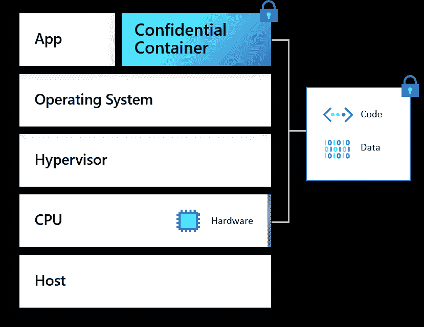
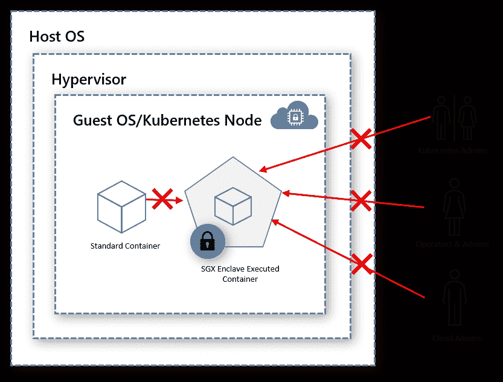

# 布伦丹·伯恩斯:关于机密计算和容器你需要知道的一切

> 原文：<https://thenewstack.io/brendan-burns-everything-you-need-to-know-about-confidential-computing-and-containers/>

 [布兰登·伯恩斯

布兰登·伯恩斯是微软 Azure Compute 的公司副总裁，也是 Kubernetes 开源项目的联合创始人。在 Azure，他领导着专注于容器、开源和 DevOps 的团队，包括 Azure Kubernetes 服务、Azure 资源管理器、服务结构和 Azure Linux 团队。他还为 Kubernetes 项目贡献了许多重要的代码，包括最近与 Kubernetes API 一起工作的客户端库。他参与开源已经超过 20 年，在此期间，他一直担任各种项目的维护者，如 JMeter 负载测试工具、Android 的 DroidDraw WYSIWYG designer 以及 Quake II 到 Linux 的移植。他拥有马萨诸塞大学阿姆赫斯特分校的计算机科学博士学位和威廉姆斯学院的工作室艺术和计算机科学学士学位。](https://github.com/brendandburns) 

Kubernetes 并不总是有 RBAC(基于角色的访问控制)，或者简单认证之外的任何访问控制。很久以前，集群上的每个用户都是完全可信的，并且对集群正在做的一切都有完全的可见性。当我们[开始将 RBAC 添加到 Kubernetes](https://thenewstack.io/microsoft-azure-brings-confidential-computing-to-kubernetes/) 时，我记得我认为这标志着 Kubernetes 过渡到运行“真正的”工作负载的一个重要时刻。虽然 RBAC 的加入为 Kubernetes API 中的资源增加了安全性，但它并没有保护工作负载本身。从今天开始，展望 Kubernetes 的未来，保密计算技术与 Kubernetes 的集成将实现客户工作负载的安全性，正如 RBAC 的加入确保了对集群本身的访问。

世界各地的用户越来越多地使用 Kubernetes 进行云原生开发和数字化转型—[云原生计算基金会 2019 年的调查](https://www.cncf.io/wp-content/uploads/2020/08/CNCF_Survey_Report.pdf)发现，78%的受访者在生产中使用 Kubernetes，比 2018 年的 58%大幅上升。所有这些不同的用户都有各种各样的需求，推动他们的技术密集度向前发展，并推动他们的数字化转型。但是几乎每个用户都需要不同的团队、系统和组织来协作和构建数据驱动的安全解决方案。

机密计算是一项改变行业的技术，是数据安全和隐私的基石。由于 GDPR 等法规、潜在的商业机密泄露以及对数据丢失的担忧，组织长期以来一直难以大规模进入数字市场。这些顾虑带来了复杂而冗长的合同、法律问题，以及迁移到云时与管理 IT 系统的人员相关的信任根。

当数据或应用程序离开组织时，无论是移动到云还是合作伙伴位置，保护数据尤为重要。在分析数据处理或现代微服务架构和 Kubernetes 等多应用环境中运行时，数据保护和特权数据访问问题尤为重要。

## 进入机密计算

机密计算使用基于硬件的可信执行环境(TEE)提供使用中数据保护保证，以增加对执行代码和内存中数据的安全保证，这是迄今为止尚未实现的。它删除了您需要信任的层，并保护应用程序和数据免受来自系统管理员、服务提供商或基础架构提供商的未经授权的访问或修改。

在这个 TEE 环境中，应用程序和数据所有者可以完全控制谁可以查看、执行和计算数据。拥有通过机密计算保护应用程序和数据的纵深防御战略，可以带来新的可能性，例如多方之间的丰富数据协作、安全密钥管理、内存数据库以及快速安全的区块链等等。

为了实现组织或内部团队之间的可信协作，必须对数据进行编辑或匿名处理，这通常会降低洞察力。数据准备流程通常成本高昂，原因包括花费的时间、人员错误以及将数据精简到最低限度，所有这些都会导致低影响力洞察。

借助机密计算，组织现在可以将丰富的数据和代码带到云中进行大规模处理。为了通过执行来保护代码和数据，机密计算使用基于硬件和软件的组件的证明，并且数据解密密钥在足迹验证之后仅被发布给可信应用。

传统方法无法实现这种级别的隐私和代码保护。

## 云计算和容器

在云原生和容器领域，我们经常看到组织构建专有的机器学习(ML)模型或数据处理模型。打包成容器的专有软件需要防止任何误用，尤其是当它们存储在注册表中或安装到主机上时。当我们考虑负责任地使用人工智能并确保我们的模型被安全和公平地使用的重要性时，这一点尤其如此。在 [Azure](https://aka.ms/AzureCC) 中，我们已经通过“[机密容器](https://docs.microsoft.com/en-us/azure/confidential-computing/confidential-containers)启用了这种可信多方丰富数据模拟让我们来看看它们是如何工作的。

> 有了机密计算，“您不再需要信任集群的管理员或操作员，就可以在 Kubernetes 集群中安全地运行高知识产权数据，如机器学习模型。”

机密计算减少了应用程序的受攻击面，并防止客户操作系统、虚拟机管理程序或主机操作系统层中的漏洞。这意味着使用机密计算的容器可以与被入侵的容器在同一主机上运行，并保护其数据。

在 Kubernetes 的上下文中，这意味着您不再需要信任集群的管理员或操作员，以便在 Kubernetes 集群中安全地运行高知识产权数据，如机器学习模型。

当应用程序的代码在一个安全区域内运行时，除了应用程序本身之外，任何人都不能访问该区域中使用的内存和执行代码本身。这提供了三个重要的属性来帮助保护您的容器。

首先，它提供了在同一主机上运行的容器之间的硬件隔离。无论有多恶意，运行在同一虚拟机上的不同容器都无法访问受 TEE 保护的数据。即使容器使用内核级漏洞接管虚拟机管理程序中的客户操作系统，TEE enclave 中的数据也是安全的。

其次，enclave 可以通过容器加密、签名和证明来提供代码完整性，从而确保只有可信代码在 enclave 内部运行。这可以防止恶意攻击，恶意攻击试图通过堆栈破坏或其他利用来修改容器内的运行代码。

第三，机密计算为附加在硬件和初始化参数上的数据解密信任提供安全的密钥发布。使用这种数据保护，您可以将模型或其他专有数据交付给在不受信任的客户环境中运行的代码，并确保这些数据只能在安全可信的执行环境中访问。这对于需要多个不可信方相互协作的场景尤其有用。

将这些能力结合在一起意味着企业可以建立对其代码和数据安全的高度信任，即使在构建动态的、基于微服务的应用程序时也是如此。云原生计算就是开发可扩展的微服务以实现敏捷性，并将这些服务打包到共享集群中以实现最高效率。但这些优化不能以安全性为代价，幸运的是，随着保密计算加入到云原生计算的世界中，它们不必这样做。

## 机密计算和开源社区

当然，云原生开发的另一个关键组件是开源。通过 Kubernetes 项目的发展，我们已经看到了社区的力量和作为一个行业来推动技术发展的价值。同样的开放努力正在机密计算领域进行。

我很高兴微软、IBM、红帽、阿里巴巴、谷歌、英特尔和其他公司都是保密计算联盟(CCC)的创始成员。现在 CCC 中有七个开放项目，包括 OpenEnclave SDK，这是一个硬件抽象层，可以为机密容器进行开发，而无需紧密绑定到特定的硬件实现。

总的来说，CCC 对解决有助于提升机密和云原生应用程序开发技术水平的问题感兴趣。首先是工具和 SDK 的开发，使开发人员在构建新应用程序时更容易利用机密计算。

可以想象，在可信执行环境中运行的细节可能很复杂，对于开发人员来说，这是保护代码和数据安全的一个巨大障碍。CCC 正在开发的工具和 SDK 旨在降低这一准入门槛，使广大开发人员能够在其应用中使用机密计算。安全性永远不应该是只提供给愿意忍受复杂性的开发人员的东西。如果我们真的要构建尊重隐私和负责任的数据使用的应用程序，我们必须为所有开发人员提供安全性，比如可信的执行环境。

当然，如果您正在构建一个新的应用程序，能够轻松地使用安全飞地进行开发是非常好的。然而，对于遗留应用程序，采用机密计算技术几乎是不可能的任务。可能无法重构代码来利用可信执行环境，或者应用程序甚至可能不是当前正在开发的应用程序。

为了促进这些用例，CCC 的成员还关注“提升和转移”工具，这些工具将使开发人员和操作人员能够将他们的容器完全不变地部署到安全的容器执行环境中。从映像拉取到执行的整个容器将在可信的执行环境中运行，而不是要求应用程序理解飞地。像 [ONNX](https://onnx.ai) 和 [Graphene](https://grapheneproject.io/) 这样的工具将真正使机密容器能够带给云原生生态系统最广泛部分的安全性民主化。

这种对新开发人员和迁移现有应用的关注激起了云原生社区的极大兴趣，我们很高兴看到合作伙伴、供应商和开源项目为我们的客户开发了具体的解决方案。我们非常期待进一步的合作，让机密容器像 RBAC 一样自动成为 Kubernetes 的一部分。这不是秘密，我期待这将带我们去哪里！

云计算原生计算基金会是新堆栈的赞助商。

通过 Pixabay 的特征图像。

<svg xmlns:xlink="http://www.w3.org/1999/xlink" viewBox="0 0 68 31" version="1.1"><title>Group</title> <desc>Created with Sketch.</desc></svg>