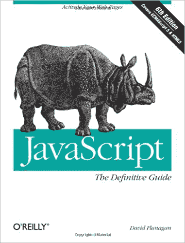

# Brendan Eich 谈到了在 10 天内创建 JavaScript，以及他今天会做些什么

> 原文：<https://thenewstack.io/brendan-eich-on-creating-javascript-in-10-days-and-what-hed-do-differently-today/>

今天，数以百万计的开发人员使用一种编程语言，这种语言是在网络繁荣的喧嚣中仅用 10 天时间创造出来的。JavaScript 创作者 Brendan Eich 在一些新发布的在线视频中重温了他的语言的根源，并解释了他在 1995 年播下的所有种子现在是如何最终开花结果的。

1995 年是一个不同的时代，一个不同的世界。当时网景公司认为浏览器/服务器组合是一种新型的分布式操作系统，记得[电脑杂志](https://www.computer.org/csdl/mags/co/2012/02/mco2012020007.pdf)。浏览器有潜力让开发者接触到任何平台上的用户——Windows、Mac 或 Linux——但缺少的是编程语言。网景公司真正想要的是一种语言来补充 Java，吸引初学者，就像微软的 Visual Basic 一样。

整个科技行业已经在争先恐后地追赶互联网的惊人普及。当时，网络革新的速度是惊人的，微软公司突然把因特网作为其 Windows 95 操作系统发布的重点，以回应网景公司新出现的浏览器和服务器产品。众所周知，34 岁的 Brendan Eich 仅用 10 天时间就创造了这种语言的第一个版本，成为 JavaScript。(去年，艾希在 dotJS 大会上开始了一次演讲，他说“22 年前的 5 月，我努力工作了 10 天”，并补充道“[我睡得不多](https://www.youtube.com/watch?v=GxouWy-ZE80&feature=youtu.be)”)

[https://www.youtube.com/embed/GxouWy-ZE80?feature=oembed](https://www.youtube.com/embed/GxouWy-ZE80?feature=oembed)

视频

该杂志指出，艾希是这项工作的合适人选，因为他在大学时就已经编写了编程语言，“只是为了在语法方面进行实验。”艾希记得，当谈到词法分析和语言解析器时，“我喜欢那些东西，因为从理论上来说，它们都非常漂亮和干净……这给了我快速破解语言解释器的能力。”甚至在加入 Netscape 之前，他还在 Silicon Graphics 开发了用于扩展网络监控工具的语言。(此外，艾希告诉他的采访者，“我这样做是为了好玩，只是为了创造我自己的语言。”)

事实上，正是硅图形公司的创始人吉姆·克拉克创建了网景公司——所以人们已经对艾希的语言写作能力产生了一些兴趣。“一开始我被邀请加入，但我没有，因为我在之前的创业公司又呆了一年，”Eich [最近告诉 InfoWorld](https://www.infoworld.com/article/3294999/javascript/interview-brendan-eich-on-javascripts-blessing-and-curse.html) 。

但是当第二年艾希最终在网景公司获得了那个决定命运的职位时，“我被一个想法吸引了，那就是做一种非常受学术界欢迎的语言，叫做 Scheme……这个想法就是‘在网景公司做 Scheme’。把这种编程语言放到浏览器里。他后来称 Scheme 为“那种让我动心的美丽的研究语言”。”但当他加入网景公司时，他们已经和太阳微系统公司达成了协议，后者正在推广他们新开发的 Java 语言。“突然，故事变成了，‘嗯，我们不知道我们是否想要这个方案。我们甚至不知道我们是否需要一点语言，就像我们希望你做的那样。也许 Java 就够了。"

这是一个他会永远记住的转折点。早在 2012 年，艾希就告诉计算机杂志，他在两个方面受到挤压。“我们都觉得微软会盯上网景，因为他们在 1994 年末曾试图收购网景……但我们也陷入了一场关于 Java 的奇怪的博弈，因为即使在网景，有些人也会想，‘好吧，如果我们有 Java，我们真的需要第二种语言吗？他们没有看到 Visual Basic 伴侣语言对更多的程序员或业余爱好者、设计师或初学者的好处。"

“但是网景公司的马克·安德森、Sun 公司的比尔·乔伊、我和其他几个人认为有必要开发一种平易近人的语言，可以直接放在网页上，”他告诉 InfoWorld。或者，正如他向计算机解释的那样，“我写的东西可以被不知道编译器是什么的人使用。他们正准备装货。

“就像基本的一样。这真的是一个卖点……”

“我接到营销指令，要让它看起来像 Java，但又不显得太大。只是这种傻傻的小兄弟语言，对吧？Java 的伙伴。”

## 接下来发生了什么

InfoWorld 问他对早期的成功有何反应。“当它开始获得早期牵引力时，尽管存在所有的错误和仓促的工作方面，我还是有点惊讶。但我并不感到震惊，因为仔细想想，是*编写*网页的人现在可以*编写*网页了。”

“JavaScript 之所以如此强大，有着如此多的缺点和紧迫的任务属性，是因为它直接连接到浏览器中普通 web 开发人员想要使用的所有东西。”在《计算机杂志》上，他分享了一个赤裸裸的事实:“一旦某样东西被放归自然，缺陷或不完美很快就会成为基本特征，几乎不可能改变。”

[https://www.youtube.com/embed/IPxQ9kEaF8c?feature=oembed](https://www.youtube.com/embed/IPxQ9kEaF8c?feature=oembed)

视频

“这也是一项令人难以置信的紧急工作，因此其中存在错误。我认为它很重要的一点是，我知道会有错误，会有差距，所以我让它作为一种语言具有很强的可塑性。”

或者，正如他在 dotJS 告诉观众的那样，“这真的很难被取代。JavaScript 有一种成功的基因。一旦它在那里，你将很难摆脱它。”

他引用了在 JavaScript 中“发现”asm.js 的例子，称之为“过去 10 年中我特别自豪的另一件事”它使用包含在原始 JavaScript 中的按位运算符，这些运算符现在是静态类型语言的基础，具有高速性能的机器类型。“如果不是从 1995 年开始就有了，以后就很难添加了。事实上，它一直存在，这意味着我们可以非常快速地编写 JavaScript。”

他告诉 InfoWorld，这是“1995 年 5 月 10 日的原始 JavaScript 中的一颗非常强大的种子。”JavaScript 的 32 位数学运算符(称为位运算符)可以追溯到 C 编程语言和 Java。这最终导致了 web assembly——一种将指令转换为虚拟机可快速执行的二进制格式的方法——以及对 JavaScript 引擎的认识，“你可以有两种语言——我用花括号、函数和移位运算符做的旧语言，以及这种二进制语言的新语言，它不适合人类阅读或书写。但是可以由编译器和工具生成，可以由工具读取……”

## 他会有什么不同

经过 23 年的反思，他有什么不同的做法吗？人们告诉他，他应该拒绝在这么短的时间内工作——或者他应该在 Netscape 中实现一种不同的语言，比如 Perl 或 Python 或 Scheme——但这不是他想要改变的。他只是希望自己在听取 JavaScript 第一批内部测试人员的反馈时能够更有选择性。

“其中一个臭名昭著的例子是，‘我想把一个数字和包含这个数字的字符串进行比较。我不想改变我的代码来把字符串转换成数字，或者把数字转换成字符串。我只是希望它能起作用。你能不能让等号运算符说，这看起来像一个 2，这看起来像一个字符串 2。他们足够平等，”

“我做到了。这是一个很大的遗憾，因为这打破了一个重要的数学属性，等价关系属性…这导致了在我们标准化 JavaScript 时增加了第二种等式运算符。”帮助 JavaScript 标准化的人之一是 Guy Steele(T4)，Scheme 的创始人之一。“盖伊说，‘别担心。有些 Lisps 有五种等号运算符。我们会再加一个。"

但是 23 年让这 10 天有了不同的视角。“当你看到我在 10 天内所做的事情时，它就像一颗种子。正是这种强有力的妥协，但仍然非常强大的内核发展成了一种更大的语言。挑战的一部分是——自从我不得不重新启动标准机构以来，我一直致力于标准化工作……我必须帮助人们了解如何让种子发展成一门完整的语言。”

Eich 也是 Mozilla 社区(以及开发 Firefox web 浏览器等开源项目的 [Mozilla Foundation](https://www.mozilla.org) )的联合创始人。2015 年，他成为了勇敢软件公司的首席执行官，该公司开发了一款名为勇敢的广告拦截浏览器，现在每月拥有超过 220 万活跃用户。这一切都源于他对隐私的兴趣，尽管艾希在采访结束时开玩笑说，如果你追溯到它的起源，JavaScript 是广告商用于网络跟踪的基本工具之一。

“所以我正在弥补，”他笑着说。

* * *

## WebReduce

<svg xmlns:xlink="http://www.w3.org/1999/xlink" viewBox="0 0 68 31" version="1.1"><title>Group</title> <desc>Created with Sketch.</desc></svg>