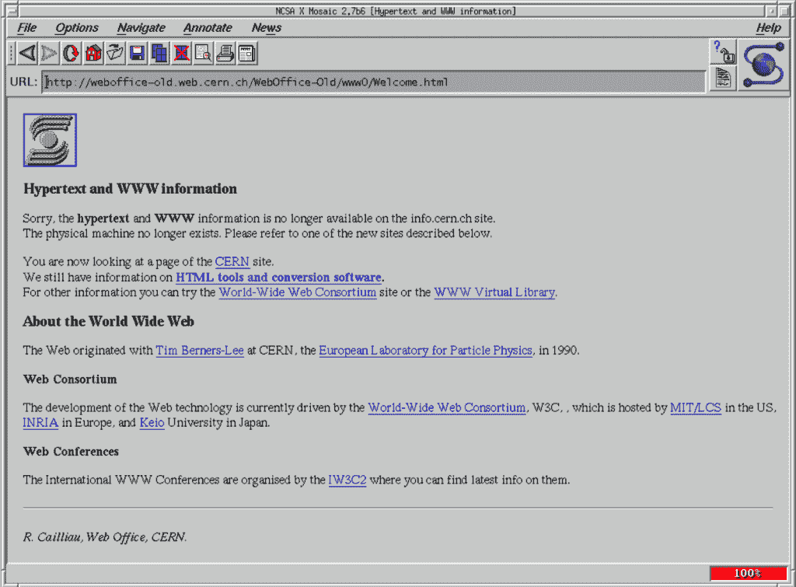

# Brendan Eich 讲述 JavaScript 如何在浏览器大战中幸存

> 原文：<https://thenewstack.io/brendan-eich-on-how-javascript-survived-the-browser-wars/>

上个月，在麻省理工学院人工智能研究员 Lex Fridman 的播客上看到了一段有趣的互联网历史记忆。弗里德曼坐下来与布伦丹·艾希(Brendan Eich)进行了三个小时的交谈，他以 JavaScript 编程语言的创始人而闻名。

随着他们谈话的进行，Eich 及时补充了那一刻的细节，分享了他自己的见解，对编程语言的看法，以及当他回顾过去时所看到的。

他还记得网络早期决定性战役的激动人心之处——接下来的四分之一世纪的浏览器创新。艾希接着共同创建了 Mozilla 社区，以及开发 Firefox 网络浏览器等开源项目的 Mozilla 基金会，并在 2015 年成为 Brave Software 的首席执行官，该公司开发了创新的广告拦截网络浏览器 Brave。

最后，艾希分享了一些关于这一切最终意味着什么的想法。

弗里德曼称之为“我最喜欢的对话之一”

[https://www.youtube.com/embed/krB0enBeSiE?feature=oembed](https://www.youtube.com/embed/krB0enBeSiE?feature=oembed)

视频

## 在标准上创新

艾希毕业于网络时代之前的大学，在那个时代，没有一个单一的网络标准占据明显的主导地位。“在 20 世纪 80 年代，没有人知道什么会赢。像 IBM 的[系统网络架构](https://en.wikipedia.org/wiki/Systems_Network_Architecture)和 [DECnet](https://en.wikipedia.org/wiki/DECnet) 以及所有其他协议这样的专有堆栈都在说‘我们要做了！’或者‘这将是一个异质的未来！'

“取而代之的是 Berkeley Unix 和可追溯到 ARPANET 的 TCP/IP 栈取得了胜利。我想我们都知道。我们在 SGI 都知道这一点，但销售人员不知道，所以他们一直试图让多个网络堆栈投入运行。”

但这并不是 Eich 唯一一次见证一个标准的诞生。艾希记得，在 1993 年之前，浏览互联网包括阅读电子邮件和新闻组新闻组的“文本 y”应用程序，直到马克·安德森和埃里克·比纳发明的马赛克浏览器的发布，这种情况才有所改变，他们当时是伊利诺伊大学厄巴纳-香槟分校国家超级计算应用中心的程序员。这是第一个在网页中显示图像的浏览器。

1994 年，安德森继续创立了网景公司，该公司开发了开创性的网景浏览器(最初名为 Mosaic)。但是艾希指出了一些经常被忽视的互联网历史:这两位程序员“在 HTML 标准上进行了创新”。特别是，马克发了这封电子邮件说，“嗨，大家好，我们认为你们应该能够在页面中放置图像。”你知道当他发来的时候，Eric Bina 已经写好了代码。

“就在几年前，我和蒂姆·伯纳斯·李聊了更多，他说，‘啊，我们有另一种方式来做这件事。’但没有成功，因为马克把他的装在马赛克里。"

艾希说，他从这件事中学到了一些东西。“互联网意味着有巨大的先发优势，快速、抢先非常重要。”他后来承认 JavaScript 编程语言取得了类似的成就，这是他在用 10 天时间为网景导航创建的。“我不是说那是最好的语言，我只是说那是做这件事的正确时机。我想说的是，另一种选择是不去做。我本可以告诉网景，“我做不了这个。太匆忙了。"

那么这个世界就只剩下微软为 web 开发人员设计的脚本语言了，”而且是 Visual Basic 脚本。那就糟了。”

## 网景能杀死 Windows 吗？

艾希创造了 JavaScript，为网络开发者提供了一种非正式的“粘合语言”，可以对网页的各个部分进行编程，并让他们对用户的动作做出响应。

这种语言必须在 10 天内完成一个重要的演示。当被问及是否有睡眠时，艾希回答说:“不够。”在接下来的几个月里，“我们发布了一系列 dot 版本，像疯子一样修复了安全漏洞。”

但这是一个梦想远大的时代，艾希还记得与安德森的头脑风暴，安德森在他们首次公开募股之前就大胆地宣称“网景加 Java 杀死了 Windows”，并大胆地想象一个程序由你的网络浏览器运行的世界的最大可能的影响。“他雄心勃勃，他希望网景公司有可能控制局面，”他说。

当然，他们也一直意识到来自微软的潜在威胁。

## 探索 Internet Explorer

当然，微软的 Internet Explorer 是 Netscape Navigator 的翻版，后来成为使用最广泛的浏览器，一度占据了 95%的浏览器市场。艾希说，网景被微软“无情地粉碎”——微软已经开始以低价出售其服务器软件，以削弱网景在一个关键领域的现金流。网景本身被美国在线收购。浏览器的代码是开源的，因此形成了后来的 Firefox 的基础。

弗里德曼问艾希，他对微软这些年来在开发竞争浏览器中所扮演的角色有何看法，最后他这样提问:“世界因为 ie 浏览器的存在而变得更糟了吗？”但艾希首先区分了今天的微软和“当时”的微软，比尔·盖茨是一个“激进的人物，在我看来，不是真正的原创——不是创始人。”

那么，为什么 Internet Explorer 赢得了浏览器大战？“分销，”艾希很快回答。“分销比什么都重要。这就是为什么，即使现在我们看到在浏览器大战中，Edge 做得更好。因为它被强加给有窗户的人。”

“这就是为什么网景公司的每个人都觉得，‘我们完了。’"

他补充道，“苹果在 Safari 上也是这样做的。这不是微软独有的。”

但他仍然为网景公司的创新感到自豪，这种创新“真正开始从相当静态的网络语言中制造可编程的堆栈。”以及他为帮助 JavaScript 发展所做的工作。

“我在那里做了很多人的工作，让 JavaScript 在最初几年幸存下来，那时它有点危险，对吗？JavaScript 被认为是一种米老鼠语言，它是用来解决浏览器底部状态栏中的滚动文本等问题的。但我一直在倾听开发人员的意见，与他们一起工作，并试图让它以一种有用的方式在单线程事件循环中运行。我认为这创造了人们喜爱的东西。”

但是他也有一些有趣的想法，关于是什么让 JavaScript 保持健壮。“不基于某种时尚判断而拒绝它的人确实会使用它，并且确实会与标准机构互动。标准机构主要是竞争浏览器供应商，但现在也包括大量使用 JavaScript 的大公司 PayPals 和其他类似的公司，Salesforce。他们必须迎合网络开发者。他们必须雇佣懂 JavaScript 的开发人员，他们必须让他们的引擎保持最新的标准——这就创造了所有这种围绕 JavaScript 的社会结构，这是不寻常的……”

Eich 将此与遵循 C++等语言内部工作原理的社区进行了对比。“这是一个更加稀薄的群体。这更像是老语言的白头发。而 JavaScript 是一个更年轻、更有活力的庞大群体。”

* * *

# WebReduce

<svg xmlns:xlink="http://www.w3.org/1999/xlink" viewBox="0 0 68 31" version="1.1"><title>Group</title> <desc>Created with Sketch.</desc></svg>