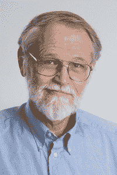
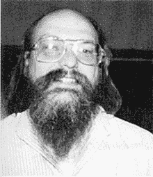
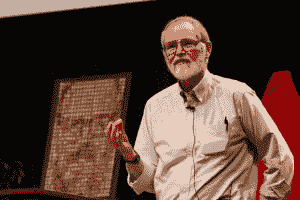

# 布莱恩·柯尼根记得“grep”的起源

> 原文：<https://thenewstack.io/brian-kernighan-remembers-the-origins-of-grep/>

这个月见证了一段有趣的口述历史的发布，其中 76 岁的 [Brian Kernighan](https://www.cs.princeton.edu/~bwk/) 记得 Unix 命令`grep`的起源。

Kernighan 已经是 Unix 世界的一个传奇——他被认为是在 1970 年*创造了 Unix 这个术语的人。他的最后一个首字母也变成了`awk`中的“K”——当人们引用 1978 年关于 C 编程的标志性的“K 书”时，也变成了“K”。最初的 Unix 程序员手册称 Kernighan 为“杰出的解释者”，自 2000 年以来，他一直是普林斯顿大学的计算机科学教授——在贝尔实验室历史悠久的计算科学研究中心工作了 30 年。*

在 YouTube 频道 Computerphile 的新采访中，Kernighan 分享了一些回忆…

两年前，Kernighan 记得他在 1967 年作为一名研究生加入贝尔实验室，学习电子工程，因为当时没有“计算机科学”专业。“[这是一个很棒的地方](https://youtu.be/QFK6RG47bww?list=PLzH6n4zXuckqZ90zLyy36qjO5YIn1RulG)因为有大量非常优秀的人在做非常有趣的事情，没有人告诉你该做什么……”

Brian Kernighan–途经 Princeton.edu

“在一个单独的、较大的建筑里，可能有 4000 人，其中大约 2000 人可能是各种形式的科学、物理、化学、材料的博士，然后是所谓的软端，数学和计算机科学的相对较新的领域。”

## 记住 Unix 诞生的地方

Kernighan 回忆说，整个美国电话电报公司有“远远超过”100 万名雇员，这使他们成为美国政府以外最大的雇主。他们作为大多数美国人的电话公司的主导地位给了他们一个非常稳定的收入流，而研究只代表了公司的一小部分。“从某种意义上来说，只要这些人能生产出有用的东西，这并不重要，”他回忆道。

他们做到了。Kernighan 引用了他们在晶体管方面的工作，激光方面的早期工作，以及区域精炼，“这使得半导体实际上变得可行——所有这些东西都来自贝尔实验室。”

[https://www.youtube.com/embed/QFK6RG47bww?list=PLzH6n4zXuckqZ90zLyy36qjO5YIn1RulG](https://www.youtube.com/embed/QFK6RG47bww?list=PLzH6n4zXuckqZ90zLyy36qjO5YIn1RulG)

视频

他还记得，当把穿孔卡输入一台电脑被分时系统取代时，分时系统“实际上给了每个人一种错觉，以为自己拥有了整台电脑。”那么，你能把这称为云计算的早期版本吗？“也许你可以。这是一台中央计算机，它拥有资源，是信息存储的地方，你可以与它远程对话。”

直到 1967 年，他才见到 Unix 的创造者肯·汤普森，但最终，他和丹尼斯·里奇都和柯尼根在同一个组织。

肯·汤普森，通过行话文件

“如果有人有想法，他们会谈论它。人们会聚集在走廊里谈论想法。人们会在午餐时见面，谈论类似的事情。”

这就把我们带到了汤普森发明`grep`的时刻。

## **一项实用新型的诞生**

最初的 Unix 程序员手册[称`grep`是 Unix 经历的“更令人难忘的小革命”之一，称其不可逆转地将“工具”观植入 Unix。在`wc`、`cat`和`uniq`等实用程序中已经可以看到，流转换模型在后来的`tr`、`m4`、`sed`和一系列语言预处理程序的设计中被有意遵循当然，在搜索文本模式时会用到`grep`——无论该文本是来自输入文件还是来自“管道”文本(另一个命令的输出)。](http://www.cs.dartmouth.edu/~doug/reader.pdf)

[https://www.youtube.com/embed/NTfOnGZUZDk?feature=oembed](https://www.youtube.com/embed/NTfOnGZUZDk?feature=oembed)

视频

为了理解`grep`的故事，“你必须把自己放回到计算的早期 Unix 的非常非常早期，”Kernighan 解释道。早在 20 世纪 70 年代初，Unix 运行在 PDP-11s 上，“这是一台计算能力很低的机器。它运行速度不是很快，也没有太多的内存，可能是 32K 左右，可能是 64K 字节，这是 64K 字节，不是兆字节，辅助存储也非常小，只有几兆字节的磁盘。”

在与 Computerphile 的另一次采访中，Kernighan 认为正是这些低存储环境也催生了 Unix 的 pipe operator。

[https://www.youtube.com/embed/bKzonnwoR2I?feature=oembed](https://www.youtube.com/embed/bKzonnwoR2I?feature=oembed)

视频

“如果在将一个程序的输出放入下一个程序之前，您必须完全存储它，这可能是不合适的……因此，在将它传递给下一个程序之前，您不一定能够实例化一个程序的输出。

“管道从来不需要实例化整个输出…这意味着你可以偷偷摸摸地通过它…”

但是也没有足够的内存来编辑大文件。那时`ed`是标准文本编辑器——汤普森为只有原始显示器的世界编写的一个小程序。“没有光标寻址，所以你不能在一行内移动。`ed`的文字编辑反映了那种事情。”

`ed`让您指定出现在斜杠之间的正则表达式，以及在匹配的行上执行的一些操作(指定在斜杠之外的*)。这些操作通常用一个字母来表示，如“p”表示打印,“a”表示追加。还有一个代表全局的“g”标志，它将执行一个命令*而不是只在一行上执行*，而是在文件的每一行*上执行(匹配指定的正则表达式)。例如，打印命令“p”。**

如果你写下这个命令——g 代表“全局”, p 代表“打印”,将它应用到斜杠之间的正则表达式——它看起来像这样:

`g/re/p`

Kernighan 以故事的形式提供了一些重要的背景。他们的同事李·麦克马洪(Lee McMahon)曾想研究《联邦党人文集》(Federalist papers)，这些论文由几个不同的作者(包括亚历山大·汉密尔顿(Alexander Hamilton))撰写，但以相同的笔名发表，他仔细分析了文本，通过找到所有特定单词和短语的出现来寻找关于原始作者的线索。不幸的是，该集合的明文版本只有 1 兆字节——“以今天的标准来看，噪音很低”，但在当时:“不适合。他无法在`ed`中全部编辑它们。

“他把这个送给肯·汤普森，然后回家吃晚饭之类的。第二天他回来了，肯给他写了一个程序。

"这个项目叫做`grep`"

“它一炮而红，”最初的“Unix 程序员手册”断言，“并很快作为动词进入我们的语言。”

## 编码挑战

“让我补充一点，”柯尼根笑着回忆道。25 年前，也就是 1993 年的春天，他作为一名客座教授，需要为他的编程课布置一项任务。所以他向他的学生提供了`ed`的源代码——“那时候可能有 1800 行 C 语言”——并告诉他们像肯·汤普森那样做。

“你的工作是把这 1800 行 C 语言转换成`grep`，作为一个 C 程序。你有一周的时间去做。”

Kernighan 向全班指出他们有几个优势。例如，最初的 grep 是用 PDP-11 汇编语言编写的。“这是你在新工作中可能遇到的典型情况，”他们的作业文本解释道。“你被要求在一个大的程序中做一个小的改变，而最大的挑战是找到正确的东西来改变，同时确保没有其他东西被破坏。”

有趣的是，Kernighan 早在 1993 年就告诉 Thompson，他正在布置这个问题——历史记录将会显示他收到了 Thompson 的回复。

看起来是个非常好的任务。它强调重复利用和清洁，而不是抱怨。

“当然，它们也有一个严重的缺点，”Kernighan 告诉 Computerphile。"他们都不是肯·汤普森。"

一段后续视频显示，采访者坚持要讲故事的其余部分。“是他们想出来的吗？”

“哦，是的，是的，很好，”柯尼根很快回答道。“这是一件容易的工作。”

[https://www.youtube.com/embed/bSaBe6WiC2s?feature=oembed](https://www.youtube.com/embed/bSaBe6WiC2s?feature=oembed)

视频

“过了一段时间就不用了。它的问题是，随着人们越来越多地转向基于屏幕的编辑器——`vi`、`emacs`等等——然后是基于鼠标的编辑器，最近，`ed`已经失修了。”

尽管如此，Kernighan 认为这仍然是我们伟大的极客传统的一部分。“如果你定期使用`vi`，那么`ed`就藏在那里。所有的命令都非常相似……”

但是他笑着说“这是一项伟大的运动。”

## 说到`vi`

事实上，由于这个原因，Kernighan 自己也使用`vi`作为他的文本编辑器，尽管直到今天，他仍然会使用`ed`——“非常偶然地，当我想做一些非常快速和简单的事情时。它是可脚本化的…“他还使用了由 Rob Pike 编写的名为`sam`的混合文本编辑器，“因此，在某种意义上，这些都来自于命令和正则表达式的原型示例，这一点刚刚得以延续。”

Brian Kernighan，2012 年，贝尔实验室。Ben Lowe 通过 Flickr 和维基百科拍摄的照片

当《计算机爱好者》的采访者问及管道操作器今天是否还在使用时，克尼根强调说:“哦，当然。这仍然是一个基本的机制。你一直在用它。

“你在这一点上想都不要想。这只是一部分。这绝对是“不要重新发明轮子”的一个例子。其他人已经为你做了很多有用的事情。"

此外，他说，“把命令粘在一起也很有趣。”

* * *

## WebReduce

<svg xmlns:xlink="http://www.w3.org/1999/xlink" viewBox="0 0 68 31" version="1.1"><title>Group</title> <desc>Created with Sketch.</desc></svg>