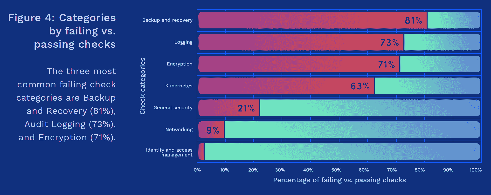

# 错误配置的地形模块是一个安全问题

> 原文：<https://thenewstack.io/bridgecrew-all-these-misconfigured-terraform-modules-are-a-security-issue/>

根据专注于开发人员的安全供应商 [Bridgecrew 的一份新报告，所有可供下载的社区构建的 Terraform 模块中有多达一半配置错误，为基础设施即代码驱动系统中的潜在安全漏洞开辟了道路。](https://bridgecrew.io/)

“大多数市场实际上都依赖于公共注册模块。如果他们没有任何控制来系统地分析它们，或者由精通 Terraform 中潜在有害错误配置知识的人来分析，这些类型的发现就会丢失，”Bridgecrew 联合创始人兼产品副总裁[盖伊·艾森科特](https://www.linkedin.com/in/guy-eisen-3012a597/?originalSubdomain=il)在接受新堆栈采访时说。“使用更安全的模块可以非常容易地防止一些最终会导致数据泄露的错误配置。”

Bridgecrew 的[“开源平台安全状况”](https://bridgecrew.io/blog/state-of-open-source-terraform-security-report-2020)报告中发表的一项分析显示，当 Bridgecrew 评估它们如何再次匹配 CIS 基准[时，亚马逊网络服务、Azure 和谷歌云支持的 2600 个模块中有 44%配置错误。](https://www.cisecurity.org/cis-benchmarks/)

问题不在于模糊的配置。事实上，曾经被下载的模块中有 56%包含现在被认为是错误的配置，最新的模块并没有显著的改进。

随着 Terraform 继续被更广泛地采用，这个问题似乎越来越严重:与今年第一季度相比，2020 年第二季度注册中的模块增加了 83%。自 6 月份收集数据以来，增长速度进一步加快。总体而言，这家以开发者为中心的安全公司发现，自 2017 年以来，已有 1500 万个错误配置的模块被下载。

由 [HashiCorp](https://www.hashicorp.com/) 管理的开源 [Terraform framework](https://www.terraform.io/) 已经成为 IT 系统新兴的“基础设施即代码”概念的组成部分之一。Terraform 提供了一条通往可编程基础设施的道路，通过一种易于理解的声明性语言，可以在其中部署和管理资源。除了管理 Terraform 项目本身，HashiCorp 还维护着 [Terraform Registry](https://registry.terraform.io/) ，它是由 HashiCorp、云提供商和公共开源许可证下的社区贡献者维护的数千个模块、自含式 Terraform 配置包的所在地。

但是，当组织和云提供商调查 Terraform 和其他基础设施即代码工具的使用时，他们可能会忘记在将这些原型投入生产时进行安全检查。

根据 Bridgecrew 的说法，它的大多数检查都失败了，因为没有定义用于增强数据安全性和可追溯性的模块可选参数。注册中心四分之三的模块是为 AWS 设计的，但是其他的云提供商也开始赶上来了。S3 存储的处理特别麻烦。创建弹性 Kubernetes (EKS)的一个错误配置的模块是下载最多的模块之一，尽管现在有了一个更新的版本。

“在像 Terraform 这样的配置语言中，你可以有选择地输入参数来配置你的模块，以做一些非常具体和定制的事情。即使是高度规模化的 Terraform 工程师也不会知道你可以附加到潜在资源的所有潜在属性和参数，”艾森科特说。“这种语言最终需要的是一组启动和运行它的强制字段，以及一组非强制的可选字段，这将大大加强和限制对该资源的潜在访问。”

哈希公司的一名发言人在回应该报道时回答说:

*报告中使用“错误配置”一词表明某些模块不正确，但事实并非如此。Bridgecrew 报告的挑战在于，并非所有的 Terraform 模块都打算编纂最佳实践。有些模块只是为了以更方便的方式打包提供者的功能，同时仍然让模块的用户做出适当的工程权衡。注册表中的一些模块是由他们的目标云供应商的代表编写的，旨在封装有见解的最佳实践，但这不是所有注册表模块的目标。Terraform Registry 的目标当然不是允许用户将他们的工程/设计工作完全外包给模块维护者。*

Terraform 注册表使用“已验证”状态来表示 HashiCorp 已经确认了该模块的发行者的真实性，并且该模块是由 HashiCorp 技术合作伙伴计划的活跃成员发行的，但是该状态并不表示 HashiCorp 已经对该模块的内容进行了审查。

该公司承认，开源版本的 Terraform open 面临的挑战之一是，它缺乏对如何使用基础设施即代码的治理。该公司指出，企业版的优势之一是包含了最佳实践和治理。“在 HashiCorp，我们关注的事情之一是在不牺牲开源好处的同时，为组织和团队带来治理。Terraform 云和企业产品可帮助组织进行治理和合规，以避免出现本报告中建议的情况，”该发言人在电子邮件中写道。

Bridgecrew 发现，最常见的错误配置出现在为备份和恢复、日志记录和加密类别创建的模块中。例如，日志中缺少粒度报告可能会妨碍对安全漏洞的调查。同样，缺少备份和恢复协议可能会严重降低用户恢复系统的能力。网络模块中的错误会使整个系统容易受到来自互联网的攻击。

为了完成这项工作，Bridgecrew 使用了其旗舰产品 [Bridgecrew Platform](https://bridgecrew.io/platform/) ，这是一种扫描和修复声明性代码的自助服务工具，可以从用户的 GitHub 帐户或其他存储库中自动提取。它不仅涵盖了 Terraform，还涵盖了 Kubernetes、无服务器框架、ARM 模板等等。它依赖于许多扫描仪，包括 Bridgecrew 自己的开源扫描仪 [Checkov](https://github.com/bridgecrewio/checkov) 。

来源:Bridgecrew 的“开源平台安全状况”

从 Bridgecrew 的角度来看，这种对安全性的缺乏关注证明了许多公司没有认识到基础设施的安全性——因为代码安全性尚未成为重中之重，尽管该报告确实指出行业标准正在改善，并且云提供商正在试图教育他们的用户如何保护他们的部署。

报告没有提到问题的严重性。与安全漏洞不同，没有一个通用的系统来对错误配置的危险程度进行分级。

安全管理社区资源有一个先例:几年前，Docker Hub 作为容器图像的中央存储库变得非常流行，但很快就发现未经验证的图像通常包含安全漏洞。许多商业集装箱登记处的出现就是为了解决这个问题。

可以肯定的是，Terraform 注册中心并没有像 Docker Hub 那样带来同样的风险。许多模块由云提供商维护并保持更新。注册中心的一个伙伴是官方的和经过验证的“提供者”列表，它使得负责 API 交互和公开资源的上游 API 的逻辑抽象可用。目前，这些只是概括了自以为是的最佳实践。简而言之，注册表中的模块允许您成功地将基础设施作为代码启动，但该公司没有表示这将如何影响您的安全状况。

Bridgecrew 提供了许多技巧来最大限度地减少基于配置的错误。组织可以创建预先批准、经过测试的模块的服务目录模型。“这要追溯到一个过程，”艾森科特说。“本质上，如果公司正在利用基础架构即代码，我们强烈建议开发一个内部流程来审查和验证进入环境的模块，就像您对引入环境的新开源包所做的那样。”

其他提示:开发人员可以使用预提交钩子扫描器或 linter 来捕获编码过程中的错误。轻量级 CI/CD 作业可以为代码所有者标记大多数错误。

亚马逊网络服务、Bridgecrew 和 HashiCorp 是新堆栈的赞助商。

通过 [Flickr](https://www.flickr.com/photos/baileysjunk/4213979651) 获取专题图片。

*目前，新堆栈不允许在该网站上直接发表评论。我们邀请所有希望讨论某个故事的读者通过 [Twitter](https://twitter.com/thenewstack) 或[脸书](https://www.facebook.com/thenewstack/)访问我们。我们也欢迎您通过电子邮件发送新闻提示和反馈: [feedback@thenewstack.io](mailto:feedback@thenewstack.io) 。*

<svg xmlns:xlink="http://www.w3.org/1999/xlink" viewBox="0 0 68 31" version="1.1"><title>Group</title> <desc>Created with Sketch.</desc></svg>