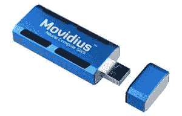
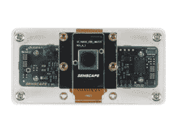
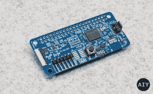

# 利用定制的人工智能芯片将智能带到边缘

> 原文：<https://thenewstack.io/bring-intelligence-to-the-edge-with-custom-ai-chips/>

曾经有一段时间，图形处理单元(GPU)仅限于支持 PC 游戏或图形渲染的高端视频适配器。一个普通的计算机用户甚至一个程序员都不太关心 GPU。得益于 ML 和 AI 的崛起，GPU 炙手可热。从公共云供应商到学术研究实验室，GPU 已经成为计算的重要组成部分。

GPU 的最大制造商 NVIDIA 在市场上享有垄断地位。他们的 GPU 带有软件驱动程序和计算工具包，可以并行运行计算任务。CUDA 和 [cuDNN](https://developer.nvidia.com/cudnn) 是人工智能研究人员和企业数据科学家中流行的工具包。

机器学习算法只不过是适用于解决商业问题的数学和统计方程。训练机器学习模型涉及通过替换方程的多个变量来并行运行复杂的数学方程。当变量的神奇组合被发现时，这个模型就被认为是完全训练好的。

GPU 配备了数百个内核，可以并行运行这些复杂的数学方程。虽然 CPU 同样更快，但它们是通用处理器，不是为大规模并行化而设计的。GPU 通过接管数学计算部分来补充 CPU。包括机器学习、高性能计算(HPC)、图形渲染、游戏开发在内的许多工作负载都依赖于 GPU。ML 和 AI 技术的日益普及，使得 GPU 和 CPU 一样无孔不入。

机器学习模型有两个阶段——训练和推理。

在监督机器学习中，训练包括将各种变量组合输入复杂的方程，直到预测值更接近实际值。这种技术用于解决简单的线性回归问题到处理计算机视觉和自然语言处理的复杂深度学习算法。

一旦模型完全定型，它就可以预测或分类看不见的数据点。推理是一种利用完全训练好的模型进行预测的技术。虽然推理不像训练那样激烈，但它仍然使用复杂的数学方程来产生预期的结果。例如，在计算机视觉中，输入图像被立即转换成大量的像素阵列，这些像素阵列被提供给模型进行推理。这引发了一项复杂的计算任务，需要处理数百万个方程和变量。

大多数经过训练的机器学习模型在边缘计算层以离线模式运行。这些边缘设备需要加速器来加速推理。如果推理只在 CPU 上运行，可能不会导致更快的响应。在诸如人脸检测和物体检测的场景中，用户期望预测或分类在毫秒内发生。这个用例的经典例子是 iPhone 中的 Face ID 认证。当摄像头捕捉到匹配的人脸时，手机会立即解锁。iPhone 中有一个 GPU 正在加速机器学习模型的计算。这种在终端用户设备中运行完全训练的机器学习模型的机制被称为推理。

边缘计算将推动专业人工智能芯片和加速器的采用。

意识到边缘 CPU 对互补处理器的需求，英特尔和高通等芯片制造商正在投资专门的处理器来加速 ML 推理。这些芯片针对包括计算机视觉和自然语言处理在内的特定用例进行了高度定制。

我们将着眼于计算机视觉中专用芯片的三种具体实现。

## 英特尔 Movidius 神经计算棒

2016 年，英特尔收购了利基芯片制造商 Movidius，该公司生产用于无人机和虚拟现实设备的计算机视觉处理器。Movidius 的旗舰产品是 Myraid，这是一种专门用于处理图像和视频流的芯片。由于其处理计算机视觉的能力，它被定位为 VPU——视觉处理单元。

收购 Movidius 后，英特尔将 Myraid 2 封装在 USB 拇指驱动器中，作为神经计算棒(NCS)出售。NCS 最好的一点是它可以与 x86 和 ARM 设备一起工作。它可以很容易地插入英特尔 NUC 或 Raspberry Pi 来运行推理。它从主机设备获取电能，而无需外部电源。

建立在 Caffe 或 TensorFlow 上的机器学习模型可以很容易地移植到 NCS 上。英特尔发布了一款 SDK 和工具，可帮助您在 Movidius 上分析、调整和部署现有模型。SDK 有许多基于流行的神经网络架构的示例，如 AlexNet、ImageNet、MobileNet 和 Inception。

当连接到配备摄像头模块的 Raspberry Pi 时，英特尔 Movidius NCS 可以在短短几毫秒内执行对象检测。

你可以从亚马逊购买价格为 80 美元的英特尔 m ovidius NCS T2 设备。

## 有角的桑金艾

Horned Sungem 是一家专注于人工智能的中国公司。Horned Sungem 的 AI 开发板专为开发人员、学生、业余爱好者和爱好者打造，让他们轻松创建自己的 AI 应用程序。

该设备有一个 USB-C 连接器，可以插入 Raspberry Pi 或任何其他计算设备。它原生支持通过 CSI 接口连接的 Raspberry Pi 摄像头。

据制造商称，其芯片具有独特的集成前端设计，能够在低功耗下实现高性能(<3W). HS has its own development toolkit based on Python which supports most platforms such as MacOS, Linux, Android, Windows (to be released soon).

HS comes with fully trained ML models out of the box. Developers can easily get started with the toolkit which has no dependency on deep learning frameworks or complex libraries. After running a short installation script, the device will be ready to identify a variety of objects.

Interestingly, HS is based on Intel Movidius MA245X VPU chips that power many devices in production.

Horned Sungem AI is 售价 129 美元)。

## 谷歌 AIY 视觉套件

虽然它看起来像是基于谷歌 Cardboard(T4)项目的业余爱好工具包，但 AIY 视觉工具包(T5)却很强大。它配备了在一个小小的设备——Raspberry Pi Zero 上构建成熟的计算机视觉应用程序所需的一切。

谷歌与英特尔合作开发了一款名为 Vision Bonnet 的定制主板。看到主板由英特尔 Movidius VPU 驱动并不奇怪。

AIY 视觉套件带有一个 Raspberry Pi 摄像头模块，直接连接到视觉罩上。这避免了将图像帧转发到 VPU 进行处理所涉及的等待时间。

Google 已经完全重写了 Movidius SDK，这使得运行 TensorFlow 模型进行推理变得简单得多。Python SDK 具有 API，用于对工具包附带的按钮和 led 进行编程。

该工具包附带了半打模型，可以随时进行推断。开发人员可以轻松地使用这些模型来开发定制的应用程序。

谷歌 AIY 视觉套件在 Target 上售价 89.99 美元

尽管人工智能和边缘计算仍处于起步阶段，但预计它们将加速发展。公共云中的 GPU 和边缘的专用人工智能芯片将推动下一波计算。

<svg xmlns:xlink="http://www.w3.org/1999/xlink" viewBox="0 0 68 31" version="1.1"><title>Group</title> <desc>Created with Sketch.</desc></svg>