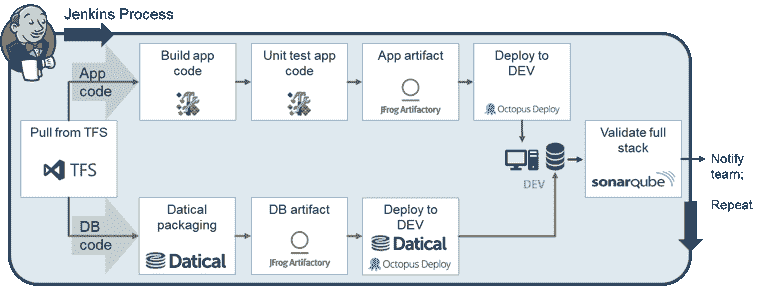

# 将 DevOps 带到殖民地生活的全部堆栈中

> 原文：<https://thenewstack.io/bringing-devops-to-the-full-stack-at-colonial-life/>

 [科莱特·凯西

科莱特·凯西是 Colonial Life 的技术架构师，负责 32 个应用程序和 5 个数据库。她拥有超过 20 年的 IT 行业经验，涉及广泛的软件开发领域，从大型机到。Net，到 COM+，移动，物联网。她热衷于在 Colonial Life 的 scrum 团队中培养和推广敏捷开发实践和 DevOps。](https://www.coloniallife.com/) 

[Colonial Life](https://www.coloniallife.com/)(Unum Group 的子公司)是一家拥有近 80 年历史的自愿福利提供商，它发现自己处于许多老牌组织最近发现自己所处的位置:处于改进软件交付的关键努力之中。这一计划是由来自企业的压力推动的，企业要求更快、更高质量地交付软件，以保持在市场中的竞争力。作为回应，我们寻求敏捷和 DevOps 工具和实践，我们知道自动化将是我们现代化工作的关键。

在转型之前，我们在软件生命周期和交付中，在我们的开发、验收和生产环境中构建和部署新代码主要是一个手动过程。如果出现任何问题，所有的构建和部署工作都必须手动重做。

我们有一个以微软为中心的软件堆栈，这意味着在应用程序代码方面，动态链接库(dll)是从源代码构建的，部署到每个环境是使用脚本手动完成的，该脚本会复制 dll。数据库方面甚至更糟，因为 SQL Server 数据库管理员(DBA)必须手动将 SQL 脚本部署到每个环境中。所有这些手动干预使得整个过程充满风险、不可靠且缓慢。

为了了解规模，我们最大的部署有 900 多个不同的应用程序版本脚本，必须由 DBA 针对数据库执行。考虑到手动工作的范围，数据库部署过程中的步骤被意外跳过或未完成是很常见的，这导致了必须进行分类和解决的生产问题。更糟糕的是，部署窗口通常在深夜或凌晨，数据库管理员可能不得不同时支持其他应用程序的多个版本，因此他们非常紧张。事情需要改变。

2016 年，我们开始了敏捷转型，目标是让业务更频繁地发布，以更高的速度、质量和可靠性为最终用户提供价值，并让我们的工程师有更多时间花在功能开发和交付上。

我们从改造我们最大的创收应用程序开始，该应用程序负责将用户登记到我们的保险计划中。这款应用程序不仅对我们的业务至关重要，而且也是我们整个产品组合中最难管理的应用程序之一——通常在周末需要 15 到 17 个小时的手动工作才能发布。虽然从一个不是为自动化测试和部署时代而构建的大型遗留应用程序开始似乎有悖常理，但我们认为如果这个应用程序可以现代化，那么我们产品组合中的其他应用程序也可以现代化。

> 通过在整个堆栈中实现所有这些自动化，我们能够将构建数量增加三倍，并在较低的环境中进行数量级的部署。就整体业务成果而言，我们已经从每年三次痛苦、高风险的手动发布发展到七次自动化部署。

在承担使我们的注册应用程序现代化的巨大任务时，我们面临着许多质疑。毕竟，我们正在改变已经存在多年的成熟流程，而许多对现有流程感到满意的工程师不愿意改变。为了建立对新工具和流程的信心，我们设法找到了一个即将开始一个完全独立的项目的小型绿地应用团队，并决定将新技术和流程应用到该团队，与我们为 enrollment 应用程序所做的工作并行。

这种方法成为了我们的试验场，并取得了很好的回报——虽然 greenfield 团队不确定是否能以如此不同的方式做事，但起初，他们很快实现了生产力和质量的大幅提高。这一小小的胜利为我们赢得了一批内部支持者，他们帮助我们赢得了组织中其他人的必要支持，让我们能够将这些新工具和流程用于更新 behemoth enrollment 应用程序的更大项目。

关于实际的持续集成(CI)过程，我们投资了 Jenkins、Datical、JFrog Artifactory、Octopus Deploy 和 SonarQube。开发人员继续分别使用 Visual Studio 和 SQL Server Management Studio 进行应用程序和数据库开发，我们继续使用 Team Foundation Server (TFS)进行源代码管理，使用 CA 的 Agile Central 进行积压管理。

我们的 CI 流程现在有两个部分。第一部分是每夜的 Jenkins 构建，允许团队可以获得整个堆栈的每日反馈——包括应用程序和数据库代码更改。第二部分是每当应用程序代码被检入时发生的触发的 Jenkins 构建。由于应用程序代码的构建速度更快，这些触发式构建为开发人员提供了工作日期间应用程序代码更改的更即时的反馈。

殖民生活的夜间 CI 流程图

通过在整个堆栈中实现所有这些自动化，我们能够将构建数量增加三倍，并在较低的环境中进行数量级的部署。就整体业务成果而言，我们已经从每年三次痛苦、高风险的手动发布发展到七次自动化部署。

经历了这段旅程后，我最好的建议是首先将自动化构建和部署步骤引入到您的软件管道中，并推迟需要更大提升的更大的重新架构项目。与使用先进的微服务和容器架构重写您的传统应用相比，您将通过管道自动化更快地实现价值。

也就是说，我还建议评估您公司的期望和需求——对于 Colonial Life，将交付价值的构建数量增加三倍，足以证明推迟重新架构工作是合理的，但必要的结果和里程可能对其他人有所不同。重点是首先解决较小的管道自动化项目，评估提升——您可能会对 ROI 感到惊喜，然后再致力于更大的重构项目。

我们在殖民地生活的下一步是什么？扩展我们在整个企业中最大的应用程序之一上验证的模式，并为我们产品组合中的所有其他应用程序带来同样的提升。向前向上！

CloudBees 是新堆栈的赞助商。

通过 Pixabay 的特征图像。

<svg xmlns:xlink="http://www.w3.org/1999/xlink" viewBox="0 0 68 31" version="1.1"><title>Group</title> <desc>Created with Sketch.</desc></svg>