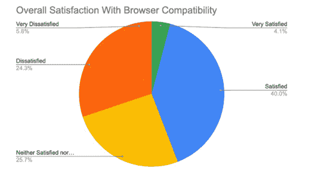
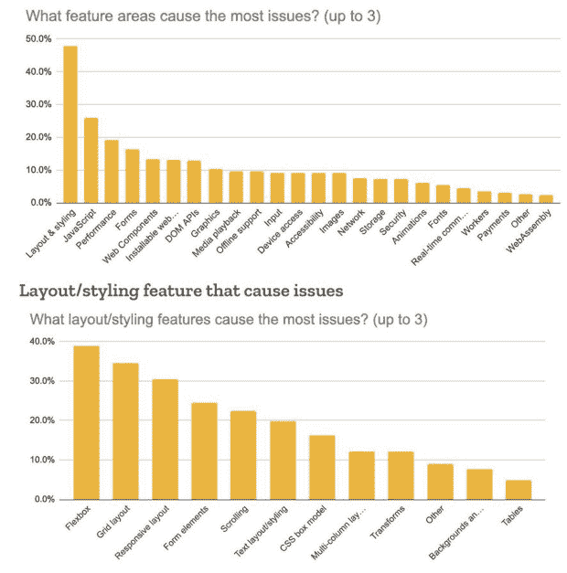
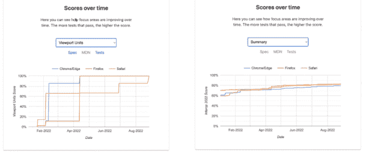
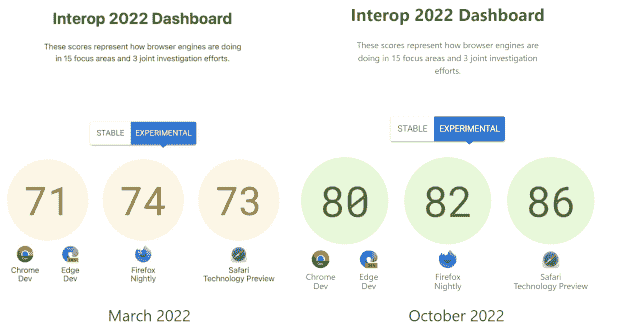

# 浏览器供应商旨在通过 Interop 2022 治愈开发人员的痛苦

> 原文：<https://thenewstack.io/browser-vendors-aim-to-heal-developer-pain-with-interop-2022/>

> web 应该是一个平台，在这个平台上，多种实现交付相同的标准:现在有一个新的重点，让浏览器实际交付互操作性。

互操作性一直是 web 的希望和挫折，但是让不同的浏览器做同样的事情对于许多 web 开发人员来说仍然是繁重的。考虑到 W3C、TC39 和其他 web 标准流程都需要在多种浏览器和引擎中实现，提案才能成为标准，您可能会期望所有浏览器对基于 web 标准的功能表现相同。实际上，考虑到这些浏览器是由不同的厂商开发的，并且它们必须在不同的设备上运行，在这些设备上并非一切都是一样的，行为可能会有令人沮丧的不同。

在像 [MDN 开发者需求评估](https://hacks.mozilla.org/2020/12/2020-mdn-web-developer-needs-assessment-now-available/)这样的调查中，Web 开发者经常将浏览器之间的兼容性和互操作性问题称为他们最大的挫折(在[浏览器兼容性数据报告](https://github.com/mdn/browser-compat-data)中探索这些研究的数据)。

MDN 的调查结果显示了开发人员对浏览器兼容性问题的失望程度。

[Interop 2022](https://github.com/web-platform-tests/interop) 是一个正在进行的项目的一部分，该项目旨在减少所有 web 开发人员的痛苦:“我们如何减少世界上每秒钟 web 开发人员流泪的次数，”谷歌内部 web 平台团队的软件工程师 Philip jgenstedt 问道，他只是在开玩笑。

## **痛苦之网**

以谷歌的开发者为例，谷歌网络平台团队主管 Rick Byers 称其为“我们网络平台最大的支持者之一”。当他们转而使用 iOS 版 Gmail 而不是网页版 Gmail 时，那个人的反馈是:“不再觉得我一直在与平台作斗争，这种感觉真好”。

这种反应让开发浏览器的人感到惊讶，因为正如[亚历克斯·罗素](https://www.linkedin.com/in/alexrussell/)(拜尔斯的前同事，现在在微软从事网络平台工作)[在 2017 年的聚合物峰会上指出的那样](https://www.youtube.com/watch?v=y-8Lmg5Gobw)，“浏览器工程师往往不会从内心感受到我们作为网络开发人员所感受到的问题。”

Igalia 开发者倡导者 Brian Kardell 指出，开发者不太关心抽象的标准:“他们想知道如果我尝试使用它，我会感到痛苦吗？”

> “作为一名开发人员，无论你认为你想要什么，你想要的第一件事是所有网站实际上工作相同。”

相反，他们会在像 Flexbox 这样广泛使用的特性中遇到互操作性问题。“Flexbox 已经存在了非常非常长的时间，人们一直在使用它，”Kardell 说，他估计 [HTTP Archive](https://httparchive.org/) 上 70%的网站使用 Flexbox，并且有 1000 个漏洞需要修复。

他指出，运行测试和修复错误以获得完美的互操作性的“最后一英里”工作并不令人兴奋，而且需要付出很多努力。“跨不同操作系统的不同架构很难实现完美的互操作性。”

## **认真对待考试**

拜尔斯将开发者在构建网络时遇到的大部分挫折归咎于浏览器制造商如何自然地关注他们自己的浏览器而不是网络本身。“我们在 Chrome 团队的工作不是开发 Chrome。我们的工作是帮助更大的社区建立网络。”

改变优先级使得如何改善 web 开发人员的体验变得更加清晰。“如果我们想让开发者把它当作一个严肃的平台来对待，我们就需要真正以应有的工程原则来对待这个网络平台。”

“开发商感到沮丧并不奇怪。web 表现不一致。我们没有应用我们的工程专业知识。软件工程的第一步是，如果你想要可靠性，你应该有一个连贯的测试套件:网络没有连贯的测试套件。”

> genstedt 很快指出，浏览器测试套件确实存在。"问题是我们对此并不太关心。"

测试经常发生在特性发布之后，而且经常是外包的。

拜尔斯回忆道，一旦 Chrome 团队意识到他们确实关心网络平台测试，并在 BlinkOn 宣布了一个关于网络可预测性的会议，其他一直倡导测试的浏览器代表就热情地接近了他们。

“我们不需要把一块大石头推上山，我们只需要说我们会认真对待这件事，整个社区以一种非常积极和建设性的方式走到一起，说，当然，这是设计事情的正确方式。我们本质上都是工程师，显然，我们只是在工程上丢了球。让我们聚在一起，作为一个社区一起工作，用一个一等公民的通用测试套件来真正设计 web。”

该社区创建了专注于互操作性的会议、邮件列表、仪表板和 bug 跟踪器:genstedt 描述为“尝试不同的事情，看看什么会起作用，以激励我们所有人为 web 开发人员改进 web 平台”。其中之一是谷歌、Igalia 和微软合作的 [Compat 2021](https://web.dev/compat2021/) 项目(后更名为 Interop 2021 ),涵盖了 MDN 调查和 Mozilla 非常全面的[浏览器兼容性报告](https://insights.developer.mozilla.org/reports/mdn-browser-compatibility-report-2020.html)中强调的五个特定领域，作为开发人员的特殊问题:纵横比、Flexbox、网格、粘性定位和转换。

这个想法是为了解决这样的问题，即有一个标准被明确规定并被广泛接受，足以有多种实现，但这些实现有缺陷——或者只是不完整。

MDN 浏览器兼容性报告显示了一些非常具体的挫折。

“根据我们对 web 开发人员痛点的理解，我们挑选了一些似乎有问题的领域，”他解释道。对于其中的每一个，他们都查看了规范和相关测试，以得出一个指标来跟踪不同浏览器实现的表现。

## **参与和优先事项**

Interop 2022 汇集了更多的参与者——增加了苹果和 Mozilla，以及 [Bocoup](https://bocoup.com/) (一家特别关注可访问性和包容性的咨询合作公司)——同样，重点是改善 web 开发人员生活的功能，在这方面，技术已经成熟，影响显而易见，而不是试图解决 [Web 平台测试](https://wpt.fyi/results/?label=master&label=experimental&aligned)(涵盖处于许多不同开发阶段甚至实验阶段的标准和提案)中的所有问题。

正如苹果公司 WebKit 网络兼容性团队的负责人 Brent Fulgham 在 T2 的推特上所说，“Interop 2022 代表了我们(网络引擎维护者、标准团体和网络开发者)瞄准的技术，作为良好的网络兼容性和互操作性的最重要的标准。”

微软的一位发言人告诉我们，Interop 2022 是关于“确保 web 开发人员可以依赖这些标准，并向他们的客户提供创新体验”。

谷歌的 genstedt 强调，Interop 项目是关于共同利益的参与和相互共识。“我们认识到，我们不能强迫对方做我们不想做的事情。这不是努力让 Mozilla 实现一个我们喜欢的东西，但他们不喜欢；那是不可能的。”

“我们没有试图协商一份共同的优先事项清单。我们只是走到一起，看看我们能达成什么共识；如果有人不想说，为什么那不是过程的一部分。”

> “哪些事情是我们可以共同认同的，哪些是我们将共同关注的重要事情？这些都是我们都想投资的事情，如果我们同时合作，我们可以做得更好。这是一个双赢的局面。”

互操作性不仅仅是关于改进互操作性的良好意图，而是可测量的:同样，它具有由自动化测试生成的度量，清楚地表明需要做多少工作以及已经取得了多少进展。在[互操作仪表板](https://wpt.fyi/interop-2022)上的分数是通过对 2022 年和 2021 年的优先级进行加权计算得出的，这反映了开发者明确想要使用的技术。“我们想确保这是在衡量该特性的真实互操作性，”他指出。

但这些指标也意味着这项工作是在公开场合有效完成的。选择重点领域意味着决定“这是否足够强大，以至于我们想要，如果不完全致力于做工程工作，但愿意公开这个指标，如果我们不做这项工作，会让我们看起来很糟糕。”

以协调的方式致力于互操作性意味着不仅所有的浏览器都在改进，而且它们也在一起改进。

## 【2022 年的 10 个新重点领域

genstedt 说，通过网络平台测试 repo 从开发人员那里收集的建议和从最终用户那里收集的 [bug 报告](https://webcompat.com/)都是关于浏览器之间的实现差异，而[CSS 研究的状态](https://web.dev/state-of-css-2021/)在选择 2022 年的十个新重点领域中发挥了重要作用，“因为那里我们有最多和最好的数据”。

完整的列表是层叠层、颜色空间和功能、包容(这是解决许多开发人员一直要求的[容器查询](https://drafts.csswg.org/css-contain-3/#container-queries)支持的第一步)、对话框元素、表单修复(就像 [Open UI](https://open-ui.org/) 正在做的使表单跨浏览器以相同方式工作的工作)、滚动、子网格、排版和编码、视口单元和 [Web Compat](https://wpt.fyi/results/?label=experimental&label=master&product=chrome&product=firefox&product=safari&aligned&view=interop&q=label%3Ainterop-2022-webcompat) (不是特定的功能或技术， 而是各种浏览器中已经发布的各种功能的已知问题的集合，但这些功能存在错误或与标准不匹配，从而阻止了网站按照设计的方式工作)。

“这是一个混合体，既修复了那些稍有破损的旧东西，也修复了一些更具前瞻性的东西，尽管我们已经有了一些实施经验。我们不是在这里制定新的标准，我们不是在做完全全新的事情，”genstedt 说。“我们优先考虑的所有事情都是在年初有一些实施经验的事情，我们认为可以通过加速和使它们随处可用来受益。”

“有些事情我们每个人都认为很重要，但可能没有达到我们需要做更多工作才能达到的目标。如果我可以这么说的话，我们剩下的是一套东西，我认为当它随处可用时，会让开发人员相当高兴。”

例如，CSS [子网格](https://wpt.fyi/results/css/css-grid/subgrid?label=master&label=experimental&product=chrome&product=firefox&product=safari&aligned&view=interop&q=label%3Ainterop-2022-subgrid)已经在 Firefox 中，使得在复杂的网格布局中对齐对象更加容易；Safari 已经在 2022 年实现了支持，它将“很快”转向 Chrome，在 Edge 中发布子网格(基于 Chrome)是微软主要关注的 Interop 2022 工作的一部分。

视窗单元是另一个很好的例子，说明了在互操作中增加一个焦点区域可以带来多大的不同。开发人员在浏览器兼容性报告和 CSS 调查中反复抱怨视窗单元，因为它们在移动设备上工作得不好，在移动设备上，当你滚动页面时，你必须考虑地址栏和浏览器视窗大小的变化。[动态视口单元](https://www.w3.org/TR/css-values-4/#viewport-relative-lengths)会处理这个问题，但是没有浏览器支持。“对每个人来说，这实际上是从零开始的，但我们可以看到，在很短的时间内，它从零变成了 100%。genstedt 指出:“这通常不会在一年内发生。

> “这样更有效。我们没有做更多的工作。通过同时关注它，我们可能会做更少的工作。做这种协调，简直是双赢。”

滚动是移动给开发者带来许多不同的互操作性问题的另一个领域。“在 web 开发人员看来，当你触摸手机并在浏览器之间移动手指时，会发生什么并不是超级一致的:地址栏会发生什么，会触发什么事件，不同事物的宽度和高度会报告给 JavaScript 什么值？”

Interop 2022 专注于过度滚动行为——当你一直向下滚动页面并开始拖动时会发生什么——以及滚动捕捉，用于在产品传送带上滑动。因为移动和桌面浏览器之间的互操作性不太好，开发人员必须用 JavaScript 编写代码，这就不能提供流畅的体验。

拜尔斯指出，一般来说，触摸、点击和滚动行为是将浏览器作为产品来构建的一个例子，而不是为了获得高质量的网络平台而进行工程设计。

“当我们都开始把我们的桌面浏览器和桌面浏览器引擎移植到移动设备上时，我们认为这是一个浏览器工程问题，而我们并没有像我们应该做的那样认为这是一个平台工程问题。我们都推出了适用于移动设备的浏览器，却没有真正思考:我们需要如何更新标准？”

为了让网络在移动设备上运行良好，浏览器需要把滚动放到一个单独的线程上。“要想在低功耗移动设备上实现流畅的滚动，唯一的办法就是我们为 JavaScript 异步滚动。拜尔斯说:“这从根本上改变了网络平台的模式，我认为我们没有为它更新任何一个规范。浏览器增加了一些功能，比如缩放、隐藏地址栏以及屏幕上点击和触摸的不同方式，但标准不一定要改变来匹配。

"我们在标准、互操作性和测试套件方面积累了大量的债务."

他认为，像 Interop 这样的项目正在帮助手机行业迎头赶上。“拥有一个可互操作的开放平台的代价是它的追赶速度很慢，但我们最终会认识到，移动网络平台是一个严肃的计算平台。这不仅仅是因为我们有好的浏览器，而且在底层平台上，我们越来越有标准，我们有你可以依赖的一致行为。仍有工作要做，但我认为我们已经开始认识到，移动网络现在是一个可预测的可靠平台，你可以像十年前在桌面上一样押注你的业务。”

## **一起期待**

关于[色彩空间和功能](https://wpt.fyi/results/css/css-color?label=master&label=experimental&product=chrome&product=firefox&product=safari&aligned&view=interop&q=label%3Ainterop-2022-color)的工作非常重要，因为虽然显示器越来越好，但色彩管理和利用更宽色域的规范却没有跟上。 [CSS 颜色模块](http://drafts.csswg.org/css-color-5)正在[试图寻址那个](https://darker.ink/writings/Towards-richer-colors-on-the-Web)。genstedt 说:“我们的显示器显示色彩更加生动，渐变效果也比以前更好。互操作的工作将帮助浏览器制造商弄清楚“我们实际上如何在我们的浏览器中实现它，而不使用更多的内存。”如果没有这个功能，页面可能会退回到不太鲜艳的颜色；有了它，“设计师将利用这一点做出更有活力的设计”。

从 2021 年开始，五个重点领域的工作也在继续:Safari 继续追赶纵横比、flexbox、grid 和 transforms。但更重要的是，与六个月前相比，所有四种浏览器在所有互操作优先级上更加接近平等(这已经是 Compat 2021 之前互操作性水平的一大进步)。

拥有清晰的指标意味着您可以看到互操作性的进展有多好。

不过，Interop 2022 的三个重点领域略有不同。genstedt 称之为“调查工作”,而不是专注于浏览器已经准备好前进并可以立即开始工作的领域，这些领域是开发人员或网络用户看到问题但还没有一个共享测试套件用作衡量标准的领域。“我们已经说过，让我们一起努力，找出哪里缺乏规格，我们需要编写什么测试，这样明年我们就可以将这些作为 2023 年的重点领域，如果证据确凿的话。”

视口测量就是一个很好的例子。genstedt 说:“我们知道浏览器之间在处理这些 JavaScript APIs 和具有触发和 CSS 单元的事件方面存在差异，”但自动化测试尚未完成，因此来自不同浏览器的工程师们合作解决了一系列需要解决的问题。“我将把这些带给 CSS 工作组，这样我们就可以完善这些规范，然后下次再编写测试。”

> “把它想象成一个蹦床。当我们知道某件事很重要，但我们还不知道如何去做时，这就像是下一次把它包括进来的垫脚石。”

这些更具推测性的调查确实有助于互操作性度量，但是所有浏览器都得到了相同的分数，强调了在新标准和测试上取得进展是团队努力的结果。

“并不是每个人都决定去推动，”拜尔斯建议道。“我们正在努力寻找共同感兴趣的领域，这样我们就可以就值得推进的事情达成一致。”

“这是我喜欢在网络平台上工作的原因之一，当你可以找到关心同样事情的盟友时，你可以通过说‘嘿，我们都想完成这件事，让我们同意我们想完成这件事，让我们完成它’来移山，我们都受益。”

“网络的总价值不仅仅是各个部分的总和，也不仅仅是我们每个人可以单独做的事情。最终，我认为像网络平台这样的开放平台的强大之处在于，它比任何一家公司拥有的平台都要强大得多，也更有弹性。”

<svg xmlns:xlink="http://www.w3.org/1999/xlink" viewBox="0 0 68 31" version="1.1"><title>Group</title> <desc>Created with Sketch.</desc></svg>