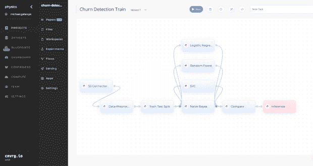

# 用人工智能蓝图建立一个客户流失检测系统

> 原文：<https://thenewstack.io/build-a-churn-detection-train-with-ai-blueprints/>

我的第一篇 [AI 蓝图教程](https://cnvrg.io/recommendation-system/)讲述了推荐系统的类型，以及如何使用蓝图而不用编写模型代码来创建一个推荐系统。其中一个教训是创建和扩展 ML 管道是多么容易。人工智能蓝图不仅可以用于创建推荐系统，还可以用于 [NLP](https://cnvrg.io/twitter-sentiment-analysis/) 、[计算机视觉](https://cnvrg.io/webinars-and-workshops/build-ocr-text-detection-application/)、异常检测等等。这个特别的教程深入研究了什么是客户流失，以及如何使用人工智能蓝图来清理和验证数据，以便训练多个模型来预测客户是否可能流失。

## 什么是客户流失？

客户流失可以定义为在特定时间内停止使用公司产品的客户的百分比。跟踪客户流失很重要，因为传统上，获得一个新客户的成本要比留住一个现有客户的成本高得多。此外，回头客比新顾客更有可能消费更多。

客户流失率可以用下面的公式计算。

### 示例:计算客户流失率

假设你**开始**一年有 1000 个客户，而**在这段时间内失去了** 95 个客户。下面的计算表明，客户流失率为 9.5%。

公司试图保持尽可能低的流失率。问题是预测客户是否会流失很困难，可能需要大量的数据科学专业知识和领域知识。这就是人工智能蓝图可以发挥作用的地方。

## 使用人工智能蓝图预测客户是否会流失

描述:这是我们将在本教程中使用的管道。

在本教程中，我们将使用人工智能蓝图来清理和验证数据，以便训练多个模型来预测客户是否可能根据他们的个人特征流失。上图显示了一个[流，在 cnvrg 中，](https://app.cnvrg.io/docs/core_concepts/flows.html#flows-components)是一个生产就绪的机器学习管道，允许您构建复杂的 DAG(有向无环图)管道，并通过拖放来运行您的 ML 组件。

在创建客户流失预测器之前，重要的是后退一步，简要提及人工智能蓝图的类型。

三种常见的蓝图类型是:

*   推断:这些都是预先训练好的，随时可以使用。您需要做的只是将蓝图一键式部署到您自己的基础架构中。这对于对象检测、文本检测和情感分析等用例非常有用。
*   培训:这些类型的蓝图要么用于微调，要么用于培训模型。这些在您的特定数据上表现最佳。你需要给它提供你自己的数据集。在培训中，蓝图将尝试找到最适合您的数据的最佳模型，并使其在流程结束时易于部署。
*   组件:它允许您将连接器与模型和部署选项混合搭配，并创建您自己的故事。

本教程将利用培训蓝图。

### 选择蓝图

为了能够跟随这部分教程，你需要[注册或者](https://metacloud.cloud.cnvrg.io/sign-up)登录 cnvrg.io 元云。一旦你创建了一个用户名，你会看到一个类似于下图的屏幕。

下一步是选择蓝图。

接下来，输入流失检测训练。

点击客户流失检测培训。您将看到一个类似于下图的屏幕。

接下来，点击使用蓝图，然后继续。你会看到一个流程图。

该蓝图由以下组件组成:

*   S3 连接器用于从 S3 获取数据。本教程使用已经提供的预构建数据示例路径，因此您无需上传自己的数据集。[其他蓝图教程已经展示了如何上传和使用你自己的数据集](https://cnvrg.io/recommendation-system/)。
*   数据预处理确保数据格式正确。它还处理空值。
*   [训练测试分割](https://builtin.com/data-science/train-test-split)将数据分割成训练集和测试集。这将有助于评估算法的性能。
*   分割数据后会出现多模型训练。这个蓝图训练朴素贝叶斯、SVC、随机森林和逻辑回归。自然，这很容易调整到更多或更少的模型。
*   比较组件将模型与所有算法之间的公共度量进行比较。
*   推理是可用于部署的组件。这允许您通过将模型用作 API 来获取模型并从中获得预测。

### 运行蓝图

点击“运行

根据您的元云帐户，可能需要几分钟时间来运行。如果您看到所有事情的状态都是成功的，那么您已经成功地创建了一个客户流失检测器！

上图只是显示蓝图运行成功。从这里，您可以查看客户流失概率。在下图中，较高的预测概率意味着客户更有可能流失。负责客户流失的业务部门可以利用这种洞察力，通过额外的支持来培养或尝试重新吸引客户。

## 结论

使用人工智能蓝图，构建客户流失检测器很容易！如果你想了解更多关于人工智能蓝图或元云的信息，请考虑参加我们的[下一场网络研讨会](https://cnvrg.io/webinars-and-workshops/)。如果你有任何问题或者想分享你正在用 AI Blueprints 建造的东西，你可以在 [cnvrg.io 社区](https://community.cnvrg.io/)发帖或者在 Twitter 上提到我们 [@cnvrg_io](https://twitter.com/cnvrg_io?lang=en) 。

<svg xmlns:xlink="http://www.w3.org/1999/xlink" viewBox="0 0 68 31" version="1.1"><title>Group</title> <desc>Created with Sketch.</desc></svg>