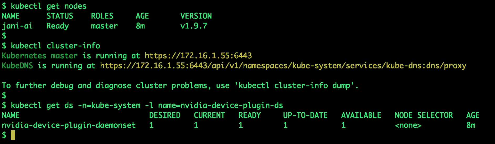
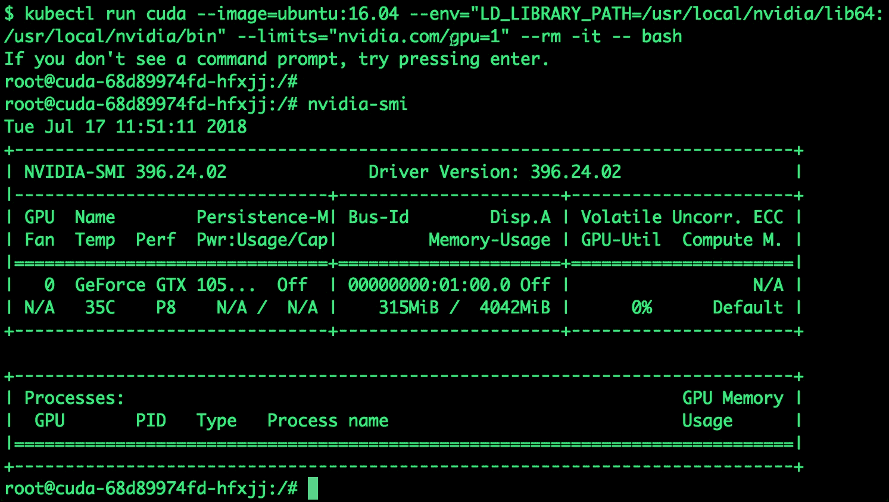

# 基于 Kubernetes 和 Nvidia GPU 搭建机器学习实验床

> 原文：<https://thenewstack.io/build-a-machine-learning-testbed-based-on-kubernetes-and-nvidia-gpu/>

英伟达 GPU 已经成为运行机器学习作业的事实标准。从入门级显卡到云中的 Pascal 100 GPUs，数据科学家正在依赖英伟达进行训练和推理机器学习模型。

在基础设施方面，Kubernetes 已经成为运行现代应用程序的标准。它已经从运行无状态工作负载发展到事务数据库。

Nvidia 一直在缓慢但稳步地增加对容器和 Kubernetes 的支持。今天，可以从容器和 Kubernetes pods 访问 GPU。几乎所有的容器即服务(CaaS)提供商都通过 Kubernetes 公开 Nvidia K80 和 P100 GPU。

即使我们可以在公共云中访问 GPU，也没有什么比构建我们自己的基于 GPU 的运行 Kubernetes 的开发机器更好的了。根据您的预算，您可以选择从入门级的 [GTX 1050 Ti](https://www.geforce.com/hardware/desktop-gpus/geforce-gtx-1050-ti/specifications) 系列到高端的[泰坦 X GPU](https://www.geforce.com/hardware/desktop-gpus/geforce-gtx-titan-x)来驱动您的测试平台。

我最近基于不起眼的 [GeForce GTX 1050 Ti](https://www.geforce.com/hardware/desktop-gpus/geforce-gtx-1050-ti/specifications) GPU 建造了一台定制机器。作为 Kubernetes 的粉丝，我想运行一个单节点集群来运行我的机器学习实验。这绝不是公共云中的 K80s 和 P100s 所能提供的动力。但是，这足以探索基于 GPU 的深度学习框架，如 TensorFlow 和 Caffe。

在本教程中，我将向您介绍构建一个 GPU 支持的单节点 Kubernetes 集群的步骤。

Nvidia GPUs 上的 Kubernetes 在预览版中可用。请注意，生产环境不建议使用这种配置。

## 先决条件

您需要为您的 GPU 安装 Ubuntu 16.04 和最新的 Nvidia 驱动程序。然后，您必须安装和配置最新的 CUDA 和 cuDNN 软件。网上有很多指南可以帮助你完成这个步骤。

确保命令 **nvidia-smi** 工作正常，没有任何错误。它应该会显示类似于下面截图的输出。


一旦安装和配置了 GPU 软件，设置 Nvidia-Docker。对于逐步说明，请遵循我几周前在新堆栈上发布的[指南](https://thenewstack.io/primer-nvidia-docker-containers-meet-gpus/)。

当您运行命令 **nvidia-docker** 时，您应该会看到以下输出:


现在我们已经具备了先决条件，让我们继续安装 Kubernetes。

## 在 Nvidia GPUs 上安装 Kubernetes

在 GPU 上安装和配置 Kubernetes 的过程与常规设置没有太大不同。Nvidia 已经为 Kubernetes 构建了 GPU 专用的容器图像，将使用这些图像来代替标准图像。

我们将使用 Nvidia 专用的 [kubeadm](https://kubernetes.io/docs/reference/setup-tools/kubeadm/kubeadm/) ，这是在 GPU 上安装 Kubernetes 集群最简单的工具。

首先将官方 GPG 密钥添加到您的机器中，并更新软件包索引。

```
$  curl  -s  https://packages.cloud.google.com/apt/doc/apt-key.gpg | sudo apt-key add -
$  curl  -s  -L  https://nvidia.github.io/kubernetes/gpgkey | sudo apt-key add -
$  curl  -s  -L  https://nvidia.github.io/kubernetes/ubuntu16.04/nvidia-kubernetes.list |\
sudo tee  /etc/apt/sources.list.d/nvidia-kubernetes.list
$  sudo apt-get update

```

下一步将安装 Nvidia 提供的 Kubernetes 组件的特定版本。

```
$  sudo apt install  -y  kubectl=1.9.7+nvidia kubelet=1.9.7+nvidia kubeadm=1.9.7+nvidia

```

注意 Nvidia 如何构建了 *kubelet* 和 *kubeadm* 的并行实现。

在我们继续其余的配置之前，我们需要禁用交换检查。因为我们正在用有限的资源构建一台开发机器，所以禁用交换内存不是一个好主意。相反，我们将在配置文件中添加一个标志来忽略交换内存。

编辑下面的配置文件，将参数添加到 KUBELET_EXTRA_ARGS 变量中。

```
$  sudo vim  /etc/systemd/system/kubelet.service.d/10-kubeadm.conf
# Add this to parameter --fail-swap-on=false

Environment="KUBELET_EXTRA_ARGS=--authentication-token-webhook --fail-swap-on=false"

```

让我们重新启动 kubelet 来应用更改。

```
$  sudo systemctl daemon-reload
$  sudo systemctl start kubelet

```

您可以使用以下命令来检查 kubelet 的状态。如果 kubelet 初始化失败，也不用担心。此错误是由于缺少 CA 证书造成的，该证书是在下一步使用 kubeadm 初始化集群时生成的。

```
$  sudo systemctl status kubelet

```

现在，我们准备初始化主机。运行下面的命令，等待几分钟，让主服务器启动。这一步将完成初始化主机的繁重工作。

```
$  sudo kubeadm init  --ignore-preflight-errors=all  --config  /etc/kubeadm/config.yml Swap

```

如果一切顺利，您应该会看到下面的输出。

```
…..

[addons]  Applied essential addon:  kube-dns
[addons]  Applied essential addon:  kube-proxy

```

您的 Kubernetes 主机已成功初始化！

要开始使用您的集群，您需要以普通用户的身份运行以下命令:

```
mkdir  -p  $HOME/.kube
sudo cp  -i  /etc/kubernetes/admin.conf  $HOME/.kube/config
sudo chown  $(id  -u):$(id  -g)  $HOME/.kube/config

```

现在，您应该为集群部署一个 pod 网络。

运行" kubectl apply -f [podnetwork]。yaml”以及本文档页面上列出的[选项之一:](https://kubernetes.io/docs/concepts/cluster-administration/addons/)

现在，您可以通过在每个节点上以 root 用户身份运行以下命令来加入任意数量的机器:

```
kubeadm join  --token c63098.fde788f481e97e77  172.16.1.55:6443  --discovery-token-ca-cert-hash sha256:585fcc6f3290873d72056b06c05901771ef12b74a4ce1d2a2ec8e8cb518fd6e9

```

这是主模块已经准备好的确认。由于我们运行的是单个节点，因此没有额外的节点需要添加。

将配置文件复制到。kube 文件夹。

```
$  mkdir  -p  $HOME/.kube
$  sudo cp  -i  /etc/kubernetes/admin.conf  $HOME/.kube/config
$  sudo chown  $(id  -u):$(id  -g)  $HOME/.kube/config

```

因为我们刚刚设置了一个单节点集群来在主节点上运行作业，所以我们需要告诉 Kubernetes 在主节点上调度作业。运行以下命令来配置此选项。

```
$  kubectl taint nodes  --all node-role.kubernetes.io/master-

```

我们还有几个步骤要完成。让我们安装法兰绒作为覆盖网络，这是必要的豆荚互相交谈。

```
$  kubectl apply  -f  <a  href="https://raw.githubusercontent.com/coreos/flannel/v0.9.1/Documentation/kube-flannel.yml">https://raw.githubusercontent.com/coreos/flannel/v0.9.1/Documentation/kube-flannel.yml</a>

```

我们现在已经准备好测试集群了。



注意，访问底层 GPU 所需的插件被部署为 Kubernetes daemonset，可以通过下面的命令
看到

```
$  kubectl get ds  -n=kube-system  -l  name=nvidia-device-plugin-ds

```

让我们做最后的检查，看看我们是否可以从 Kubernetes pod 访问 GPU。我们将运行带有几个附加参数的标准 Ubuntu 16:04 Docker 映像。

```
$  kubectl run cuda  --image=ubuntu:16.04  \
--env="LD_LIBRARY_PATH=/usr/local/nvidia/lib64:/usr/local/nvidia/bin"  \
--limits="nvidia.com/gpu=1"  --rm  -it  --  bash

```



你可以很容易地扩展这个场景，在 Kubernetes 上运行 Nvidia DIGITS 来训练高级神经网络。

本演练涵盖了在 Nvidia GPU 上配置 Kubernetes 的基础知识。在未来的文章中，我将介绍如何使用容器和 GPU 大规模训练机器学习模型。

<svg xmlns:xlink="http://www.w3.org/1999/xlink" viewBox="0 0 68 31" version="1.1"><title>Group</title> <desc>Created with Sketch.</desc></svg>