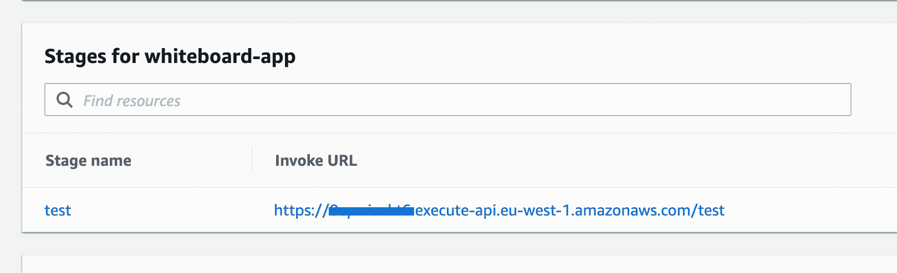

# 用 AWS Gateway 和 Lambda 构建一个无服务器 API

> 原文：<https://thenewstack.io/build-a-serverless-api-with-aws-gateway-and-lambda/>

API 是任何 web 应用程序的关键部分，有不同的开发和设计技术。无服务器是一种越来越受欢迎的方法，因为它的成本效益，可伸缩性和相对简单。作为领先的无服务器提供商，Amazon Web Services (AWS)为无服务器开发领域做出了巨大贡献，在本文中，我们将使用 AWS Lambda 和其他 AWS 服务解释一般的 API 实现概念。

## 为什么选择 AWS Lambda？

 [塞尔坎·奥扎勒

塞尔坎是桑德拉的联合创始人兼首席技术官。他在软件开发方面有 10 多年的专业经验，是 AWS 认证专家，拥有分布式环境专利。他主要从事无服务器架构、分布式系统和监控工具方面的工作。](https://www.linkedin.com/in/serkanozal/) 

AWS Lambda 是一个 AWS [服务](https://docs.aws.amazon.com/lambda/latest/dg/welcome.html)，负责运行特定的功能来响应特定的触发器——应用程序中发生的事件。这些触发器可能是 HTTP 调用；来自其他 AWS 服务的事件，如 S3、Kinesis 或 SNS 或者只是重复的预定事件。功能在某种类型的临时容器中执行，这些容器完全由 AWS 提供和扩展，因此开发团队可以将更多精力放在代码和功能上，而不是基础设施上。

另一个吸引人的特性是现收现付模式，在这种模式下，只对函数的总执行时间收费，不对空闲时间收费。当然，像任何其他服务一样，Lambda 也有[限制](https://blog.thundra.io/aws-lambda-limits-to-keep-in-mind-when-developing-a-serverless-application)，有时并不适合某些任务——比如非常长时间运行的任务、繁重的计算任务或者需要控制执行环境的进程。然而，AWS Lambda 通常非常适合实现 API。

## API 网关的角色

AWS API Gateway 是一项服务，允许开发人员创建和管理 HTTP 端点，将它们映射到特定的 AWS 资源，并配置自定义域、授权机制、缓存和其他[功能](https://docs.aws.amazon.com/apigateway/latest/developerguide/welcome.html)。API 网关是无服务器 API 的基础部分，因为它负责定义的 API 和处理对该 API 的请求的函数之间的连接。

### HTTP APIs

如前所述，API Gateway 包括许多功能和集成。然而，在某些时候，Amazon 意识到无服务器开发人员通常不需要所有这些特性，而是需要实现过程的一般简化。这可能就是为什么在 2019 年末，AWS [宣布了](https://aws.amazon.com/ru/blogs/compute/announcing-http-apis-for-amazon-api-gateway/)新的 HTTP APIs，这是一个精简版的 API 网关，它大大简化了开发者体验，并为无服务器 API 提供了更好的性能和更低的成本。尽管很简单，HTTP APIs 仍然支持一些重要的特性，比如为所有端点配置 CORS、JWT 集成、自定义域和 VPC 连接。

## 理解无服务器 API 概念

为了容易理解无服务器 API 实现的主要概念，我们将构建一个简单的“虚拟白板”应用程序的极简示例，它由两个简单的端点组成:用于在白板上写消息的 POST 和用于获取最近三条消息的 GET。我们还会考虑其他可能的特性——比如路径参数、CORS 和授权者——但是我们会保持最终的实现简单易懂。

### AWS DynamoDB

我们将通过使用 [AWS DynamoDB](https://aws.amazon.com/dynamodb/) 来存储消息，使我们的项目完全没有服务器。该数据库符合无服务器原则，易于使用，并提供了一个真正具有成本效益的按请求付费模式。DynamoDB 是 AWS 提供的 NoSQL 键值数据库，你的数据存储在 AWS 服务器上，完全由 Amazon 管理。

### AWS 无服务器应用程序模型

为了继续进一步的实现，您需要安装一个 AWS 帐户和 AWS 无服务器应用程序模型( [SAM](https://docs.aws.amazon.com/serverless-application-model/latest/developerguide/what-is-sam.html) )并配置。SAM 是用于创建、更新和管理无服务器应用程序以及应用程序运行所需的所有资源的工具。有了 AWS SAM，您不需要通过 web 控制台手动创建每个服务，而只需在特殊的模板文件中描述所有需要的东西。

安装完 CLI 后，导航到您将要工作的目录并运行以下命令:

```
$  sam init  -r  nodejs12.x  -n  whiteboard

```

*初始化新项目*

选择第一个选项，然后选择“从头快速开始”这将创建一个“白板”目录，其中包含最少的安装文件。

## 定义所需的资源

首先，打开 template.yml 文件，删除“资源”部分下面的所有内容。在转到 API 本身之前，让我们创建辅助资源。定义一个用来存储消息的 DynamoDB 表:

```
Resources:

  BoardMessagesTable:
      Type:  AWS::DynamoDB::Table
      Properties:
        TableName:  board-messages-table
        AttributeDefinitions:
          -  AttributeName:  partKey
            AttributeType:  S
          -  AttributeName:  createdAt
            AttributeType:  N
        KeySchema:
          -  AttributeName:  partKey
            KeyType:  HASH
          -  AttributeName:  createdAt
            KeyType:  RANGE
        ProvisionedThroughput:
          ReadCapacityUnits:  5
          WriteCapacityUnits:  5

```

*声明 DynamoDB 表*

上面的代码将告诉 AWS 创建一个 DynamoDB 表，其中属性“partKey”将是一个对所有记录都相同的分区键,“createdAt”将是一个范围键，允许按时间戳进一步排序。我们还可以在记录中添加其他键和值，但不要求您定义它们。

现在，在同一个文件中，就在前一个定义的下面，声明所有将来的端点和函数都将与之相关的 HTTP API。

```
BoardHttpApi:
    Type:  AWS::Serverless::HttpApi
    Properties:
      StageName:  Test
      CorsConfiguration:  True

```

*声明 HTTP API*

这个定义非常小而且简单，因为我们只包含了阶段名和 CORS 配置，实际上这也不是必需的。这说明了 API 的创建是多么简单和干净。然而，有许多可能的属性需要添加，例如授权函数的引用、要使用的域的定义、日志记录设置和其他属性。

### 定义 API 处理函数

最后，当我们定义了 API 之后，让我们也声明两个连接到其特定端点的函数。

```
PostMessageFunction:
      Type:  AWS::Serverless::Function
      Properties:
        Handler:  src/handlers/postMessage.handler
        Runtime:  nodejs12.x
        MemorySize:  128
        Timeout:  5
        Events:
          PostMessage:
            Type:  HttpApi
            Properties:
              ApiId:  !Ref BoardHttpApi
              Method:  POST
              Path:  /messages
        Policies:
          -  AmazonDynamoDBFullAccess

  GetMessagesFunction:
      Type:  AWS::Serverless::Function
      Properties:
        Handler:  src/handlers/getMessages.handler
        Runtime:  nodejs12.x
        MemorySize:  128
        Timeout:  5
        Events:
          GetMessages:
            Type:  HttpApi
            Properties:
              ApiId:  !Ref BoardHttpApi
              Method:  GET
              Path:  /messages
        Policies:
          -  AmazonDynamoDBFullAccess

```

*声明 POST 和 GET 请求的处理程序*

上面的代码非常自我描述:两个函数，其中一个将在对“/messages”路径的 POST 请求时被调用，另一个将在对同一路径的 GET 请求时被调用。这两个函数都有 128 MB 的 RAM 容量和 5 秒的超时时间。这些函数的代码位于/src/handlers/目录下的 postMessage.js 和 getMessage.js 文件中。我们现在就要创建它们。(请注意，我们在每个函数的“策略”部分提供了对 DynamoDB 的完全访问权限，这只是为了让事情变得更简单。)在实际项目中，您应该考虑提供更细粒度的访问。

## 函数编码

导航到/src/handlers 目录，在那里创建包含以下内容的文件:

postMessage.js

```
const AWS  =  require('aws-sdk');
const dynamodb  =  new AWS.DynamoDB();

exports.handler  =  async  (event)  =>  {
  const  {  body  }  =  event;
  try  {
    const  {  author,  text  }  =  JSON.parse(body);
    if  (!author  ||  !text)  {
      return  {
        statusCode:  403,
        body:  'author and text are required!'
      }
    }

    await dynamodb.putItem({
      TableName:  'board-messages-table',
      Item:  {
        msgId:  {  S:  'board'  },
        author:  {  S:  author  },
        text:  {  S:  text  },
        createdAt:  {  N:  String(Date.now())  }  // still expects string!
      }
    }).promise();
    return  {
 statusCode:  200,
 body:  'Message posted on board!',
    }
  }  catch  (err)  {
    return  {
 statusCode:  500,
 body:  'Something went wrong :(',
    }
  }
};

```

*发布请求处理人的代码*

该函数将运行以响应 POST 请求，并将解析来自请求主体的消息的作者和文本，并将数据保存到数据库中。它还用所有记录的相同值填充“partKey”属性。虽然通常这不是一个好的做法，但是对于这个例子来说这是完全可以的，因为它允许您在具有相同分区键的所有项目中按范围键进行排序。请注意，DynamoDB 总是希望保存字符串数据，即使属性的类型是数字。

getMessages.js

```
const AWS  =  require('aws-sdk');
const dynamodb  =  new AWS.DynamoDB();

exports.handler  =  async  ()  =>  {
  try  {
    const result  =  await dynamodb.query({
      TableName:  'board-messages-table',
      KeyConditionExpression:  'partKey = :partKey',
      ScanIndexForward:  false,
      Limit:  3,
      ExpressionAttributeValues:  {':partKey':  {  S:  'board'}}
    }).promise();

    return  {
      statusCode:  200,
      headers:  {
        'Content-Type':  'application/json',
      },
      body:  JSON.stringify(result.Items),
    }
  }  catch  (err)  {
    console.log(err);
    return  {
      statusCode:  500,
      body:  'Something went wrong :(',
    }
  }
};

```

*获取请求处理程序的代码*

在这个函数中，我们首先获取“partKey”等于“board”的记录，然后使用设置为“false”的“ScanIndexForward”对消息进行排序，以便最新的消息排在第一位，最后我们使用“Limit”属性将结果限制为三条消息。

## 部署

使用 AWS SAM 进行部署很容易，只需一个命令和一些输入就可以完成。导航到项目的根目录并运行以下命令:

*部署命令*

然后会要求您输入应用程序的名称和要使用的 AWS 区域。您还需要确认一些操作:

[](https://cdn.thenewstack.io/media/2020/08/13c96a08-image2.png)

填写并接受设置

完成所有确认后，部署将开始，您将看到所有的资源都被创建。这大约需要一分钟或更少的时间。

[](https://cdn.thenewstack.io/media/2020/08/027cef1b-image4.png)

要创建的资源及其状态的列表

该过程完成后，在浏览器中打开 AWS web 控制台，导航到 API 网关服务，找到新创建的 API，并将 URL 复制到 API 的根端点。

[](https://cdn.thenewstack.io/media/2020/08/ccc2360a-image5.png)

API 根端点的 URL

## 测试 API

让我们使用默认的“卷曲”工具在板上创建一些消息。使用以下命令，但是用您自己的数据替换占位符。

```
curl  -d  '{"author":"name", "text":"Message text"}'  -H  "Content-Type: application/json"  -X  POST https://your-api-id.execute-api.your-region.amazonaws.com/test/messages

```

*用 curl 执行 POST 请求*

用不同的消息发送几个不同的请求。如果一切正常，你会看到“消息发布在船上！”在控制台中没有任何错误。

为了获取最后的消息，运行一个更短的命令:

```
curl https://your-api-id.execute-api.your-region.amazonaws.com/test/messages

```

*用 curl 执行 GET 请求*

恭喜你！您刚刚用 AWS Lambda 和 AWS SAM 构建了一个简单的 HTTP API。当然，在一个真实的项目中，您会使用额外的特性和配置，但是原则是相同的:定义资源、定义配置、编写代码和运行 deploy。

## 连接桑德拉监控

设置监控是非常好的实践——尤其是对于无服务器应用程序，因为它们很难调试和跟踪。

将桑德拉监控连接到新创建的 Lambda 功能(参见[快速入门指南](https://docs.thundra.io/getting-started/quick-start-guide/connect-thundra))。一旦您连接了桑德拉，您将需要检测“postMessage”和“get messages”Lambda 函数，以便查看每个调用的详细信息，并对您的应用程序有一个全局的了解。

在列表中选择功能并点击“仪器”按钮，然后点击“确定”确认仪器

[](https://cdn.thenewstack.io/media/2020/08/4324d564-image1.png)

确认 Lambda 功能仪表

尝试向您的 API 发出一些其他请求，然后返回到桑德拉仪表板，单击函数名，并在调用列表中选择任何一个调用。您将看到关于计时、性能、函数输入和输出等的细节。这对于在实际项目中调试 API 非常有用。

[](https://cdn.thenewstack.io/media/2020/08/1e1d264b-image3.png)

关于单个调用的详细信息

如果您或您的公司在集成了不同 AWS 或第三方服务的复杂项目中使用无服务器，您肯定应该考虑使用[唯一跟踪](https://blog.thundra.io/tracking-application-flow-metrics-on-thundra-with-unique-tracing)特性，这将极大地简化应用程序故障排除和调试。

## HTTP APIs 值得使用吗？

HTTP APIs 加上 AWS Lambda 是构建高性能、高性价比的 API 的好方法。虽然它实际上是 API Gateway REST APIs 的精简版，但它仍然提供了所有需要的功能，并覆盖了 90%的开发者需求。HTTP APIs 不支持一些有用的特性，比如缓存、模式验证和响应转换。不过，缓存可能不是您需要的东西，因为 HTTP APIs 比旧的 REST APIs 快得多，并且验证和转换可以在函数的代码级别完成。

如果您的开发团队没有其他理由拒绝使用 HTTP APIs，那么您可以放心地继续开发这个伟大的特性。通常，无服务器事务的旅程是从 API 调用开始的，跟踪异步事件流可能会令人望而生畏。桑德拉通过其端到端分布式跟踪功能来解决这些问题。桑德拉每月免费提供 25 万个请求，这对小项目或初创公司非常有用。

*如果你想通过无服务器 API 获得完全的可观察性，* [*今天就注册桑德拉*](https://www.thundra.io/sign-up) *。*

<svg xmlns:xlink="http://www.w3.org/1999/xlink" viewBox="0 0 68 31" version="1.1"><title>Group</title> <desc>Created with Sketch.</desc></svg>