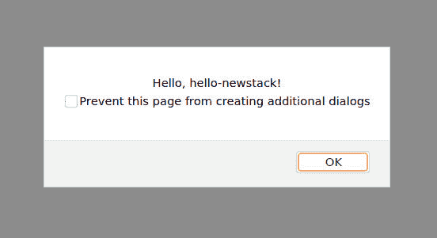
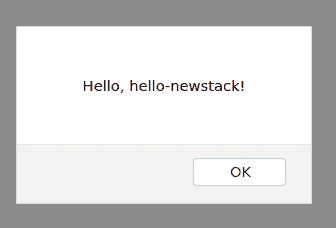

# 用 Rust 构建 WebAssembly 应用

> 原文：<https://thenewstack.io/build-a-webassembly-app-with-rust/>

在本教程中，我们将结合 [WebAssembly](https://thenewstack.io/what-is-webassembly/) 的强大功能和 [Rust 编程语言](https://thenewstack.io/the-case-for-rust-as-the-future-of-javascript-infrastructure/)的灵活性来构建一个非常简单的“Hello，World！”app。

我们之所以要使用 [Rust](https://www.rust-lang.org/) 的原因之一是因为开发人员在为该语言添加 [WebAssembly](https://webassembly.org/) 支持方面做得非常出色。因为 Rust 正在慢慢成为 web 应用程序开发人员的首选语言，所以将这两者结合成一个强大的组合是非常合理的。

这一次，我们要做的是使用 Rust 创建一个非常简单的 web 应用程序，并在 WebAssembly 和 Python 的帮助下提供它。我将在 Ubuntu Desktop 20.04 上演示，所以如果你使用不同的平台来满足你的开发需求，你必须改变过程(特别是安装步骤)来使它工作。

说了这么多，让我们继续操作吧！

## 安装必要的依赖项

为了实现这一奇迹，我们必须安装几个依赖项。

首先要做的是用命令安装必要的编译器和其他构建工具:

`sudo apt-get install build-essential -y`

安装完成后，安装 Python:

`sudo apt-get install python3 -y`

我们的下一个任务是安装 Rust，可以使用 rustup 脚本来完成，如下所示:

`curl --proto '=https' --tlsv1.2 -sSf https://sh.rustup.rs | sh`

安装 Rust 后，使用以下命令获取环境变量:

`source $HOME/.cargo/env`

接下来，我们需要安装 wasm-pack 工具(用于组装和包装 WebAssembly 的 Rust crates)。这是通过以下命令完成的:

`curl https://rustwasm.github.io/wasm-pack/installer/init.sh -sSf | sh`

## 创建您的第一个 WASM/铁锈包

现在我们已经做好了一切准备，我们可以构建我们的第一个包了。让我们将这个包称为 hello-newstack，并用以下代码创建它:

`wasm-pack new hello-newstack`

成功完成后，您应该会看到打印出来的内容:

`Generated new project at /hello-newstack`

使用以下命令切换到新创建的目录:

`cd hello-newstack`

我们现在将使用以下内容构建 web 目标:

`wasm-pack build --target web`

您应该会看到如下输出:

```
Compiling proc-macro2 v1.0.28
Compiling unicode-xid v0.2.2
Compiling syn v1.0.75
Compiling log v0.4.14
Compiling wasm-bindgen-shared v0.2.76
Compiling cfg-if v1.0.0
Compiling lazy_static v1.4.0
Compiling bumpalo v3.7.0
Compiling wasm-bindgen v0.2.76
Compiling cfg-if v0.1.10
Compiling quote v1.0.9
Compiling wasm-bindgen-backend v0.2.76
Compiling wasm-bindgen-macro-support v0.2.76
Compiling wasm-bindgen-macro v0.2.76
Compiling console_error_panic_hook v0.1.6
Compiling hello-newstack v0.1.0  (/home/jack/hello-newstack)

```

现在我们要创建一个索引 HTML 页面，用以下代码创建这个新文件:

`nano index.html`

在该文件中，粘贴以下内容:

```
&lt;!DOCTYPE html&gt;
&lt;html&gt;
  &lt;head&gt;
     &lt;meta charset="utf-8"  /&gt;
     &lt;title&gt;New Stack Wasm Test Project&lt;/title&gt;
  &lt;/head&gt;

  &lt;body&gt;
     &lt;script type="module"&gt;

       import  {  default as wasm,  greet  }  from  "./pkg/hello_newstack.js";

       wasm().then((module)  =&gt;  {
         greet();
       });
     &lt;/script&gt;
  &lt;/body&gt;
&lt;/html&gt;

```

保存并关闭新文件。

现在，我们需要运行 Python HTTP 服务器来提供新的 web 应用程序。因为我们使用的是 Python3，所以这个命令是:

`python3 -m http.server 8000`

Python 服务器启动并运行后，在同一台机器上打开一个 web 浏览器，将其指向 http://localhost:8000。您还可以将网络上的任何 web 浏览器指向 http://HOST:8000(其中 HOST 是主机的 IP 地址)。

您应该会看到一个弹出窗口，上面写着:“你好，你好，新闻报道！”(**图一**)。



图 1

单击确定关闭应用程序。

## 通过 WebAssembly 使用货物

让我们尝试一种不同的方法，这次是货物。首先，确保遵循上面的安装步骤，然后使用以下命令安装 libssl-dev:

`sudo apt-get install libssl-dev -y`

摆脱了依赖性之后，安装 cargo-generate，使用:

`cargo install cargo-generate`

以上命令需要一些时间才能完成。一旦完成，生成您的第一个项目:

`cargo generate --git https://github.com/rustwasm/wasm-pack-template`

系统会提示您输入项目名称，此时只需键入“hello”

现在，运行命令:

`wasm-pack build`

这将为我们的 web 应用程序构建一切，因此我们现在可以使用以下代码生成 web 应用程序:

`npm init wasm-app www`

使用命令切换到 www 目录:

`cd www`

使用以下命令打开 package.json 文件:

`nano package.json`

在 devDependencies 部分，添加以下内容:

`"hello-newstack": "file:../pkg"`

需要注意的一点是，您需要在“hello-newstack”上方的行尾添加一个逗号:“file:../pkg”。保存文件并安装所有必需的依赖项，包括:

`npm install`

完成后，使用以下命令打开 index.js 文件:

`nano index.js`

将该文件的内容更改为:

```
import *  as wasm from  "hello-newstack";
wasm.greet();

```

使用以下方式运行应用程序:

`npm run start`

现在，您可以将浏览器指向 http://localhost:8080 来查看新部署的 web 应用程序。



我们的网络应用已经启动并运行。

恭喜您，您刚刚使用 Rust and cargo 部署了您的第一个 WebAssembly 应用程序。尽管这是非常基本的，但它应该有助于您开始 WebAssembly 之旅。

<svg xmlns:xlink="http://www.w3.org/1999/xlink" viewBox="0 0 68 31" version="1.1"><title>Group</title> <desc>Created with Sketch.</desc></svg>