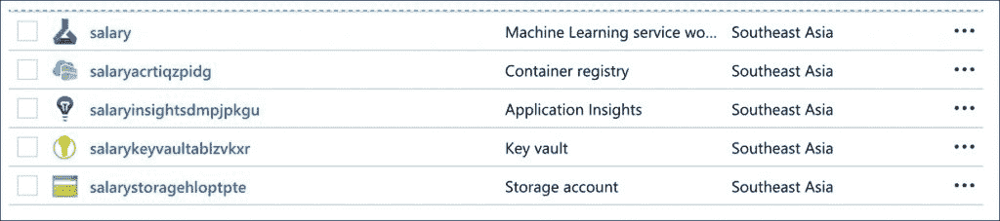
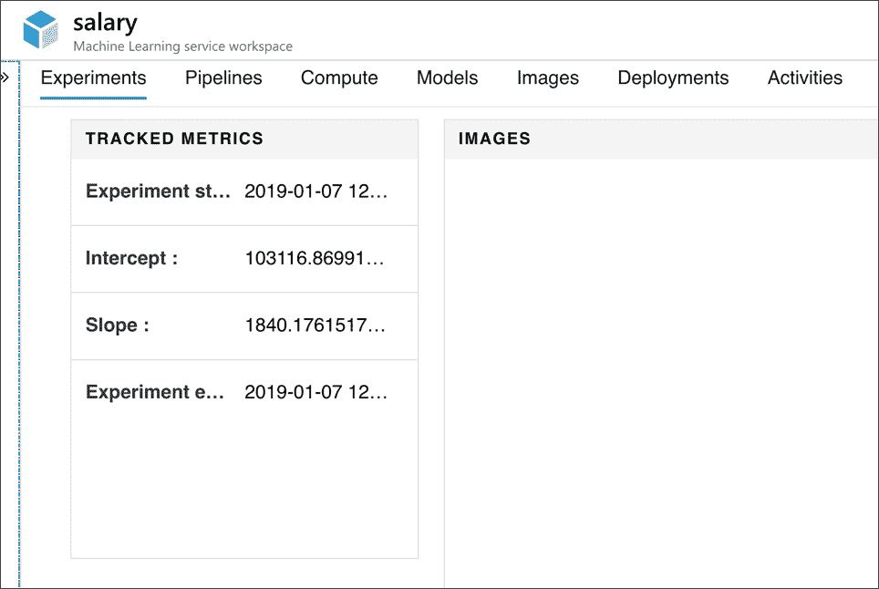
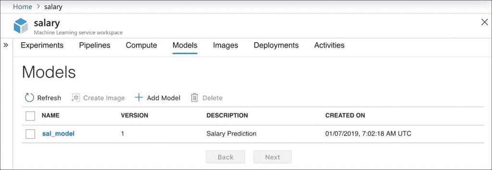
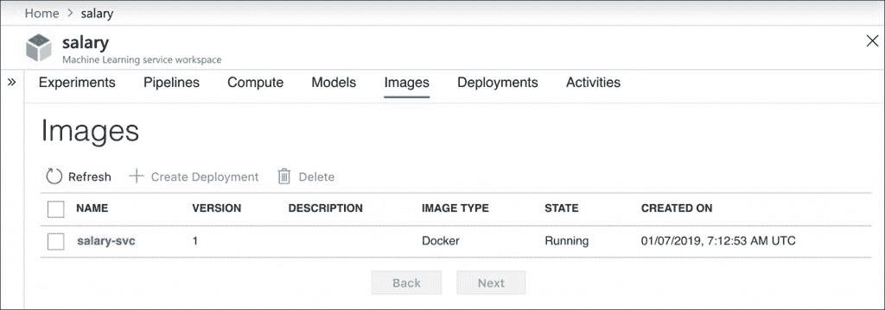
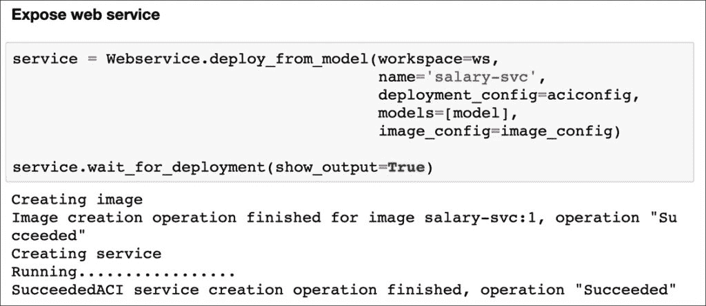
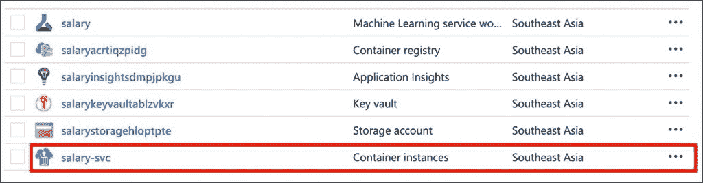
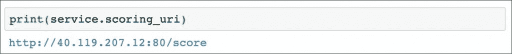
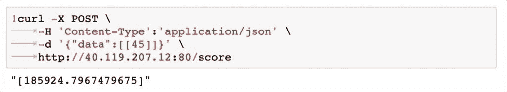

# 使用 Azure ML 服务构建和部署机器学习模型

> 原文：<https://thenewstack.io/build-and-deploy-a-machine-learning-model-with-azure-ml-service/>

本文是关于将持续集成和部署(CI/CD)实践引入机器学习的系列文章中的一篇。查看新的堆栈，了解未来的部分。

*For the background and context, we strongly recommend you to read the previous article on the [rise of ML PaaS](https://thenewstack.io/an-introduction-to-the-machine-learning-platform-as-a-service/) followed by the article on the [overview of Azure ML service](https://thenewstack.io/how-the-azure-ml-streamlines-cloud-based-machine-learning/).*

在本教程中，我们将构建并部署一个机器模型，从 Stackoverflow 数据集预测工资。至此，您将能够调用 RESTful web 服务来获得预测。

由于目的是演示工作流，我们将使用一个简单的两列数据集，其中包含多年的经验和工资。关于数据集的细节，请参考我的[之前关于线性回归的文章](https://thenewstack.io/machine-learning-linear-regression-mere-mortals/)。

## 先决条件

1.  Python 和 Scikit 的基础知识-学习
2.  有效的 Microsoft Azure 订阅
3.  蟒蛇或迷你蟒蛇

配置开发环境
用 Azure ML SDK 配置一个虚拟环境。运行以下命令来安装 Python SDK，并启动 Jupyter 笔记本。从 Jupyter 启动一个新的 Python 3 内核。

```
$  conda create  -n  aml  -y  Python=3.6

$  conda activate aml

$  conda install nb_conda

$  pip install azureml-sdk[notebooks]

$  jupyter notebook

```

## 正在初始化 Azure ML 环境

让我们从导入所有必需的 Python 模块开始，包括标准的 Scikit-learn 模块和 Azure ML 模块。

```
import datetime
import numpy as np
import pandas as pd
from sklearn.model_selection import train_test_split
from sklearn.linear_model import LinearRegression
from sklearn.externals import joblib

import azureml.core
from azureml.core import Workspace
from azureml.core.model import Model
from azureml.core import Experiment
from azureml.core.webservice import Webservice
from azureml.core.image import ContainerImage
from azureml.core.webservice import AciWebservice
from azureml.core.conda_dependencies import CondaDependencies

```

我们需要创建一个 Azure ML 工作空间，作为我们实验的逻辑边界。工作区创建了用于存储数据集的存储帐户、用于存储机密的密钥库、用于维护图像存储库的容器注册表以及用于记录指标的应用洞察。

不要忘记用您的订阅 id 替换占位符。

```
ws  =  Workspace.create(name='salary',
                      subscription_id='',  
                      resource_group='mi2',
                      create_resource_group=True,
                      location='southeastasia'
 )

```

几分钟后，我们将看到工作区内创建的资源。
[](https://thenewstack.io/build-and-deploy-a-machine-learning-model-with-azure-ml-service/az-ml-0-2/) 
我们现在可以创建一个实验来开始记录指标。由于我们没有太多要记录的参数，所以我们捕捉训练过程的开始时间。

```
exp  =  Experiment(workspace=ws,  name='salexp')
run  =  exp.start_logging() 
run.log("Experiment start time",  str(datetime.datetime.now()))

```

### 培训和测试 Scikit-learn ML 模型

我们现在将通过 Scikit-learn 继续训练和测试该模型。

```
sal  =  pd.read_csv('data/sal.csv',header=0,  index_col=None)
X  =  sal[['x']]
y  =  sal['y']
X_train,  X_test,  y_train,  y_test  =  train_test_split(X,  y,  test_size=0.25,  random_state=10)

lm  =  LinearRegression()
lm.fit(X_train,y_train)

```

经过训练的模型将被序列化为输出目录中的 pickle 文件。Azure ML 自动将输出目录的内容复制到云中。

```
filename  =  'outputs/sal_model.pkl'
joblib.dump(lm,  filename)

```

让我们通过记录斜率、截距和训练作业的结束时间来完成实验。

```
run.log('Intercept :',  lm.intercept_)
run.log('Slope :',  lm.coef_[0])

run.log("Experiment end time",  str(datetime.datetime.now()))
run.complete()

```

我们可以从 Azure Dashboard 跟踪指标和执行时间。

[](https://thenewstack.io/build-and-deploy-a-machine-learning-model-with-azure-ml-service/az-ml-1-2/)

### 注册和服务已训练的模型

每次我们冻结模型时，它都可以用一个唯一的版本向 Azure ML 注册。这使我们能够在上菜时轻松切换不同的模式。

让我们通过将 SDK 指向 PKL 文件的位置来注册上述培训工作中的工资模型。我们还以标签的形式向模型添加了一些额外的元数据。

```
model  =  Model.register(model_path  =  "outputs/sal_model.pkl",
 model_name  =  "sal_model",
 tags  =  {"key":  "1"},
 description  =  "Salary Prediction",
 workspace  =  ws)

```

检查工作区的 Models 部分，确保我们的模型已经注册。

[](https://thenewstack.io/build-and-deploy-a-machine-learning-model-with-azure-ml-service/az-ml-2/)

现在我们应该将模型打包并部署为容器映像，该映像将作为 web 服务公开。

为了创建容器映像，我们需要告诉 Azure ML 模型所需的环境。然后，我们将传递一个 Python 脚本，其中包含基于入站数据点预测值的代码。

Azure ML API 为这两者提供了方便的方法。让我们首先创建环境文件 salenv.yaml，它告诉运行时在容器映像中包含 Scikit-learn。

```
salenv  =  CondaDependencies()
salenv.add_conda_package("scikit-learn")

with open("salenv.yml","w")  as  f:
    f.write(salenv.serialize_to_string())
with open("salenv.yml","r")  as  f:
    print(f.read())

```

下面的代码片段在 Jupyter 笔记本中执行时，会创建一个名为 score.py 的文件，其中包含模型的推理逻辑。

```
%%writefile  score.py

import json
import numpy as np
import os
import pickle
from sklearn.externals import joblib
from sklearn.linear_model import LogisticRegression

from azureml.core.model import Model

def init():
    global model
    # retrieve the path to the model file using the model name
    model_path  =  Model.get_model_path('sal_model')
    model  =  joblib.load(model_path)

def run(raw_data):
    data  =  np.array(json.loads(raw_data)['data'])
    # make prediction
    y_hat  =  model.predict(data)
    return json.dumps(y_hat.tolist())

```

现在。让我们通过将推理文件和环境配置传递给映像来连接这些点。

```
%%time

image_config  =  ContainerImage.image_configuration(execution_script="score.py",  
                                                  runtime="python",  
                                                  conda_file="salenv.yml")

```

这最终导致创建一个容器图像，该图像显示在工作区的图像部分。

[](https://thenewstack.io/build-and-deploy-a-machine-learning-model-with-azure-ml-service/az-ml-3-2/)

我们已经准备好创建定义目标环境的部署配置，并将其作为 web 服务启动，该服务作为单个 vm 容器托管在 Azure Container 实例中。我们也可以选择 AKS 或物联网边缘环境作为部署目标。

```
aciconfig  =  AciWebservice.deploy_configuration(cpu_cores=1,  
 memory_gb=1,  
 tags={"data":  "Salary",  "method"  :  "sklearn"},  
 description='Predict Stackoverflow Salary')

service  =  Webservice.deploy_from_model(workspace=ws,
 name='salary-svc',
 deployment_config=aciconfig,
 models=[model],
 image_config=image_config)

service.wait_for_deployment(show_output=True)

```

[](https://thenewstack.io/build-and-deploy-a-machine-learning-model-with-azure-ml-service/az-ml-4-2/)

Azure 资源组现在有一个 Azure 容器实例运行模型的推理。

[](https://thenewstack.io/build-and-deploy-a-machine-learning-model-with-azure-ml-service/az-ml-5/)

我们可以从下面的方法得到推理服务的 URL:

```
print(service.scoring_uri)

```

[](https://thenewstack.io/build-and-deploy-a-machine-learning-model-with-azure-ml-service/az-ml-6/)

让我们继续通过 cURL 调用 web 服务。我们可以在同一个 Jupyter 笔记本上做这个。

[](https://thenewstack.io/build-and-deploy-a-machine-learning-model-with-azure-ml-service/az-ml-7/)

您可以从 [Github repo](https://github.com/janakiramm/azureml-tutorial) 中访问数据集和 Jupyter 笔记本。

这种方法的独特之处在于，我们可以从 Jupyter 笔记本内部运行的 Python 内核中执行所有任务。开发人员可以从代码中训练和部署 ML 模型。这是使用像 Azure ML 服务这样的 ML PaaS 的真正价值。

<svg xmlns:xlink="http://www.w3.org/1999/xlink" viewBox="0 0 68 31" version="1.1"><title>Group</title> <desc>Created with Sketch.</desc></svg>