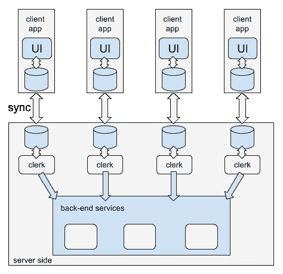

# 用离线优先的原则构建更可靠的 Web 应用

> 原文：<https://thenewstack.io/build-better-customer-experience-applications-using-offline-first-principles/>

这篇投稿来自

[Pedro Teixeira](https://github.com/pgte)

的合伙人兼首席未来学家

[YLD](https://www.yld.io/)

，谁是演讲者

[Node.js Interactive Europe](http://events.linuxfoundation.org/events/node-interactive-europe)

，该活动将于 9 月 15 日至 9 月 18 日在阿姆斯特丹举行，由推动代码发展的开发人员深入探讨 Node.js 的未来。

 [佩德罗·特谢拉

佩德罗·特谢拉是 YLD 节点咨询公司的合伙人兼首席未来学家。他还是多个 Node.js 模块的作者、Node Tuts 截屏节目的主持人、动手操作 Node.js 电子书的作者以及 Node.js 信条的狂热倡导者。](https://www.yld.io/) 

越来越多的客户使用智能手机购买商品和服务，无论是通过本地应用还是网络应用。而且，他们想在任何地方购物，无论是在火车上、在乡下还是在国外漫游。

然而，移动网络仍然被认为是不可靠的。即使在高度覆盖的区域和现代网络中，您仍然会遇到高延迟和网络故障率。但这不仅仅是网络出了问题:客户对故障率的体验还取决于给定的应用程序如何处理离线。

在质量范围的一个极端，你有一个应用程序，当一个网络错误发生时，应用程序给用户一个粗略的错误消息，没有如何恢复的线索。

在光谱的另一端是自动处理网络故障的应用程序——这是光谱的好的一端。也许他们创建了唯一的事务标识符，允许后端检测重复的事务，允许应用程序在失败后自动尝试重新提交事务。也许这个应用程序后端支持一种轮询机制，允许客户端应用程序查询事务的状态。也许应用程序的响应能力足够强，可以通知客户交易的中间状态，例如火车旅行的每一段何时已经预订，何时付款已经授权，何时预订已经全部确认，等等。

这些一流的弹性应用程序也可能对一些客户端故障具有弹性:如果用户关闭标签、浏览器崩溃或设备关机，交易仍能正常进行。它能够从客户停止的地方恢复，用最近的交易状态更新自己。

构建一个更好的应用程序不仅是击败竞争对手的必要条件，而且通常需要在后端和前端开发上投入大量资金。或者说，至少大多数人是这么认为的。

但是，事情不应该这样。先跟[下线](http://offlinefirst.org/)打个招呼。

## 什么是先下线？

离线优先是构建应用程序的一种方式，在这种方式下，网络连接是一种增强，而不是必需的。当您构建默认模式为离线的应用程序时，您倾向于交付更好的整体客户体验，而不是用永远在线的桌面思维来构建应用程序。

离线第一技巧和技术的存在是为了让应用程序在离线时为客户提供良好的体验。例如，最近在大多数浏览器中增加了[服务人员](https://developer.mozilla.org/en-US/docs/Web/API/Service_Worker_API)，允许 web 应用程序拦截 HTTP 请求，或者填充缓存，或者在离线时使用缓存。但是当我们处理电子商务交易时，什么技巧和技术可以帮助我们呢？

## 客户端有本地数据

当然，应用程序在离线时访问数据的唯一方法是将数据存储在本地。存在一些在客户端工作的数据库技术。 [SQLite](https://www.sqlite.org/) 是嵌入式数据库的参考，通常用于本地应用。在 web 领域， [PouchDB](https://pouchdb.com/) 在浏览器提供的存储之上提供了一个文档存储。PouchDB 也有一些不错的特性——它可以与后端 [CouchDB](http://couchdb.apache.org/) 服务器、 [Cloudant](https://cloudant.com/) 、PouchDB Node.js 服务器或任何其他实现 [CouchDB 复制协议](http://docs.couchdb.org/en/stable/replication/protocol.html)的数据库同步。

在这种体系结构中，每个客户端都有自己的专用数据库，然后复制到后端的专用数据库。每个数据库可能包含客户文档。(文档是一个 JSON 对象，可以包含任意数据)。

对于习惯于关系数据库的人来说，每个客户一个数据库可能听起来很奇怪，但在使用 CouchDB 及其变体时，这是一种常见的模式。这也是一种清晰自然地分离和强制用户访问哪些数据的方式。

## 同步协议

当客户端或服务器上发生变化时，同步协议开始生效，并尝试将该变化复制到另一端。如果当时没有网络连接，客户端将尝试重新连接。一旦建立了连接，两个数据库将能够相互通信并同步。

在这种体系结构中，客户机和服务器都可以同时对数据进行更改。如果给定文档出现冲突，复制协议会确保两个数据库都收敛到该文档的同一版本。当冲突发生时，Pouch 和 CouchDB 会保留所有的冲突数据。如果程序员愿意的话，他们可以用任何他们认为正确的策略来解决这个冲突，并且最小化数据丢失。

## 与 Node.js 的后端集成

除了能够同步之外，PouchDB(和 CouchDB)还可以保存任何文档的整个修订历史，并提供一个异步的变更提要，可以传输所有文档的所有版本。这将 PouchDB(或 CouchDB)转换成一个事件队列，由 clerk 进程处理。然后，这个职员可以处理文档更改，并随意与后端服务进行交互。

反过来，这个职员可以在任何给定的文档中执行更改，然后这些更改将通过同步协议传播到客户机应用程序中。

clerk 可以在任何语言运行时中实现，然而， [Node.js](/tag/node.js/) 有一个开源的[pocket-clerk 库](https://github.com/pgte/pouch-clerk)，所以你不必在这里自己构建，可以简单地使用这个库，并且很容易地自行推出。

在这种体系结构中，每个交易都可以用客户数据库中的一个文档来描述。该文档应包含执行下一步交易所需的所有数据。

如果您正在购买商品，它可能包含所有产品及其各自的数量和付款方式标识符。如果你购买飞机旅行，它应该包含所有的航班，乘客数据和付款方式。诸如此类。

这个文档包含一个重要的属性:状态。由于任何事务至少有两种状态(开始和完成)，职员可以对转换做出反应，并且您可以将这些转换建模到您的特定流中。例如，如果您正在构建一个出租车应用程序，您可以对状态进行建模(请求、搜索司机、分配的司机、途中的司机、到达的司机、接站的司机、运输中的司机等)。您可以很容易地以这种方式对长时间运行的事务建模，其中事务文档缓慢地转换状态。

## 客户端用户界面

为这种架构构建客户端 UI 应该相对容易:它必须将 UI 状态与本地事务状态同步。(如果您使用的是 [React](https://facebook.github.io/react/) 和 [Redux](https://thenewstack.io/flux-overview-react-state-management-ecosystem/) ，您可以使用 [pouch-redux-middleware](https://github.com/pgte/pouch-redux-middleware) 包，该包将 Redux 状态与本地 PouchDB 数据库保持同步)。

现在，您可以简单地使用 React 之类的反应式技术来构建 UI，而不用担心处理网络错误:架构会为您处理它。

使用离线优先原则构建应用程序的数据层需要您重新构建前端数据库。但是，通过利用 PouchDB 或 CouchDB 数据库的一些功能并使用 Node.js，它允许您插入现有的后端服务，最终提供改进的事务体验。

<svg xmlns:xlink="http://www.w3.org/1999/xlink" viewBox="0 0 68 31" version="1.1"><title>Group</title> <desc>Created with Sketch.</desc></svg>