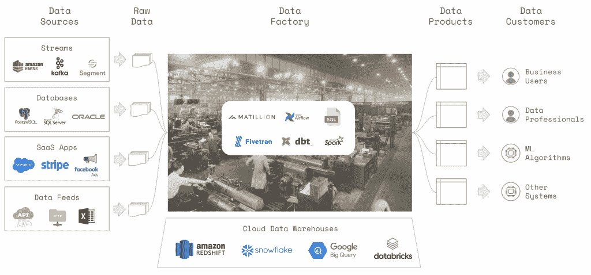

# 构建数据工厂，而不是数据仓库

> 原文：<https://thenewstack.io/build-data-factories-not-data-warehouses/>

数据仓库是现代数据栈中一个破碎的隐喻。

我们不会将无法区分的数据托盘装载到虚拟仓库中，在那里我们将它们整齐地排成行和列，然后用叉车将它们装载到送货卡车上。

取而代之的是，我们将原始数据输入工厂，这些工厂里充斥着由传送带连接起来的复杂装配线。我们的工厂为各种内部和外部客户制造定制和不断发展的数据产品。

作为一家运营数据工厂的企业，我们主要关心的是:

*   工厂是否生产高质量的数据产品？
*   经营我们的工厂要花多少钱？
*   我们能以多快的速度让工厂适应不断变化的客户需求？

像[亚马逊网络服务的](https://aws.amazon.com/?utm_content=inline-mention)红移、[雪花](https://www.snowflake.com/?utm_content=inline-mention)、谷歌的 BigQuery 和 Databricks 这样的云数据仓库降低了数据工厂的运营成本。像 Airflow 这样的编排工具和像 [dbt](https://www.getdbt.com/) 这样的数据转换框架使得我们工厂的组件重新设计变得更加容易。

但是我们经常忽略数据质量问题，导致糟糕的决策和破碎的产品体验。或者他们在最后一刻被最终用户发现，导致消防演习和信任流失。

## 数据质量控制优先级

 [杰里米·斯坦利

杰里米·斯坦利(Jeremy Stanley)是 Anomalo 的联合创始人兼首席技术官，他帮助公司提高数据的质量和可靠性。最近，他是 Instacart 的数据科学副总裁，在那里他专注于物流和市场发现的机器学习。在此之前，他在 Sailthru 领导数据科学和工程，为电子商务和出版公司构建个性化工具。在 Sailthru 之前，他在 Collective 负责创建广告优化和竞价技术。他在数据、机器学习和战略方面的早期经验始于 EY。](https://www.linkedin.com/in/jeremystanley/) 

为了在我们的隐喻工厂中建立数据质量控制，我们可以在四个点进行测试:

*   到达我们工厂的原材料。
*   生产线上每一步的*机器性能*。
*   在转换步骤之间的*半成品*物料。
*   我们运送给内部或外部客户的*最终产品*。

这些测试点并不同等重要。作为工厂操作员，**最关键的**质量测试是在生产线的末端。工厂有专门的团队对成品进行取样，并确保它们符合严格的质量标准。

数据也是如此。我们不知道我们生产的数据是否是高质量的，直到我们测试了成品。例如:

*   连接引入了重复的行吗？
*   格式错误的列会导致值丢失吗？
*   时间戳记录是否不一致？
*   查询逻辑的变化是否影响了业务指标？

在验证最终产品的质量后，我们应该确保我们消费的是高质量的原材料。识别到达工厂的原始数据中的缺陷将会节省我们的时间和精力，以便以后找到问题的根源。

## 投资不足

不幸的是，迄今为止，测试我们的数据工厂的大部分投资都等同于评估机器性能或可视化平面图:

*   我们监控数据基础设施的正常运行时间和响应能力。
*   我们监控气流任务的异常和运行时间。
*   我们通过 dbt 应用基于规则的测试来检查转换的逻辑。
*   我们分析数据谱系来构建数据工厂车间的复杂地图。

这些活动是有帮助的，但是我们本末倒置了！我们应该首先确保我们的工厂生产和吸收高质量的数据。根据我与数百个数据团队的对话，我认为我们未能做到这一点有三个原因:

**1。我们使用手头的工具。** 工程团队拥有强大的工具和最佳实践来监控 web 和后端应用程序的运行。我们可以使用这些现有的工具来监控数据工厂的基础设施和编排。然而，这些工具无法监控数据本身。

**2。我们让机器操作员负责质量控制。** 数据质量的重担往往落在工厂里操作机器的数据和分析工程师身上。他们是用于转换数据的工具和逻辑的专家。他们可能会编写测试来确保他们的转换是正确的，但是他们可能会忽略处理过程中的上游或下游问题。

**3。很好地测试数据是困难的。我们的数据工厂生成了数千个极其多样化的数据表，其中包含数百个有意义的列和段。这些表中的数据不断变化，原因从“预期”到“完全超出我们的控制”简单的测试策略经常错过真正的问题，复杂的策略很难维护。校准不当的测试可能会向用户发送误报警报，导致警报疲劳。**

## 数据质量控制需求

我们需要专门构建的工具来监控和评估进入或离开数据工厂的数据的质量。

我们应该将这些工具交给数据消费者——非常关心他们使用的数据质量的主题专家。无论有没有代码，这些消费者都应该能够快速测试他们的数据并监控他们的关键指标。

我们的数据质量工具必须能够在日常批处理流程或实时流程中覆盖数千个表、数十亿行、数百个团队。

所使用的算法应该足够灵活，能够处理来自不同应用和行业的数据。它们应该很好地适应不同的表格结构、数据粒度和表格更新机制。我们应该自动化测试，以避免让数据消费者承受繁忙的工作负担。

我们应该通过通知控制、反馈循环和稳健的预测模型来最大限度地减少误报，从而避免产生警报疲劳。当问题出现时，我们应该通过利用数据和上游数据生成过程中的上下文来直观地解释它们。

## 数据质量的未来

如今，组织可以捕获、存储和查询与其业务相关的大量数据。他们可以使对这些数据的访问民主化，以便分析、流程或产品可以依赖于这些数据。

数据团队操作复杂的数据工厂来满足其组织的数据需求。但他们往往无法控制产生的数据质量。如果数据团队不能在下游用户之前发现并解决数据质量问题，他们就有失去信任和被排挤的风险。

数据主管必须通过定义和实施质量控制标准来对数据质量负责。他们需要以可扩展的方式测试数据的工具和流程，包括数据本身**和参与生产和消费数据的人员**。

这些都是复杂的挑战，但是数据社区正在进行大量的创新来应对这些挑战。我期待未来我们的数据工厂是透明的、快速的、廉价的，**和**生产出高质量的数据！

*我要感谢 Anthony Goldbloom、Chris Riccomini、Dan Siroker、D.J. Patil、John Joo、Kris Kendall、Monica Rogati、Pete Soderling、Taly Kanfi 和 Vicky Andonova 提供的反馈和建议。*

<svg xmlns:xlink="http://www.w3.org/1999/xlink" viewBox="0 0 68 31" version="1.1"><title>Group</title> <desc>Created with Sketch.</desc></svg>