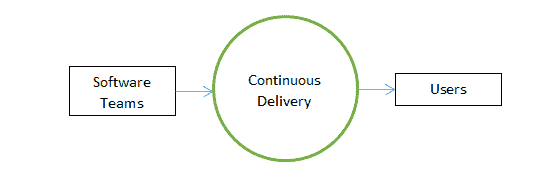

# 通过持续交付建立更深层次的用户关系

> 原文：<https://thenewstack.io/build-deeper-user-relationships-with-continuous-delivery/>

 [卡尔·蒂姆

卡尔是一位父亲、丈夫、科幻小说读者和啤酒爱好者，住在太平洋西北部。哦，他也是 Armory 的产品营销主管，所以他偶尔会写一些关于渐进式交付、Kubernetes、开发人员和营销的东西。](https://www.linkedin.com/in/carltimm/) 

每一笔好生意的中心都是它的顾客。为了保持业务，组织必须通过持续提供一流的体验，让客户物有所值，从而与客户保持稳固的关系。在科技领域尤其如此，因为它节奏如此之快，充满活力。

CD 基金会在其[持续交付状态报告](https://cd.foundation/state-cd-report/)中指出，如果产品没有“获得客户的广泛接受，通常是因为他们从未收到潜在客户的早期反馈，以确定产品或服务是否相关。”正如 CD 基金会建议的那样，客户的意见可以改善客户体验，并导致更多的采用。

然而，接收客户的意见和实施是两回事。经常快速地实施客户反馈的一个关键因素是持续交付。实践连续交付允许您通过快速整合客户反馈和安全可靠地部署新代码来建立稳固和长期的关系。

## 什么是持续交付？

连续交付(CD)是一种软件开发实践，在这种实践中，软件团队安全且实时地向用户发布可持续的变更。这意味着开发足够稳定的工作软件特性，以按需交付价值，并在尽可能短的时间内交付。这也意味着错误修复很快，新功能更新不会破坏现有功能。最重要的是，它还保证用户的遗留数据是安全的。

CD 遵循一个有组织的流程，即众所周知的连续交付管道。管道开始于开发人员将他的代码提交给源代码库。在每次新的提交之后，自动测试和检查运行，以确保代码遵循设定的标准。验证完成后，应用程序将自动部署进行集成、试运行或用户验收测试，之后即可按需部署。

## 共同发展问题

[SlashData](https://www.slashdata.co/) 研究表明，只有十分之一的开发者每天发布多个部署。对于大多数开发人员来说，提交的代码投入生产至少需要一周的时间。在许多情况下，当发生计划外停机时，会花费大量时间来排除故障和恢复服务。稳定性丧失，导致频繁停机的循环，因为之前的修复导致了其他问题的出现。

大多数情况下，这些问题是由部署过程中的低效造成的。您的开发团队中可能有最优秀的人员，但是如果最优秀的人员没有合适的工作工具，他们的才能将会被严重地低估。这最终导致开发团队和客户都不满意。

部署问题的一个[根本原因](https://blog.inedo.com/blog/deployment-failures)是源于手动流程的人为错误。常见问题包括:

*   看不到代码中的错误
*   曲解一行文字
*   直接在服务器上进行更改

这些看似很小的错误可能会导致巨大的问题，例如在对源代码的不同部分进行更改时，系统崩溃或应用程序意外中断。

缺乏沟通也是一个重大障碍。有人可能解决了一个问题，但没有正确地记录或跟踪它，而另一个开发人员可能正在处理同一个问题，却不知道它已经被修复了。这些问题会导致意想不到的失败和不愉快的客户。

实施 CD 最佳实践有助于最小化这些问题。

## 最佳实践加强了用户关系

建立和维护部署最佳实践对于减少产品故障以及建立和培养与用户的长期关系至关重要。让我们讨论一下实施 CD 最佳实践如何有利于并加强您与用户的关系。

### 快速处理客户输入

当软件团队在他们的 CD 过程中遵循最佳实践时，它允许应用程序的平滑和安全的部署。如果当前客户看到错误报告和对快速解决的功能的请求，他们不太可能转向竞争对手。快速发布应用改进不仅能让你的用户感到被倾听，还能降低你的产品失败的可能性。如果新客户经常看到你的软件有所改进，经历更少的错误，并且再次感到他们的需求得到了考虑，他们就更有可能留下来。

### 监控和改进关键指标

当通过有效的沟通与用户建立更牢固、更持久的关系时，密切关注 CD 报告中的指标也至关重要。特别感兴趣的是变更的部署频率和交付时间。

您的部署频率可能与您响应用户需求的速度密切相关。如果您的部署频率更接近每天一次，而不是每月一次，这是一个很好的迹象，表明您对用户反馈的响应很快。你回复得越及时，用户就越高兴。

变更的交付周期衡量将提交转移到生产中需要多长时间。这个标准是衡量开发团队健康状况的一个很好的方法。这也很好地反映了您的团队对快速响应用户输入的准备程度。

### 利用渐进式交付

渐进式交付是 CD 的自然演变。虽然 CD 实现了有形的速度，但是持续地将代码从构建到生产更快地推进会增加损害客户体验的不良推出的风险。这正是渐进式交付所要解决的问题。

渐进式交付提供了控制手段来管理如何将代码交付到生产环境中，从而确保速度，同时引入安全性以最大限度地减少破损并保护客户体验。

您可以用许多不同的方式实现渐进式交付。例如，可以使用蓝/绿部署、金丝雀部署、功能标志或 A/B 测试等选项来实现渐进式交付的优势。在所有情况下，受控的、渐进的代码发布都是至关重要的。最初，该版本的目标受众较少，例如:

*   内部环境
*   一小部分用户
*   特定的客户群
*   目标区域

随着向较小受众的推广证明是成功的，它会逐渐面向较大的受众，直到整个部署完成。通过这种方法，渐进式交付有助于最大限度地减少部署错误代码，并确保更好的客户体验。

## 与 CD 一起前进

本文探讨了持续交付是如何保持平稳的客户关系的关键。它还研究了传统的 CD 技术，以及它与渐进传递技术的比较。为了确保您超越客户的期望，您必须不断地向他们提供一流的服务，而您使用的 CD 工具可以帮助您做到这一点。

*[今天就联系 Armory](https://www.armory.io/demo-request/)请求演示并获得对您的软件交付实践的免费评估。*

<svg xmlns:xlink="http://www.w3.org/1999/xlink" viewBox="0 0 68 31" version="1.1"><title>Group</title> <desc>Created with Sketch.</desc></svg>