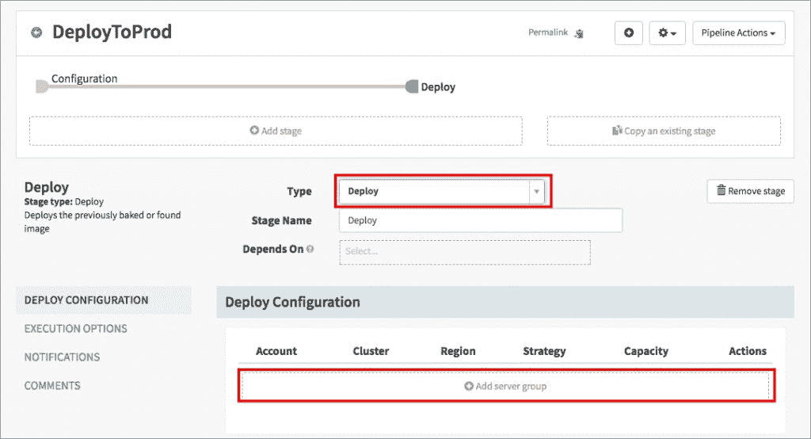
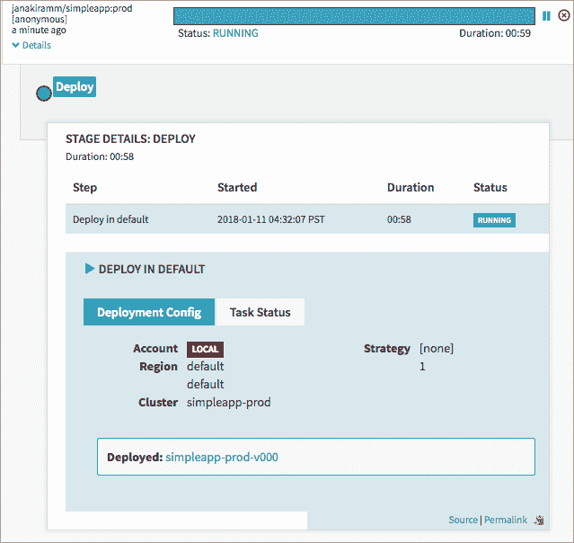

# 使用 Spinnaker 和 Kubernetes 构建可扩展的 CI/CD 管道

> 原文：<https://thenewstack.io/build-extensible-ci-cd-pipelines-spinnaker-kubernetes/>

在我们探索 [Spinnaker](https://www.spinnaker.io/) 多云部署工具的[上一期](https://thenewstack.io/getting-started-spinnaker-kubernetes/)中，我们已经设置并测试了在 Minikube 上运行的 Spinnaker。我们现在将重点关注创建一个自动化管道，将容器化的应用程序部署到生产 Kubernetes 集群。

## 概观

此部署场景中有四个组件:

*   开源代码库
*   码头枢纽
*   大三角帆
*   库伯内特星团

目标是将应用程序的最新版本部署到 Kubernetes 的临时集群中，一旦版本经过测试和批准，就将其转移到生产集群中:

[](https://storage.googleapis.com/cdn.thenewstack.io/media/2018/01/3b366fd8-spinn-k8s-0.jpg)

一旦配置完成，这个管道就提供了一个无摩擦、无需人工干预的容器化应用程序部署。它可以非常容易地扩展以执行蓝/绿部署。

## 配置环境

本教程中使用的[应用程序](https://github.com/janakiramm/simpleapp)是一个静态 HTML 页面，旨在从视觉上区分构建。它有一个包含生产级代码库的主分支和一个开发分支。

首先分叉这个存储库，然后将其连接到 Docker Hub。参考 Docker 文档中关于集成 Github 和 Docker Hub 进行自动化构建的指南。

将 Github repo 连接到 Docker Hub 后，您的配置应该类似于下面的截图:

[](https://storage.googleapis.com/cdn.thenewstack.io/media/2018/01/2877abe2-spinn-k8s-1.jpg)

[](https://storage.googleapis.com/cdn.thenewstack.io/media/2018/01/21ecf592-spinn-k8s-2.jpg)

repo 的主分支被配置为构建带有标记 prod 的 Docker 映像，而 dev 分支将生成带有 dev 标记的映像。

每次执行 Github repo 提交时，Docker Hub 都会启动一个自动构建过程，生成新的映像。

一旦 Github 和 Docker Hub 集成，我们需要配置 Spinnaker 来与 Docker Hub 对话。我们通过修改配置文件 [values.yaml](https://raw.githubusercontent.com/kubernetes/charts/master/stable/spinnaker/values.yaml) 来添加 Docker Hub 凭证。

用 curl 命令下载文件:

```
$  curl  -Lo values.yaml https://raw.githubusercontent.com/kubernetes/charts/master/stable/spinnaker/values.yaml

```

编辑 values.yaml，在 dockerhub 账户下插入您的 Docker Hub 凭证。将您从我的 Github 帐户获取的回购文件添加到存储库列表中:

[](https://storage.googleapis.com/cdn.thenewstack.io/media/2018/01/996422b3-spinn-k8s-3.jpg)

如果您已经有了上一教程中的 Spinnaker 安装设置，请使用下面的命令将其删除:

```
$  helm del  –purge kubelive

```

现在，使用更新后的配置启动 Spinnaker:

```
$  helm install  -n  kubelive stable/spinnaker  -f  values.yaml  --timeout  300  --version  0.3.5  --namespace spinnaker

```

使用以下命令将 Spinnaker 端口暴露给主机:

```
$  export DECK_POD=$(kubectl get pods  --namespace spinnaker  -l  "component=deck,app=kubelive-spinnaker"  -o  jsonpath="{.items[0].metadata.name}")

$  kubectl port-forward  --namespace spinnaker  $DECK_POD  9000

```

现在可以通过访问 http://localhost:9000 从浏览器访问 Spinnaker。

## [](https://storage.googleapis.com/cdn.thenewstack.io/media/2018/01/663b0507-spinn-k8s-4.png)

## 创建 Spinnaker 管道

让我们首先创建一个名为 Simpleapp 的应用程序。

[](https://storage.googleapis.com/cdn.thenewstack.io/media/2018/01/2d228a44-spinn-k8s-5.jpg)

创建一个负载平衡器，并将其命名为 **prod** 。确认端口为 **80** ，**目标端口**为 **80** ，类型为**节点端口:**

[](https://storage.googleapis.com/cdn.thenewstack.io/media/2018/01/67c00abb-spinn-k8s-6.jpg)

创建第二个负载平衡器，称为 **dev** 。保持端口和目标端口值为 **80** 。确保类型为**集群 IP:**

[](https://storage.googleapis.com/cdn.thenewstack.io/media/2018/01/44973e8e-spinn-k8s-7.jpg)

基于产品分支的生产应用程序将通过第一个**节点端口**上的第一个负载平衡器公开，而开发构建将通过第二个负载平衡器在内部进行测试。选择**集群 IP** 会限制开发构建的可见性。

您的负载平衡器部分现在应该有两个负载平衡器，即 **simpleapp-dev** 和 **simpleapp-prod:**

[](https://storage.googleapis.com/cdn.thenewstack.io/media/2018/01/19c07c12-spinn-k8s-8.jpg)

单击管道选项卡，创建一个名为**的新管道，部署产品**:

[](https://storage.googleapis.com/cdn.thenewstack.io/media/2018/01/357301e2-spinn-k8s-9.jpg)

在自动触发器部分，选择**码头工人登记处**作为类型，**码头工人登记处**作为登记处名称，您的码头工人中枢用户名作为组织，图像作为**、T42 作为> /simpleapp** ，以及**产品**作为标签。确保选择了“已启用触发器”。

这种配置将在每次 Docker Hub 构建新映像时自动触发 Spinnaker 管道。需要注意的是，触发器不适用于最新的标签*。这就是为什么我们选择*开发*和*产品*作为 simpleapp 图像的标签。*

 *[](https://storage.googleapis.com/cdn.thenewstack.io/media/2018/01/962c9b06-spinn-k8s-10.jpg)

点击添加阶段并选择**部署**作为类型:

[](https://storage.googleapis.com/cdn.thenewstack.io/media/2018/01/dd7c3bca-spinn-k8s-11.jpg)

点击添加服务器组，并在出现提示时选择**继续使用模板**。

为堆栈键入 **prod** ，为容器选择 **simpleapp:prod** 。这是从与 Spinnaker 关联的 Docker Hub 帐户中提取的:

[](https://storage.googleapis.com/cdn.thenewstack.io/media/2018/01/46aa1d6e-spinn-k8s-12.jpg)

在负载平衡器部分，选择 **simpleapp-prod** 。这将服务器组与为生产应用程序创建的负载平衡器相关联:

[](https://storage.googleapis.com/cdn.thenewstack.io/media/2018/01/e6e5e31f-spinn-k8s-13.jpg)

对于容器设置，选择**蓝色**作为名称:

[](https://storage.googleapis.com/cdn.thenewstack.io/media/2018/01/775948b5-spinn-k8s-14.jpg)

进一步向下滚动以启用**就绪探针**和**活性探针**:

[](https://storage.googleapis.com/cdn.thenewstack.io/media/2018/01/db166b4a-spinn-k8s-15.jpg)

点击**添加**按钮，然后点击**保存修改**保存管道。返回管道主页:

[](https://storage.googleapis.com/cdn.thenewstack.io/media/2018/01/2c90f4b1-spinn-k8s-16.jpg)

回到 Github repo，对主分支中的代码进行修改并提交。这将触发 Docker Hub 构建过程，产生新的映像。

如果您查看 Docker Hub repo 的**构建详细信息**选项卡，您会注意到构建过程正在进行中:

[](https://storage.googleapis.com/cdn.thenewstack.io/media/2018/01/3a5182e2-spinn-k8s-17.jpg)

一旦在 Docker Hub 中成功创建了新映像，就会自动触发 Spinnaker 的 **DeployToProd** 管道:

[](https://storage.googleapis.com/cdn.thenewstack.io/media/2018/01/07fbdf00-spinn-k8s-18.jpg)

几分钟后，访问 Kubernetes 集群中的任意一个节点。要获得节点端口值，切换到终端并运行下面的命令:

```
$  kubectl get svc
NAME TYPE          CLUSTER-IP    EXTERNAL-IP PORT(S) AGE
kubernetes ClusterIP 10.96.0.1 &lt;none&gt;          443/TCP      3h
simpleapp-dev  ClusterIP 10.98.221.141  &lt;none&gt;          80/TCP 1h
simpleapp-prod NodePort      10.96.173.214  &lt;none&gt;          80:32537/TCP  1h

```

如果你正在使用 Minikube，你可以通过一个简单的命令进入网络应用:

```
$  minikube service simpleapp-prod
Opening kubernetes service default/simpleapp-prod in default browser...

```

我们现在已经在生产环境中部署了应用程序。让我们构建另一个管道来在开发环境中部署应用程序。

按照上面的步骤创建另一个管道，并将其命名为**deploytdev**。在 Automated Triggers 下，确保您使用了标签 **dev:**

[](https://storage.googleapis.com/cdn.thenewstack.io/media/2018/01/55e1383b-spinn-k8s-20.jpg)

添加一个新阶段，并选择“部署”作为类型。当您在部署配置下添加服务器组时，从列表中选择 **simpleapp-prod-v000** 。

[](https://storage.googleapis.com/cdn.thenewstack.io/media/2018/01/d86e6cdf-spinn-k8s-21.jpg)

将堆栈名称更改为 **dev** 。确保删除标签为 prod 的现有映像，并添加标签为 dev 的新映像。这将确保 dev 映像被部署到不同的服务器组。

[](https://storage.googleapis.com/cdn.thenewstack.io/media/2018/01/7e9e29d2-spinn-k8s-22.jpg)

确保您的负载平衡器指向 **simpleapp-dev:**

[](https://storage.googleapis.com/cdn.thenewstack.io/media/2018/01/c329b925-spinn-k8s-23.jpg)

选择**绿色**作为名称，同时启用**就绪探针**和**活性探针:**

[](https://storage.googleapis.com/cdn.thenewstack.io/media/2018/01/5190980e-spinn-k8s-24.jpg)

单击添加按钮，然后单击保存更改。现在，您应该在主页中看到两条管道:

[](https://storage.googleapis.com/cdn.thenewstack.io/media/2018/01/488f295d-spinn-k8s-25.jpg)

回到 Github repo，对 dev 分支中的代码进行修改并提交。这将触发 Docker Hub 构建过程，产生新的映像。

切换到终端窗口并运行代理以隧道连接到 Kubernetes 集群:

```
$  kubectl proxy
Starting to serve on  127.0.0.1:8001

```

访问 http://localhost:8001/API/v1/proxy/namespaces/default/services/simple app-dev:80/以访问应用程序的开发版本:

[](https://storage.googleapis.com/cdn.thenewstack.io/media/2018/01/5645d574-spinn-k8s-26.jpg)

现在是时候创建最终的管道来将开发构建提升到生产了。我们将使用人工判断来将开发构建推向生产。

按照与上面相同的步骤，在 Spinnaker 中创建一个名为 **PromoteToProd** 的新管道:

[](https://storage.googleapis.com/cdn.thenewstack.io/media/2018/01/70777c54-spinn-k8s-27.jpg)

该管道将由**部署开发**管道触发:

[](https://storage.googleapis.com/cdn.thenewstack.io/media/2018/01/20324906-spinn-k8s-28.jpg)

[](https://storage.googleapis.com/cdn.thenewstack.io/media/2018/01/d06cab21-spinn-k8s-29.jpg)

[](https://storage.googleapis.com/cdn.thenewstack.io/media/2018/01/f863c4bb-spinn-k8s-30.jpg)

增加一个**手动判断**阶段，选项如下:

[](https://storage.googleapis.com/cdn.thenewstack.io/media/2018/01/d06cab21-spinn-k8s-29.jpg)

该选项将提示在将开发构建提升到生产环境之前批准它。在下一步中，我们将创建一个部署阶段，用开发构建替换现有的生产环境。

添加新的部署阶段，并使用以下设置修改服务器组:

[](https://storage.googleapis.com/cdn.thenewstack.io/media/2018/01/f863c4bb-spinn-k8s-30.jpg)

选择**红/黑**将在新服务器组准备就绪后立即禁用之前的服务器组。

对 Github 中的 dev 分支进行更改，并提交它以触发整个工作流。几分钟后，您应该会看到批准构建的提示。

[](https://storage.googleapis.com/cdn.thenewstack.io/media/2018/01/43a82a72-spinn-k8s-31.jpg)

等待部署完成。您应该在管道状态中看到**成功:**

[](https://storage.googleapis.com/cdn.thenewstack.io/media/2018/01/fe501a58-spinn-k8s-32.jpg)

访问您的 Kubernetes 集群上的**节点端口**,查看升级后的开发版本在生产环境中对公众开放:

[](https://storage.googleapis.com/cdn.thenewstack.io/media/2018/01/1c343e86-spinn-k8s-33.jpg)

恭喜你！您已经成功地将最新版本提升到生产环境中。

*请访问我们的登陆页面，查看贾纳基兰·MSV 关于学习 Spinnaker 系列的其他文章。*

<svg xmlns:xlink="http://www.w3.org/1999/xlink" viewBox="0 0 68 31" version="1.1"><title>Group</title> <desc>Created with Sketch.</desc></svg>*