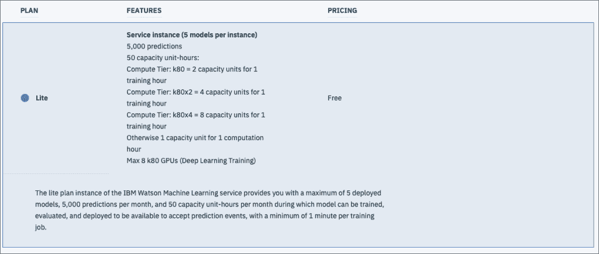

# 使用 IBM Watson Studio 云构建机器学习模型

> 原文：<https://thenewstack.io/build-machine-learning-models-with-ibm-watson-studio-cloud/>

本文是我们探索基于云的机器学习服务系列的一部分。在涵盖了 [Azure ML 服务](/how-the-azure-ml-streamlines-cloud-based-machine-learning/)、[谷歌云 ML 引擎](https://thenewstack.io/google-cloud-ml-engine-train-and-deploy-machine-learning-models/)、[亚马逊 SageMaker](https://thenewstack.io/train-deploy-machine-learning-models-with-amazon-sagemaker/) 之后，我们再来仔细看看 [IBM Watson Studio 云](https://www.ibm.com/cloud/watson-studio)。

IBM 已经将各种数据科学产品和服务整合到 Watson Studio 中，这是一个用于准备、探索、可视化数据以及创建、训练和部署机器学习模型的统一环境。包括数据科学体验云和 SPSS Modeler 在内的独立产品与 [Watson Studio](https://www.ibm.com/cloud/watson-studio) 相集成。

IBM Watson Studio 桌面测试版适用于 Microsoft Windows 和 Mac 用户。这是一个 IDE，用于解决个人桌面上的数据准备和数据建模需求。该工具的输出——一个完全准备好的数据集——可以上传到云中用于训练 ML 模型。

与其竞争对手一样，IBM 正在利用其 Watson Studio 公共云平台的构建模块。大型数据集存储在 IBM 云对象存储(COS)中，而计算服务用于训练和托管由强大的 CPU 和 GPU 基础设施支持的机器学习和深度学习模型。该服务还与 Apache Spark 集群集成，用于分布式处理。

## **IBM Watson Studio Cloud 入门**

Watson Studio 是 IBM Cloud 的 Watson 产品组合中提供的众多服务之一。它可以从目录的 AI 部分访问。Lite 计划每月有 50 个容量单位小时的限制，对开发者是免费的。该计划包括一个带有 1 个 vCPU 和 4 GB RAM 的小型计算环境，这对于试验该服务来说已经足够好了。

像大多数 IBM 云服务一样，我们需要创建一个 Watson Studio 实例，它与一个特定的计费计划和地理位置相关联。如上所述，Lite 计划是一个探索服务的好方法。

创建服务实例后，下一步是创建一个项目，作为数据集、模型、部署和 API 凭证的逻辑容器。每种项目类型都是针对通常由数据科学家执行的特定任务而预先配置的。标准类型是一个通用项目，用于处理任何类型的资产。每个项目可能会有其他具有不同访问级别的协作者。

一旦创建了项目，就可以根据需要创建资产。数据集可以上传到对象存储，然后可以从 Modeler 和 Jupyter 笔记本等其他资产中访问。

完全准备好的数据集被添加到项目中，并自动上传到 IBM Cloud Object Storage service。数据资产是可用于项目中任何其他资产的集中资源。

下一步是添加一个基于数据资产进行训练的模型。Watson Studio 可用于创建 NLP、视觉和通用模型。沃森机器学习模型是解决回归和分类问题的经典机器学习的理想选择。

在开始建模过程之前，项目需要与计算基础架构相关联。这项服务被称为沃森机器学习。Lite 计划包括 5 个部署模型、每月 5000 个预测和每月 50 个产能单位小时的慷慨限制。最棒的是，该计划包括英伟达 K80 GPUs，这些 GPU 非常适合进行深度学习实验。

一旦数据集和培训基础设施就绪，我们就可以开始培训工作了。Watson Studio 支持从头开始创建模型或上传预测模型标记语言(PMML) XML 文件。

该模型与集中式数据集、计算基础设施和基于 Spark Scala 的运行时相关联。

选择自动模型类型将自动准备数据并提示我们选择特征和标签。根据标签，Watson Studio 会建议一种适当的技术来训练模型。

训练工作完成后，模型将被保存，并准备好进行预测部署。部署会产生一个公开 REST 端点的 Web 服务。开发人员可以通过嵌入 Watson Studio 生成的 API 密钥来调用服务。

该工具还生成一个表单来测试预测，这在评估模型时非常方便。

REST 端点可以从任何语言甚至 cURL 中调用。生成令牌所需的用户名和密码可以从 Watson 机器学习服务凭证中检索。

IBM Watson Studio 抽象了训练机器学习模型所涉及的复杂性。从数据准备到模型部署，该平台简化了数据科学工作流程。

与其他基于云的产品相比，Watson Studio 不支持导出完全训练好的模型。也不支持在 Watson 中托管外部训练的 ML 模型。IBM 似乎没有利用容器和 Kubernetes 来扩展模型的训练和部署。但是，向导式开发环境弥补了这些限制。作为一个端到端平台，IBM Watson Studio 提供了一个典型的 ML PaaS 所期望的东西。

通过 Pixabay 的特征图像。

<svg xmlns:xlink="http://www.w3.org/1999/xlink" viewBox="0 0 68 31" version="1.1"><title>Group</title> <desc>Created with Sketch.</desc></svg>