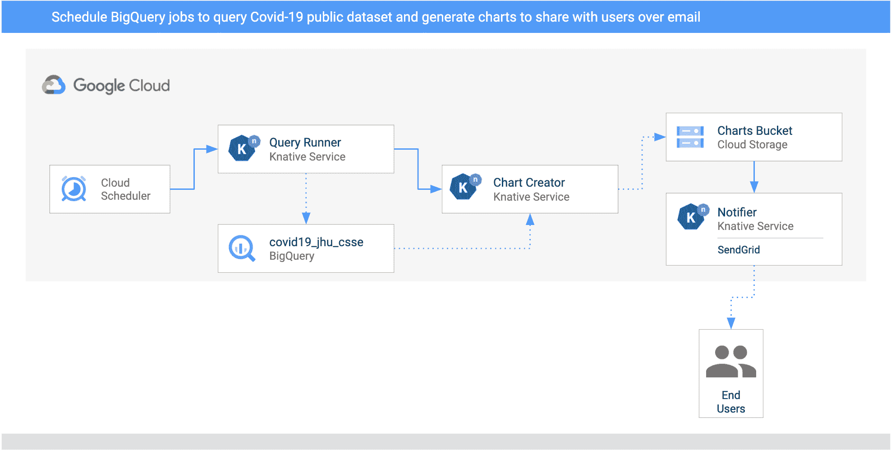

# 利用 SMOKE Stack 构建下一代云原生应用

> 原文：<https://thenewstack.io/build-next-generation-cloud-native-applications-with-the-smoke-stack/>

[TriggerMesh](https://triggermesh.com/) 赞助了这篇文章。

 [马克·辛克尔

Mark 在新兴技术和开源领域有着悠久的历史。在共同创立 TriggerMesh 之前，他是 Node.js 基金会的执行董事，也是 Citrix、Cloud.com 和 Zenoss 的高管，在那里他领导了他们的开源工作。](https://www.linkedin.com/in/markrhinkle/) 

企业技术需要帮助组织实时采取行动。有效地做到这一点意味着从批处理到事件驱动的应用程序架构的现代化。

无服务器计算是一种抽象基础设施的事件驱动架构，因此开发人员可以专注于编写应用程序代码。有了无服务器，应用程序团队无需担心维护、修补、支持和支付基础架构费用的复杂性，他们可以灵活地选择所需的基础架构。这使得无服务器成为整合来自任何地方的服务的完美粘合剂。

在 [TriggerMesh](https://triggermesh.com/) ，我们认为无服务器只是开始。真正的力量来自于无服务器的支持。无服务器架构甚至允许拥有数年或数十年遗留代码的最大企业打破他们自己的数据中心和单一云的限制。开源、标准和规范使企业开发人员能够从内部和任何云环境中融合服务，快速构建支持高速度的事件驱动型应用，以便您能够将新功能和产品快速推向市场。

要想在飞速发展的混合世界中取得成功，企业需要能够驾驭以下五大趋势的平台:

*   **服务周到**
*   **可混搭**
*   **打开**
*   **Kubernetes**
*   **事件驱动**

我将这种组合称为[烟囱](https://triggermesh.com/smoke-stack-white-paper/)，它将为下一代云原生应用提供动力。SMOKE stack 使企业开发人员能够灵活地快速响应不断变化的市场，并做出关于内部、混合或多云的最佳选择。

## 有益的

无服务器和功能即服务(FaaS)经常被混为一谈，但无服务器不仅仅是 FaaS。这就是为什么我的同事和云原生专家， [Sebastien Goaguen](https://www.linkedin.com/in/sebastiengoasguen) 喜欢说 ***serviceful，而不仅仅是无服务器*** 。在云原生世界中，应用程序是服务的组合——将这些服务想象成非常类似于单片应用程序中的库。因为无服务器抽象了基础设施的复杂性，所以它允许开发人员专注于由响应各种触发器的事件驱动功能组成的应用程序。

FaaS 平台(如 Amazon Lambda 或 Google Cloud Run)允许用户编写小段代码，根据另一个系统的变化来执行。FaaS 平台负责触发器到函数的逻辑，将信息从一个函数传递到另一个函数，自动提供容器和运行时(时间、位置和内容)，自动伸缩，身份管理等等。它还透明地处理供应和安全性。

无服务器带来的成本节约、可扩展性和操作复杂性降低是实实在在的。数字出版商 Bustle 通过迁移到无服务器架构节省了大约 84%的成本，Thomson Reuters 每秒处理 4，000 个请求，而美国职业棒球大联盟高级媒体每秒接收、分析和存储[超过 17pb 的数据](https://aws.amazon.com/solutions/case-studies)。这些只是其中几个值得注意的亮点。

## Mashable

乐高积木是构建云原生应用的常见比喻。最大的构建模块是开发人员使用的库和云服务，如机器学习、分析平台、交易平台、对话工具等。这些构建块允许开发人员快速构建云原生应用，提供巨大的商业价值，并且可以持续更新。

当您需要的所有构造块都来自单个云时，这非常简单。但是，越来越多的情况是，这不是开发人员的工作方式——对于那些用例需要大量内部部署的企业来说，这是行不通的。这些开发人员不可避免地需要使用位于另一个云中或内部的块，作为他们的云原生应用程序的一部分。

为了让开发人员在这些部署鸿沟之间搭建桥梁，他们需要一种方法来定义一个不知道服务在哪里运行的事件流。

## 打开

解决云原生集成的问题依赖于开放规范和开源。一个重要的项目是 Knative 项目，它在 Kubernetes 之上提供无服务器计算(包括 [Knative eventing](https://knative.dev/docs/eventing/) )。Knative 受到 Google、IBM(包括 Red Hat)、SAP 和 VMware(包括 Pivotal)的支持，是自动化事件驱动基础设施的重要组成部分。开放不仅意味着开源，还意味着开放规范，比如来自 CNCF 的 [CloudEvents](https://cloudevents.io/) ，它为跨云服务的通信提供了重要的行业标准。

开源无处不在，企业在上面卖。在 Red Hat 的【2020 年企业开源状况报告中，95%的受访者表示开源具有战略重要性。在安全性之后，云管理工具是红帽调查的 IT 领导者确定的开源的下一个最受欢迎的用途。

在过去，公司可以围绕强大的开源核心产品建立业务，而无需大型平台公司将相同的产品作为服务推出。然而今天，后者是常态。

竞争对手总是被合同允许提供另一家公司的 OSS 产品作为服务。我们正在见证高度集成的提供商的崛起，他们利用其独特的市场地位提供“即服务”版本的 OSS 产品，并通过集成提供卓越的用户体验。我们已经在亚马逊的分叉版 ElasticSearch 上看到了这种情况， [Salil Deshpande](https://twitter.com/salil) 在 [TechCrunch](https://techcrunch.com/2019/05/30/lack-of-leadership-in-open-source-results-in-source-available-licenses/) 上巧妙地将其描述为“利己且理性的”

为了应对这种竞争对手，像蟑螂实验室这样的公司采用了极其宽松的商业来源许可证(BSL)版本。CockroachDB 用户可以将其扩展到任意数量的节点。他们可以使用 CockroachDB 或将其嵌入到他们的应用程序中(无论他们是将这些应用程序交付给客户，还是将它们作为服务来运行)。他们甚至可以在内部将 it 作为服务来运行。唯一不能做的事情是在不购买许可的情况下提供 CockroachDB 的商业版本作为服务。其他公司如 Confluent 和 Elastic 也做了同样的事情。

虽然这些许可证并不严格属于开源定义的范畴，但它们提供了大部分相同的好处。

## 库伯内特斯

在您努力满足客户不可预测的需求时，微服务架构可能是您的头号盟友。微服务通过容器独立打包和部署。随着微服务应用的增长，编排容器及其对计算、存储和网络的动态访问可能会变得复杂。处理这种复杂性的领先解决方案是 Kubernetes，它得到了所有主要云和基础设施供应商的支持。Kubernetes 正迅速成为云的操作系统。

Kubernetes 是一个开源的容器编排系统，用于自动化部署、扩展和管理容器化的应用程序。它最初由谷歌设计，于 2014 年作为开源发布，现在由[云原生计算基金会](https://www.cncf.io/)维护。

在过去的 20 年里，很少有技术像 Kubernetes 这样飞速发展。容器编排平台最初于 2014 年发布，到 2019 年，[超过 86%的组织](https://www.stackrox.com/kubernetes-adoption-security-and-market-share-for-containers/)都在使用该平台。部分吸引力在于用户可以在云中运行 Kubernetes，也可以在内部自行管理它，为开放的混合云铺平了道路。调查报告显示，与任何其他部署模式相比，更多的组织自行管理 Kubernetes(44%)。在托管的 Kubernetes 产品中，亚马逊 EKS 以 27%的份额领先，其次是 Azure AKS (16%)、谷歌 GKE (12%)和 IBM Red Hat OpenShift (12%)。

### Knative

Knative 是一个基于 Kubernetes 的开源无服务器平台，它提供了一组中间件组件来构建现代的、以源代码为中心的、基于容器的应用程序，这些应用程序可以在任何地方运行:内部、云中，甚至是第三方数据中心。

[在 NDC 伦敦 2020](https://youtu.be/PLFLTMHB5Do) 的演讲中，谷歌开发者倡导者 [Mete Atamel](https://github.com/meteatamel) 将 Knative 描述为帮助解决开发者之前不得不在无服务器或容器之间做出的权衡。使用 Knative，您可以同时获得两者:容器的灵活性和熟悉性，以及无服务器的零接触供应和快速迭代。

Knative 做两件事:服务和事件。

*   **服务**构建于 Kubernetes 之上，支持无服务器应用和功能的部署和服务。服务提供了 FaaS 的自动扩展(包括扩展到零)功能，以及使用现代网络网关的细粒度流量控制。
*   **事件**为消费和产生符合 CNCF 无服务器工作组开发的 CloudEvents 规范的事件提供构建块。它包括对事件源的抽象，以及通过由可插入的发布/子代理服务支持的消息传递通道的解耦交付。

Google Cloud Run 和 Red Hat OpenShift Serverless 都是基于 Knative。Atamel [分享了一个非常相关的用例](https://atamel.dev/posts/2020/06-15_daily-covid19-cases-notification-pipeline/),它是一个事件驱动的应用程序，每天查询和报告特定国家的新冠肺炎病例。这个应用程序运行在 GKE 上，使用 Google CloudScheduler 服务，连接到 BigQuery 上的[新冠肺炎公共数据集程序](https://cloud.google.com/blog/products/data-analytics/free-public-datasets-for-covid19)，使用 [Matplotlib](https://matplotlib.org/) 创建可视化，并使用 SendGrid 免费层发送电子邮件。下图来自 Mete 的博客，展示了这个架构。

一个基于事件驱动的报告新冠肺炎案例的应用程序。来源: [Mete Atamel](https://atamel.dev/posts/2020/06-15_daily-covid19-cases-notification-pipeline/) ，他在他的 [Knative 教程](https://github.com/meteatamel/knative-tutorial/)中提供了关于如何构建管道的[指令](https://github.com/meteatamel/knative-tutorial/blob/master/docs/bigquery-processing-pipeline.md)以及代码和配置。

随着大量投资从 Google、Red Hat、AWS、Oracle 和其他公司涌入无服务器领域，让您的组织能够利用新的云功能至关重要。

## 事件驱动的

把事件驱动架构(EDA)想象成企业服务总线遇到微服务架构。

Confluent CEO [Jay Krebs](https://www.linkedin.com/in/jaykreps/) 这些应用程序到应用程序的交互的货币是事件。

单一的应用程序根本无法满足企业快速将新功能和服务推向市场的需求。微服务是为开发和交付与业务一致的服务提供更快捷方式的第一步。随着这些服务数量的增长，下一步是通过事件通知来集成它们。这促使企业采用 EDAs。

EDA 由通过异步事件连接的松散耦合的分布式服务组成。这些系统非常适合当今不确定的时代，因为新的服务和数据源可以在不中断现有应用程序流的情况下动态添加或删除。

越来越明显的是，EDAs 是利用新云服务爆炸式增长和数据指数式增长的最佳方式。企业利用数据和服务构建能提供更好体验的应用的机会，只受到系统灵活性的限制。

困难在于，新的研究发现，93%的公司在多云环境中运营，这使得整合来自不同云和内部的事件源和消费者成为一大挑战。

一些更常见的 EDA 用例包括流处理、数据集成和客户旅程映射。如果我们看一下数据集成，您可能在本地有一个主要的产品数据库—可能在 OracleDB 中。但是，也许你已经将 ERP 迁移到了云中，并且运行了 Salesforce。集成这些系统的事件驱动的应用程序流将使整个组织受益，因此每当产品数据库中有新价格时，都会触发一个事件，由 ERP 系统用于预测，由销售部门用于 RFP 和报价。

[在同一个汇合的博客](https://www.confluent.io/blog/every-company-is-becoming-software/)中，Kreps 预测“在这个新兴的世界中，应用程序的目的不太可能是服务于 UI 来帮助人类执行业务活动，而更可能是触发动作或对其他软件做出反应来直接执行业务。”

也许这是公司继续利用高投资、本地系统，同时加速向云迁移以实现数字化转型的最务实方式。

## 结论

凭借强大的技术，各种类型的企业都可以实现应用程序的现代化，以迎接 2020 年带给我们的挑战或机遇。如果说新冠肺炎曲线球教会了我们什么的话，那就是我们对戏剧性和突然的变化做出快速反应的能力从未像现在这样重要。我们认为，烟囱代表了每个建筑师心中的问题的最佳答案:我们如何做好准备？更多信息，[点击此处](https://triggermesh.com/smoke-stack-white-paper/)获取新的烟囱白皮书。

Amazon Web Services、云计算原生计算基金会、Confluent、Red Hat、VMware 和蟑螂实验室是新堆栈的赞助商。

通过 Pixabay 的特征图像。

<svg xmlns:xlink="http://www.w3.org/1999/xlink" viewBox="0 0 68 31" version="1.1"><title>Group</title> <desc>Created with Sketch.</desc></svg>