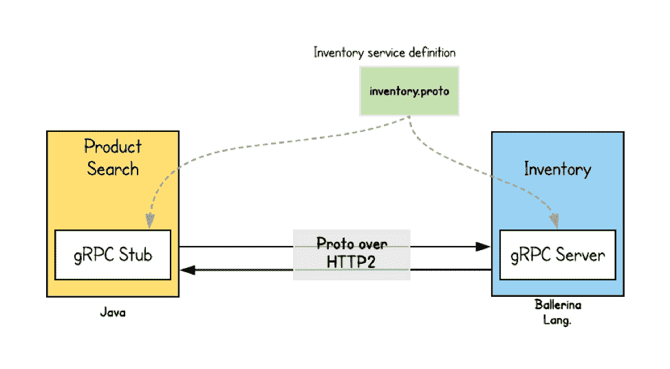
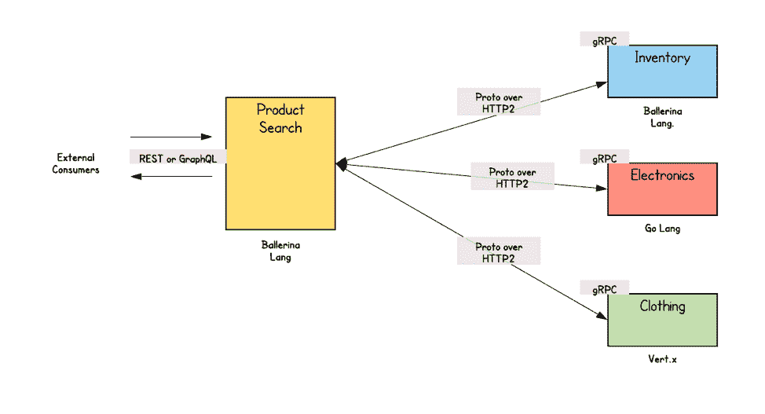

# 使用 gRPC 构建真实世界的微服务

> 原文：<https://thenewstack.io/build-real-world-microservices-with-grpc/>

[Kasun Indrasiri](https://wso2.com/)

[Kasun 是 WSO2 架构团队的重要成员，负责推动公司集成平台的开发工作。此前，他作为产品负责人参与了 WSO2 企业服务总线的开发。他撰写了《WSO2 ESB 入门*一书，并与人合著了《面向企业的微服务*】。他是 Apache Software Foundation 的当选成员、项目管理委员会成员以及 Apache Synapse 开源 ESB 项目的委员。Kasun 通过帮助成功设计和实现集成 web 服务、REST、SAP 和各种其他技术的解决方案，为众多客户提供了技术咨询。**](https://wso2.com/)

早期的[微服务实现](https://thenewstack.io/microservices-vs-monoliths-an-operational-comparison/)利用[表述性状态转移(REST)](https://en.wikipedia.org/wiki/Representational_state_transfer) 架构作为事实上的通信技术。然而，RESTful 服务对于直接向消费者公开的面向外部的服务通常是有用的。因为它们基于传统的基于文本的消息传递(JSON、XML、CVS over HTTP 等)。)，这些都是为人类优化的，但对于内部服务到服务的通信来说，这些都不是理想的选择。

相反，使用基于文本的消息传递协议，我们可以利用针对服务间通信优化的二进制协议。云本地计算基金会的 [gRPC](https://grpc.io/) (gRPC 远程过程调用)是服务间通信的理想选择，因为它使用协议缓冲区作为服务间通信的二进制数据交换格式。

当我们使用不同的技术和编程语言构建多个微服务时，有一种标准的方法来定义服务接口和底层消息交换格式是非常重要的。gRPC 提供了一种简洁而强大的方法来使用协议缓冲区指定服务契约。因此，gRPC 可能是在内部微服务之间建立通信[的最可行的解决方案。](https://www.amazon.com/Microservices-Enterprise-Designing-Developing-Deploying/dp/1484238575)

在本文中，我们将进一步了解为什么 gRPC 是构建微服务间通信的最佳选择。

## gRPC 基础

使用 gRPC，客户可以直接调用不同机器上的服务器应用程序的方法，就像它是一个本地对象一样。gRPC 基于传统的远程过程调用(RPC)技术的基础，但却是在现代技术栈(如 HTTP2、协议缓冲区等)之上实现的。以确保最大的互操作性。

gRPC 本身支持使用 gRPC 接口定义语言(IDL)定义服务契约的能力。因此，作为服务定义的一部分，您可以指定可以远程调用的方法以及参数和返回类型的数据结构。

图一。展示了 gRPC 与在线零售应用程序的结合使用，作为库存和产品搜索服务的一部分。库存服务的契约是使用 gRPC IDL 定义的，它是在 inventory.proto 文件中指定的。因此，库存服务的开发人员应该首先定义使用该服务的所有业务功能，然后从原型文件生成服务端框架代码。类似地，客户端代码(存根)可以使用相同的原型文件生成。

图 1

因为 gRPC 与编程语言无关，所以您可以使用异构语言来构建服务和客户端。在本例中，我们使用 Ballerina ( [ballerina.io](https://ballerina.io/?utm_source=thenewstack.io&utm_medium=article&utm_campaign=bio_article_nov18_tns) )生成了库存服务代码，并使用 Java 生成了客户端代码。您可以在 GitHub 上使用这个[源代码来尝试这个例子。](https://github.com/kasun04/grpc-microservices)

库存(inventory.proto)的服务合同如下所示。

服务契约很容易理解，并且可以在客户机和服务之间共享。如果服务契约有任何变化，服务和客户端代码都必须重新生成。

例如，下面的代码片段显示了为芭蕾舞演员生成的 gRPC 服务代码。对于 gRPC 服务定义中的每个操作，都会生成相应的芭蕾舞演员代码。(Ballerina 通过“Ballerina grpc–input inventory . proto–output service-skeleton–mode service”或“Ballerina grpc–input inventory . proto–output bal-client–mode client”提供了生成服务或客户端代码的现成功能)。

对于客户端，产品搜索服务是一个 Java ( [Spring Boot](https://spring.io/projects/spring-boot) )服务，也是从库存服务的 gRPC 服务定义中生成的。您可以使用 maven 插件为 Spring Boot/Java 服务生成客户端存根(客户端代码嵌入在 Spring Boot 服务中)。调用生成的客户机存根的客户机代码如下所示。

## 引擎盖下的交流

当客户端调用服务时，客户端 gRPC 库使用协议缓冲区，并整理远程过程调用，然后通过 HTTP2 发送。在服务器端，请求被解组，相应的过程调用使用协议缓冲区执行。响应遵循从服务器到客户机的类似执行流程。

使用 gRPC 开发服务和客户端的主要优点是，您的服务代码或客户端代码不需要担心解析 JSON 或类似的基于文本的消息格式(在代码内或隐式地在底层库(如 Jackson，它对服务代码是隐藏的)。进来的是二进制格式，它被解组成一个对象。此外，当我们必须处理多个微服务并确保和维护互操作性时，拥有通过 IDL 定义服务接口的一流支持是一个强大的功能。

## gRPC 的实用微服务用例

基于微服务的应用程序由多种服务组成，并使用多种编程语言构建。基于业务用例，您可以选择最合适的技术来构建您的服务。gRPC 在这种多语言架构中扮演着非常重要的角色。例如，让我们进一步扩展我们的在线零售用例，以获得更现实的东西。如图 2 所示，产品搜索服务与多个其他服务通信，这些服务是使用 gRPC 作为通信协议构建的。因此，我们可以为每项服务定义服务合同:库存、电子产品、服装等。现在，如果您想开发一个多语言架构，您可以使用不同的实现技术来生成服务框架。

图 2 展示了芭蕾舞演员 lang(T1)的库存服务，Golang(T3)的电子服务和 vert . x(Java)的服装服务。客户端还可以为每个服务契约生成一个存根。

图 2

仔细观察图 2 中的微服务通信风格，可以发现 gRPC 用于所有内部通信，而面向外部的通信可以基于 REST 或 GraphQL。当我们使用 REST 进行面向外部的通信时，大多数外部客户端可以将服务作为 API 来使用(利用 API 定义技术，比如 Open API ),因为大多数外部客户端知道如何与 HTTP RESTful 服务进行通信。此外，我们可以使用 GraphQL 之类的技术来允许消费者基于特定的客户端需求来查询服务，这是 gRPC 无法实现的。

因此，作为一种通用的做法，我们可以将 gRPC 用于内部微服务之间的所有同步通信。RESTful 服务和 GraphQL 等其他同步消息传递技术更适合面向外部的服务。

<svg xmlns:xlink="http://www.w3.org/1999/xlink" viewBox="0 0 68 31" version="1.1"><title>Group</title> <desc>Created with Sketch.</desc></svg>