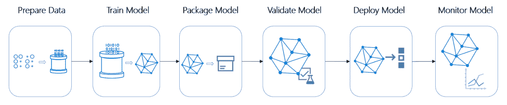
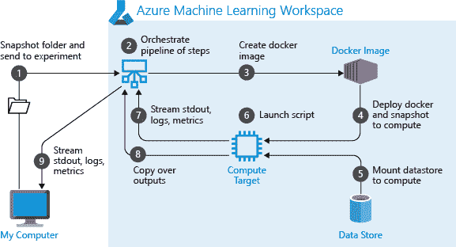

# 使用 Azure 机器学习管道构建可重复的 ML 工作流

> 原文：<https://thenewstack.io/build-repeatable-ml-workflows-with-azure-machine-learning-pipelines/>

机器学习(ML)涉及数据准备、转换、训练、调整、评估、部署和推理的复杂工作流。每一步都是独一无二的，彼此独立。

对于处理较小数据集的项目，ML 工作流的每个阶段都转化为一个 Python 函数。按顺序调用这些函数来执行端到端管道。Visual Studio Code 或 PyCharm 等开发工具用于创建函数和执行这些函数的脚本。

[](https://thenewstack.io/build-repeatable-ml-workflows-with-azure-machine-learning-pipelines/pipeline-flow/)

除了 ide，Jupyter 笔记本还被数据科学家和 ML 工程师用于工作流程的所有阶段。

在生产环境中，运行在工作站上的单个笔记本电脑或脚本并不是理想的环境。在处理工作流中使用的较大数据集和并行操作时，它可能会耗尽资源。

想象一个场景，其中来自多个摄像机的视频被收集在一个中央对象存储桶中。首先，这些视频需要分割成需要巨大计算能力的独立帧。接下来，通过应用过滤器和将它们调整到标准尺寸来标准化这些图像。然后，图像被转换并传递到卷积神经网络(CNN)上，该网络训练一个模型来执行对象检测。

上述工作流程中提到的每个阶段都需要一个专用的服务器群来加速处理。例如，在大型数据集的数据准备阶段，通常使用 Apache Spark 集群。为了训练模型和超参数调整，部署了一组支持 GPU 的虚拟机来加速该过程。为了对评估模型进行评分，可以使用不同的聚类。最后，运行容器化模型的 Kubernetes 集群被用于模型推理。

管道或工作流中使用的阶段具有不同的硬件和软件要求。无论工作流是在具有较小数据集的开发人员工作站中运行，还是在支持 GPU 的虚拟机集群中运行，这些依赖关系都是环境所期望的。

在训练和评估阶段创建的工作流可能必须重新用于再训练模型。这通常发生在数据源发生了重大变化，迫使培训和部署新版本的模型时。

开发人员和数据科学家需要一个松散耦合、一致、可重复的工作流来构建机器学习模型。为 ML 工作流创建的管道应该在不改变代码的情况下跨不同的环境执行。管道的每个阶段都应该独立更新，而不影响工作流的其他阶段。最后，管道应该在每次运行时交付一致的结果。

### Azure 机器学习管道概述

[Azure Machine Learning services](https://azure.microsoft.com/en-in/services/machine-learning/)是一个健壮的 ML 平台即服务(PaaS)，具有构建、训练和部署 ML 模型的端到端能力。该平台利用了各种 Azure 构建块，如对象存储(Azure 存储)、块设备(Azure 磁盘)、共享文件系统(Azure 文件)、计算(Azure 虚拟机)和容器(Azure 容器注册表和 Azure Kubernetes 服务)。

Azure ML pipelines 提供了一个完整的机器学习任务的独立可执行工作流，使得利用 Azure ML PaaS 的核心服务变得很容易。Azure ML 管道是多个阶段的集合，每个阶段负责一个特定的任务。每个任务都要做一件事，而且只能做一件事。

一个任务有一组 Azure ML 试图提供的定义良好的依赖关系和硬件需求。Azure 机器学习自动编排管道步骤之间的所有依赖关系。这种协调可能包括上下旋转 Docker 映像、连接和分离计算资源，以及以一致和自动的方式在各步骤之间移动数据。

Azure ML 管道旨在重用输出。运行时环境将决定哪个步骤将运行，以及哪个步骤可以从先前的运行中重用。这种能力不仅加快了执行速度，还节省了计算资源，从而降低了总体成本。

管道是 Azure ML workspace 不可或缺的一部分，这意味着它们可以访问可用的资源，如实验、数据集、计算、模型和端点。关于 Azure ML 架构的背景和逐步指南，请参考我之前的[文章](https://thenewstack.io/how-the-azure-ml-streamlines-cloud-based-machine-learning/)和[教程](https://thenewstack.io/build-and-deploy-a-machine-learning-model-with-azure-ml-service/)。

[](https://thenewstack.io/build-repeatable-ml-workflows-with-azure-machine-learning-pipelines/run_an_experiment_as_a_pipeline/)

Azure ML 管道可以通过 Python SDK 或企业版中可用的可视化设计器来构建。Python SDK 通过可定制的步骤提供了更多的控制。

### 近距离观察 Azure ML 管道

Azure ML 管道在工作区的上下文中运行。因此，第一步是将管道连接到工作区。

我们可以从运行在开发人员工作站上的笔记本上运行这段代码。

```
import azureml.core
from azureml.core import Workspace,  Datastore

ws  =  Workspace.from_config()

```

一旦工作空间被配置，那么下一步就是访问由管道的所有阶段共享的存储。每个工作区都有两个数据存储，一个用于存储平面文件，另一个用于存储二进制文件。默认的数据存储只是一个与工作区相关联的 Azure 存储 blob。

```
# Default datastore 
def_data_store  =  ws.get_default_datastore()

# Get the blob storage associated with the workspace
def_blob_store  =  Datastore(ws,  "workspaceblobstore")

# Get file storage associated with the workspace
def_file_store  =  Datastore(ws,  "workspacefilestore")

```

一旦数据存储可用，就可以用充当数据源的文件来填充它。这可以通过从公共 URL 下载或从开发人员工作站上传来完成。

```
def_blob_store.upload_files(
    ["./dataset/iris.csv"],
    target_path="train-dataset",
    overwrite=True)

```

从上传的文件中，我们现在可以创建一个可以在管道的任何步骤中引用的数据集。

```
from azureml.core import Dataset

iris_tabular_dataset  =  Dataset.Tabular.from_delimited_files([(def_blob_store,  'train-dataset/iris.csv')])

```

我们还将定义一个由管道不同阶段使用的中间存储位置。例如，数据准备步骤将上面定义的数据集作为输入，并写入下面代码片段中定义的位置。这将一个阶段与另一个阶段连接起来，其中一个步骤的输出成为另一个步骤的输入。

```
from azureml.pipeline.core import PipelineData

output_data1  =  PipelineData(
    "output_data1",
    datastore=def_blob_store,
    output_name="output_data1")

```

定义数据集后，我们现在准备定义管道的数据准备阶段。由于它运行在计算环境的上下文中，我们需要首先定义它。

Azure ML 管道支持各种计算目标，包括 Azure ML 计算实例、Azure ML 计算集群、现有的 Azure data science VM、Azure Databricks、Azure Data Lake Analytics、Azure HDInsight 和 Azure Batch。

管道中的任何一步都可以从上述环境中启动或重用计算目标。

下面的代码片段将一个 Azure ML 计算实例注册为一个目标(如果它可用),或者创建一个目标(如果它不存在)。

```
from azureml.core.compute import ComputeTarget,  AmlCompute

compute_name  =  "aml-compute"
vm_size  =  "STANDARD_NC6"
if compute_name in ws.compute_targets:
    compute_target  =  ws.compute_targets[compute_name]
    if compute_target and type(compute_target)  is AmlCompute:
        print('Found compute target: '  +  compute_name)
else:
    print('Creating a new compute target...')
    provisioning_config  =  AmlCompute.provisioning_configuration(vm_size=vm_size,
                                                                min_nodes=0,
                                                                max_nodes=4)
    # create the compute target
    compute_target  =  ComputeTarget.create(
        ws,  compute_name,  provisioning_config)

    # Can poll for a minimum number of nodes and for a specific timeout.
    # If no min node count is provided it will use the scale settings for the cluster
    compute_target.wait_for_completion(
        show_output=True,  min_node_count=None,  timeout_in_minutes=20)

    # For a more detailed view of current cluster status, use the 'status' property
    print(compute_target.status.serialize())

```

我们已经为管道配置了存储和计算。是时候在运行之前创建几个步骤了。

假设您有一个可以接受数据集、转换数据集并写入给定路径的脚本，我们可以将此作为第一步—数据准备阶段。

PythonScriptStep 是在计算目标上运行 Python 脚本的基本内置步骤。它接受一个脚本名和可选的其他参数，如脚本的参数、计算目标、输入和输出。如果未指定计算目标，则使用工作区的默认计算目标。

```
from azureml.pipeline.steps import PythonScriptStep

ds_input  =  my_dataset.as_named_input('input1')

prepStep  =  PythonScriptStep(
    script_name="./prep/prep.py",
    arguments=["--input",  ds_input.as_download(),  "--output",  output_data1],
    inputs=[ds_input],
    outputs=[output_data1],
    compute_target=compute_target,
    source_directory=project_folder,
    allow_reuse=True
)

```

上面的步骤挂载数据集并将路径作为输入参数传递给脚本。转换后的输出由脚本写入中间输出文件夹，该文件夹也由存储器装载。

请注意，prep.py 位于我们的开发工作站或运行笔记本或 Python 代码的 Azure VM 上。它将文件复制到工作区，然后再继续。

在协作环境中使用管道时，重用由 allow_reuse=true 设置的先前结果是关键，因为消除不必要的重新运行提供了敏捷性。

假设我们定义了准备、培训和评估的步骤，我们可以用它们来构建管道。

```
steps  =  [prepStep,  trainStep,  evalStep]
print("Step lists created")

```

最后，让我们构建、验证并提交管道。

```
pipeline1  =  Pipeline(workspace=ws,  steps=steps)
pipeline1.validate()
pipeline_run1  =  Experiment(ws,  ‘iris1').submit(pipeline1,  regenerate_outputs=False)

```

您可以通过写入门户的日志来监控 Azure Workspace 中的运行。

我们可以很容易地扩展它来部署模型并发布一个 REST 端点来进行推断。

在接下来的教程中，我将向您展示如何使用 Python SDK 和可视化设计器构建 Azure ML 管道。敬请关注。

*贾纳基拉姆·MSV 的网络研讨会系列“机器智能和现代基础设施(MI2)”提供了涵盖前沿技术的信息丰富、见解深刻的会议。请在 [http://mi2.live](http://mi2.live) 注册参加即将举行的 MI2 网络研讨会。*

通过 Pixabay 的特征图像。

<svg xmlns:xlink="http://www.w3.org/1999/xlink" viewBox="0 0 68 31" version="1.1"><title>Group</title> <desc>Created with Sketch.</desc></svg>